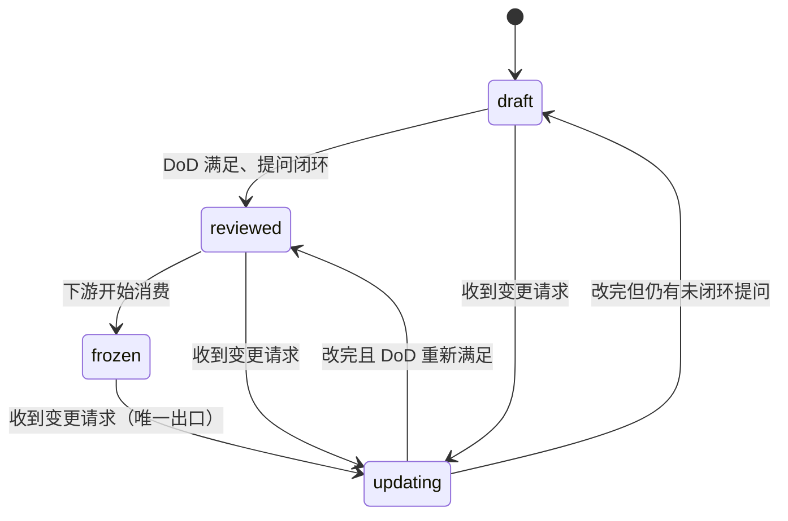

# 设计文档变更（MessagePick docs/ 回流）

对 `docs/` 流水线中**已存在**的文档做反向修改，并维护状态机与变更记录。

规则的事实来源是 `docs/README.md`（尤其 §5–§7）。本 skill 只描述流程，不重复定义规则；两者冲突时以 `docs/README.md` 为准。

## When to Use

- 任何要改动 `docs/product/`、`docs/design/`、`docs/plan/` 下文档内容的请求
- 任何要改动上述文档状态块的请求
- 验收不通过、追溯链断裂、需要废弃某条设计时

## When NOT to Use

- 首次生成某份文档 → 用对应的 `docs/prompt/generate_*.md`
  - 阶段 7a / 7b（HLD / 详设）→ `generate_high_level_design.md` / `generate_detailed_design.md`
  - 阶段 7c（`mod-###-<slug>.md`）**没有生成器**，首次撰写也走本 skill
- 只是阅读、解释、review 文档 → 直接读文件
- 维护 `docs/prompt/` 下的生成器本身 → 那不是设计变更
- 更新 `docs/status/implementation.md` 的进度行 → 该文件不参与状态机，直接改即可（见 `docs/README.md` §12.3）

## 三条硬规则

1. **`frozen` 不能直接退回 `draft`**，必须经过 `updating`。用于保留「该文档曾被冻结、曾被下游消费过」这一事实。
2. **状态传播**：上游文档进入 `updating` 时，`docs/README.md` §7 列出的**全部下游一并进入 `updating`**。此时下游引用的是过期内容，不允许继续被当作稳定输入。
3. **先解锁、后改内容**。顺序反了会出现「内容已不一致但状态仍显示 frozen」的窗口期。状态变更与 CHANGELOG 写入必须在**同一次操作内**完成。

## 状态机

| 当前状态 | 允许流转到 | 触发条件 |
| --- | --- | --- |
| `draft` | `reviewed` | 该文档的 DoD 满足，且提问全部闭环 |
| `draft` | `updating` | 变更请求落在该文档范围内 |
| `reviewed` | `frozen` | 宣布该阶段定稿，下游开始消费 |
| `reviewed` | `updating` | 变更请求落在该文档范围内 |
| `updating` | `reviewed` | 变更完成，DoD 重新满足，提问闭环 |
| `updating` | `draft` | 变更引入了未闭环的提问或未解决的 TODO |
| `frozen` | `updating` | 变更请求落在该文档范围内（**唯一出口**） |

禁止跳级：`draft → frozen`、`frozen → draft`、`reviewed → draft` 一律不允许。



## 上游影响申报（实现层专用入口）

在 `docs/design/impl/` 下写设计时，每个「关键决策」必须判定 `上游影响`：

| 填什么 | 含义 | 动作 |
| --- | --- | --- |
| `无` | 纯实现细节 | 继续 |
| `MOD-###` / `API-###` / `DM-###` | 契约变了 | **停下**，按本 skill 走回流 |
| `REQ-###` / `US-###` | 需求本身要改 | **停下**，按本 skill 走回流，**先改 `docs/product/prd.md`** |

**填了条目 ID 就不允许继续往下写。**

这条规则的意义：给出「下游推翻上游」的唯一合法路径。否则模块负责人会就地改自己的模块设计、PRD 从此失真，而验收用例是照 PRD 写的 —— 绕过必然对不上，且无人会发现。

## 输入

一条变更请求，必须包含下列 5 项。缺任何一项，**先提问补齐，禁止开始修改**。

| # | 项 | 内容 | 缺失时 |
| --- | --- | --- | --- |
| 1 | 要改什么 | 具体条目 ID（`REQ-###` / `MOD-###` / `API-###` / `DM-###` / `TASK-###` / `AC-###`）或具体段落 | 提问 |
| 2 | 为什么要改 | 一句可复述的理由（产品决策 / 缺陷 / 口径变化 / 边界调整） | 提问 |
| 3 | 期望结果 | 改完之后应该是什么样 | 提问 |
| 4 | 提出者 | agent 标识或人的标识 | 用当前 agent 标识 |
| 5 | 变更类型 | 追加 / 修改 / 废弃 | 自行判定后向提出者确认 |

## 流程

### 步骤 1 —— 判定变更类型

| 类型 | 含义 | 影响面 |
| --- | --- | --- |
| 追加 | 新增条目，不改动任何既有条目的语义 | 通常只影响 1 份文档 + 其下游新增 |
| 修改 | 改变既有条目的语义 / 字段 / 接口 / 约束 | 该文档的全部下游 |
| 废弃 | 条目作废，但 ID 保留 | 同「修改」，且必须在下游显式标注废弃 |

拿不准归类时提问，禁止自行归类。

### 步骤 2 —— 列出变更范围清单，向提出者确认

先给出这张表，说明**这次准备改哪些文档、为什么**：

```markdown
| 文档 | 动作（修改/重跑） | 依据条目 | 理由 |
| --- | --- | --- | --- |
| docs/product/prd.md | 修改 | REQ-014 | 口径变化 |
| docs/design/modules.md | 重跑 | MOD-003 | 上游 prd 变了 |
```

**未经提出者确认前，禁止写入任何文件。这是全流程唯一的人工闸门。**
范围里出现「顺手也改一下 X」时，必须显式列出并单独确认，不允许夹带。

### 步骤 3 —— 分配 `CHG-###` 并解锁

1. 读 `docs/CHANGELOG.md`，取现有最大 `CHG-###` +1（编号永不复用，含作废记录）。
2. 把范围内**所有**文档状态置为 `updating`，`变更中` 字段填该 `CHG-###`。
3. **先解锁，后改内容。**

### 步骤 4 —— 从最上游开始改

- 永远先改范围内**最上游**的那份文档，禁止先改下游再回头补上游。
- 追加型：只新增条目，分配新 ID，不改动既有条目。
- 废弃型：条目保留原位，追加标注 `已废弃 · 原因 · CHG-###`，**ID 不复用**。
- 同步更新「最后更新」日期。

### 步骤 5 —— 向下传播：重跑，不是手改

按 `docs/README.md` §7 的传播表，对每个受影响的下游运行对应的 `docs/prompt/generate_*.md`。

**禁止手工同步下游文档。** 手工同步必然漏掉追溯链与 ID，而且无法被发现。
下游重跑时同样必须遵守各自生成器的「先提问、后产出」。

### 步骤 6 —— 收敛状态

对范围内每份文档重新核对它自己的 DoD（`docs/README.md` §4）：

- DoD 满足、提问闭环 → `reviewed`
- 仍有未闭环提问或 `TODO` → `draft`，并明确告知提出者「该文档当前不可被下游消费」
- 下游已全部重跑且相互一致 → `frozen`
- 收尾时 `变更中` 字段清回 `—`

状态由 agent 自主判定（无需人工审批），但**必须真的满足条件才能标**，禁止为了让变更「看起来完成」而标 `frozen`。

### 步骤 7 —— 写 CHANGELOG

在 `docs/CHANGELOG.md` 的记录表末尾追加一行。只追加，不改写历史行。

### 步骤 8 —— 自检

运行自检脚本（见下节），然后逐条确认：

- [ ] 追溯链仍完整：每个 `AC-###` 能上溯到某个 `US-###`；每个 `REQ-###` 至少被一个 `AC-###` 覆盖
- [ ] 没有复用或回收任何已废弃 ID
- [ ] §7 里该重跑的下游全部重跑了
- [ ] 没有任何文档停留在 `updating`
- [ ] 所有状态块与实际内容一致
- [ ] `CHANGELOG.md` 历史行未被改写
- [ ] 实际改动范围 = 步骤 2 确认的范围，没有夹带

自检未全过时，不得结束本次变更，也不得把文档标成 `frozen`。

## 自检脚本

```bash
# 仓库根目录下执行
python3 .github/skills/design-doc-change/scripts/check-traceability.py

# 把 WARN 也视为失败（发布前用）
python3 .github/skills/design-doc-change/scripts/check-traceability.py --strict
```

脚本检查：状态块完整性与合法值、是否停在 `updating`、`CHG-###` 编号连续且不重复、同文档内 ID 重复定义、`AC → REQ → US` 追溯链、被引用但未定义的 ID。

退出码 `0` = 通过；`1` = 有 ERROR（`--strict` 下有 WARN 也算失败）。

## 禁止事项

- 禁止跳过 `updating`，直接修改 `reviewed` / `frozen` 文档。
- 禁止手工修改下游文档来「同步」。
- 禁止复用、回收已废弃的 ID。
- 禁止改写或删除 `CHANGELOG.md` 历史行；写错了就再追加一条更正记录。
- 禁止未确认变更范围就写入。
- 禁止用变更请求里没提到的信息去补全设计——缺什么就问。

## 参考

- `docs/README.md` —— 全部规则的事实来源（§4 DoD、§5 ID、§6 状态机、§7 传播、§12 设计分层与分派）
- `docs/design/README.md` —— 契约层 vs 实现层的判断标准、上游影响规则
- `docs/CHANGELOG.md` —— 变更记录
- `docs/status/implementation.md` —— 实现进度看板（不参与状态机，改它不需要本 skill）
- `./scripts/check-traceability.py` —— 自检脚本
- `docs/prompt/generate_*.md` —— 正向生成器，本 skill 在第 5 步调用它们
