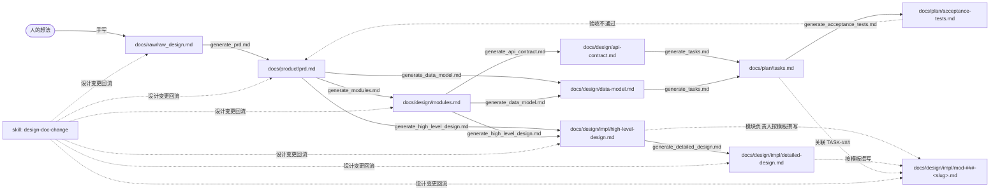

# 贡献指南

> **本文件是入口，不是规则本身。** 规则的**定义**只有一处：`docs/README.md`。
> 这里只回答「我该做什么、按什么顺序做、去哪查」。
> 两处说法不一致时，以 `docs/README.md` 为准，并把本文件当 bug 修。
> 本文件**不参与文档状态机**（没有 `draft` / `reviewed` / `updating` / `frozen`）。

---

## 1. 这个仓库在做什么

「**prompt 驱动、文档先行**」——先有文档，后有代码。

一次需求的推进方式是固定的：

> 手写 raw → 逐阶段生成文档 → 分派模块 → 写实现设计 → 写代码 → 跑验收。

文档流水线（`docs/`）与回流 skill（`.github/skills/design-doc-change/`）是这条路径的**常设基础设施**，不随项目走到哪一步而变。因为改文档的代价远低于改代码，所以全部规则的重点只有一件事：**别让文档之间失去追溯关系**（`AC → TASK → MOD → REQ → US`）。

---

## 2. 30 秒上手

| 步骤 | 做什么 |
| --- | --- |
| 1 | 读 `docs/README.md`（规则全文）和 `docs/design/README.md`（契约层 / 实现层怎么分） |
| 2 | 在 §3 找到自己负责的那一类文件 |
| 3 | **正向生成**：用 `docs/prompt/generate_*.md`，严格按阶段号递增，不跳级 |
| 4 | **反向修改**：用 `/design-doc-change`（skill），**不要手改** |
| 5 | 提交前跑自检脚本（见 §6） |

---

## 3. 谁写什么

| 角色 | 负责的文件 | 边界 |
| --- | --- | --- |
| **任何人** | `docs/raw/raw_design.md` | 阶段 0，唯一由人从零手写的文档；允许混乱、允许自相矛盾 |
| **架构负责人** | `docs/design/modules.md`、`api-contract.md`、`data-model.md`（契约层）<br>`docs/design/impl/high-level-design.md`、`detailed-design.md` | 契约层只声明「模块之间约定什么」，禁止框架名 / 类图 / DDL |
| **模块负责人** | `docs/design/impl/mod-###-<slug>.md`（**一份 = 一个 `MOD-###` = 一个负责人**） | 只写「模块内部怎么实现」；模块的职责与边界不在你这里，引用 ID 即可 |
| **各模块负责人** | `docs/status/implementation.md` 的**自己那一行** | 看板是「一个文件只有一个负责人」的唯一例外，按行划分；**不参与状态机**，改它不用开 `CHG-###` |

> 模板：`docs/design/impl/mod-000-template.md`。`MOD-000` 保留给模板，**不分配给任何模块**。

**本文件只覆盖「文档由谁写」，不覆盖协作流程**（reviewer 指派、PR 合并、分支命名策略）。

> TODO: 待确认 —— reviewer / PR 合并 / 分支命名策略由谁定、记在哪份文件？

---

## 4. 流水线



- 主链是**线性**的，每一跳 = 一次 prompt 调用。
- 主链的终点是 `docs/plan/acceptance-tests.md`；验收不通过要**回流上游**，不是就地改下游。
- 阶段 7（实现层）是主链之外的第二条分支：`prd` + `modules` → HLD → 详设 → `mod-###-<slug>.md`。
  HLD / 详设有生成器；`mod-###-<slug>.md` **没有**，由模块负责人按 `mod-000-template.md` 撰写。
- 每个生成器都必须**先提问、后产出**；提问未闭环时禁止产出。

---

## 5. 红线清单

> 以下是**摘要**，每条的定义都在 `docs/README.md`；以它为准。

| # | 红线 | 定义 |
| --- | --- | --- |
| 1 | 不直接手改 `docs/product/`、`docs/design/`、`docs/plan/` 下任何内容，一律走 `/design-doc-change` | §7、skill |
| 2 | 上游改了 → **重跑**下游，**禁止手工同步**下游文档 | §7 |
| 3 | `frozen` **不能**直接退回 `draft`，必须经 `updating` | §6.1 |
| 4 | **先解锁、后改内容**；状态变更与 `CHG-###` 记录必须在同一次操作内完成 | §6.3 |
| 5 | 上游不是 `reviewed` / `frozen` 时，**禁止**跑下游 prompt | §6.3 |
| 6 | 所有 ID（`US`/`REQ`/`MOD`/`API`/`DM`/`TASK`/`AC`/`CHG-###`）**永不复用、永不回收** | §5.2 |
| 7 | `docs/CHANGELOG.md` **只追加**，历史行永不修改 | `CHANGELOG.md` |
| 8 | 未确定的点写 `> TODO: 待确认 —— <具体问题>` 并提问；**不写猜测值** | §8 |
| 9 | 契约层（`design/` 根）禁止框架名 / 类图 / 时序图 / DDL；实现层（`design/impl/`）才允许 | §12 |
| 10 | 实现层每个「关键决策」必须填 `上游影响`；**填了条目 ID 就停下回流**，不许绕过 PRD | §12.2 |

**唯一的人工闸门是「变更范围确认」**：走回流时，agent 会先给出「这次准备改哪些文档、为什么」的清单，**你确认前它不会写入任何文件**。除此之外的状态流转（`draft → reviewed → updating → frozen`）由 agent 自主完成，无需人工审批。

---

## 6. 提交前自检

```bash
# 仓库根目录下执行
python3 .github/skills/design-doc-change/scripts/check-traceability.py

# 发布前用：把 WARN 也视为失败
python3 .github/skills/design-doc-change/scripts/check-traceability.py --strict
```

退出码 `0` = 通过，`1` = 失败。

脚本检查：状态块完整性与合法值、是否停在 `updating`、`CHG-###` 编号连续且不重复、同文档内 ID 重复定义、`AC → REQ → US` 追溯链、被引用但未定义的 ID。

> 脚本只是兜底。它**测不出**「下游被手工改过」——这类问题只能靠遵守 §5 第 2 条来避免。

---

## 7. 去哪查

本文件是长期约定，**不记录进度快照**——进度、阻塞、待办每天都在变，写在这里必然过期。

| 我想知道 | 看 |
| --- | --- |
| 全部规则（DoD、ID、状态机、传播、分层） | `docs/README.md` |
| 每份文档的当前状态、架构待办 | `docs/README.md` §10 |
| 这段内容该写进契约层还是实现层 | `docs/design/README.md` |
| 回流流程怎么走、8 个步骤 | `.github/skills/design-doc-change/SKILL.md` |
| 各阶段生成器 | `docs/prompt/README.md` |
| 各模块实现进度、谁卡在哪 | `docs/status/implementation.md` |
| 最近改了什么、为什么改 | `docs/CHANGELOG.md` |

