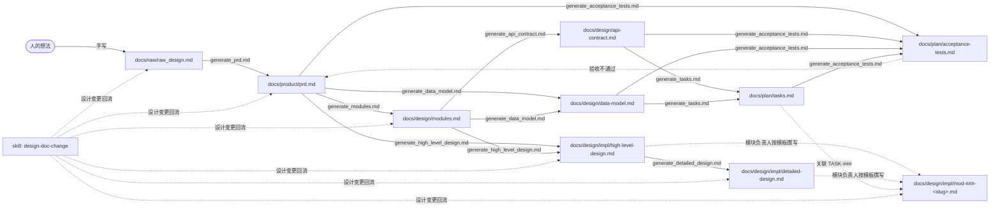
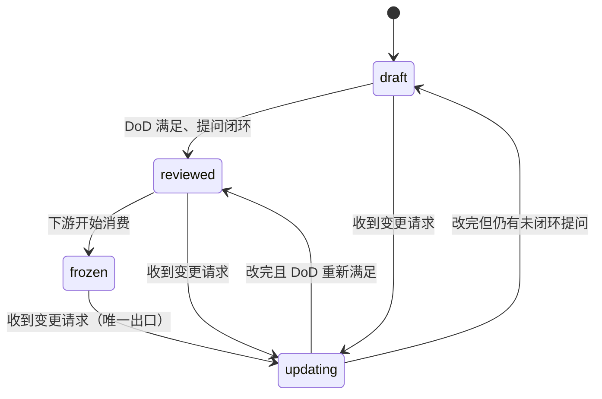

# MessagePick 文档架构

> **状态**: draft
> **适用范围**: 本仓库 `docs/` 下所有文档与 prompt
> **最后更新**: 2026-09-12

本文件是 `docs/` 的架构说明与写作规则。新增文档、新增 prompt、改名、拆分目录之前，先读这里。

---

## 1. 设计原则

| 原则 | 含义 |
| --- | --- |
| 文档是唯一事实来源 (SSOT) | 需求、模块、接口、字段各自只在一处定义；其他文档只做**引用**（写 ID），不复制描述 |
| 文档由 prompt 生成 | 每个阶段 = 1 个 prompt + 1 份输入 + 1 份输出；人只在 `raw/` 手写和「回答提问」两处介入 |
| 先声明后实现 | `product/` 与 `design/` 只声明契约，不写实现、不写伪代码、不选框架 |
| 可判定 | 每条验收标准都必须能被直接写成测试用例 |
| 不假设 | 技术选型未定 = 必须提问；禁止在文档里填猜测值 |
| 可追溯 | 每个下位条目都能通过 ID 回溯到上位条目（见 §5） |

---

## 2. 目录结构

```text
docs/
├── README.md                          # 本文件：文档架构总览与规则
├── CHANGELOG.md                       # 变更记录（只追加）：谁、何时、改了什么、影响了谁
├── raw/                               # 阶段 0：原始输入（人类手写，不要求格式）
│   └── raw_design.md
├── product/                           # 阶段 1：产品需求
│   └── prd.md
├── design/                            # 设计：分两层（见 design/README.md）
│   ├── README.md                      #   分层导航：契约层 vs 实现层
│   ├── modules.md                     #   【契约层】模块职责 / 边界 / 依赖
│   ├── api-contract.md                #   【契约层】模块间接口契约
│   ├── data-model.md                  #   【契约层】数据模型与字段
│   └── impl/                          #   【实现层】一份模块设计 = 一个负责人
│       ├── high-level-design.md       #     HLD：整体架构、关键流程
│       ├── detailed-design.md         #     详设：横切机制
│       └── mod-000-template.md        #     模块设计模板（MOD-000 保留）
├── plan/                              # 阶段 5–6：实施与验证
│   ├── tasks.md                       #   任务拆分
│   └── acceptance-tests.md            #   验收用例
├── status/                            # 实现进度（不参与状态机，见 §12）
│   └── implementation.md              #   模块看板：负责人 / 状态 / 设计文档
└── prompt/                            # 生成器：驱动上述每一阶段的 prompt
    ├── README.md                      #   prompt 索引：输入 → 输出 → 触发时机
    ├── generate_prd.md                #   阶段 1
    ├── generate_modules.md            #   阶段 2
    ├── generate_api_contract.md       #   阶段 3
    ├── generate_data_model.md         #   阶段 4
    ├── generate_tasks.md              #   阶段 5
    ├── generate_acceptance_tests.md   #   阶段 6
    ├── generate_high_level_design.md  #   阶段 7a
    ├── generate_detailed_design.md    #   阶段 7b
    └── update_design_document_prompt.md  # 指针 → .github/skills/design-doc-change/
```

**分层依据**：按「流水线阶段」分目录，而不是按「文档类型」分（不设 `api/`、`db/` 这类横切目录）。理由：每份文档都有唯一的上游和唯一的下游，目录即阶段，一眼能看出生成顺序。

**`docs/` 之外还有一处**：回流流程的实现放在工作区 skill 里——

```text
.github/skills/design-doc-change/
├── SKILL.md                          # 设计变更回流流程（状态机 + 8 步 + 自检）
└── scripts/check-traceability.py     # 追溯链与状态自检脚本
```

为什么放在 `docs/` 之外：skill 只有在 `.github/skills/` 这类固定路径下才会被发现，而回流流程需要**被模型自动加载**（否则 agent 会直接手改文档、绕过状态机）。分工见 §11。

---

## 3. 流水线



要点：

- **主链是线性的**（`raw → prd → modules → api/data-model → tasks → acceptance`），每一跳都是一次 prompt 调用。
- **阶段 7（实现层）是主链之外的第二条分支**：`prd` + `modules` → HLD → 详设 → `mod-###-<slug>.md`。
  前两跳是 prompt（`generate_high_level_design.md` / `generate_detailed_design.md`）；第三跳**没有生成器**，由模块负责人按 `mod-000-template.md` 撰写（§12）。
- **验收不通过要回流到上游**，而不是就地改下游文档。
- 每个 prompt 都必须先提问、后产出；提问未闭环时禁止产出。
- **所有回流统一走 `design-doc-change` skill**（`.github/skills/design-doc-change/SKILL.md`）：它是唯一允许反向写回上游的入口，向上改与向下重跑都由它驱动，并全程维护状态机（§6）。

---

## 4. 阶段定义与完成标志 (DoD)

| # | 阶段 | prompt | 输入 | 输出 | 完成标志 |
| --- | --- | --- | --- | --- | --- |
| 0 | 原始设计 | —（手写） | 人的想法 | `raw/raw_design.md` | 想法已落成文字；允许混乱、允许矛盾 |
| 1 | 产品需求 | `generate_prd.md` | `raw/raw_design.md` | `product/prd.md` | 用户场景 / 功能边界（含不做什么）/ 交互流程（含异常分支）/ 数据与规则 / 验收标准齐全，且所有提问已闭环 |
| 2 | 模块拆分 | `generate_modules.md` | `product/prd.md` | `design/modules.md` | 每个模块都有：职责、**明确不负责**、接口签名、字段、依赖方向与禁用方向、可判定验收标准；并含模块清单表 + mermaid 依赖图 |
| 3 | 接口契约 | `generate_api_contract.md` | `design/modules.md` | `design/api-contract.md` | 每个 `API-###` 有入参 / 出参 / 错误码 / 调用方与被调用方；全文无实现 |
| 4 | 数据模型 | `generate_data_model.md` | `product/prd.md` + `design/modules.md` | `design/data-model.md` | 每个 `DM-###` 有类型 / 来源 / 默认值 / 约束 / 归属模块；每个字段能指回来源需求 |
| 5 | 任务拆分 | `generate_tasks.md` | `design/*.md` | `plan/tasks.md` | 每个 `TASK-###` 覆盖至少一个 `MOD-###`，且可独立验证；含依赖顺序与预估 |
| 6 | 验收用例 | `generate_acceptance_tests.md` | `product/prd.md` + `design/*.md` + `plan/tasks.md` | `plan/acceptance-tests.md` | 每条 `REQ-###` 至少被一个 `AC-###` 覆盖；每条 `AC-###` 含前置条件 / 步骤 / 期望结果 / 覆盖对象 |
| 7a | 高层设计 | `generate_high_level_design.md` | `product/prd.md` + `design/modules.md` | `design/impl/high-level-design.md` | 架构总览 / 运行时视图 / 3–5 条端到端关键流程 / 部署形态 / 横切关注点清单齐全；每个关键决策已判定「上游影响」；技术选型已列候选方案并经提出者确认 |
| 7b | 详细设计 | `generate_detailed_design.md` | `design/impl/high-level-design.md` | `design/impl/detailed-design.md` | HLD 第 5 节标为「适用」的横切关注点全部展开；每个关键决策已判定「上游影响」 |
| 7c | 模块设计 | —（模块负责人按 `mod-000-template.md` 撰写） | `design/*.md`（契约层）+ `design/impl/high-level-design.md` | `design/impl/mod-###-<slug>.md` | 契约层每条 `API-###` / `DM-###` 都有模块设计承接；每个决策的「上游影响」字段已判定，填了 ID 的已回流闭环 |

---

## 5. 命名与 ID 规则

### 5.1 文件名

- 一律 kebab-case、小写、`.md`；名称表达内容，不用 `doc1`、`final`、`v2`、日期后缀。
- 版本用 git 管，不用文件名管。
- **冻结名（不得修改）**：`raw_design.md`、`prd.md`、`modules.md`。原因：现有 prompt 已把 `docs/raw/raw_design.md`、`docs/product/prd.md`、`docs/design/modules.md` 写死在「输入/输出」段落中。

### 5.2 ID 前缀

| 前缀 | 归属文档 | 格式 | 含义 |
| --- | --- | --- | --- |
| `US-###` | `product/prd.md` | 三位数字 | 用户场景 |
| `REQ-###` | `product/prd.md` | 三位数字 | 需求条目（可验收） |
| `MOD-###` | `design/modules.md` | 三位数字 | 模块 |
| `API-###` | `design/api-contract.md` | 三位数字 | 接口 |
| `DM-###` | `design/data-model.md` | 三位数字 | 数据实体 / 字段组 |
| `TASK-###` | `plan/tasks.md` | 三位数字 | 实施任务 |
| `AC-###` | `plan/acceptance-tests.md` | 三位数字 | 验收用例 |
| `CHG-###` | `CHANGELOG.md` | 三位数字 | 变更记录（仅作为记录索引，不是设计条目） |

规则：ID 一经分配**永不复用、永不回收**；条目作废时保留 ID 并标注 `已废弃`；跨文档引用只写 ID，不重复正文描述。

### 5.3 追溯链

```text
US-### ─┐
        ├─→ REQ-### ─→ MOD-### ─┬─→ API-### ─┐
        │                       └─→ DM-###  ─┼─→ TASK-### ─→ AC-###
        │                                     │
        └─────────────────────────────────────┘（REQ 直接产生 AC）
```

自检方式：任取一个 `AC-###`，应能顺着链条向上走到某个 `US-###`；反向任取一个 `REQ-###`，应至少有一个 `AC-###` 覆盖。

---

## 6. 文档状态与门禁

每份文档头部必须有状态块：

```markdown
> **状态**: draft | reviewed | updating | frozen
> **生成者**: docs/prompt/generate_xxx.md
> **上游**: docs/xxx/yyy.md
> **下游**: docs/xxx/zzz.md
> **变更中**: —            <!-- 仅 updating 时填 CHG-###，其余填 — -->
> **最后更新**: YYYY-MM-DD
```

| 状态 | 含义 | 允许的操作 |
| --- | --- | --- |
| `draft` | 生成中，或提问未闭环 | 只读，禁止下游消费 |
| `reviewed` | 提问全部闭环，DoD 满足 | 可作为下游 prompt 的输入 |
| `updating` | 正在被一条设计变更修改 | 只读，**禁止下游消费**，也禁止作为任何 prompt 的输入 |
| `frozen` | 下游已开始消费，处于稳定态 | 可作为下游 prompt 的输入；修改必须走 §7 |

### 6.1 状态流转



`frozen` **不能直接退回** `draft`，必须经过 `updating`——用于保留「该文档曾被冻结、曾被下游消费过」这一事实。禁止跳级（`draft → frozen`、`reviewed → draft` 均不允许）。

### 6.2 状态传播

上游文档进入 `updating` 时，§7 列出的**全部下游必须一并进入 `updating`**。此时下游引用的内容已经过期，不允许继续被当作稳定输入。

### 6.3 门禁

- 上游不是 `reviewed` / `frozen` 时，**禁止运行下游 prompt**。
- 状态变更与 `CHANGELOG.md` 记录必须在**同一次操作内**完成：不允许只改状态不记录，也不允许记录了却漏改状态。
- 本团队 agent 可自主完成 `draft → reviewed → updating → frozen` 全流程，无需人工审批；但状态必须真实反映文档状况。执行流程见 `.github/skills/design-doc-change/SKILL.md`，可机器校验：

  ```bash
  python3 .github/skills/design-doc-change/scripts/check-traceability.py [--strict]
  ```

### 6.4 适用范围

- **参与状态机**：`raw/`、`product/`、`design/`（含 `design/impl/`）、`plan/` 下的全部文档。
- **不参与**：
  - `status/implementation.md` —— 高频变动的事实记录，每次都走状态流转成本远大于收益（见 §12）。
  - `CHANGELOG.md` —— 审计日志，只追加。
  - `prompt/` 下的生成器与指针文件 —— 它们是工具，不是设计产物。
  - `design/README.md` —— 导航文档，随目录结构变动。

---

## 7. 变更传播规则

改动上游后，必须**重跑**下列下游，而不是手工微调下游文档：

| 上游变更 | 必须重跑 |
| --- | --- |
| `raw/raw_design.md` | 全部阶段 |
| `product/prd.md` | `modules` → 其下全部 |
| `design/modules.md` | `api-contract`、`data-model` → `tasks` → `acceptance-tests` → `design/impl/**` |
| `design/api-contract.md` 或 `design/data-model.md` | `tasks` → `acceptance-tests` → 受影响的 `design/impl/mod-*.md` |
| `design/impl/high-level-design.md` 或 `detailed-design.md` | 受影响的 `design/impl/mod-*.md` |
| `design/impl/mod-###-<slug>.md`（发现契约级影响） | **回流**到 `design/` 根目录契约层，再按本表向下重跑 |
| `plan/tasks.md` | `acceptance-tests` |
| `plan/acceptance-tests.md` | 无（终态）；若发现缺口，回流上游 |

**上行触发点**：实现层的每个「关键决策」都带一个 `上游影响` 字段（见 §12）。该字段填了条目 ID 时，必须先回流改上游，再向下重跑 —— 这是「下游推翻上游」唯一的合法路径。

第一步永远是按 §6 把「上游 + 其全部下游」一并置为 `updating`，改完再逐级收敛回 `reviewed` / `frozen`。执行细节见 `.github/skills/design-doc-change/SKILL.md`。

重跑后同步更新状态块的「最后更新」，并在 `docs/CHANGELOG.md` 追加一条记录（分配 `CHG-###`）。

---

## 8. 写作规则（所有 docs 通用）

**必须做到**

- 用户场景写成一句可复述的话：谁、在什么情况下、触发什么动作、想达成什么。
- 功能边界里「不做什么」要写清楚——它比「做什么」更有价值。
- 交互流程要走完异常分支：空状态、失败、超时、无权限。
- 验收标准必须能被写成测试用例。
- 未确定的点写成 `> TODO: 待确认 —— <具体问题>`，并同步向人提问。**不写猜测值。**

**禁止**

- 词汇黑名单：`体验流畅`、`性能良好`、`优化用户体验`、`模块划分合理`、`易于扩展`。
- 在 `raw/`、`product/`、`design/`（**不含 `design/impl/`**）、`plan/` 里写：函数体、伪代码、具体框架名、类图、时序图、DDL。这些属于实现层。
- 在 `design/impl/` 里**允许**写实现细节；但不允许在那里复述契约层的正文（应引用 ID）。
- 在下游文档里复制上游正文（应引用 ID）。

---

## 9. 演进规则

| 触发条件 | 动作 |
| --- | --- |
| 单个文件 > 约 600 行，或出现 2 个以上独立子域 | 拆成目录（如 `design/modules/`），原文件退化为索引 |
| 需要新阶段 | 新增 `prompt/generate_<阶段>.md`，并在 §4 表格登记 |
| 需要实现级内容（类图 / 时序图 / DDL / 框架选型） | 放 `docs/design/impl/`，**不要**污染契约层（`design/` 根目录），见 §12 |
| 某模块的实现设计超过约 600 行 | 拆成 `design/impl/` 下的多个文件，`mod-###-<slug>.md` 退化为索引 |
| 出现跨模块的实现约定 | 上提到契约层（`api-contract.md` / `data-model.md`），不要在 `impl/` 里私定 |
| 新增一个模块 | `modules.md` 定义 `MOD-###` → 补 `design/impl/mod-###-<slug>.md` → 在看板补一行 |
| 某个 prompt 需要「被自动加载」或需要携带脚本 / 模板 | 升级为 skill 放 `.github/skills/<name>/`，`docs/prompt/` 下留指针（见 §11） |

---

## 10. 当前状态

| 文件 | 状态 | 说明 |
| --- | --- | --- |
| `docs/README.md` | draft | 本文件，架构规则 |
| `docs/raw/raw_design.md` | draft | 占位模板，**待你手写** |
| `docs/product/prd.md` | draft | 占位模板，待阶段 1 生成 |
| `docs/design/modules.md` | draft | 占位模板，待阶段 2 生成 |
| `docs/design/api-contract.md` | draft | 占位模板，待阶段 3 生成 |
| `docs/design/data-model.md` | draft | 占位模板，待阶段 4 生成 |
| `docs/plan/tasks.md` | draft | 占位模板，待阶段 5 生成 |
| `docs/plan/acceptance-tests.md` | draft | 占位模板，待阶段 6 生成 |
| `docs/prompt/generate_prd.md` | reviewed | 已补全；`额外要求` 含 §5.2 ID 前缀要求 |
| `docs/prompt/generate_modules.md` | reviewed | 已补全；`额外要求` 含 §5.2 ID 前缀要求 |
| `docs/prompt/generate_api_contract.md` | reviewed | 已补全，含 `API-###` / 追溯 / 覆盖要求 |
| `docs/prompt/generate_data_model.md` | reviewed | 已补全，含 `DM-###` / 追溯 / 覆盖要求 |
| `docs/prompt/generate_tasks.md` | reviewed | 已补全，含 `TASK-###` / 覆盖要求 |
| `docs/prompt/generate_acceptance_tests.md` | reviewed | 已补全，含 `AC-###` / 覆盖矩阵 / 终态回流 |
| `docs/prompt/generate_high_level_design.md` | reviewed | 阶段 7a：HLD 生成器；唯一允许技术选型的阶段，选型走「候选 + 推荐 → 人确认」 |
| `docs/prompt/generate_detailed_design.md` | reviewed | 阶段 7b：详设生成器，展开 HLD 第 5 节的横切关注点 |
| `docs/prompt/update_design_document_prompt.md` | — | 指针文件，指向 skill（流程定义已迁出，见 §11） |
| `docs/CHANGELOG.md` | — | 变更记录（只追加），已含 CHG-001 – CHG-004 |
| `docs/design/README.md` | draft | 设计分层导航（契约层 vs 实现层） |
| `docs/design/impl/high-level-design.md` | draft | HLD 模板，待撰写 |
| `docs/design/impl/detailed-design.md` | draft | 详设模板，待撰写 |
| `docs/design/impl/mod-000-template.md` | draft | 模块设计模板（`MOD-000` 保留，不分配） |
| `docs/status/implementation.md` | — | 模块实现看板（不参与状态机） |
| `.github/skills/design-doc-change/SKILL.md` | reviewed | 设计变更回流流程（状态机 + 8 步 + 自检 + 上游影响规则），可自动加载 |
| `.github/skills/design-doc-change/scripts/check-traceability.py` | reviewed | 追溯链自检脚本，当前 0 error / 0 warning |

### 待办（本架构落地需要的事）

- [ ] 手写 `docs/raw/raw_design.md`（唯一需要人从零写的文档）。
- [x] 在现有 `generate_prd.md` / `generate_modules.md` 的「额外要求」里补一句「输出须带 §5.2 的 ID 前缀」，否则追溯链断在阶段 1、2。
- [x] 补全阶段 3–6 的 prompt 步骤（原来只有骨架）。
- [x] 把 `update_design_document_prompt.md` 改造成 skill —— 已完成，见 §11 与 `design-doc-change`。
- [ ] 定义模块完成后，为每个 `MOD-###` 建 `design/impl/mod-###-<slug>.md` 并在看板补行。
- [ ] 接口冻结标记（`API-###` 冻结后禁止修改）暂缓，等团队分派跑起来再说。

---

## 11. Prompt 与 Skill 的分工

正向生成用 **prompt**，反向变更是 **skill**。分界线是「需不需要被自动发现」。

| | `docs/prompt/*.md`（生成器） | `.github/skills/*/SKILL.md` |
| --- | --- | --- |
| 触发 | 人主动调用 `/…` | 人调用 **或** 模型按 `description` 自动加载 |
| 位置 | `docs/` 内，随文档架构走 | `.github/skills/`，独立于文档 |
| 资产 | 单文件 | 可带 `scripts/`、`references/`、`assets/` |
| 上下文成本 | 全文注入 | 渐进加载（先只读 `name` + `description`） |

**判断规则**

- 流程需要「没人提醒也会被执行」→ **skill**。回流流程就是这类：agent 收到「改一下 REQ-014」时，必须知道要走 `updating` + 重跑下游，而不是直接手改文档。靠 prompt 做不到——它必须有人记得调用。
- 流程是「人明确要生成某份文档时才发生」→ **prompt**。正常生成时人一定在场，不需要自动发现；放在 `docs/prompt/` 里跟文档架构待在一起更内聚。
- 需要挂脚本、模板等资产 → **skill**。`docs/prompt/` 是纯文本索引，不适合放可执行资产。

**避免第二份事实来源**：流程定义只存一处。流程迁为 skill 后，`docs/prompt/` 下留**指针文件**，说明流程在哪、怎么调用，但不复述流程本身（§1 SSOT 原则）。

**当前分布**

| 流程 | 形态 | 位置 |
| --- | --- | --- |
| 阶段 1–6 正向生成 | prompt | `docs/prompt/generate_*.md` |
| 设计变更回流 | skill | `.github/skills/design-doc-change/` |
| 追溯链自检 | skill 资产 | `.github/skills/design-doc-change/scripts/` |

---

## 12. 设计分层与实现分派

模块按人分派后，`design/` 分成两层。判断标准只有一句话：

> **契约层回答「模块之间约定什么」；实现层回答「模块内部怎么实现」。**

| | 契约层 | 实现层 |
| --- | --- | --- |
| 位置 | `design/` 根目录 | `design/impl/` |
| 文件 | `modules.md`、`api-contract.md`、`data-model.md` | `high-level-design.md`、`detailed-design.md`、`mod-###-<slug>.md` |
| 读者 | 所有模块负责人 | 该模块负责人（HLD / 详设为全员） |
| 粒度 | 跨模块 | 单模块 |
| 框架名 / 类图 / 时序图 / DDL | **禁止** | **允许** |
| 谁改 | 架构负责人 | 模块负责人 |
| 上游影响 | 不适用 | 每个决策必须判定 |

### 12.1 分派规则

- **一份 `mod-###-<slug>.md` = 一个 `MOD-###` = 一个负责人。** 不同人不会改到同一份文件，这是 §6「一个文件只有一个负责人」的落点。
- `MOD-000` 保留给模板（`design/impl/mod-000-template.md`），不分配给任何模块。
- 模块的**职责和边界不写在 `impl/` 里** —— 那是契约层的内容，`impl/` 只引用 ID。避免两处描述同一件事（§1 SSOT）。

### 12.2 上游影响（下游推翻上游的唯一合法路径）

实现过程中拿到的约束，可能让上游设计甚至需求不再成立。因此每个「关键决策」都必须填 `上游影响`：

| 填什么 | 含义 | 动作 |
| --- | --- | --- |
| `无` | 纯实现细节 | 继续 |
| `MOD-###` / `API-###` / `DM-###` | 契约变了 | **停下**，走 `design-doc-change` 回流 |
| `REQ-###` / `US-###` | 需求本身要改 | **停下**，走 `design-doc-change` 回流，**先改 `product/prd.md`** |

**填了条目 ID 就不允许继续往下写。** 不允许在模块设计里绕过 PRD 就地实现 —— 验收用例是照 PRD 写的，绕过必然对不上，且无人会发现。

### 12.3 实现进度

进度记在 `docs/status/implementation.md`，**不参与状态机**，不受 §7 变更传播约束，改它不需要开 `CHG-###`。

理由：状态机解决的是「文档是否可信、下游能不能消费」，而进度是每天变的事实。把高频变动的东西塞进状态机，会让 `updating` 变成常态，门禁随之失效。

看板与设计的联动：每行必须链接到对应的 `design/impl/mod-###-<slug>.md`；每个已定义的 `MOD-###` 必须在看板中有一行（自检脚本会校验）。
