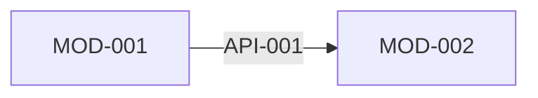

# MessagePick 接口契约

> **状态**: draft
> **生成者**: `docs/prompt/generate_api_contract.md`
> **上游**: `docs/design/modules.md`
> **下游**: `docs/prompt/generate_tasks.md`、`docs/prompt/generate_acceptance_tests.md`
> **变更中**: —
> **最后更新**: 2026-09-12

<!-- 本文件由 prompt 生成。修改必须走 design-doc-change skill（.github/skills/design-doc-change/SKILL.md，状态机见 docs/README.md §6）。 -->
<!-- 只声明契约：不写实现、不指定传输方式（HTTP / gRPC / 进程内调用）。 -->

## 1. 接口清单

| 接口 ID | 名称 | 所属模块 | 调用方 | 来源需求 |
| --- | --- | --- | --- | --- |
| API-001 | | MOD-### | MOD-### | REQ-### |

## 2. 接口详情

### API-001 <名称>

- **所属模块**：
- **调用方 / 被调用方**：
- **触发时机与调用频率假设**：
- **入参**：

  | 字段 | 类型 | 必填 | 约束 | 默认值 |
  | --- | --- | --- | --- | --- |

- **出参（成功）**：

  | 字段 | 类型 | 含义 |
  | --- | --- | --- |

- **错误**：

  | 错误码 / 标识 | 触发条件 | 调用方应如何处理 |
  | --- | --- | --- |

- **幂等性与重试语义**：

## 3. 调用关系图

## 4. 待确认

<!-- > TODO: 待确认 —— <具体问题> -->
