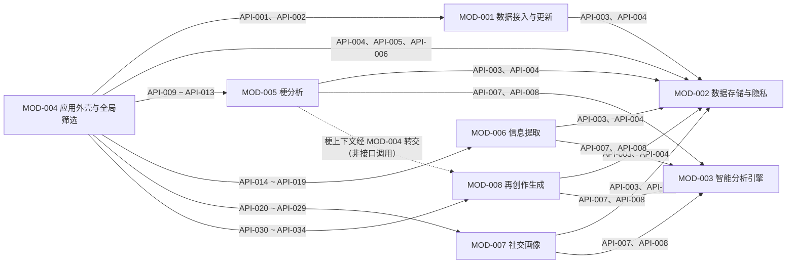

# MessagePick 接口契约

> **状态**: reviewed
> **生成者**: `docs/prompt/generate_api_contract.md`
> **上游**: `docs/design/modules.md`
> **下游**: `docs/prompt/generate_tasks.md`、`docs/prompt/generate_acceptance_tests.md`
> **变更中**: —
> **最后更新**: 2026-09-12

<!-- 本文件由 prompt 生成。修改必须走 design-doc-change skill（.github/skills/design-doc-change/SKILL.md，状态机见 docs/README.md §6）。 -->

## 1. 接口清单

| 接口 ID | 名称 | 所属模块 | 调用方 | 来源需求 | 一句话用途 |
| --- | --- | --- | --- | --- | --- |
| API-001 | 触发更新 | MOD-001 | MOD-004 | REQ-001、REQ-002、REQ-016、REQ-082 | 按来源采集 / 导入数据并返回分来源结果 |
| API-002 | 查询更新状态 | MOD-001 | MOD-004 | REQ-002、REQ-003、REQ-006、REQ-016 | 返回是否有数据、「记录更新至 X」、当前用户（Me 标识）与各来源状态 |
| API-003 | 写入记录 | MOD-002 | MOD-001、MOD-005 ~ MOD-008 | REQ-007、REQ-011 | 持久化原始记录与派生结果（按记录身份去重） |
| API-004 | 按条件读取 | MOD-002 | MOD-001、MOD-004 ~ MOD-008 | REQ-004、REQ-006、REQ-007 | 按实体类型 + 筛选条件分页读取记录（含群清单读取） |
| API-005 | 删除预检 | MOD-002 | MOD-004 | REQ-011、REQ-012 | 返回删除范围内的受影响实体清单与计数 |
| API-006 | 执行删除 | MOD-002 | MOD-004 | REQ-003、REQ-011、REQ-012 | 凭二次确认执行按群 / 全量删除 |
| API-007 | 执行任务 | MOD-003 | MOD-005 ~ MOD-008 | REQ-007、REQ-016 | 统一执行五类模型任务并返回结果与引用 |
| API-008 | 重试任务 | MOD-003 | MOD-005 ~ MOD-008 | REQ-016 | 按任务引用重试失败 / 超时的任务 |
| API-009 | 查询梗词云 | MOD-005 | MOD-004 | REQ-004、REQ-005、REQ-020 ~ REQ-024 | 返回词云条目与图例（含等价表格数据） |
| API-010 | 查询梗单元 | MOD-005 | MOD-004 | REQ-007、REQ-026 ~ REQ-033 | 返回单个梗的全部单元内容与来源引用 |
| API-011 | 查询生命周期视图 | MOD-005 | MOD-004 | REQ-025、REQ-030 | 返回每梗生命周期条带与当月领跑梗 |
| API-012 | 提交纠正改判 | MOD-005 | MOD-004 | REQ-008、REQ-035 | 提交四类改判并返回最新梗数据 |
| API-013 | 查询「我相关」梗 | MOD-005 | MOD-004 | REQ-006 | 按「我用过的 / 我参与消息里的」视角筛选梗 |
| API-014 | 查询提取条目 | MOD-006 | MOD-004 | REQ-004、REQ-043、REQ-044、REQ-047 | 返回提取条目列表（供时间轴 / 归档使用） |
| API-015 | 查询通知总览 | MOD-006 | MOD-004 | REQ-044、REQ-045 | 按来源 / 类型 / 优先级 / 待办分组返回通知 |
| API-016 | 修改主题 / 优先级 | MOD-006 | MOD-004 | REQ-008、REQ-044、REQ-045 | 修改条目的主题或优先级并即时生效 |
| API-017 | 标记待办状态 | MOD-006 | MOD-004 | REQ-008、REQ-046 | 将待办标记为完成 / 忽略 |
| API-018 | 查询到期待办 | MOD-006 | MOD-004 | REQ-046 | 返回距到期 ≤1 天且未完成的待办清单 |
| API-019 | 查询消息详情 | MOD-006 | MOD-004 | REQ-007、REQ-048、REQ-070 | 返回 heading 与正文（AI 总结 + 全部来源消息） |
| API-020 | 查询人物画像 | MOD-007 | MOD-004 | REQ-006、REQ-053、REQ-054、REQ-061、REQ-071 ~ REQ-075、REQ-080 | 返回某人的标签、维度分、雷达与已确认性格标签 |
| API-021 | 查询兴趣 → 人 | MOD-007 | MOD-004 | REQ-060、REQ-064、REQ-065、REQ-081 | 按维度或标签反查人选（含回复时长与活跃度） |
| API-022 | 查询两人配对 | MOD-007 | MOD-004 | REQ-057 ~ REQ-059、REQ-062 | 返回共同爱好、契合度与逐维度差值 |
| API-023 | 查询「我的社交契合度」 | MOD-007 | MOD-004 | REQ-057、REQ-058、REQ-079 | 返回逐人契合度列表与整体融入度 |
| API-024 | 生成组局建议 | MOD-007 | MOD-004 | REQ-063 | 按选定兴趣与候选人生成纯文字建议 |
| API-025 | 查询身份对齐候选 | MOD-007 | MOD-004 | REQ-082 | 返回跨群身份对齐候选映射与状态 |
| API-026 | 提交身份对齐结论 | MOD-007 | MOD-004 | REQ-082 | 逐条确认 / 否定候选映射 |
| API-027 | 确认与增删改性格标签 | MOD-007 | MOD-004 | REQ-074 ~ REQ-077 | 在六维闭集内确认 / 增 / 删 / 改性格标签 |
| API-028 | 增删改兴趣标签 | MOD-007 | MOD-004 | REQ-008、REQ-055、REQ-056 | 人工增删改某人的兴趣标签并即时生效 |
| API-029 | 查询成员兴趣提示 | MOD-007 | MOD-004 | REQ-070、REQ-075 | 按成员集合返回已确认兴趣提示（供内联组装） |
| API-030 | 生成表情包 | MOD-008 | MOD-004 | REQ-013、REQ-014、REQ-036 | 按梗上下文、素材档位、模板与文案生成 4 张变体 |
| API-031 | 生成文字变体 | MOD-008 | MOD-004 | REQ-013、REQ-037 | 基于梗用法生成默认 5 条文字变体 |
| API-032 | 生成新梗候选 | MOD-008 | MOD-004 | REQ-009、REQ-038 | 从近期消息生成候选梗单元（确认前不入库） |
| API-033 | 确认候选入库 | MOD-008 | MOD-004 | REQ-009、REQ-038 | 使用者确认后将候选入库并进入词云等视图 |
| API-034 | 查询生成历史 | MOD-008 | MOD-004 | 阶段 2 提问裁定（生成历史留存） | 返回生成记录（可回看与再次下载） |

### 1.1 未产生接口的模块

- **MOD-004 应用外壳与全局筛选**：本阶段未产生任何 `API-###`。依据 `modules.md` MOD-004「对外接口声明：本模块为顶层：无模块间接口（没有任何模块依赖它）」；阶段 3 提问 1/9 已确认不分配接口编号。其面向使用者的 4 条编排契约（首屏引导与更新入口、全局筛选、消息详情组装、删除流程）在 `modules.md` 中声明，由后续阶段（任务 / 验收 / 实现层）承接，不属于模块间接口。
- 其余 7 个模块（MOD-001 ~ MOD-003、MOD-005 ~ MOD-008）均产生了接口，见上表。

### 1.2 错误标识约定

错误标识为稳定英文常量（阶段 3 提问 5/9 裁定），一经分配不复用；同一标识在各接口含义一致，具体触发条件与处理方式见各接口条目。

| 错误标识 | 含义 |
| --- | --- |
| NO_AUTH | 数据来源未授权（给出来源与原因，可手动重试） |
| TIMEOUT | 采集 / 任务超时（可重试） |
| PARTIAL_FAILURE | 分来源执行时部分失败（其余来源结果照常返回） |
| ANALYSIS_FAILED | 分析 / 生成任务失败（含原因分类，可重试） |
| STORAGE_UNAVAILABLE | 存储不可用 |
| NOT_FOUND | 目标对象不存在（梗 / 条目 / 成员 / 候选 / 标签 / 合并目标，按各接口说明） |
| INVALID_INPUT | 输入缺失或非法（含值不在闭集内） |
| CONFIRMATION_REQUIRED | 缺少二次确认（拒绝执行） |
| DELETION_INTERRUPTED | 删除中断（已删除部分不可恢复） |
| IDENTITY_NOT_READY | 「我」的身份未就绪（提示 + 手动重试） |
| NO_DATA | 尚无可用数据（空态；引导完成首次更新） |
| EMPTY_RESULT | 筛选 / 检索 / 候选为空（空态 + 一键清除筛选） |
| MATERIAL_NOT_CONFIRMED | 成员素材（头像 / 照片 / 原话）未确认，不得产出 |
| SOURCE_UNAVAILABLE | 素材 / 候选来源不可用（说明原因 + 手动重试） |

处理口径统一遵循 REQ-016：失败 / 超时 → 提示 + 重试且已缓存内容仍可浏览；无结果 → 空态 + 一键清除筛选；无授权 → 说明原因 + 手动重试，不静默失败。

### 1.3 共享入参：全局筛选条件

| 字段 | 类型 | 必填 | 约束 | 默认值 |
| --- | --- | --- | --- | --- |
| 群 | 群标识列表 | 选填 | 多选；空 = 不限 | 空 |
| 时间范围 | 结构（起止时间点） | 选填 | 空 = 不限 | 空 |
| 关键词 | 文本 | 选填 | 匹配对象随模块：模块一 = 梗名与解读；模块二 = 消息文本与 AI 总结；模块三 = 标签名与成员昵称（REQ-005）；空 = 不限 | 空 |
| 身份 | 标识 | 选填 | 「我」的成员标识，取自 MOD-002 的 Me 标识、无需手工设置（REQ-006）；模块一 / 三生效，模块二不使用 | 空 |

全局筛选条为全应用唯一筛选控件（REQ-004、REQ-049），由 MOD-004 统一产生并作为入参传给各模块的查询接口；各模块不得自建同类筛选控件。

### 1.4 阶段 3 提问裁定：`modules.md` 待同步项

下列裁定与 `modules.md` 现有文字不一致，需经变更流程（design-doc-change 回流）同步修订后向下重跑；本文件已按裁定结果记录契约。其余裁定（提问 1/9、3/9、5/9、9/9）不涉及上游文字变化。

| 裁定 | 涉及接口 | `modules.md` 待同步项 |
| --- | --- | --- |
| 提问 2/9：「触发更新」增加可选入参「目标来源」，支持按来源单独重试 | API-001 | MOD-001 该接口的入参声明（原为「无」） |
| 提问 4/9：「身份对齐」拆为两条接口（候选查询 / 结论提交） | API-025、API-026 | MOD-007 该条声明由一行拆为两行（语义不变） |
| 提问 6/9、7/9：「执行任务」增加入参「任务参数」与出参「任务引用」 | API-007、API-008 | MOD-003 该接口的入参 / 出参声明 |
| 提问 8/9：写入按记录身份去重（写入幂等） | API-003 | MOD-002 该接口的幂等口径说明 |

## 2. 接口详情

### API-001 触发更新

- **所属模块**：MOD-001 数据接入与更新
- **来源需求**：REQ-001、REQ-002、REQ-016、REQ-082
- **调用方 / 被调用方**：调用方 MOD-004；被调用方 MOD-001（本模块）。
- **触发时机与调用频率假设**：使用者点击「更新数据」或对失败来源执行重试时调用；假设为人工触发的低频调用（无定时自动采集）。
- **入参**：

  | 字段 | 类型 | 必填 | 约束 | 默认值 |
  | --- | --- | --- | --- | --- |
  | 目标来源 | 枚举（群消息 / 通讯录与好友列表） | 选填 | 省略 = 全部来源；指定 = 只采集 / 重试该来源（阶段 3 提问 2/9 裁定） | 全部来源 |

- **出参（成功）**：

  | 字段 | 类型 | 含义 |
  | --- | --- | --- |
  | 来源结果 | 列表（按来源各一条） | 本次采集 / 导入的结果明细（成功条数、失败明细） |
  | 来源状态 | 枚举（成功 / 失败 / 无授权 / 超时） | 按来源分别给出；部分失败不阻塞（REQ-016、阶段 2 提问裁定） |
  | 完成时间 | 时间 | 各成功来源本次完成的时刻；群消息来源成功时同时刷新「记录更新至 X」（REQ-002） |

- **错误**：

  | 错误码 / 标识 | 触发条件 | 调用方应如何处理 |
  | --- | --- | --- |
  | NO_AUTH | 某来源未授权（含来源与原因） | 说明原因 + 手动重试，不静默失败（REQ-016） |
  | TIMEOUT | 某来源采集超时 | 提示 + 重试；照常返回已成功来源的结果（REQ-016） |
  | PARTIAL_FAILURE | 部分来源失败、其余来源成功 | 分项提示失败来源；可指定「目标来源」单独重试 |

- **幂等性与重试语义**：幂等性：不适用（一次调用 = 一次采集 / 导入，重复调用会重新采集并可能刷新「记录更新至 X」）。重试语义：适用（对失败来源指定「目标来源」再次调用；省略来源即重跑全部来源，写入按记录身份去重，不产生重复数据）。

### API-002 查询更新状态

- **所属模块**：MOD-001 数据接入与更新
- **来源需求**：REQ-002、REQ-003、REQ-006、REQ-016
- **调用方 / 被调用方**：调用方 MOD-004；被调用方 MOD-001（本模块）。
- **触发时机与调用频率假设**：打开应用首屏、更新完成后、进入设置页时调用；低频（界面展示驱动）。
- **入参**：无（调用即查询当前数据状态）。
- **出参（成功）**：

  | 字段 | 类型 | 含义 |
  | --- | --- | --- |
  | 是否有数据 | 布尔 | 以群消息来源是否已有记录为准；为「否」时触发首屏引导（REQ-003、REQ-011） |
  | 记录更新至 X | 时间 | 群消息来源最近一次成功完成时间；始终可见（REQ-002） |
  | 来源状态 | 列表（来源 + 最近一次状态 + 时间） | 通讯录 / 好友列表分项记录、分项展示（REQ-002、阶段 2 提问裁定） |
  | 当前用户 | 标识 | 「我」的成员标识（Me），采集时解析、由 MOD-002 持有；模块一 / 三据此取「我」的视角，无需使用者手工设置（REQ-006，CHG-026） |

- **错误**：

  | 错误码 / 标识 | 触发条件 | 调用方应如何处理 |
  | --- | --- | --- |
  | STORAGE_UNAVAILABLE | 存储不可用 | 提示 + 重试，不静默失败（REQ-016） |

- **幂等性与重试语义**：幂等性：适用（只读查询，数据未变化时结果一致）。重试语义：适用（存储不可用 → 提示 + 重试）。

### API-003 写入记录

- **所属模块**：MOD-002 数据存储与隐私
- **来源需求**：REQ-007、REQ-011
- **调用方 / 被调用方**：调用方 MOD-001、MOD-005、MOD-006、MOD-007、MOD-008；被调用方 MOD-002（本模块）。
- **触发时机与调用频率假设**：各模块完成采集或产生派生结果时调用；频率随上层交互，非周期轮询。
- **入参**：

  | 字段 | 类型 | 必填 | 约束 | 默认值 |
  | --- | --- | --- | --- | --- |
  | 实体类型 | 枚举 | 必填 | 覆盖原始记录与全部派生结果（含生成历史）；取值集合见 `docs/design/data-model.md` | — |
  | 记录内容 | 结构 | 必填 | 与实体类型对应的记录内容；结论必须带来源消息引用（REQ-007） | — |

- **出参（成功）**：

  | 字段 | 类型 | 含义 |
  | --- | --- | --- |
  | 写入结果 | 结构 | 逐条写入结果：成功条数、失败明细（记录 + 原因） |

- **错误**：

  | 错误码 / 标识 | 触发条件 | 调用方应如何处理 |
  | --- | --- | --- |
  | STORAGE_UNAVAILABLE | 存储不可用 | 提示 + 重试，不静默失败（REQ-016） |

- **幂等性与重试语义**：幂等性：适用（按记录身份去重：同一记录重复写入不产生副本 —— 阶段 3 提问 8/9 裁定）。重试语义：适用（写入失败可原样重试，不产生重复记录）。

### API-004 按条件读取

- **所属模块**：MOD-002 数据存储与隐私
- **来源需求**：REQ-004、REQ-006、REQ-007
- **调用方 / 被调用方**：调用方 MOD-001、MOD-004、MOD-005、MOD-006、MOD-007、MOD-008；被调用方 MOD-002（本模块）。
- **触发时机与调用频率假设**：各模块查询展示时调用；频率随上层交互。
- **入参**：

  | 字段 | 类型 | 必填 | 约束 | 默认值 |
  | --- | --- | --- | --- | --- |
  | 实体类型 | 枚举 | 必填 | 同 API-003；实体类型 = 群时用于读取群清单（群标识 + 群名），供外壳产出全局筛选的群多选与按群删除的群选择项（REQ-004，CHG-026） | — |
  | 筛选条件 | 结构 | 选填 | 群、时间范围、关键词、身份；结构见 §1.3 | 空（不限） |
  | 页码 | 数值（整数） | 选填 | ≥ 1（阶段 3 提问 3/9 裁定） | 1 |
  | 每页条数 | 数值（整数） | 选填 | ≥ 1（阶段 3 提问 3/9 裁定） | 50 |

- **出参（成功）**：

  | 字段 | 类型 | 含义 |
  | --- | --- | --- |
  | 记录集 | 列表 | 命中的记录；含来源消息引用（REQ-007）；实体类型 = 群时每项为群标识 + 群名 |
  | 分页信息 | 结构 | 当前页码、每页条数、命中总条数 |

- **错误**：

  | 错误码 / 标识 | 触发条件 | 调用方应如何处理 |
  | --- | --- | --- |
  | STORAGE_UNAVAILABLE | 存储不可用 | 提示 + 重试，不静默失败（REQ-016） |

- **幂等性与重试语义**：幂等性：适用（只读查询，数据未变化时结果一致）。重试语义：适用（存储不可用 → 提示 + 重试）。

### API-005 删除预检

- **所属模块**：MOD-002 数据存储与隐私
- **来源需求**：REQ-011、REQ-012
- **调用方 / 被调用方**：调用方 MOD-004；被调用方 MOD-002（本模块）。
- **触发时机与调用频率假设**：使用者在设置页发起删除、尚未二次确认前调用；极低频（人工触发）。
- **入参**：

  | 字段 | 类型 | 必填 | 约束 | 默认值 |
  | --- | --- | --- | --- | --- |
  | 删除范围 | 结构 | 必填 | 两种：按群（群标识）/ 全量（REQ-011） | — |

- **出参（成功）**：

  | 字段 | 类型 | 含义 |
  | --- | --- | --- |
  | 受影响实体清单与计数 | 结构（原始 + 派生） | 按实体类型列出将删除的条数；含生成历史（REQ-011） |

- **错误**：

  | 错误码 / 标识 | 触发条件 | 调用方应如何处理 |
  | --- | --- | --- |
  | STORAGE_UNAVAILABLE | 存储不可用 | 提示 + 重试，不静默失败（REQ-016） |

- **幂等性与重试语义**：幂等性：适用（只读预检，数据未变化时结果一致）。重试语义：适用（存储不可用 → 提示 + 重试）。

### API-006 执行删除

- **所属模块**：MOD-002 数据存储与隐私
- **来源需求**：REQ-003、REQ-011、REQ-012
- **调用方 / 被调用方**：调用方 MOD-004；被调用方 MOD-002（本模块）。
- **触发时机与调用频率假设**：使用者在删除预检后完成二次确认时调用；极低频（人工触发）。
- **入参**：

  | 字段 | 类型 | 必填 | 约束 | 默认值 |
  | --- | --- | --- | --- | --- |
  | 删除范围 | 结构 | 必填 | 同 API-005 | — |
  | 二次确认标记 | 布尔 | 必填 | 缺少时拒绝执行（REQ-011） | — |

- **出参（成功）**：

  | 字段 | 类型 | 含义 |
  | --- | --- | --- |
  | 删除结果 | 结构 | 各实体删除计数；原始记录与全部派生结果均在范围内（REQ-011）；删除后「是否已有数据」由 API-002 重新判定（REQ-003） |

- **错误**：

  | 错误码 / 标识 | 触发条件 | 调用方应如何处理 |
  | --- | --- | --- |
  | CONFIRMATION_REQUIRED | 缺少二次确认 | 拒绝执行并提示需二次确认（REQ-011） |
  | DELETION_INTERRUPTED | 删除中断 | 提示已删除部分不可恢复；按剩余范围重新发起（REQ-011） |
  | STORAGE_UNAVAILABLE | 存储不可用 | 提示 + 重试，不静默失败（REQ-016） |

- **幂等性与重试语义**：幂等性：不适用（删除不可恢复，重复调用不会还原数据）。重试语义：适用（中断后可重新发起；已删除部分不可恢复、不会重复删除）。

### API-007 执行任务

- **所属模块**：MOD-003 智能分析引擎
- **来源需求**：REQ-007、REQ-016
- **调用方 / 被调用方**：调用方 MOD-005、MOD-006、MOD-007、MOD-008；被调用方 MOD-003（本模块）。
- **触发时机与调用频率假设**：调用方需要模型任务（识别 / 抽取 / 聚类 / 生成 / 推断）时调用；频率随上层交互。
- **入参**：

  | 字段 | 类型 | 必填 | 约束 | 默认值 |
  | --- | --- | --- | --- | --- |
  | 任务类型 | 枚举（识别 / 抽取 / 聚类 / 生成 / 推断） | 必填 | 五类任务；业务判定口径不属本模块 | — |
  | 输入内容 | 结构 | 必填 | 消息集合 / 文本 / 上下文 | — |
  | 任务参数 | 结构 | 必填 | 本次任务的语义与判定口径，由调用方给出（阶段 3 提问 6/9 裁定） | — |

- **出参（成功）**：

  | 字段 | 类型 | 含义 |
  | --- | --- | --- |
  | 任务结果 | 结构 | 结构化结果；形态随任务类型与调用方给出的口径而定 |
  | 来源引用 | 列表 | 每条结果可回溯到具体输入消息（REQ-007） |
  | 任务引用 | 标识 | 本次任务的引用，供 API-008 重试使用（阶段 3 提问 7/9 裁定） |

- **错误**：

  | 错误码 / 标识 | 触发条件 | 调用方应如何处理 |
  | --- | --- | --- |
  | ANALYSIS_FAILED | 任务失败（含原因分类） | 提示 + 重试（错误结果同样携带「任务引用」）（REQ-016） |
  | TIMEOUT | 任务超时 | 提示 + 重试（错误结果同样携带「任务引用」）（REQ-016） |
  | INVALID_INPUT | 输入缺失 / 非法 | 修正输入后重新调用 |

- **幂等性与重试语义**：幂等性：不适用（每次调用为一次新的任务执行，同一输入不保证相同结果）。重试语义：适用（失败 / 超时后携带「任务引用」调用 API-008；重试成功后结果由调用方落库）。

### API-008 重试任务

- **所属模块**：MOD-003 智能分析引擎
- **来源需求**：REQ-016
- **调用方 / 被调用方**：调用方 MOD-005、MOD-006、MOD-007、MOD-008；被调用方 MOD-003（本模块）。
- **触发时机与调用频率假设**：API-007 失败或超时后，由调用方 / 使用者触发重试；低频。
- **入参**：

  | 字段 | 类型 | 必填 | 约束 | 默认值 |
  | --- | --- | --- | --- | --- |
  | 任务引用 | 标识 | 必填 | 由 API-007 返回（阶段 3 提问 7/9 裁定） | — |

- **出参（成功）**：

  | 字段 | 类型 | 含义 |
  | --- | --- | --- |
  | 任务结果 | 结构 | 同 API-007 |
  | 来源引用 | 列表 | 同 API-007（REQ-007） |
  | 任务引用 | 标识 | 本次重试的引用，可再次重试（阶段 3 提问 7/9 裁定） |

- **错误**：

  | 错误码 / 标识 | 触发条件 | 调用方应如何处理 |
  | --- | --- | --- |
  | ANALYSIS_FAILED | 任务失败（含原因分类） | 提示 + 重试（REQ-016） |
  | TIMEOUT | 任务超时 | 提示 + 重试（REQ-016） |
  | INVALID_INPUT | 任务引用无效 / 输入非法 | 修正后重新调用 |

- **幂等性与重试语义**：幂等性：不适用（同 API-007）。重试语义：适用（本接口即重试动作，可重复调用；重试成功后结果由调用方落库）。

### API-009 查询梗词云

- **所属模块**：MOD-005 梗分析（模块一）
- **来源需求**：REQ-004、REQ-005、REQ-020 ~ REQ-024
- **调用方 / 被调用方**：调用方 MOD-004；被调用方 MOD-005（本模块）。
- **触发时机与调用频率假设**：进入模块一词云视图、切换字号口径 / 布局或修改全局筛选时调用；交互驱动。
- **入参**：

  | 字段 | 类型 | 必填 | 约束 | 默认值 |
  | --- | --- | --- | --- | --- |
  | 全局筛选条件 | 结构 | 选填 | 见 §1.3；关键词匹配对象 = 梗名与解读（REQ-005） | 空（不限） |
  | 字号口径 | 枚举（累计出现次数 / 指定时间窗内出现频次） | 选填 | 时间窗取全局筛选的时间范围，不自建第二组时间控件（REQ-020、REQ-049） | 累计出现次数 |
  | 布局 | 枚举（按热度 / 按首次出现时间） | 必填 | 切为按首现时间后词序按首现时间排列并标注首现日期（REQ-023） | — |

- **出参（成功）**：

  | 字段 | 类型 | 含义 |
  | --- | --- | --- |
  | 梗条目 | 列表 | 每条含：梗名、频率值（按入参口径）、出现次数、类型、首现时间、最近调用时间（悬停展示四项，REQ-024） |
  | 图例 | 结构 | 类型 → 颜色 + 文字标签；类型 ≤ 3 类（REQ-020） |
  | 来源消息引用 | 列表 | 条目可回溯到原始消息（REQ-007） |

- **错误**：

  | 错误码 / 标识 | 触发条件 | 调用方应如何处理 |
  | --- | --- | --- |
  | ANALYSIS_FAILED | 分析失败 | 提示 + 重试，已缓存内容仍可浏览（REQ-016） |
  | TIMEOUT | 分析超时 | 提示 + 重试，已缓存内容仍可浏览（REQ-016） |
  | NO_DATA | 尚无数据 | 空态；引导完成首次更新（REQ-003） |
  | EMPTY_RESULT | 筛选后无结果 | 空态 + 一键清除筛选（REQ-016） |

- **幂等性与重试语义**：幂等性：适用（只读查询）。重试语义：适用（失败 / 超时 → 提示 + 重试）。
- **备注**：列表 / 表格视图与词云使用同口径的同一份数据（REQ-021）。

### API-010 查询梗单元

- **所属模块**：MOD-005 梗分析（模块一）
- **来源需求**：REQ-007、REQ-026 ~ REQ-033
- **调用方 / 被调用方**：调用方 MOD-004；被调用方 MOD-005（本模块）。
- **触发时机与调用频率假设**：点击词云中的梗词、打开梗单元时调用；交互驱动。
- **入参**：

  | 字段 | 类型 | 必填 | 约束 | 默认值 |
  | --- | --- | --- | --- | --- |
  | 梗标识 | 标识 | 必填 | — | — |
  | 全局筛选条件 | 结构 | 选填 | 见 §1.3 | 空（不限） |

- **出参（成功）**：

  | 字段 | 类型 | 含义 |
  | --- | --- | --- |
  | 解读 | 文本 | 什么意思 / 从哪来 / 现在怎么用（REQ-026） |
  | 首现时间与来源群 | 时间 + 标识 | 可跳回原始消息（REQ-027） |
  | 最近调用时间与距今 | 时间 + 数值 | 可跳回原始消息（REQ-027） |
  | 累计出现次数 | 数值 | 按消息计数 |
  | 热度状态 | 枚举（活跃 / 衰减中 / 已沉寂） | ≤7 天 = 活跃；8–30 天 = 衰减中；>30 天 = 已沉寂（REQ-028） |
  | 周环比趋势 | 数值 | 与上周比较（REQ-028） |
  | 月度分布 | 数值序列 | 柱状图可切表格、悬停显数值、标注不完整月份（REQ-029） |
  | 生命周期 | 结构（首现 / 峰值 / 沉寂 / 活跃天数） | 条带长度 = 生命周期跨度（REQ-030） |
  | 梗王 | 结构（成员 + 次数 + 占比 + 主要使用者） | 只呈现可统计事实（REQ-031） |
  | 精华消息 | 列表 | 默认 3 条、可展开更多；文字 / 图片 / 表情包均支持，每条可查看上下文（REQ-032） |
  | 相关变体 | 列表 | 可点击切换（REQ-033） |
  | 来源消息引用 | 列表 | 每条结论可回溯到原始消息（REQ-007） |

- **错误**：

  | 错误码 / 标识 | 触发条件 | 调用方应如何处理 |
  | --- | --- | --- |
  | NOT_FOUND | 梗不存在 | 提示并返回上一视图 |
  | ANALYSIS_FAILED | 分析失败 | 提示 + 重试，已缓存内容仍可浏览（REQ-016） |
  | TIMEOUT | 分析超时 | 提示 + 重试，已缓存内容仍可浏览（REQ-016） |

- **幂等性与重试语义**：幂等性：适用（只读查询）。重试语义：适用（失败 / 超时 → 提示 + 重试）。

### API-011 查询生命周期视图

- **所属模块**：MOD-005 梗分析（模块一）
- **来源需求**：REQ-025、REQ-030
- **调用方 / 被调用方**：调用方 MOD-004；被调用方 MOD-005（本模块）。
- **触发时机与调用频率假设**：进入梗生命周期视图或切换月份范围时调用；交互驱动。
- **入参**：

  | 字段 | 类型 | 必填 | 约束 | 默认值 |
  | --- | --- | --- | --- | --- |
  | 全局筛选条件 | 结构 | 选填 | 见 §1.3 | 空（不限） |
  | 月份范围 | 结构（起止月份） | 必填 | — | — |

- **出参（成功）**：

  | 字段 | 类型 | 含义 |
  | --- | --- | --- |
  | 梗条带 | 列表 | 每梗一行：首现 / 峰值 / 沉寂点 / 活跃天数 / 按月强度（REQ-025、REQ-030）；另附同窗口**按月次数**（2026-09-13 补充，供条带标签与色阶取真实次数，强度仍为 0–1 比例） |
  | 当月领跑梗 | 列表 | 当月领跑梗标注（REQ-025） |

- **错误**：

  | 错误码 / 标识 | 触发条件 | 调用方应如何处理 |
  | --- | --- | --- |
  | ANALYSIS_FAILED | 分析失败 | 提示 + 重试，已缓存内容仍可浏览（REQ-016） |
  | TIMEOUT | 分析超时 | 提示 + 重试，已缓存内容仍可浏览（REQ-016） |
  | NO_DATA | 尚无数据 | 空态；引导完成首次更新（REQ-003） |

- **幂等性与重试语义**：幂等性：适用（只读查询）。重试语义：适用（失败 / 超时 → 提示 + 重试）。
- **备注**：可复制的表格视图与条带数据一致（REQ-025）。

### API-012 提交纠正改判

- **所属模块**：MOD-005 梗分析（模块一）
- **来源需求**：REQ-008、REQ-035
- **调用方 / 被调用方**：调用方 MOD-004；被调用方 MOD-005（本模块）。
- **触发时机与调用频率假设**：使用者在梗单元 / 词云上执行改判时调用；交互驱动。
- **入参**：

  | 字段 | 类型 | 必填 | 约束 | 默认值 |
  | --- | --- | --- | --- | --- |
  | 梗标识 | 标识 | 必填 | — | — |
  | 改判类型 | 枚举（不是梗 / 不感兴趣 / 合并到其他梗 / 梗王标注有误） | 必填 | 四类改判（REQ-035） | — |
  | 合并目标 | 标识 | 条件必填 | 仅「合并到其他梗」时必填 | — |

- **出参（成功）**：

  | 字段 | 类型 | 含义 |
  | --- | --- | --- |
  | 改判后的最新梗数据 | 结构 | 改判立即影响后续结果（REQ-008、REQ-035） |

- **错误**：

  | 错误码 / 标识 | 触发条件 | 调用方应如何处理 |
  | --- | --- | --- |
  | NOT_FOUND | 梗不存在 / 合并目标不存在 | 提示并保留原状态 |
  | STORAGE_UNAVAILABLE | 存储不可用 | 提示 + 重试，不静默失败（REQ-016） |

- **幂等性与重试语义**：幂等性：适用（同一条改判重复提交结果一致）。重试语义：适用（失败 → 提示 + 重试）。

### API-013 查询「我相关」梗

- **所属模块**：MOD-005 梗分析（模块一）
- **来源需求**：REQ-006
- **调用方 / 被调用方**：调用方 MOD-004；被调用方 MOD-005（本模块）。
- **触发时机与调用频率假设**：切换「我相关」视角时调用；交互驱动。
- **入参**：

  | 字段 | 类型 | 必填 | 约束 | 默认值 |
  | --- | --- | --- | --- | --- |
  | 全局筛选条件 | 结构 | 选填 | 见 §1.3 | 空（不限） |
  | 视角 | 枚举（我用过的 / 我参与消息里的） | 必填 | 「我」= Me 标识，无需手工设置（REQ-006） | — |

- **出参（成功）**：

  | 字段 | 类型 | 含义 |
  | --- | --- | --- |
  | 梗条目 | 列表 | 附来源引用（REQ-006、REQ-007） |

- **错误**：

  | 错误码 / 标识 | 触发条件 | 调用方应如何处理 |
  | --- | --- | --- |
  | IDENTITY_NOT_READY | 身份未就绪 | 提示 + 手动重试（REQ-016） |
  | EMPTY_RESULT | 无结果 | 空态 + 一键清除筛选（REQ-016） |

- **幂等性与重试语义**：幂等性：适用（只读查询）。重试语义：适用（身份未就绪 / 失败 → 提示 + 手动重试）。

### API-014 查询提取条目

- **所属模块**：MOD-006 信息提取（模块二）
- **来源需求**：REQ-004、REQ-043、REQ-044、REQ-047
- **调用方 / 被调用方**：调用方 MOD-004；被调用方 MOD-006（本模块）。
- **触发时机与调用频率假设**：进入模块二归档 / 时间轴视图或修改全局筛选时调用；交互驱动。
- **入参**：

  | 字段 | 类型 | 必填 | 约束 | 默认值 |
  | --- | --- | --- | --- | --- |
  | 全局筛选条件 | 结构 | 选填 | 见 §1.3；关键词匹配对象 = 消息文本与 AI 总结（REQ-005） | 空（不限） |

- **出参（成功）**：

  | 字段 | 类型 | 含义 |
  | --- | --- | --- |
  | 条目列表 | 列表 | 每条含：识别类型、要素（时间 / 地点 / 人物 / 事项 / DDL）、主题、来源群、时间、来源消息引用（REQ-043、REQ-044、REQ-047） |

- **错误**：

  | 错误码 / 标识 | 触发条件 | 调用方应如何处理 |
  | --- | --- | --- |
  | ANALYSIS_FAILED | 分析失败 | 提示 + 重试，已提取内容仍可浏览（REQ-016） |
  | TIMEOUT | 分析超时 | 提示 + 重试，已提取内容仍可浏览（REQ-016） |
  | NO_DATA | 尚无数据 | 空态；引导完成首次更新（REQ-003） |
  | EMPTY_RESULT | 无结果 | 空态 + 一键清除筛选（REQ-016） |

- **幂等性与重试语义**：幂等性：适用（只读查询）。重试语义：适用（失败 / 超时 → 提示 + 重试）。
- **备注**：按时间排序供时间轴使用；群多选取自全局筛选（REQ-047）；模块二不区分身份（REQ-006）。

### API-015 查询通知总览

- **所属模块**：MOD-006 信息提取（模块二）
- **来源需求**：REQ-044、REQ-045
- **调用方 / 被调用方**：调用方 MOD-004；被调用方 MOD-006（本模块）。
- **触发时机与调用频率假设**：进入通知总览、切换浏览维度或修改全局筛选时调用；交互驱动。
- **入参**：

  | 字段 | 类型 | 必填 | 约束 | 默认值 |
  | --- | --- | --- | --- | --- |
  | 全局筛选条件 | 结构 | 选填 | 见 §1.3；关键词匹配对象 = 消息文本与 AI 总结（REQ-005） | 空（不限） |
  | 浏览维度 | 枚举（来源 / 类型 / 优先级 / 待办） | 必填 | — | — |

- **出参（成功）**：

  | 字段 | 类型 | 含义 |
  | --- | --- | --- |
  | 分组的通知列表 | 列表 | 每组含通知条目：来源、类型、优先级、待办状态、来源消息引用（REQ-045）；另附**主题、事项要素、时间要素**（2026-09-13 补充，与 API-014 同源字段，供条目主行「主题 · 事项要素」与时间展示，背向兼容） |

- **错误**：

  | 错误码 / 标识 | 触发条件 | 调用方应如何处理 |
  | --- | --- | --- |
  | ANALYSIS_FAILED | 分析失败 | 提示 + 重试，已缓存内容仍可浏览（REQ-016） |
  | TIMEOUT | 分析超时 | 提示 + 重试，已缓存内容仍可浏览（REQ-016） |
  | NO_DATA | 尚无数据 | 空态；引导完成首次更新（REQ-003） |
  | EMPTY_RESULT | 无结果 | 空态 + 一键清除筛选（REQ-016） |

- **幂等性与重试语义**：幂等性：适用（只读查询）。重试语义：适用（失败 / 超时 → 提示 + 重试）。

### API-016 修改主题 / 优先级

- **所属模块**：MOD-006 信息提取（模块二）
- **来源需求**：REQ-008、REQ-044、REQ-045
- **调用方 / 被调用方**：调用方 MOD-004；被调用方 MOD-006（本模块）。
- **触发时机与调用频率假设**：使用者修改条目的主题或优先级时调用；交互驱动。
- **入参**：

  | 字段 | 类型 | 必填 | 约束 | 默认值 |
  | --- | --- | --- | --- | --- |
  | 条目标识 | 标识 | 必填 | — | — |
  | 主题 | 文本 | 选填 | 与「优先级」至少给出一项 | — |
  | 优先级 | 枚举 | 选填 | 与「主题」至少给出一项 | — |

- **出参（成功）**：

  | 字段 | 类型 | 含义 |
  | --- | --- | --- |
  | 更新后的条目 | 结构 | 改后立即生效（REQ-008） |

- **错误**：

  | 错误码 / 标识 | 触发条件 | 调用方应如何处理 |
  | --- | --- | --- |
  | NOT_FOUND | 条目不存在 | 提示并刷新列表 |
  | STORAGE_UNAVAILABLE | 存储不可用 | 提示 + 重试，不静默失败（REQ-016） |

- **幂等性与重试语义**：幂等性：适用（同一新值重复提交结果一致）。重试语义：适用（失败 → 提示 + 重试）。

### API-017 标记待办状态

- **所属模块**：MOD-006 信息提取（模块二）
- **来源需求**：REQ-008、REQ-046
- **调用方 / 被调用方**：调用方 MOD-004；被调用方 MOD-006（本模块）。
- **触发时机与调用频率假设**：使用者对某条待办执行「完成」「忽略」时调用；交互驱动。
- **入参**：

  | 字段 | 类型 | 必填 | 约束 | 默认值 |
  | --- | --- | --- | --- | --- |
  | 条目标识 | 标识 | 必填 | — | — |
  | 待办状态 | 枚举（完成 / 忽略） | 必填 | 未处理为初始状态（REQ-046） | — |

- **出参（成功）**：

  | 字段 | 类型 | 含义 |
  | --- | --- | --- |
  | 待办状态 | 枚举（未处理 / 完成 / 忽略） | 标记立即生效（REQ-008、REQ-046） |

- **错误**：

  | 错误码 / 标识 | 触发条件 | 调用方应如何处理 |
  | --- | --- | --- |
  | NOT_FOUND | 条目不存在 | 提示并刷新列表 |
  | STORAGE_UNAVAILABLE | 存储不可用 | 提示 + 重试，不静默失败（REQ-016） |

- **幂等性与重试语义**：幂等性：适用（同一状态重复提交结果一致）。重试语义：适用（失败 → 提示 + 重试）。

### API-018 查询到期待办

- **所属模块**：MOD-006 信息提取（模块二）
- **来源需求**：REQ-046
- **调用方 / 被调用方**：调用方 MOD-004；被调用方 MOD-006（本模块）。
- **触发时机与调用频率假设**：使用者使用应用期间检查并提示（提前 1 天，无后台常驻 —— 阶段 2 提问裁定）；使用期间低频检查。
- **入参**：

  | 字段 | 类型 | 必填 | 约束 | 默认值 |
  | --- | --- | --- | --- | --- |
  | 当前时间 | 时间 | 必填 | 由调用方给出，用于计算距到期天数 | — |

- **出参（成功）**：

  | 字段 | 类型 | 含义 |
  | --- | --- | --- |
  | 到期待办清单 | 列表 | 距到期 ≤1 天且未完成的待办（REQ-046） |

- **错误**：

  | 错误码 / 标识 | 触发条件 | 调用方应如何处理 |
  | --- | --- | --- |
  | STORAGE_UNAVAILABLE | 存储不可用 | 提示 + 重试，不静默失败（REQ-016） |

- **幂等性与重试语义**：幂等性：适用（只读查询）。重试语义：适用（失败 → 提示 + 重试）。
- **备注**：提醒仅在应用使用期间呈现，无后台调度（REQ-046、阶段 2 提问裁定）。

### API-019 查询消息详情

- **所属模块**：MOD-006 信息提取（模块二）
- **来源需求**：REQ-007、REQ-048、REQ-070
- **调用方 / 被调用方**：调用方 MOD-004（REQ-070 组装兴趣提示时同样经由此查询取正文）；被调用方 MOD-006（本模块）。
- **触发时机与调用频率假设**：打开某条消息的详情时调用；交互驱动。
- **入参**：

  | 字段 | 类型 | 必填 | 约束 | 默认值 |
  | --- | --- | --- | --- | --- |
  | 条目标识 | 标识 | 必填 | — | — |

- **出参（成功）**：

  | 字段 | 类型 | 含义 |
  | --- | --- | --- |
  | heading | 结构 | 一句话总结 + 来源群 + 时间（REQ-048） |
  | 正文 | 结构 | AI 总结 + 所有来源群消息（REQ-048） |

- **错误**：

  | 错误码 / 标识 | 触发条件 | 调用方应如何处理 |
  | --- | --- | --- |
  | NOT_FOUND | 条目不存在 | 提示并返回上一视图 |
  | ANALYSIS_FAILED | 分析失败 | 提示 + 重试，详情正文仍可浏览（REQ-016） |
  | TIMEOUT | 分析超时 | 提示 + 重试，详情正文仍可浏览（REQ-016） |

- **幂等性与重试语义**：幂等性：适用（只读查询）。重试语义：适用（失败 / 超时 → 提示 + 重试）。
- **备注**：兴趣提示不由此接口返回，由 MOD-004 经 API-029 另行组装（REQ-070）。

### API-020 查询人物画像

- **所属模块**：MOD-007 社交画像（模块三）
- **来源需求**：REQ-006、REQ-053、REQ-054、REQ-061、REQ-071 ~ REQ-075、REQ-080
- **调用方 / 被调用方**：调用方 MOD-004；被调用方 MOD-007（本模块）。
- **触发时机与调用频率假设**：打开某人画像、或从搜索结果进入某人时调用；交互驱动。
- **入参**：

  | 字段 | 类型 | 必填 | 约束 | 默认值 |
  | --- | --- | --- | --- | --- |
  | 成员标识 | 标识 | 必填 | 含「我」（Me 标识，REQ-006） | — |
  | 全局筛选条件 | 结构 | 选填 | 见 §1.3；关键词匹配对象 = 标签名与成员昵称（REQ-005） | 空（不限） |

- **出参（成功）**：

  | 字段 | 类型 | 含义 |
  | --- | --- | --- |
  | 二级标签 | 列表 | 含置信度与证据引用；无证据的标签不进入画像（REQ-053、REQ-054） |
  | 一级维度分 | 结构 | 每个维度分 = 该维度下全部二级标签置信度之和（REQ-080） |
  | 爱好雷达 | 结构 | 五轴：运动 / 艺术 / 游戏 / 娱乐 / 社交（REQ-071） |
  | 个人标签词云 | 结构 | 与「梗词云」区分的独立视图数据（REQ-017、REQ-073） |
  | 性格标签 | 列表 | 仅已确认的标签；仅使用者本人可见（REQ-061、REQ-074、REQ-075、REQ-077） |

- **错误**：

  | 错误码 / 标识 | 触发条件 | 调用方应如何处理 |
  | --- | --- | --- |
  | ANALYSIS_FAILED | 分析失败 | 提示 + 重试，已缓存内容仍可浏览（REQ-016） |
  | TIMEOUT | 分析超时 | 提示 + 重试，已缓存内容仍可浏览（REQ-016） |
  | NO_DATA | 尚无数据 | 空态；引导完成首次更新（REQ-003） |
  | EMPTY_RESULT | 无结果 | 空态 + 一键清除筛选（REQ-016） |

- **幂等性与重试语义**：幂等性：适用（只读查询）。重试语义：适用（失败 / 超时 → 提示 + 重试）。

### API-021 查询兴趣 → 人

- **所属模块**：MOD-007 社交画像（模块三）
- **来源需求**：REQ-060、REQ-064、REQ-065、REQ-081
- **调用方 / 被调用方**：调用方 MOD-004；被调用方 MOD-007（本模块）。
- **触发时机与调用频率假设**：使用者在反向搜索中按维度 / 按标签检索时调用；交互驱动。
- **入参**：

  | 字段 | 类型 | 必填 | 约束 | 默认值 |
  | --- | --- | --- | --- | --- |
  | 检索入口 | 枚举（按一级维度 / 按二级标签） | 必填 | 两个入口（REQ-064） | — |
  | 检索值 | 文本 / 标识 | 必填 | 与检索入口对应 | — |
  | 全局筛选条件 | 结构 | 选填 | 见 §1.3 | 空（不限） |

- **出参（成功）**：

  | 字段 | 类型 | 含义 |
  | --- | --- | --- |
  | 人选列表 | 列表 | 每人含回复时长、活跃度（REQ-065）；发言不足者标「未知」但仍列出（REQ-081） |

- **错误**：

  | 错误码 / 标识 | 触发条件 | 调用方应如何处理 |
  | --- | --- | --- |
  | ANALYSIS_FAILED | 分析失败 | 提示 + 重试，已缓存内容仍可浏览（REQ-016） |
  | TIMEOUT | 分析超时 | 提示 + 重试，已缓存内容仍可浏览（REQ-016） |
  | NO_DATA | 尚无数据 | 空态；引导完成首次更新（REQ-003） |
  | EMPTY_RESULT | 无结果 | 空态 + 一键清除筛选（REQ-016） |

- **幂等性与重试语义**：幂等性：适用（只读查询）。重试语义：适用（失败 / 超时 → 提示 + 重试）。
- **备注**：匹配范围跨全部已采集的历史群（REQ-051）。

### API-022 查询两人配对

- **所属模块**：MOD-007 社交画像（模块三）
- **来源需求**：REQ-057 ~ REQ-059、REQ-062
- **调用方 / 被调用方**：调用方 MOD-004；被调用方 MOD-007（本模块）。
- **触发时机与调用频率假设**：使用者查看两人配对时调用；交互驱动。
- **入参**：

  | 字段 | 类型 | 必填 | 约束 | 默认值 |
  | --- | --- | --- | --- | --- |
  | 成员标识 A | 标识 | 必填 | — | — |
  | 成员标识 B | 标识 | 必填 | 与 A 不同 | — |

- **出参（成功）**：

  | 字段 | 类型 | 含义 |
  | --- | --- | --- |
  | 共同爱好 | 列表 | 两人的共同标签（REQ-062） |
  | 契合度 | 数值 | 共同标签数 + 强度 / 置信度加权 + 实际互动 + 活跃度（只计一次）（REQ-057、REQ-058） |
  | 逐维度差值 | 结构 | 逐维度两人差别，用于雷达叠加对比（REQ-059） |

- **错误**：

  | 错误码 / 标识 | 触发条件 | 调用方应如何处理 |
  | --- | --- | --- |
  | NOT_FOUND | 成员不存在 | 提示并刷新列表 |
  | ANALYSIS_FAILED | 分析失败 | 提示 + 重试，已缓存内容仍可浏览（REQ-016） |
  | TIMEOUT | 分析超时 | 提示 + 重试，已缓存内容仍可浏览（REQ-016） |

- **幂等性与重试语义**：幂等性：适用（只读查询）。重试语义：适用（失败 / 超时 → 提示 + 重试）。

### API-023 查询「我的社交契合度」

- **所属模块**：MOD-007 社交画像（模块三）
- **来源需求**：REQ-057、REQ-058、REQ-079
- **调用方 / 被调用方**：调用方 MOD-004；被调用方 MOD-007（本模块）。
- **触发时机与调用频率假设**：打开「我的社交契合度」视图时调用；交互驱动。
- **入参**：无（「我」取 MOD-002 持有的 Me 标识，无需调用方传入身份 —— REQ-006）。
- **出参（成功）**：

  | 字段 | 类型 | 含义 |
  | --- | --- | --- |
  | 逐人契合度列表 | 列表 | 我 vs 每个群友（REQ-079） |
  | 整体融入度 | 数值 | 单一分数（REQ-079） |

- **错误**：

  | 错误码 / 标识 | 触发条件 | 调用方应如何处理 |
  | --- | --- | --- |
  | IDENTITY_NOT_READY | 身份未就绪 | 提示 + 手动重试（REQ-016） |
  | ANALYSIS_FAILED | 分析失败 | 提示 + 重试，已缓存内容仍可浏览（REQ-016） |
  | TIMEOUT | 分析超时 | 提示 + 重试，已缓存内容仍可浏览（REQ-016） |

- **幂等性与重试语义**：幂等性：适用（只读查询）。重试语义：适用（身份未就绪 / 失败 → 提示 + 手动重试）。

### API-024 生成组局建议

- **所属模块**：MOD-007 社交画像（模块三）
- **来源需求**：REQ-063
- **调用方 / 被调用方**：调用方 MOD-004；被调用方 MOD-007（本模块）。
- **触发时机与调用频率假设**：使用者在反向社交结果中选定一个兴趣后生成；交互驱动。
- **入参**：

  | 字段 | 类型 | 必填 | 约束 | 默认值 |
  | --- | --- | --- | --- | --- |
  | 选定兴趣 | 标识 / 文本 | 必填 | 在兴趣 → 人结果中选定（REQ-063） | — |
  | 候选人集合 | 列表（成员标识） | 必填 | 由调用方给出 | — |

- **出参（成功）**：

  | 字段 | 类型 | 含义 |
  | --- | --- | --- |
  | 文字建议 | 文本 | 仅文字建议；不含待办、不含可直接发送的文案（REQ-063） |

- **错误**：

  | 错误码 / 标识 | 触发条件 | 调用方应如何处理 |
  | --- | --- | --- |
  | ANALYSIS_FAILED | 分析失败 | 提示 + 重试（REQ-016） |
  | TIMEOUT | 分析超时 | 提示 + 重试（REQ-016） |
  | EMPTY_RESULT | 无候选 | 空态 + 提示重新选择兴趣 |

- **幂等性与重试语义**：幂等性：不适用（每次调用为一次新的生成）。重试语义：适用（失败 / 超时 → 提示 + 重试）。

### API-025 查询身份对齐候选

- **所属模块**：MOD-007 社交画像（模块三）
- **来源需求**：REQ-082
- **调用方 / 被调用方**：调用方 MOD-004；被调用方 MOD-007（本模块）。
- **触发时机与调用频率假设**：打开「身份对齐」面板时调用；交互驱动。
- **入参**：无（候选由 MOD-007 结合通讯录 / 好友列表生成）。
- **出参（成功）**：

  | 字段 | 类型 | 含义 |
  | --- | --- | --- |
  | 候选映射 | 列表 | 每条含待对齐的成员、候选映射关系、来源（通讯录 / 好友列表）、状态（未确认不生效）（REQ-082） |

- **错误**：

  | 错误码 / 标识 | 触发条件 | 调用方应如何处理 |
  | --- | --- | --- |
  | SOURCE_UNAVAILABLE | 候选来源（通讯录 / 好友列表）不可用 | 说明原因 + 手动重试（REQ-016） |

- **幂等性与重试语义**：幂等性：适用（只读查询）。重试语义：适用（来源不可用 → 说明原因 + 手动重试）。

### API-026 提交身份对齐结论

- **所属模块**：MOD-007 社交画像（模块三）
- **来源需求**：REQ-082
- **调用方 / 被调用方**：调用方 MOD-004；被调用方 MOD-007（本模块）。
- **触发时机与调用频率假设**：使用者在候选列表中逐条确认 / 否定时调用；交互驱动。
- **入参**：

  | 字段 | 类型 | 必填 | 约束 | 默认值 |
  | --- | --- | --- | --- | --- |
  | 候选标识 | 标识 | 必填 | — | — |
  | 结论 | 枚举（确认 / 否定） | 必填 | — | — |

- **出参（成功）**：

  | 字段 | 类型 | 含义 |
  | --- | --- | --- |
  | 映射状态 | 枚举（未确认 / 已确认 / 已否定） | 未确认与否定均不生效，相关人按独立个体处理（REQ-082） |

- **错误**：

  | 错误码 / 标识 | 触发条件 | 调用方应如何处理 |
  | --- | --- | --- |
  | NOT_FOUND | 候选不存在 | 提示并刷新候选列表 |
  | STORAGE_UNAVAILABLE | 存储不可用 | 提示 + 重试，不静默失败（REQ-016） |

- **幂等性与重试语义**：幂等性：适用（同一结论重复提交结果一致）。重试语义：适用（失败 → 提示 + 重试）。

### API-027 确认与增删改性格标签

- **所属模块**：MOD-007 社交画像（模块三）
- **来源需求**：REQ-074 ~ REQ-077
- **调用方 / 被调用方**：调用方 MOD-004；被调用方 MOD-007（本模块）。
- **触发时机与调用频率假设**：使用者在性格标签面板执行确认 / 增 / 删 / 改时调用；交互驱动。
- **入参**：

  | 字段 | 类型 | 必填 | 约束 | 默认值 |
  | --- | --- | --- | --- | --- |
  | 成员标识 | 标识 | 必填 | — | — |
  | 操作 | 枚举（确认 / 增 / 删 / 改） | 必填 | — | — |
  | 六维标签 | 枚举（领导式 / 活泼 / 幽默 / 冷静 / 理性 / 判断） | 条件必填 | 除「删」以外必填；值必须在闭集内（REQ-074） | — |

- **出参（成功）**：

  | 字段 | 类型 | 含义 |
  | --- | --- | --- |
  | 标签状态 | 列表 | 确认后才进入产物与视图；仅使用者本人可见（REQ-075、REQ-077） |

- **错误**：

  | 错误码 / 标识 | 触发条件 | 调用方应如何处理 |
  | --- | --- | --- |
  | INVALID_INPUT | 值不在六维闭集内 | 拒绝并说明可取值（REQ-074） |
  | NOT_FOUND | 标签不存在 | 提示并刷新列表 |
  | STORAGE_UNAVAILABLE | 存储不可用 | 提示 + 重试，不静默失败（REQ-016） |

- **幂等性与重试语义**：幂等性：适用（同一操作重复提交结果一致）。重试语义：适用（失败 → 提示 + 重试）。

### API-028 增删改兴趣标签

- **所属模块**：MOD-007 社交画像（模块三）
- **来源需求**：REQ-008、REQ-055、REQ-056
- **调用方 / 被调用方**：调用方 MOD-004；被调用方 MOD-007（本模块）。
- **触发时机与调用频率假设**：使用者对某人的兴趣标签执行增 / 删 / 改时调用；交互驱动。
- **入参**：

  | 字段 | 类型 | 必填 | 约束 | 默认值 |
  | --- | --- | --- | --- | --- |
  | 成员标识 | 标识 | 必填 | — | — |
  | 操作 | 枚举（增 / 删 / 改） | 必填 | — | — |
  | 标签 | 结构 | 条件必填 | 一级维度（固定五类，不增不减）+ 二级标签名；增与改时必填（REQ-052、REQ-055） | — |

- **出参（成功）**：

  | 字段 | 类型 | 含义 |
  | --- | --- | --- |
  | 更新后的画像与匹配结果 | 结构 | 人工增删改一经提交立即影响后续结果（REQ-008、REQ-056） |

- **错误**：

  | 错误码 / 标识 | 触发条件 | 调用方应如何处理 |
  | --- | --- | --- |
  | NOT_FOUND | 标签不存在 | 提示并刷新列表 |
  | STORAGE_UNAVAILABLE | 存储不可用 | 提示 + 重试，不静默失败（REQ-016） |

- **幂等性与重试语义**：幂等性：适用（同一操作重复提交结果一致）。重试语义：适用（失败 → 提示 + 重试）。

### API-029 查询成员兴趣提示

- **所属模块**：MOD-007 社交画像（模块三）
- **来源需求**：REQ-070、REQ-075
- **调用方 / 被调用方**：调用方 MOD-004（用于组装消息详情的内联提示）；被调用方 MOD-007（本模块）。
- **触发时机与调用频率假设**：MOD-004 组装消息详情时按需调用；交互驱动。
- **入参**：

  | 字段 | 类型 | 必填 | 约束 | 默认值 |
  | --- | --- | --- | --- | --- |
  | 成员标识集合 | 列表（标识） | 必填 | 消息涉及的成员 | — |

- **出参（成功）**：

  | 字段 | 类型 | 含义 |
  | --- | --- | --- |
  | 成员兴趣提示 | 列表 | 每个成员的已确认兴趣提示；仅含已确认数据（REQ-070、REQ-075） |

- **错误**：

  | 错误码 / 标识 | 触发条件 | 调用方应如何处理 |
  | --- | --- | --- |
  | NO_DATA | 无数据 | 不显示提示（不弹错误提示） |

- **幂等性与重试语义**：幂等性：适用（只读查询）。重试语义：适用（失败 → 提示 + 重试）。

### API-030 生成表情包

- **所属模块**：MOD-008 再创作生成
- **来源需求**：REQ-013、REQ-014、REQ-036
- **调用方 / 被调用方**：调用方 MOD-004（生成面板容器与上下文转交，梗上下文来自 MOD-005）；被调用方 MOD-008（本模块）。
- **触发时机与调用频率假设**：使用者在生成面板完成素材档位 / 模板 / 文案选择后点击生成时调用；交互驱动。
- **入参**：

  | 字段 | 类型 | 必填 | 约束 | 默认值 |
  | --- | --- | --- | --- | --- |
  | 梗上下文 | 结构 | 必填 | 梗标识、解读、变体、精华图片引用；由 MOD-004 转交（非直接依赖） | — |
  | 素材档位 | 枚举（参考群内相关图片 / 改编热门表情包 / 纯模板生成） | 必填 | 三档单选其一，不可多选（REQ-036） | — |
  | 模板 | 标识 | 必填 | 模板清单由实现层内置（阶段 3 提问 9/9 裁定）；本契约只传递标识 | — |
  | 文案 | 文本 | 必填 | 使用者编辑的内容；据此生成 4 个文案变体（REQ-036） | — |

- **出参（成功）**：

  | 字段 | 类型 | 含义 |
  | --- | --- | --- |
  | 图片引用 | 列表（4 张） | 同一模板下的 4 个文案变体图；可复制 / 下载（REQ-036） |
  | 「创作」标注 | 标记 | 全部生成物必须带标注（REQ-013） |

- **错误**：

  | 错误码 / 标识 | 触发条件 | 调用方应如何处理 |
  | --- | --- | --- |
  | MATERIAL_NOT_CONFIRMED | 使用成员头像 / 照片 / 原话作素材但未确认 | 拒绝生成并提示需先确认（REQ-014） |
  | SOURCE_UNAVAILABLE | 来源素材不可用 | 提示并允许切换素材档位（REQ-036） |
  | ANALYSIS_FAILED | 生成失败 | 提示 + 重试（REQ-016） |
  | TIMEOUT | 生成超时 | 提示 + 重试（REQ-016） |

- **幂等性与重试语义**：幂等性：不适用（每次生成产生新的产出并计入生成历史）。重试语义：适用（失败 / 超时重试；成功结果记入生成历史，可回看与再次下载 —— 阶段 2 提问裁定）。

### API-031 生成文字变体

- **所属模块**：MOD-008 再创作生成
- **来源需求**：REQ-013、REQ-037
- **调用方 / 被调用方**：调用方 MOD-004；被调用方 MOD-008（本模块）。
- **触发时机与调用频率假设**：使用者在生成面板请求更多文字变体时调用；交互驱动。
- **入参**：

  | 字段 | 类型 | 必填 | 约束 | 默认值 |
  | --- | --- | --- | --- | --- |
  | 梗上下文 | 结构 | 必填 | 同 API-030（由 MOD-004 转交） | — |

- **出参（成功）**：

  | 字段 | 类型 | 含义 |
  | --- | --- | --- |
  | 文字变体 | 列表（默认 5 条） | 基于该梗用法的说法 / 句式；可一键复制（REQ-037） |
  | 「创作」标注 | 标记 | 全部生成物必须带标注（REQ-013） |

- **错误**：

  | 错误码 / 标识 | 触发条件 | 调用方应如何处理 |
  | --- | --- | --- |
  | ANALYSIS_FAILED | 生成失败 | 提示 + 重试（REQ-016） |
  | TIMEOUT | 生成超时 | 提示 + 重试（REQ-016） |

- **幂等性与重试语义**：幂等性：不适用（每次生成产生新的产出并计入生成历史）。重试语义：适用（失败 / 超时重试；成功结果记入生成历史 —— 阶段 2 提问裁定）。

### API-032 生成新梗候选

- **所属模块**：MOD-008 再创作生成
- **来源需求**：REQ-009、REQ-038
- **调用方 / 被调用方**：调用方 MOD-004；被调用方 MOD-008（本模块）。
- **触发时机与调用频率假设**：调用方从近期聊天中发现潜在新梗时调用；交互驱动。
- **入参**：

  | 字段 | 类型 | 必填 | 约束 | 默认值 |
  | --- | --- | --- | --- | --- |
  | 近期消息范围 | 结构（时间范围 / 消息集合） | 必填 | — | — |
  | 分析结果引用 | 列表（标识） | 选填 | 调用方已有的分析结果 | 空 |

- **出参（成功）**：

  | 字段 | 类型 | 含义 |
  | --- | --- | --- |
  | 候选梗单元 | 列表 | 含义推测、出处消息引用、使用示例（REQ-038） |
  | 候选状态 | 枚举（候选 / 已确认） | 确认前不出现在词云等视图；确认后才入库（REQ-038、REQ-009） |

- **错误**：

  | 错误码 / 标识 | 触发条件 | 调用方应如何处理 |
  | --- | --- | --- |
  | ANALYSIS_FAILED | 生成失败 | 提示 + 重试（REQ-016） |
  | TIMEOUT | 生成超时 | 提示 + 重试（REQ-016） |
  | EMPTY_RESULT | 无候选 | 空态 |

- **幂等性与重试语义**：幂等性：不适用（每次调用为一次新的生成）。重试语义：适用（失败 / 超时 → 提示 + 重试）。

### API-033 确认候选入库

- **所属模块**：MOD-008 再创作生成
- **来源需求**：REQ-009、REQ-038
- **调用方 / 被调用方**：调用方 MOD-004；被调用方 MOD-008（本模块）。
- **触发时机与调用频率假设**：使用者对候选梗执行确认时调用；交互驱动。
- **入参**：

  | 字段 | 类型 | 必填 | 约束 | 默认值 |
  | --- | --- | --- | --- | --- |
  | 候选标识 | 标识 | 必填 | — | — |
  | 使用者确认 | 布尔 | 必填 | true = 入库；未确认不生效（REQ-009、REQ-038） | — |

- **出参（成功）**：

  | 字段 | 类型 | 含义 |
  | --- | --- | --- |
  | 梗标识 | 标识 | 入库后的梗；进入词云等视图（REQ-038、REQ-009） |

- **错误**：

  | 错误码 / 标识 | 触发条件 | 调用方应如何处理 |
  | --- | --- | --- |
  | NOT_FOUND | 候选不存在 | 提示并刷新候选列表 |
  | STORAGE_UNAVAILABLE | 存储不可用 | 提示 + 重试，不静默失败（REQ-016） |

- **幂等性与重试语义**：幂等性：适用（同一候选重复确认不重复入库，返回同一梗标识）。重试语义：适用（失败 → 提示 + 重试）。

### API-034 查询生成历史

- **所属模块**：MOD-008 再创作生成
- **来源需求**：阶段 2 提问裁定（生成历史留存；归属 MOD-008）
- **调用方 / 被调用方**：调用方 MOD-004；被调用方 MOD-008（本模块）。
- **触发时机与调用频率假设**：打开生成历史时调用；交互驱动。
- **入参**：

  | 字段 | 类型 | 必填 | 约束 | 默认值 |
  | --- | --- | --- | --- | --- |
  | 全局筛选条件 | 结构 | 选填 | 见 §1.3 | 空（不限） |

- **出参（成功）**：

  | 字段 | 类型 | 含义 |
  | --- | --- | --- |
  | 历史记录 | 列表 | 类型（G1 / G2 / G3）、时间、梗标识、素材档位、产出引用；可回看与再次下载（阶段 2 提问裁定） |

- **错误**：

  | 错误码 / 标识 | 触发条件 | 调用方应如何处理 |
  | --- | --- | --- |
  | EMPTY_RESULT | 无记录 | 空态 |

- **幂等性与重试语义**：幂等性：适用（只读查询）。重试语义：适用（失败 → 提示 + 重试）。

## 3. 调用关系图

说明：

- MOD-004 不暴露接口（§1.1），但作为多数接口的调用方承担编排（更新入口、视图容器与筛选、删除入口、REQ-070 组装）。
- 业务模块（MOD-005 ~ MOD-008）之间不发生直接调用；MOD-005 → MOD-008 的梗上下文转交经 MOD-004 完成（与 `modules.md` §3 一致）。
- 各接口的调用时机与频率假设均为交互驱动（无定时轮询），详见各接口条目。

## 4. 待确认

无。阶段 3 的 9 条提问已全部闭环（裁定见 §1.1、§1.4 与各接口的「阶段 3 提问 n/9」注记）；本文件不含未决 `TODO`。
