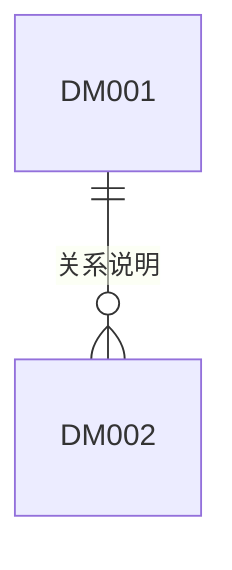

# MessagePick 数据模型

> **状态**: draft
> **生成者**: `docs/prompt/generate_data_model.md`
> **上游**: `docs/product/prd.md`、`docs/design/modules.md`
> **下游**: `docs/prompt/generate_tasks.md`、`docs/prompt/generate_acceptance_tests.md`
> **变更中**: —
> **最后更新**: 2026-09-12

<!-- 本文件由 prompt 生成。修改必须走 design-doc-change skill（.github/skills/design-doc-change/SKILL.md，状态机见 docs/README.md §6）。 -->
<!-- 只声明模型：不写建表语句、不选数据库、不写 ORM 映射。 -->

## 1. 实体清单

| 实体 ID | 实体名 | 归属模块 | 来源需求 | 职责 |
| --- | --- | --- | --- | --- |
| DM-001 | | MOD-### | REQ-### | |

## 2. 实体详情

### DM-001 <实体名>

| 字段 | 类型 | 来源 | 默认值 | 可空 | 约束 |
| --- | --- | --- | --- | --- | --- |

- **计算口径**：由其他字段派生的字段及其规则
- **关系**：与其他实体的基数、级联行为
- **生命周期**：创建时机、可变字段、删除 / 归档规则

## 3. 实体关系图

## 4. 待确认

<!-- > TODO: 待确认 —— <具体问题> -->
