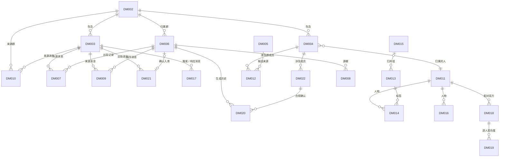

# MessagePick 数据模型

> **状态**: reviewed
> **生成者**: `docs/prompt/generate_data_model.md`
> **上游**: `docs/product/prd.md`、`docs/design/modules.md`
> **下游**: `docs/prompt/generate_tasks.md`、`docs/prompt/generate_acceptance_tests.md`
> **变更中**: —
> **最后更新**: 2026-09-12

<!-- 本文件由 prompt 生成。修改必须走 design-doc-change skill（.github/skills/design-doc-change/SKILL.md，状态机见 docs/README.md §6）。 -->
<!-- 只声明模型：不写建表语句、不选数据库、不写 ORM 映射。 -->

## 1. 实体清单

| 实体 ID | 实体名 | 归属模块 | 来源需求 | 职责 |
| --- | --- | --- | --- | --- |
| DM-001 | 采集来源状态 | MOD-001 | REQ-001、REQ-002、REQ-016 | 按来源记录采集 / 导入状态；派生「记录更新至 X」与「是否有数据」 |
| DM-002 | 群 | MOD-002 | REQ-004、REQ-011、REQ-047 | 群的标识与名称；群多选筛选与按群删除的单位 |
| DM-003 | 原始消息记录 | MOD-002 | REQ-001、REQ-005、REQ-007、REQ-011、REQ-032、REQ-070 | 全部结论的来源事实；可回跳原文的终点 |
| DM-004 | 群成员身份 | MOD-002 | REQ-001、REQ-005、REQ-006、REQ-082 | 群内身份（群昵称 / 群名片、Me 标识）；跨群合并的入口 |
| DM-005 | 通讯录 / 好友列表记录 | MOD-002 | REQ-001、REQ-082 | 仅用于生成身份对齐候选 |
| DM-006 | 梗 | MOD-005 | REQ-005、REQ-020、REQ-026 ~ REQ-028、REQ-035、REQ-038、REQ-040 | 梗单元主体与全部派生指标 |
| DM-007 | 梗出现记录 | MOD-005 | REQ-006、REQ-007、REQ-027、REQ-028、REQ-031 | 梗 ↔ 来源消息的关联；全部梗统计的基础数据 |
| DM-008 | 梗变体关系 | MOD-005 | REQ-033、REQ-035 | 衍生说法之间的关系与切换 |
| DM-009 | 梗精华消息 | MOD-005 | REQ-007、REQ-032 | 每梗默认 3 条代表性消息 |
| DM-010 | 提取条目 | MOD-006 | REQ-005、REQ-007、REQ-043 ~ REQ-048 | 识别类型 + 要素 + 来源消息；通知总览 / 待办 / 时间轴 / 详情的主体 |
| DM-011 | 人 | MOD-007 | REQ-006、REQ-057、REQ-066、REQ-079、REQ-081、REQ-082 | 跨群合并单位；承载活跃度、回复时长与维度分 |
| DM-012 | 身份对齐候选映射 | MOD-007 | REQ-082 | 跨群候选映射与确认 / 否定状态 |
| DM-013 | 兴趣标签 | MOD-007 | REQ-052 ~ REQ-055、REQ-067、REQ-078、REQ-087 | 二级标签本体（一级五类）、热度分与事件流 |
| DM-014 | 人物兴趣标签 | MOD-007 | REQ-050、REQ-053、REQ-054、REQ-056、REQ-058 | 人 ↔ 兴趣双向索引的唯一数据（含置信度与证据） |
| DM-015 | 同义标签归并组 | MOD-007 | REQ-055 | 同义二级标签归并为同一条 |
| DM-016 | 性格标签 | MOD-007 | REQ-072、REQ-074 ~ REQ-077 | 六维闭集性格标签与分数、确认状态 |
| DM-017 | 消息互动记录 | MOD-007 | REQ-058、REQ-066 | 回复时长与「实际互动」的基础数据 |
| DM-018 | 两人契合度 | MOD-007 | REQ-058、REQ-059、REQ-062、REQ-086 | 共同爱好 + 契合度 + 逐维度差值 |
| DM-019 | 我的社交契合度 | MOD-007 | REQ-006、REQ-079 | 逐人契合度列表 + 整体融入度 |
| DM-020 | 生成历史 | MOD-008 | REQ-013、REQ-014、REQ-036 ~ REQ-038 | 生成结果留存（可回看与再次下载） |
| DM-021 | 候选梗单元 | MOD-008 | REQ-009、REQ-038 | 新梗候选（确认前不生效） |
| DM-022 | 素材合规确认 | MOD-008 | REQ-013、REQ-014 | 成员素材的确认状态 |

### 1.1 与 modules.md「持有数据」声明的对应

| 模块 | modules.md 声明的持有数据 | 本文件落点 |
| --- | --- | --- |
| MOD-001 | 来源状态、完成时间 X、是否有数据、原始采集记录 | DM-001；原始采集记录经 MOD-002 落 DM-002 ~ DM-005，不另存副本 |
| MOD-002 | 原始消息记录、成员身份、通讯录 / 好友列表、派生结果、删除范围与级联关系 | DM-002 ~ DM-005；派生结果为 DM-006 ~ DM-022；删除范围不分配 `DM-###`（见 §1.2） |
| MOD-003 | 任务输入、任务结果、失败 / 超时分类 | 无落点（见 §1.2） |
| MOD-004 | 全局筛选条件、是否无数据、记录更新至 X、视图与导航状态 | 筛选条件见 `api-contract.md` §1.3（不重复定义）；是否无数据、记录更新至 X 为 DM-001 的派生字段；视图与导航状态无落点（见 §1.2） |
| MOD-005 | 梗名 / 类型 / 解读、首现与最近调用、累计 / 周环比 / 热度、月度分布、生命周期、梗王、精华消息、相关变体、纠正标记、词云口径 | DM-006 ~ DM-009；词云口径无落点（见 §1.2） |
| MOD-006 | 提取条目与要素、来源群 / 来源消息引用、主题、优先级、待办状态、提醒状态、关键词过滤对象 | DM-010；关键词过滤对象为匹配口径，不单独成实体（见 §1.2） |
| MOD-007 | 人物、兴趣标签、同义归并组、活跃度、回复时长、契合度 / 维度分 / 融入度、性格标签、时间轴 / 事件流、未知标记 | DM-011 ~ DM-019 |
| MOD-008 | 生成历史、候选梗单元、素材档位、「创作」标注、合规确认记录 | DM-020 ~ DM-022 |

### 1.2 无数据落点的模块与结构

- **MOD-003 智能分析引擎**：无 `DM-###`。任务输入不落库（是否持久化由调用方决定），任务结果与失败 / 超时分类随接口返回（`api-contract.md` API-007、API-008）。经阶段 4 提问 3/10 确认。
- **MOD-004 应用外壳与全局筛选**：无 `DM-###`。全局筛选条件已在 `api-contract.md` §1.3 定义，不在此重复（避免两处事实来源）；「是否无数据」「记录更新至 X」是 DM-001 的派生字段；视图与导航状态属运行期状态。经阶段 4 提问 3/10 确认。
- **运行期与输出型结构（不分配 `DM-###`）**：删除范围与级联关系（MOD-002 删除预检的输出，API-005）、词云口径与布局（模块一视图状态，默认累计出现次数、可切指定时间窗，REQ-020）、组局建议（REQ-063，仅输出文字、不留存）。经阶段 4 提问 3/10 确认。
- **匹配口径类声明**：模块一 = 梗名与解读、模块二 = 消息文本与 AI 总结、模块三 = 标签名与成员昵称（REQ-005），写在对应实体的约束中，不单独成实体。

## 2. 实体详情

字段表「来源」列取值：**采集**（外部获取：wechat-cli / 通讯录与好友列表）、**任务产出**（MOD-003 的模型任务）、**使用者输入**（使用者操作 / 改判 / 确认）、**计算**（由其他字段或实体派生）。全部时间口径以来源消息的发送时间为基准（阶段 4 提问 10/10 裁定）。

### DM-001 采集来源状态

**归属模块**：MOD-001 数据接入与更新 ｜ **来源需求**：REQ-001、REQ-002、REQ-016。

| 字段 | 类型 | 来源 | 默认值 | 可空 | 约束 |
| --- | --- | --- | --- | --- | --- |
| 采集来源 | 枚举（群消息 / 通讯录与好友列表） | —（实体身份） | — | 否 | 两个来源各一条（REQ-001） |
| 状态 | 枚举（成功 / 失败 / 无授权 / 超时） | 采集 | — | 否 | 按来源分别记录；部分失败不阻塞，其余来源结果照常返回（REQ-016） |
| 最近成功时间 | 时间点 | 采集 | — | 可空（从未成功时为空） | 仅群消息来源推进「记录更新至 X」（REQ-002、阶段 2 提问裁定） |
| 失败原因 | 文本 | 采集 | — | 可空（成功时为空） | 无授权 / 超时必须给出原因，供手动重试（REQ-016） |
| 记录更新至 X | 时间点 | 计算 | — | 可空（群消息来源从未成功时为空） | = 群消息来源的「最近成功时间」（REQ-002、阶段 2 提问裁定） |
| 是否有数据 | 布尔 | 计算 | 否 | 否 | = 群消息来源存在至少一条 DM-003 记录；为否时触发首屏引导（REQ-003） |

- **计算口径**：「记录更新至 X」与「是否有数据」均为派生值，由「最近成功时间」与 DM-003 的记录数即时得出，不单独维护。
- **关系**：不引用其他实体；「是否有数据」随 DM-002 / DM-003 的删除即时回落（REQ-003、REQ-011）。
- **生命周期**：首次执行「更新数据」时按来源创建（各一条）；仅由采集 / 重试结果更新；全量清空时一并删除（REQ-011）。

### DM-002 群

**归属模块**：MOD-002 数据存储与隐私 ｜ **来源需求**：REQ-004、REQ-011、REQ-047。

| 字段 | 类型 | 来源 | 默认值 | 可空 | 约束 |
| --- | --- | --- | --- | --- | --- |
| 群标识 | 标识 | 采集 | — | 否 | 唯一；群多选筛选与按群删除的单位（REQ-004、REQ-011） |
| 群名 | 文本 | 采集 | — | 否 | 群多选项与「来源群」展示（REQ-004、REQ-047、REQ-048） |

- **计算口径**：无派生字段。
- **关系**：1:N → DM-003、DM-004、DM-006、DM-010。级联（按群删除）→ 该群的原始消息记录、群成员身份、归属该群的梗及其全部派生结果一并删除，不可恢复（REQ-011）。
- **生命周期**：采集到该群首条记录时创建；群名随采集更新；删除不可恢复（REQ-011）。

### DM-003 原始消息记录

**归属模块**：MOD-002 数据存储与隐私 ｜ **来源需求**：REQ-001、REQ-005、REQ-007、REQ-011、REQ-032、REQ-070。

| 字段 | 类型 | 来源 | 默认值 | 可空 | 约束 |
| --- | --- | --- | --- | --- | --- |
| 消息标识 | 标识 | 采集 | — | 否 | 记录身份键；重复写入按身份去重，不产生副本（REQ-007） |
| 所属群 | 引用（→ DM-002） | 采集 | — | 否 | 群筛选与按群删除的依据（REQ-004、REQ-011） |
| 发送者 | 引用（→ DM-004） | 采集 | — | 否 | 梗王统计与「我相关」判定的依据（REQ-006、REQ-031） |
| 发送时间 | 时间点 | 采集 | — | 否 | 全部时间口径的基准（阶段 4 提问 10/10 裁定） |
| 类型 | 枚举（文字 / 图片 / 表情包） | 采集（识别兜底） | 文字 | 否 | 九类系统 / 活动消息记为 DM-010 的识别类型，不进入本字段（REQ-032、REQ-043、阶段 4 提问 4/10 裁定） |
| 文本内容 | 文本 | 采集 | — | 可空（图片 / 表情包消息为空） | 关键词匹配对象之一（模块二，REQ-005） |
| 媒体引用 | 引用（图片 / 表情包素材） | 采集 | — | 可空（文字消息为空） | 支持预览；可作为 G1 素材档位①的参考（REQ-032、REQ-036） |
| 提及成员 | 引用集（→ DM-004） | 采集 | 空 | 可空（无提及为空） | 「消息涉及的成员」与「被 @」判定的依据（REQ-066、REQ-070） |
| 引用消息 | 引用（→ DM-003） | 采集 | 空 | 可空（非引用回复为空） | 「直接接话」判定依据之一（REQ-066、阶段 4 追问 2/2 裁定） |

- **计算口径**：本实体保存原始事实，不派生其他字段；全部时间口径以「发送时间」为准（阶段 4 提问 10/10 裁定）。
- **关系**：N:1 → DM-002、DM-004；自引用「引用消息」；被 DM-007、DM-009、DM-010、DM-014、DM-017 引用为来源消息。级联 → 按群删除时随群删除；消息被删除时引用它的派生结果一并删除，不保留悬空引用（REQ-007、REQ-011）。
- **生命周期**：采集写入时创建；写入后字段不可修改（重复写入按消息标识去重）；删除不可恢复（REQ-011）。

### DM-004 群成员身份

**归属模块**：MOD-002 数据存储与隐私 ｜ **来源需求**：REQ-001、REQ-005、REQ-006、REQ-082。

| 字段 | 类型 | 来源 | 默认值 | 可空 | 约束 |
| --- | --- | --- | --- | --- | --- |
| 成员标识 | 标识 | 采集 | — | 否 | 群内唯一；记录身份键（REQ-001） |
| 所属群 | 引用（→ DM-002） | 采集 | — | 否 | 同一人在不同群是不同记录（REQ-082） |
| 群昵称 / 群名片 | 文本 | 采集 | — | 否 | 关键词匹配对象之一（模块三，REQ-005） |
| 是否「我」 | 布尔 | 采集（Me 标识） | 否 | 否 | 无需使用者手工设置；全库至多一条为真（REQ-006） |
| 归属的人 | 引用（→ DM-011） | 计算 | — | 否 | 默认指向仅含本成员的人；存在已确认映射时按映射合并（REQ-082、阶段 4 提问 2/10 裁定） |

- **计算口径**：「归属的人」= 未确认映射时，本群成员自成一个「人」；DM-012 状态为「已确认」的映射把两端群成员指向同一个人；「未确认 / 已否定」不生效（REQ-082）。
- **关系**：N:1 → DM-002、DM-011；被 DM-003、DM-010、DM-012、DM-022 引用。级联 → 按群删除时随群删除；某「人」不再有任何群成员身份时，该人及其派生结果一并删除（REQ-011）。
- **生命周期**：采集写入时创建；群昵称 / 群名片随采集更新；删除不可恢复（REQ-011）。

### DM-005 通讯录 / 好友列表记录

**归属模块**：MOD-002 数据存储与隐私 ｜ **来源需求**：REQ-001、REQ-082。

| 字段 | 类型 | 来源 | 默认值 | 可空 | 约束 |
| --- | --- | --- | --- | --- | --- |
| 联系人标识 | 标识 | 采集 | — | 否 | 与来源组合后唯一 |
| 显示名 | 文本 | 采集 | — | 否 | 生成身份对齐候选的匹配依据（REQ-082） |
| 来源 | 枚举（通讯录 / 好友列表） | 采集 | — | 否 | 同一人来自两个来源时各记一条（REQ-001） |

- **计算口径**：无派生字段。
- **关系**：作为 DM-012 的候选来源被引用（REQ-082）；不参与模块一 / 模块二的计算。
- **生命周期**：采集写入时创建（按联系人标识 + 来源去重）；无群归属，按群删除不影响；全量清空时删除，不可恢复（REQ-011）。
- 字段集为最小集，仅服务身份对齐候选，不做联系人管理用途（阶段 4 提问 5/10 裁定）。

### DM-006 梗

**归属模块**：MOD-005 梗分析（模块一）｜ **来源需求**：REQ-005、REQ-020、REQ-026 ~ REQ-028、REQ-035、REQ-038、REQ-040。

| 字段 | 类型 | 来源 | 默认值 | 可空 | 约束 |
| --- | --- | --- | --- | --- | --- |
| 梗标识 | 标识 | 任务产出 | — | 否 | 唯一；G3 候选经确认入库后取得（REQ-038） |
| 归属群 | 引用（→ DM-002） | 任务产出（首现消息所在群） | — | 否 | 一个梗只属一个群；群筛选与按群删除按此字段作用（REQ-004、REQ-011、阶段 4 提问 1/10 裁定） |
| 梗名 | 文本 | 任务产出 + 使用者输入 | — | 否 | 词云字号载体；关键词匹配对象之一（REQ-005、REQ-020） |
| 类型 | 枚举（口头禅 / 内部梗 / 表情包梗） | 任务产出 + 使用者输入 | — | 否 | ≤3 类；带图例且每类另有文字标签（REQ-020） |
| 解读 | 文本 | 任务产出 | — | 否 | 一句话覆盖「什么意思、从哪来、现在怎么用」；关键词匹配对象之一（REQ-005、REQ-026） |
| 纠正标记 | 枚举（无 / 不是梗 / 不感兴趣 / 已合并至 / 梗王标注有误） | 使用者输入 | 无 | 否 | 改判立即影响后续结果（REQ-008、REQ-035） |
| 合并目标 | 引用（→ DM-006） | 使用者输入（仅「合并到其他梗」） | 空 | 可空（非合并改判为空） | 目标须与本梗同属一个群；合并仅由使用者手动发起（REQ-035、REQ-040） |
| 来源候选 | 引用（→ DM-021） | 使用者输入（确认入库） | 空 | 可空（非 G3 入库为空） | 确认前不进入词云等视图（REQ-038） |
| 首现时间 / 首现来源群 | 时间点 / 引用（→ DM-002） | 计算 | — | 否 | = 最早一条出现记录（DM-007）的消息发送时间与所属群（REQ-027） |
| 最近调用时间 | 时间点 | 计算 | — | 否 | = 最新一条出现记录的消息发送时间（REQ-028） |
| 距今 | 时长 | 计算 | — | 否 | = 当前时间 − 最近调用时间（阶段 4 提问 10/10 裁定） |
| 累计出现次数 | 整数 | 计算 | 0 | 否 | = 出现记录条数（按消息计数）（REQ-028） |
| 周环比 | 数值 | 计算 | — | 否 | 最近 7 天出现次数对上一 7 天的环比（REQ-028、阶段 4 提问 10/10 裁定） |
| 热度状态 | 枚举（活跃 / 衰减中 / 已沉寂） | 计算 | — | 否 | 按距今：≤7 天活跃、8–30 天衰减中、>30 天已沉寂（REQ-028、阶段 1 提问裁定） |
| 月度分布 | 数值序列（月 → 次数） | 计算 | 空 | 否 | 按发送时间分月计数；不完整月份 = 当月与数据未覆盖整月的边界月（REQ-029、阶段 4 提问 10/10 裁定） |
| 生命周期 | 结构（首现 / 峰值 / 沉寂点 / 活跃天数） | 计算 | — | 否 | 峰值 = 出现次数最多的月份；沉寂点 = 最近一次出现的时间点；活跃天数 = 首现到最近调用时间的自然日跨度（REQ-025、REQ-030、阶段 4 提问 9/10 裁定） |
| 梗王 / 主要使用者 | 结构（成员 + 次数 + 占比） | 计算 | — | 否 | 梗王 = 出现记录中发送者次数最多者，并列时全部列出；占比 = 梗王次数 ÷ 累计出现次数；只呈现可统计事实（REQ-031、阶段 4 提问 9/10 裁定） |

- **计算口径**：全部派生字段以 DM-007 的出现记录为唯一基础数据；不做跨群合并（REQ-040、阶段 4 提问 1/10 裁定）。
- **关系**：N:1 → DM-002；1:N → DM-007、DM-009、DM-020；自关联 → DM-008（变体）、本实体「合并目标」；N:1 → DM-021（来源候选）。级联 → 按群删除时归属该群的梗及其派生结果一并删除（REQ-011）。
- **生命周期**：识别任务创建，或 G3 候选经使用者确认后入库（REQ-038）；可变字段 = 梗名、类型、解读、纠正标记、合并目标；改判「不是梗」后不再进入词云与统计结果，改判记录保留（REQ-035）；删除不可恢复（REQ-011）。

### DM-007 梗出现记录

**归属模块**：MOD-005 梗分析（模块一）｜ **来源需求**：REQ-006、REQ-007、REQ-027、REQ-028、REQ-031。

| 字段 | 类型 | 来源 | 默认值 | 可空 | 约束 |
| --- | --- | --- | --- | --- | --- |
| 记录标识 | 标识 | 任务产出 | — | 否 | 记录身份键；重复写入按身份去重（REQ-007） |
| 梗 | 引用（→ DM-006） | 任务产出 | — | 否 | 记录的归属梗 |
| 来源消息 | 引用（→ DM-003） | 任务产出 | — | 否 | 必须可回跳原文（REQ-007、REQ-027） |
| 出现时间 | 时间点 | 计算 | — | 否 | = 来源消息的发送时间（阶段 4 提问 10/10 裁定） |
| 发言成员 | 引用（→ DM-004） | 计算 | — | 否 | = 来源消息的发送者（梗王统计口径，REQ-031） |
| 是否「我相关」 | 布尔 | 计算 | 否 | 否 | = 发送者为「我」，或来源消息的提及成员含「我」（REQ-006、阶段 4 提问 8/10 裁定） |

- **计算口径**：「我相关」用于 REQ-006 的只看 / 标注视角（「我用过的」与「我参与的消息里的」）。
- **关系**：N:1 → DM-006、DM-003。级联 → 来源消息被删除时记录一并删除，DM-006 的派生统计随之重算（REQ-011）。
- **生命周期**：梗识别任务写入时创建；不单独修改；随所属梗或来源消息删除而删除。

### DM-008 梗变体关系

**归属模块**：MOD-005 梗分析（模块一）｜ **来源需求**：REQ-033、REQ-035。

| 字段 | 类型 | 来源 | 默认值 | 可空 | 约束 |
| --- | --- | --- | --- | --- | --- |
| 源梗 | 引用（→ DM-006） | 任务产出 | — | 否 | 衍生说法的出发梗 |
| 衍生梗 | 引用（→ DM-006） | 任务产出 | — | 否 | 与源梗同属一个群（阶段 4 提问 1/10 裁定） |
| 关系状态 | 枚举（生效 / 已失效） | 任务产出 + 使用者输入 | 生效 | 否 | 任一端被改判「不是梗」或合并时转为已失效（REQ-035） |

- **计算口径**：梗单元的「相关变体」= 以该梗为源的生效关系的衍生梗集合，可点击切换到对应梗（REQ-033）。
- **关系**：N:1 → DM-006 ×2（源梗、衍生梗）。级联 → 任一端的梗被删除时关系删除（REQ-011）。
- **生命周期**：任务产出写入时创建；由改判或重跑更新；随梗删除。

### DM-009 梗精华消息

**归属模块**：MOD-005 梗分析（模块一）｜ **来源需求**：REQ-007、REQ-032。

| 字段 | 类型 | 来源 | 默认值 | 可空 | 约束 |
| --- | --- | --- | --- | --- | --- |
| 梗 | 引用（→ DM-006） | 任务产出 | — | 否 | — |
| 来源消息 | 引用（→ DM-003） | 任务产出 | — | 否 | 文字 / 图片 / 表情包均支持；图片可预览（REQ-032） |
| 展示序号 | 整数 | 任务产出 | — | 否 | 决定展示顺序 |

- **计算口径**：默认展示序号最小的 3 条，其余经「展开更多」查看；每条可查看上下文（REQ-032）。
- **关系**：N:1 → DM-006、DM-003。级联 → 梗或来源消息被删除时一并删除（REQ-011）；删除后按剩余出现记录重算，可少于 3 条。
- **生命周期**：任务产出写入时创建；重跑时整批替换；随所属梗删除。

### DM-010 提取条目

**归属模块**：MOD-006 信息提取（模块二）｜ **来源需求**：REQ-005、REQ-007、REQ-043 ~ REQ-048。

| 字段 | 类型 | 来源 | 默认值 | 可空 | 约束 |
| --- | --- | --- | --- | --- | --- |
| 条目标识 | 标识 | 任务产出 | — | 否 | 记录身份键 |
| 识别类型 | 枚举（至少含群公告 / @所有人 / 接龙 / 投票 / 报名 / 缴费 / 会议 / 活动 / 截止日期） | 任务产出 | — | 否 | 至少覆盖九类，可扩展（REQ-043、阶段 4 提问 4/10 裁定） |
| 时间要素 | 时间点 | 任务产出 | 空 | 可空（未提取到为空） | REQ-043 |
| 地点要素 | 文本 | 任务产出 | 空 | 可空（未提取到为空） | REQ-043 |
| 人物要素 | 引用集（→ DM-004） | 任务产出 | 空 | 可空（未提取到为空） | REQ-043 |
| 事项要素 | 文本 | 任务产出 | 空 | 可空（未提取到为空） | REQ-043 |
| DDL | 时间点 | 任务产出 | 空 | 可空（无截止日期为空） | 到期提醒的计算基准（REQ-043、REQ-046） |
| 来源群 | 引用（→ DM-002） | 任务产出 | — | 否 | 详情 heading（REQ-048）；时间轴与群多选（REQ-047） |
| 来源消息 | 引用集（→ DM-003） | 任务产出 | — | 否 | 详情正文必须含全部来源消息；可回跳原文（REQ-007、REQ-048） |
| 一句话总结 | 文本 | 任务产出 | — | 否 | 详情 heading（REQ-048） |
| AI 总结 | 文本 | 任务产出 | — | 否 | 详情正文；关键词匹配对象之一（REQ-005、REQ-048） |
| 主题 | 文本 | 任务产出 + 使用者输入 | — | 否 | 由聚类命名、可改，改后立即生效（REQ-008、REQ-044） |
| 优先级 | 枚举（高 / 中 / 低） | 任务产出 + 使用者输入 | 中 | 否 | 三档闭集；由判定给出、可改（REQ-045、阶段 4 追问 1/2 裁定） |
| 待办状态 | 枚举（未处理 / 完成 / 忽略） | 使用者输入 | 未处理 | 否 | 支持「完成」「忽略」标记（REQ-046） |
| 提醒状态 | 枚举（待提醒 / 不提醒） | 计算 | 不提醒 | 否 | = 待办状态为「未处理」且当前时间距 DDL ≤ 1 天；仅在使用应用期间检查，无后台常驻（REQ-046、阶段 2 提问裁定） |

- **计算口径**：「提醒状态」如上；本实体不区分身份（模块二界面无身份维度，REQ-006）。
- **关系**：N:1 → DM-002；N:N → DM-003（来源消息）；N:N → DM-004（人物要素）。级联 → 来源消息被删除时按剩余来源消息重算，无来源消息时删除（REQ-011）。
- **生命周期**：识别 / 提取任务写入时创建；可变字段 = 主题、优先级、待办状态；删除不可恢复（REQ-011）。

### DM-011 人

**归属模块**：MOD-007 社交画像（模块三）｜ **来源需求**：REQ-006、REQ-057、REQ-066、REQ-079、REQ-081、REQ-082。

| 字段 | 类型 | 来源 | 默认值 | 可空 | 约束 |
| --- | --- | --- | --- | --- | --- |
| 人标识 | 标识 | 计算 | — | 否 | 跨群合并单位；未确认映射时一人 = 一个群成员（REQ-082、阶段 4 提问 2/10 裁定） |
| 群成员身份 | 引用集（→ DM-004） | 计算 | — | 否 | 经已确认映射（DM-012）合并进来的全部群成员（REQ-082） |
| 是否「我」 | 布尔 | 计算 | 否 | 否 | = 包含带 Me 标识的群成员；全库至多一人为真（REQ-006） |
| 未知标记 | 布尔 | 计算 | 否 | 否 | 发言不足、不足以推断兴趣时为真；不做推测，仍列出并列于人-人图谱（零连线）（REQ-081）；判定阈值由实现层确定（阶段 4 提问 6/10 裁定） |
| 活跃度 | 数值（发言量） | 计算 | 0 | 否 | 跨全部已采集群合并到人；与「社交」维度同源；在契合度中只计一次（REQ-057、阶段 4 提问 7/10 裁定） |
| 回复时长 | 时长（中位数） | 计算 | — | 可空（无可统计样本时为空） | 以「被 @ 或直接接话」为触发，取首条回复间隔的中位数；排除纯表情回复与跨天回复；跨群合并到人（REQ-066、阶段 4 追问 2/2 裁定） |
| 一级维度分 | 数值序列（运动 / 艺术 / 游戏 / 娱乐 / 社交） | 计算 | 0 | 否 | 每个维度 = 该维度下该人的全部二级标签置信度之和（REQ-080） |
| 性格维度分 | 数值序列（六个性格维度） | 计算 | 0 | 否 | 只统计状态为「已确认」的性格标签（REQ-075、REQ-080） |

- **计算口径**：回复时长触发口径（阶段 4 追问 2/2 裁定）：「直接接话」= 引用对方消息的回复或同一群内紧随其后的回复；「跨天」= 自然日不同；「纯表情回复」= 仅含表情包 / 图片的消息。展示用名称取自其群成员记录的群昵称 / 群名片（REQ-005）。
- **关系**：1:N → DM-004；被 DM-012、DM-014、DM-016、DM-018、DM-019 引用。级联 → 最后一个群成员身份被删除时，该人及其全部派生结果删除（REQ-011）。
- **生命周期**：随群成员身份创建（默认一人对应一个群成员）；映射确认后合并、否定后保持独立（REQ-082）；删除不可恢复（REQ-011）。

### DM-012 身份对齐候选映射

**归属模块**：MOD-007 社交画像（模块三）｜ **来源需求**：REQ-082。

| 字段 | 类型 | 来源 | 默认值 | 可空 | 约束 |
| --- | --- | --- | --- | --- | --- |
| 候选标识 | 标识 | 任务产出 | — | 否 | — |
| 候选来源 | 引用（→ DM-005） | 任务产出 | — | 否 | 候选结合通讯录 / 好友列表给出（REQ-082） |
| 涉及群成员 | 引用集（→ DM-004，两个及以上） | 任务产出 | — | 否 | 如「A 群的张三 = B 群的小张」（REQ-082） |
| 状态 | 枚举（未确认 / 已确认 / 已否定） | 使用者输入 | 未确认 | 否 | 未确认与已否定均不生效（REQ-082） |
| 确认时间 | 时间点 | 使用者输入 | 空 | 可空（未确认 / 已否定为空） | 逐条确认 / 否定的记录（REQ-082） |

- **计算口径**：状态为「已确认」时，涉及群成员的「归属的人」（DM-004）合并到同一个人；其余状态无任何效果（REQ-082）。
- **关系**：N:1 → DM-005；N:N → DM-004。级联 → 任一群成员身份被删除时该候选映射删除（REQ-011）。
- **生命周期**：由任务产出创建；由使用者逐条确认 / 否定；未确认前相关人按各自独立个体处理（REQ-082）；全量清空时删除。

### DM-013 兴趣标签

**归属模块**：MOD-007 社交画像（模块三）｜ **来源需求**：REQ-052 ~ REQ-055、REQ-067、REQ-078、REQ-087。

| 字段 | 类型 | 来源 | 默认值 | 可空 | 约束 |
| --- | --- | --- | --- | --- | --- |
| 标签标识 | 标识 | 任务产出 + 使用者输入 | — | 否 | 二级标签本体（REQ-052） |
| 标签名 | 文本 | 任务产出 + 使用者输入 | — | 否 | 关键词匹配对象之一（模块三，REQ-005）；可人工增 / 删 / 改（REQ-056） |
| 一级维度 | 枚举（运动 / 艺术 / 游戏 / 娱乐 / 社交） | 任务产出 | — | 否 | 固定五类，不增不减（REQ-052、REQ-054） |
| 归并组 | 引用（→ DM-015） | 任务产出 + 使用者输入 | 空 | 可空（未归并时为空） | 同义标签归并为同一条（REQ-055） |
| 首现时间 | 时间点 | 计算 | — | 否 | = 该标签下最早的证据消息发送时间（REQ-067） |
| 事件流 | 结构（时间点 → 强度） | 计算 | 空 | 否 | 回放兴趣首现与兴衰；不参与任何权重计算（REQ-067、REQ-087） |
| 兴趣热度分 | 数值 | 计算 | — | 否 | = 该标签下全部人的活跃 / 投入程度（REQ-078）；聚合口径由实现层确定（阶段 4 提问 6/10 裁定） |

- **计算口径**：「归并组」生效时，「兴趣 → 人」与「人 → 兴趣」两侧统一以代表标签呈现，同义标签不重复出现（REQ-055）。
- **关系**：1:N → DM-014；N:1 → DM-015。级联 → 不再被任何人物兴趣标签引用时删除（REQ-011）。
- **生命周期**：抽取任务创建或使用者新增；可变字段 = 标签名、一级维度、归并组；删除不可恢复（REQ-011）。

### DM-014 人物兴趣标签

**归属模块**：MOD-007 社交画像（模块三）｜ **来源需求**：REQ-050、REQ-053、REQ-054、REQ-056、REQ-058。

| 字段 | 类型 | 来源 | 默认值 | 可空 | 约束 |
| --- | --- | --- | --- | --- | --- |
| 人物 | 引用（→ DM-011） | 任务产出 | — | 否 | — |
| 兴趣标签 | 引用（→ DM-013） | 任务产出 | — | 否 | — |
| 置信度 | 数值 | 任务产出 | — | 否 | 用于维度分求和与契合度加权；分值口径由实现层确定（REQ-058、REQ-080、阶段 4 提问 6/10 裁定） |
| 证据 | 引用集（→ DM-003） | 任务产出 | — | 否 | 每条标签必须附带证据消息；无证据的标签不进入画像（REQ-053、REQ-054） |
| 来源方式 | 枚举（模型抽取 / 同义归并 / 人工增改） | 任务产出 + 使用者输入 | 模型抽取 | 否 | 人工增 / 删 / 改立即生效（REQ-008、REQ-056） |

- **计算口径**：无派生字段；本实体是「人 ↔ 兴趣」双向索引的唯一数据，正反两个方向互为反查（REQ-050）。
- **关系**：N:1 → DM-011、DM-013；N:N → DM-003（证据）。级联 → 人或标签删除时记录删除（REQ-011）。
- **生命周期**：抽取任务创建；由使用者增 / 删 / 改；删除不可恢复（REQ-011）。

### DM-015 同义标签归并组

**归属模块**：MOD-007 社交画像（模块三）｜ **来源需求**：REQ-055。

| 字段 | 类型 | 来源 | 默认值 | 可空 | 约束 |
| --- | --- | --- | --- | --- | --- |
| 归并组标识 | 标识 | 任务产出 | — | 否 | — |
| 代表标签 | 引用（→ DM-013） | 任务产出 | — | 否 | 归并后对外呈现的标签（REQ-055） |
| 已归入标签 | 引用集（→ DM-013） | 任务产出 + 使用者输入 | — | 否 | 如「羽毛球 / 打羽球 / 约球」归一为同一条（REQ-055） |

- **计算口径**：归并不改变证据与置信度，只改变呈现与聚合口径（REQ-055）。
- **关系**：1:1 → DM-013（代表标签）；1:N → DM-013（已归入标签）。级联 → 代表标签被删除时归并组失效并删除（REQ-011）。
- **生命周期**：抽取后自动生成，可由使用者修正（REQ-055、REQ-056）；随所属标签删除。

### DM-016 性格标签

**归属模块**：MOD-007 社交画像（模块三）｜ **来源需求**：REQ-072、REQ-074 ~ REQ-077。

| 字段 | 类型 | 来源 | 默认值 | 可空 | 约束 |
| --- | --- | --- | --- | --- | --- |
| 标签标识 | 标识 | 任务产出 | — | 否 | — |
| 人物 | 引用（→ DM-011） | 任务产出 | — | 否 | — |
| 维度 | 枚举（领导式 / 活泼 / 幽默 / 冷静 / 理性 / 判断） | 任务产出 | — | 否 | 六维闭集固定，不增删（REQ-072、REQ-074） |
| 分数 | 数值 | 任务产出 | — | 否 | 仅对使用者本人可见，无对外通道（REQ-077）；分值口径由实现层确定（阶段 4 提问 6/10 裁定） |
| 状态 | 枚举（候选 / 已确认） | 使用者输入 | 候选 | 否 | 未确认候选不得出现在任何产物与视图；确认动作仅由使用者执行（REQ-075） |
| 来源方式 | 枚举（模型推断 / 人工增改） | 任务产出 + 使用者输入 | 模型推断 | 否 | 可增 / 删 / 改并立即生效（REQ-076） |

- **计算口径**：纳入 DM-011 的「性格维度分」时只统计状态为「已确认」的记录（REQ-075、REQ-080）。
- **关系**：N:1 → DM-011。级联 → 人物删除时标签删除（REQ-011）。
- **生命周期**：推断任务创建（候选）；经使用者确认后入库并展示；删除不可恢复（REQ-011）。

### DM-017 消息互动记录

**归属模块**：MOD-007 社交画像（模块三）｜ **来源需求**：REQ-058、REQ-066。

| 字段 | 类型 | 来源 | 默认值 | 可空 | 约束 |
| --- | --- | --- | --- | --- | --- |
| 记录标识 | 标识 | 计算 | — | 否 | 记录身份键 |
| 触发消息 | 引用（→ DM-003） | 计算 | — | 否 | 被 @ 或被接话的原消息（REQ-066） |
| 触发成员 | 引用（→ DM-004） | 计算 | — | 否 | 原消息的发送者（REQ-066） |
| 响应消息 | 引用（→ DM-003） | 计算 | — | 否 | 首条符合条件的回复（REQ-066） |
| 响应成员 | 引用（→ DM-004） | 计算 | — | 否 | 回复方（REQ-058、REQ-066） |
| 互动类型 | 枚举（@ 提及 / 引用回复 / 紧随接话） | 计算 | — | 否 | 判定口径见 DM-011「回复时长」（REQ-066、阶段 4 追问 2/2 裁定） |
| 间隔时长 | 时长 | 计算 | — | 否 | = 响应消息发送时间 − 触发消息发送时间；跨天（自然日不同）与纯表情回复不纳入统计（REQ-066、阶段 4 追问 2/2 裁定） |

- **计算口径**：只统计各触发消息的首条有效响应；本实体是「回复时长」（DM-011）与两人「实际互动」（DM-018）的唯一基础数据。
- **关系**：N:1 → DM-003 ×2（触发 / 响应消息）；N:1 → DM-004 ×2（触发 / 响应成员）。级联 → 任一端消息被删除时记录删除并重算相关统计（REQ-011）。
- **生命周期**：由已采集消息计算得出，可重算；随来源消息删除。

### DM-018 两人契合度

**归属模块**：MOD-007 社交画像（模块三）｜ **来源需求**：REQ-058、REQ-059、REQ-062、REQ-086。

| 字段 | 类型 | 来源 | 默认值 | 可空 | 约束 |
| --- | --- | --- | --- | --- | --- |
| 配对标识 | 标识 | 计算 | — | 否 | 两人组合（无序对）（REQ-062） |
| 人 A / 人 B | 引用（→ DM-011 ×2） | 计算 | — | 否 | 两个不同的人 |
| 共同爱好 | 引用集（→ DM-013） | 计算 | 空 | 否 | = 两人共有的人物兴趣标签对应的标签集合（REQ-062） |
| 契合度分 | 数值 | 计算 | — | 否 | 因子 = 共同标签数量 + 置信度加权 + 实际互动 + 活跃度（只计一次）；不做时效衰减；权重由实现层确定（REQ-058、REQ-086、阶段 4 提问 6/10、7/10 裁定） |
| 逐维度差值 | 数值序列（五轴差值） | 计算 | 空 | 否 | = 两人在同一一级维度上维度分之差，用于雷达图叠加对比（REQ-059、REQ-062、REQ-080） |

- **计算口径**：基础数据 = DM-014（共同标签与置信度）、DM-017（实际互动）、DM-011（活跃度，且只计一次）；时间轴 / 事件流不参与权重（REQ-087）。
- **关系**：N:1 → DM-011 ×2；被 DM-019 引用。级联 → 任一人删除时配对记录删除（REQ-011）。
- **生命周期**：按需计算；人 / 标签 / 互动数据变化后按最新数据重算；随人删除。

### DM-019 我的社交契合度

**归属模块**：MOD-007 社交画像（模块三）｜ **来源需求**：REQ-006、REQ-079。

| 字段 | 类型 | 来源 | 默认值 | 可空 | 约束 |
| --- | --- | --- | --- | --- | --- |
| 逐人契合度 | 引用集（→ DM-018） | 计算 | 空 | 否 | 「我」与每个群友的配对结果列表（REQ-079） |
| 整体融入度 | 数值 | 计算 | — | 否 | 「我」在群里的整体融入度（单一分数）；构成与权重由实现层确定（REQ-079、阶段 4 提问 6/10 裁定） |

- **计算口径**：逐人列表复用 DM-018 的配对结果，「我」由 DM-011 的「是否『我』」确定；身份未就绪时不可用（REQ-006）。
- **关系**：N:N → DM-018；1:1 → DM-011（「我」）。级联 → 随 DM-018 与人的删除而变化（REQ-011）。
- **生命周期**：按需计算；「我」或配对数据变化后重算。

### DM-020 生成历史

**归属模块**：MOD-008 再创作生成 ｜ **来源需求**：REQ-013、REQ-014、REQ-036 ~ REQ-038。

| 字段 | 类型 | 来源 | 默认值 | 可空 | 约束 |
| --- | --- | --- | --- | --- | --- |
| 记录标识 | 标识 | 任务产出 + 使用者输入 | — | 否 | 记录身份键 |
| 生成类型 | 枚举（G1 表情包 / G2 文字变体 / G3 新梗候选） | 使用者输入 | — | 否 | 三类入口（REQ-036 ~ REQ-038） |
| 梗引用 | 引用（→ DM-006） | 使用者输入 | 空 | 可空（G3 由候选入库后回填） | 生成所基于的梗（REQ-034） |
| 素材档位 | 枚举（参考群内图片 / 改编热门表情包 / 纯模板生成） | 使用者输入 | — | 可空（非 G1 为空） | 三档单选其一，不可多选（REQ-036、阶段 1 提问裁定） |
| 模板 | 文本 | 使用者输入 | 空 | 可空（非 G1 为空） | G1 所选模板（REQ-036） |
| 产出引用 | 引用集（4 张变体图 / 5 条文字 / 候选） | 任务产出 | — | 否 | 可复制 / 下载 / 回看（REQ-036、REQ-037、阶段 2 提问裁定） |
| 创作标注 | 标记（固定标识） | 任务产出 | 已标注 | 否 | 全部生成物必须带「创作」标注，不呈现为真实聊天记录（REQ-013） |
| 生成时间 | 时间点 | 任务产出 | — | 否 | 历史列表排序；可回看与再次下载（阶段 2 提问裁定） |

- **计算口径**：G1 产出 = 同一模板下 4 个文案变体（REQ-036、阶段 1 提问裁定）；G2 产出默认 5 条（REQ-037）；G3 产出为候选梗单元（见 DM-021），确认后才入库（REQ-038）。
- **关系**：N:1 → DM-006；N:1 → DM-021（G3）；N:1 → DM-022（涉及成员素材时）。级联 → 所属梗或所属群被删除时记录一并删除（REQ-011）。
- **生命周期**：生成动作发生时创建；产出可回看与再次下载；不自动发布、不自动替换群内说法（REQ-015）；删除不可恢复（REQ-011）。

### DM-021 候选梗单元

**归属模块**：MOD-008 再创作生成 ｜ **来源需求**：REQ-009、REQ-038。

| 字段 | 类型 | 来源 | 默认值 | 可空 | 约束 |
| --- | --- | --- | --- | --- | --- |
| 候选标识 | 标识 | 任务产出 | — | 否 | — |
| 含义推测 | 文本 | 任务产出 | — | 否 | REQ-038 |
| 出处消息 | 引用集（→ DM-003） | 任务产出 | — | 否 | 候选须给出出处消息（REQ-038） |
| 使用示例 | 文本 | 任务产出 | — | 否 | REQ-038 |
| 状态 | 枚举（候选 / 已确认入库 / 已废弃） | 使用者输入 | 候选 | 否 | 确认前不进入词云等视图（REQ-009、REQ-038） |
| 入库梗 | 引用（→ DM-006） | 使用者输入 | 空 | 可空（未确认为空） | 确认后回填（REQ-038） |

- **计算口径**：无派生字段。
- **关系**：N:N → DM-003（出处消息）；1:1 → DM-006（确认入库后）。级联 → 出处消息被删除时候选删除；入库后由 DM-006 承担生命周期（REQ-011）。
- **生命周期**：生成任务创建；由使用者确认（入库）或废弃；删除不可恢复（REQ-011）。

### DM-022 素材合规确认

**归属模块**：MOD-008 再创作生成 ｜ **来源需求**：REQ-013、REQ-014。

| 字段 | 类型 | 来源 | 默认值 | 可空 | 约束 |
| --- | --- | --- | --- | --- | --- |
| 确认标识 | 标识 | 使用者输入 | — | 否 | — |
| 素材引用 | 引用（群内图片 / 成员头像 / 照片 / 原话） | 使用者输入 | — | 否 | 素材未确认不得产出（REQ-014） |
| 涉及成员 | 引用（→ DM-004） | 使用者输入 | — | 否 | 使用成员素材必须经确认（REQ-014） |
| 确认状态 | 枚举（未确认 / 已确认） | 使用者输入 | 未确认 | 否 | 未确认时 G1 生成被拒（REQ-014） |
| 确认时间 | 时间点 | 使用者输入 | 空 | 可空（未确认为空） | 确认记录（REQ-014） |

- **计算口径**：无派生字段。
- **关系**：N:1 → DM-004；被 DM-020 引用。级联 → 成员身份被删除时确认记录删除（REQ-011）。
- **生命周期**：使用成员素材时创建；经使用者确认后生效；随所属数据删除。

## 3. 实体关系图

图中实体编号与 §1 实体清单一一对应（如 `DM003` = DM-003 原始消息记录）。

- **可追溯**：全部派生结果最终引用 DM-003（原始消息记录），删除 DM-003 的记录即级联删除引用它的派生结果，满足 REQ-007 与 REQ-011。
- **分层**：DM-002 ~ DM-005 是底层事实（MOD-002）；DM-006 ~ DM-022 是各业务模块的派生结果，彼此不互依赖（跨模块数据由 MOD-004 组装，见 `modules.md` §3）。
- **合并关系**：DM-004 指向 DM-011；未确认映射时一个群成员对应一个人，确认后才合并（REQ-082）。

## 4. 待确认

无。阶段 4 的 10 条提问与 2 条追问已全部闭环（裁定标注在各条目的「阶段 4 提问 n/10 裁定」「阶段 4 追问 n/2 裁定」中）；本文件不含未决 `TODO`。
