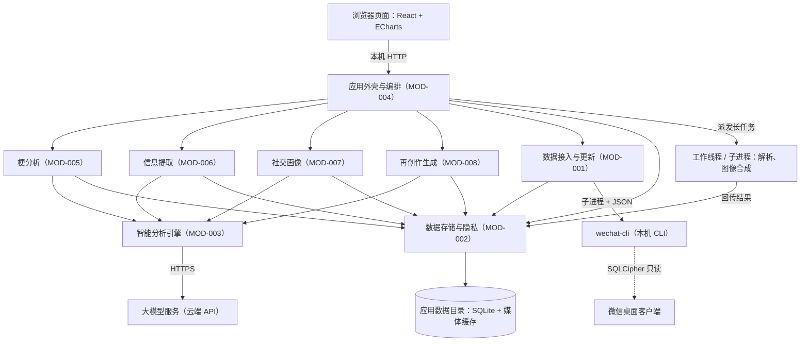

# 高层设计（HLD）

> **状态**: reviewed
> **生成者**: `docs/prompt/generate_high_level_design.md`
> **上游**: `docs/product/prd.md`、`docs/design/modules.md`
> **下游**: `docs/design/impl/detailed-design.md`、`docs/design/impl/mod-*.md`
> **变更中**: —
> **最后更新**: 2026-09-12

<!-- 本文件属于实现层。修改必须走 design-doc-change skill（.github/skills/design-doc-change/SKILL.md）。 -->

## 1. 架构总览

本应用是单机、单用户的本地 Web 应用：本机服务进程承载全部采集、分析、存储与编排逻辑，浏览器只负责展示与交互。自上而下五层——

1. **展示层**：浏览器页面（React + ECharts），三个模块的视图、全局筛选控件与设置 / 引导界面都在这里。
2. **外壳与编排层**：`MOD-004`，本机服务的 HTTP 入口，负责首屏引导、全局筛选、跨模块组装（含 `REQ-070` 的兴趣提示）与统一异常呈现；业务模块互不依赖，跨模块数据一律由它转交。
3. **业务模块层**：`MOD-005` ~ `MOD-008` 四个模块，同进程内独立成组件，互不发生依赖。
4. **能力层**：`MOD-001`（经适配层调用 wechat-cli 采集）、`MOD-003`（统一执行识别 / 抽取 / 聚类 / 生成 / 推断任务）、`MOD-002`（唯一的持久化与查询底座）。业务模块只经这三个模块触达外部世界与数据。
5. **外部**：wechat-cli 子进程、大模型服务（云端 API）；两者都是出站调用，应用无入站的外部访问入口。

各模块在架构中的落点（覆盖 `docs/design/modules.md` 的 8 个模块）：

| 模块 | 落点 |
| --- | --- |
| `MOD-001` | 服务进程内的采集适配层：拉起 wechat-cli 子进程、解析 JSON、去重写入 |
| `MOD-002` | 服务进程内的存储组件：独占 SQLite 库与媒体缓存目录，向全部模块提供读写与级联删除 |
| `MOD-003` | 服务进程内的模型任务组件：统一失败 / 超时 / 重试语义，向四个业务模块提供任务执行 |
| `MOD-004` | 浏览器页面 + 服务进程的 HTTP 入口共同构成外壳：视图容器、全局筛选、编排与异常统一呈现 |
| `MOD-005` | 业务模块一，运行于服务进程；图表由浏览器侧 ECharts 绘制 |
| `MOD-006` | 业务模块二，同上 |
| `MOD-007` | 业务模块三，同上 |
| `MOD-008` | 生成模块，运行于服务进程；图像合成在 worker 中执行 |

## 2. 运行时视图

应用整体在单台机器上运行，没有跨机部署边界；全部执行体如下。

**执行体与进程划分**

| 执行体 | 内容 | 与其他执行体的关系 |
| --- | --- | --- |
| 本机服务进程（Node） | HTTP 入口与外壳编排（`MOD-004`）、四个业务模块（`MOD-005` ~ `MOD-008`）、智能分析引擎（`MOD-003`）、采集适配层（`MOD-001`）、存储组件（`MOD-002`） | 单实例；仅监听回环地址；独占应用数据目录与 SQLite |
| 浏览器页面 | React 应用、ECharts 图表、筛选与表格控件 | 与服务进程跨进程；只经本机 HTTP 取数，不直接碰文件与数据库 |
| 工作线程 / 子进程 | CLI 输出解析、图像合成、大结果集处理等长任务（`worker_threads`，必要时子进程） | 由服务进程拉起；结果回传服务进程后统一落库 |
| wechat-cli 子进程 | 每次命令即启即走 | 由 `MOD-001` 经适配层调用，标准输出为 JSON |
| 大模型服务 | 云端 API（HTTPS） | 仅由 `MOD-003` 出站调用 |

**事件循环与串行点**

- 服务进程的单线程事件循环承载 HTTP 与编排；解析、图像合成等长任务不在此同步执行（见 §6 决策 6）。
- SQLite 写入由存储组件串行化（单写者）：一个事务内完成一批写入，不留下半成品状态。
- 采集流程全局互斥：同一时刻最多一个采集或分项重试在跑，避免同一来源被重复拉取。
- 模型任务的并发上限是配置项（默认值在 `detailed-design.md` 定）；超限排队，但不阻塞已缓存内容的读取。
- 浏览器侧的首屏绘制在页面线程执行；`REQ-010` 的耗时由「服务端查询 + 本机传输 + 页面渲染」三段共同决定。

**启动、退出与常驻**

- 启动：拉起本机服务 → 打开浏览器页面（启动方式与打包形式在 `detailed-design.md` 与交付阶段确定）。
- 无后台常驻：应用关闭后不执行采集、分析或提醒检查；`REQ-046` 的到期提醒因此只在使用应用期间出现（与阶段 2 的裁定一致）。

## 3. 关键流程（端到端）

### 流程 1 —— 数据接入：首次更新、增量更新与删除（覆盖 `US-014`、`US-015`）

1. 启动本机服务并打开浏览器页面；外壳（`MOD-004`）取更新状态，`MOD-001` 经 `MOD-002` 判定「是否已有数据」（`REQ-003`）。
2. 无数据 → 首屏引导（说明 +「更新数据」入口）；有数据 → 主界面，「记录更新至 X」始终可见（`REQ-002`、`REQ-003`）。
3. 点击「更新数据」→ `MOD-001` 处理两个来源：群消息（`sessions` 列群 → 各群 `history` 分页拉取 → `members` 取群成员）与通讯录 / 好友列表（`contacts`）；解析在 worker 中完成。
4. 记录经 `MOD-002` 按记录身份去重写入（幂等）；登录账号在采集时被识别为「我」（`REQ-006`）。
5. 群消息来源成功完成 → X 更新为本次完成时间；通讯录 / 好友列表分项记录状态（`REQ-002`）。
6. 任一来源失败、超时或无授权 → 分来源结果 + 分项提示 + 可单独重试，已入库数据不受影响（`REQ-016`）；若检出「未初始化」，给出原因与终端操作指引（见 §6 决策 7）。
7. 采集完成后在后台触发各模块所需的分析任务（见 §6 决策 9）；X 只随采集完成刷新，不受分析进度影响。
8. 删除分支（`US-015`）：设置页发起 → `MOD-002` 预检（受影响实体与计数）→ 二次确认 → 级联删除（原始记录 + 派生结果 + 生成历史 + 媒体缓存）→ 数据状态回落为「无数据」，重新出现首屏引导（`REQ-011`、`REQ-003`）。

### 流程 2 —— 梗分析：从词云到原文（覆盖 `US-001`、`US-002`、`US-003`）

1. 切入模块一：外壳取全局筛选条件（`REQ-004`）→ `MOD-005` 查询词云数据；尚未分析的部分先触发识别 / 解读 / 分类任务（经 `MOD-003`）并落库（`MOD-002`）。
2. 词云按「字号 = 频率、颜色 = 类型」绘制；支持布局切换、悬停信息与列表 / 表格等价视图（`REQ-020` ~ `REQ-024`）。
3. 点击梗词 → 梗单元：解读、首现与最近调用、累计次数与周环比、月度分布、生命周期条、梗王、精华消息、相关变体（`REQ-026` ~ `REQ-033`）。
4. 点击任一来源引用 → 经 `MOD-002` 回到对应原始消息（`REQ-007`）。
5. 「我相关」视角（我用过的 / 我参与的消息里的梗）按 `REQ-006` 过滤。
6. 纠正改判（不是梗 / 不感兴趣 / 合并到其他梗 / 梗王标注有误）写入后，相关视图即时按改判结果更新（`REQ-008`、`REQ-035`）。
7. 异常：分析失败或超时 → 提示 + 重试，已缓存内容仍可浏览；筛选无结果 → 空态 + 一键清除（`REQ-016`）。

### 流程 3 —— 信息提取：时间轴 → 通知 → 待办 → 详情（覆盖 `US-005`、`US-006`）

1. 切入模块二：`MOD-006` 查询提取条目（必要时先触发识别 / 抽取 / 聚类任务经 `MOD-003` 执行并落库）。
2. 消息时间轴按时间排列，群多选取自全局筛选条（`REQ-047`、`REQ-004`）。
3. 通知总览按来源 / 类型 / 优先级 / 待办浏览；主题与优先级可改，改后立即生效（`REQ-044`、`REQ-045`、`REQ-008`）。
4. 待办标记「完成 / 忽略」后落库；到期前 1 天、仅在使用应用期间检查并提示（`REQ-046`）。
5. 打开消息详情：外壳组装 `MOD-006` 的详情（heading + AI 总结 + 全部来源消息）与 `MOD-007` 的成员兴趣提示（`REQ-048`、`REQ-070`）。
6. 异常：分析失败或超时 → 提示 + 重试，已提取内容仍可浏览（`REQ-016`）；模块内不出现第二组时间 / 关键词 / 群筛选控件（`REQ-049`）。

### 流程 4 —— 社交画像：身份对齐 → 找人 → 配对 → 组局（覆盖 `US-007` ~ `US-013`）

1. 切入模块三：`MOD-007` 基于已采集数据生成 / 读取身份对齐候选（含通讯录 / 好友列表来源）；使用者逐条确认或否定，未确认的映射不生效（`REQ-082`）。
2. 兴趣抽取（`MOD-003`）→ 同义合并 → 落库；每条标签带证据消息引用（`REQ-053`、`REQ-054`、`REQ-055`）。
3. 正向：人物兴趣画像 + 爱好雷达图 + 个人标签词云 + 证据回原文；兴趣标签可增删改并即时影响后续结果（`REQ-056`、`REQ-061`、`REQ-071`、`REQ-073`）。
4. 反向：按一级维度或二级标签搜索 → 结果含回复时长与活跃度 → 选定兴趣生成组局建议（纯文字）（`REQ-064`、`REQ-065`、`REQ-063`）。
5. 配对与「我的社交契合度」：共同爱好 + 契合度 + 逐维度差值；逐人列表 + 整体融入度（`REQ-058`、`REQ-059`、`REQ-062`、`REQ-079`）。
6. 性格标签：候选 → 使用者确认 → 入库展示，未确认的不出现在任何产物（`REQ-074`、`REQ-075`、`REQ-076`）；不提供对外通道（`REQ-077`、`REQ-085`）。
7. 发言不足者标「未知」、仍列出、图谱中零连线（`REQ-081`）；异常：抽取失败或超时 → 提示 + 重试，已有画像与列表可浏览（`REQ-016`）。

### 流程 5 —— 再创作：生成、确认与历史（覆盖 `US-004`）

1. 梗单元的「生成」入口（挂载点在 `MOD-005`）→ 外壳把梗上下文转交 `MOD-008`（`REQ-034`）。
2. 选素材档位（三档单选其一）、模板与文案（`REQ-036`）。
3. 若使用成员头像 / 照片 / 原话作素材 → 先经使用者确认，未确认不生成（`REQ-014`）。
4. 生成：G1 → 4 张文案变体（本地渲染）；G2 → 5 条文字变体；G3 → 候选梗单元（含义推测 / 出处消息 / 使用示例）（`REQ-036` ~ `REQ-038`）。
5. G3 候选确认后才入库并进入词云等视图；产出带「创作」标注；不自动发布、不替换群内说法（`REQ-009`、`REQ-013`、`REQ-015`）。
6. 产出与生成历史经 `MOD-002` 落库，可回看、可再次下载；复制 / 下载在浏览器侧完成。
7. 异常：生成失败或超时 → 提示 + 重试；来源素材不可用或素材未确认 → 明确提示（`REQ-016`）。

## 4. 部署与运行形态

- **形态**：单机、单用户的本地 Web 应用 —— 本机服务与浏览器页面同机运行；无服务端部署、无账号体系、无对外访问入口（服务只监听回环地址；`REQ-085` 要求无对外分享 / 发送通道）。
- **平台**：Windows / macOS / Linux 均需支持；wechat-cli 在三个平台上的权限前置不同（见下表）。
- **数据落点**：SQLite 库文件、媒体缓存、生成历史全部位于本机的应用数据目录，并全部纳入删除范围（`REQ-011`）。

**外部依赖**

| 依赖 | 用途 | 前置与运行要求 | 不可用时的表现 |
| --- | --- | --- | --- |
| wechat-cli（本机 CLI，`https://github.com/SAI-Hackathon-24/wechat-cli`） | 唯一采集通道：群消息、群成员、通讯录 / 好友列表 | 已安装；已完成一次 `init`（读取微信进程内存，需管理员 / root 权限；macOS 还需终端获得全盘访问）；采集期间微信桌面客户端保持运行 | 未初始化 → 说明原因 + 终端操作指引 + 手动重试；命令失败 / 超时 → 分来源结果 + 分项重试（`REQ-016`） |
| 微信桌面客户端 | 本地数据来源 | `init` 与采集期间运行中 | 同上（说明原因 + 重试） |
| 大模型服务（云端 API，OpenAI 兼容；地址与凭据可配置） | 识别 / 抽取 / 聚类 / 生成 / 推断（统一经 `MOD-003`） | 网络可达；地址与凭据在设置页配置（`REQ-012` 的数据去向说明同页） | 任务失败 / 超时 → 提示 + 重试，已缓存内容仍可浏览（`REQ-016`） |

除上述两项外无其他外部服务。数据出站只有一个方向：按 `REQ-012` 告知的模型任务所需内容发往已配置的大模型服务；应用不提供任何对外分享 / 发送通道（`REQ-085`）。

**首次使用链路**：安装 wechat-cli 并完成一次 `init`（应用外、终端、需提权）→ 启动本机服务、打开页面 → 首屏引导 →「更新数据」（`REQ-003`）。

## 5. 横切关注点总览

| 关注点 | 是否适用 | 展开位置 |
| --- | --- | --- |
| 并发模型 | 适用 | `detailed-design.md` |
| 错误处理与重试 | 适用 | `detailed-design.md` |
| 存储与一致性 | 适用 | `detailed-design.md` |
| 安全与权限 | 适用 | `detailed-design.md` |
| 性能与容量 | 适用 | `detailed-design.md` |
| 可观测性 | 适用 | `detailed-design.md` |
| 配置与开关 | 适用 | `detailed-design.md` |
| 兼容与迁移 | 适用 | `detailed-design.md` |

说明：

- 全部关注点均适用，没有「不适用」项：本应用有长任务与并发点（§6 决策 6）、统一的失败 / 超时 / 重试语义（`REQ-016`）、单写者持久化与删除完整性（`REQ-011`、§6 决策 3）、本机敏感数据与云端出站（`REQ-011`、`REQ-012`）、首屏性能指标（`REQ-010`）、排障所需的本地日志、可配置项（模型地址与凭据、模型任务并发上限、CLI 可执行文件与状态目录），以及演进需求（库结构版本、CLI 输出字段变化、模型配置变更）。
- 具体机制（退避策略、幂等键、事务边界、日志格式、迁移脚本等）留给 `detailed-design.md` 展开；模块内部的算法与取值口径（评分、阈值、权重等）不属本表，分别落在对应的 `mod-###`。

## 6. 关键决策与取舍

### 决策 1 —— 运行形态：本机 Web 服务 + 浏览器

- **背景与约束**：个人本机工具（`REQ-085`），数据源是本机 wechat-cli；界面重（词云 / 雷达 / 图谱 / 表格 / 图片），且不需要服务端与多用户。
- **候选方案与取舍**：① Electron 桌面客户端：桌面壳与打包链路成熟，「始终可见」与提醒体验最好；代价是安装包大、引入完整桌面框架。② Tauri 桌面客户端：体积与内存最优；代价是引入 Rust 工具链，后端逻辑换语言。③ 本机 Web 服务 + 浏览器：语言栈单一（TypeScript），无打包链路、开发与调试最直接；代价是「记录更新至 X 始终可见」与「到期提醒」退化为页面内状态，启动需要脚本或快捷方式拉起本机服务。
- **决定**：采用 ③（按提出者裁定）。
- **后果**：运行时视图按「服务进程 + 浏览器页面」组织（§2）；`REQ-046` 的提醒只在页面打开、服务运行时检查（与阶段 2 的裁定一致），无系统级通知；「更新数据」入口与 X 在页面顶部常驻。
- **上游影响**：无

### 决策 2 —— 前端与可视化：React + ECharts

- **背景与约束**：三个模块需要词云、爱好 / 性格雷达图、人-人关系图谱、月度柱状与强度、时间轴 / 事件流、评分卡；数据量为万条级，首屏有时间指标（`REQ-010`）。
- **候选方案与取舍**：① React + ECharts（含 `echarts-wordcloud`）：一个库覆盖全部图表类型，工程组件（表格、虚拟列表）生态最大；代价是包体较大。② Vue 3 + ECharts：图表覆盖相同；团队熟悉度更低，需要额外学习成本。③ Svelte + D3：定制自由度与体积最优；但词云、图谱、雷达都要自研，工作量与风险最大。
- **决定**：React + ECharts（按提出者确认）。
- **后果**：图表统一走 ECharts 配置；无障碍等价视图（`REQ-021`、`REQ-025` 的表格）用普通组件实现；大列表用虚拟滚动保障首屏耗时。
- **上游影响**：无

### 决策 3 —— 本地存储：SQLite

- **背景与约束**：`REQ-011` 要求级联删除（原始记录 + 派生结果 + 生成历史），写入要按记录身份去重（幂等）；设计规模按 1 万–10 万条消息 / 5–20 个群；单机、单写者。
- **候选方案与取舍**：① SQLite（Node 侧 `better-sqlite3`，WAL）：事务与唯一约束直接支撑去重写入和级联删除，索引支撑筛选与首屏性能，单文件便于备份与整体清除；代价是原生模块需按平台编译。② DuckDB：分析聚合更快；但并发写弱、依赖更重，本量级用不上。③ 文件 + 自建索引（JSON/NDJSON）：零依赖；但事务、一致性、筛选与删除完整性都要自研，风险最高。
- **决定**：SQLite（按提出者确认）。
- **后果**：`MOD-002` 是唯一写者，事务边界就是删除边界；媒体缓存与库文件同置一个应用数据目录，删除时一并清理（`REQ-011`）。
- **上游影响**：无

### 决策 4 —— 模型接入：统一抽象层 + 默认云端 API

- **背景与约束**：五类模型任务统一经 `MOD-003` 执行；`REQ-012` 要求告知数据去向；提出者确认允许调用云端。
- **候选方案与取舍**：① 抽象层 + 默认云端（OpenAI 兼容，可配 baseURL / Key）：质量与速度好、不依赖本机算力，且预留了本地模型的切换点；代价是数据出本机（按 `REQ-012` 告知）。② 双通道（云端 + 本地 Ollama 都实现）：数据可不出本机；代价是测试面与运维面翻倍。③ 纯本地模型：离线可用；代价是质量 / 速度受本机硬件限制，部署最重。
- **决定**：单抽象层 + 默认云端通道（按提出者确认）；本期不实现本地通道。
- **后果**：任务语义与判定口径仍由调用方给出（`MOD-003` 的边界不变）；设置页需要数据去向说明与凭据配置；失败 / 超时按 `REQ-016` 提示 + 重试。
- **上游影响**：无

### 决策 5 —— 表情包生成：本地模板化渲染

- **背景与约束**：G1 的口径是「同一模板下 4 个文案变体」，素材三档单选（`REQ-036`）；产物要能复制 / 下载并保存进生成历史。
- **候选方案与取舍**：① 本地模板渲染（SVG / Canvas + 本地图像合成）：确定性排版、离线、零边际成本、直接产出可下载文件；三档素材共用一条渲染管线；代价是风格丰富度取决于模板库。② 云端文生图 API：风格多样；但结果不可控、需上传素材、按张计费，且与「同一模板 4 个变体」的口径不符。③ 混合：兼顾两端；复杂度和隐私面翻倍。
- **决定**：本地渲染（按提出者确认）。
- **后果**：生成不依赖网络；「4 张」由模板 + 4 组文案驱动；模板库随应用内置（组织方式在 `detailed-design.md` / `mod-008` 定）；成员素材先确认（`REQ-014`）、产物带「创作」标注（`REQ-013`）。
- **上游影响**：无

### 决策 6 —— 运行时与长任务：服务进程 + 工作线程

- **背景与约束**：CLI 输出解析、模型调用编排、图像合成与大结果集处理都不能阻塞界面响应；本机 Web 形态下界面天然在浏览器侧。
- **候选方案与取舍**：① 全部在服务进程内异步执行（任务队列）：实现最简单；但同步解析与图像合成会卡住整个服务的响应。② 服务进程 + 工作线程 / 子进程：长任务隔离，界面响应稳定；代价是多一层消息传递与错误映射。③ 独立 sidecar 后端进程：边界更干净；但进程管理、端口与生命周期最复杂。
- **决定**：服务进程承担编排与存储，长任务放 `worker_threads`（必要时子进程）（按提出者确认）。
- **后果**：任务进度与结果经本机 HTTP 回传（长连接的实现形式在 `detailed-design.md` 定）；worker 崩溃不影响已缓存内容的可用性（`REQ-016`）。
- **上游影响**：无

### 决策 7 —— wechat-cli 集成：子进程 + JSON 适配层；init 检测 + 引导

- **背景与约束**：对提出者指定仓库的实读结论——wechat-cli 是本机 CLI（`sessions` / `history` / `contacts` / `members` / `stats` / `export` / `favorites` / `unread` / `new-messages` / `media` / `init`），查询命令默认输出结构化 JSON；全部查询依赖一次 `init`（需管理员 / root 权限、交互选择账号）；`history` 支持时间与分页过滤，`media` 可把图片 / 表情包解密到目录；CLI 对登录账号返回 `me`，即 `REQ-006` 的「Me」标识。
- **候选方案与取舍**：① 子进程 + 适配层：只读、边界清晰、可做版本探测与降级；代价是进程启动与输出解析开销。② 应用自行读取微信解密库：省一层进程；但等于重写采集器，违背 `REQ-001` 的单一数据源与 `MOD-001` 边界。③ 常驻封装服务：省启动开销；但引入额外生命周期与端口管理。
- **决定**：适配层以子进程调用 CLI（可配置可执行文件与状态目录），解析 JSON 后映射为内部记录；`init` 不在应用内提权执行，应用只检测未初始化并给出原因与终端指引（按提出者裁定）。
- **后果**：采集失败可按来源 / 命令粒度重试（`REQ-016`）；CLI 输出字段变化由适配层吸收（见 §5 兼容与迁移）；「我」的身份在采集时解析后交 `MOD-002` 持有（`REQ-006`），无需使用者手工设置。
- **上游影响**：无

### 决策 8 —— 采集范围与媒体：首次全量 + 增量；媒体按需解密并缓存

- **背景与约束**：模块三需要跨全部已采集历史群（`REQ-051`），梗生命周期需要长跨度历史；性能验收为万条级（`REQ-010`）；需要媒体文件的是精华消息预览与生成素材（图片 / 表情包）。
- **候选方案与取舍**：① 首次全量分页 + 之后增量，媒体按需解密并缓存：首采可控、后续轻量；代价是首次进入媒体较多的视图会触发一次解密（有进度与重试）。② 全量 + 媒体全量导出：预览零等待；但首采最慢、占空间最大。③ 仅最近 90 天：首采最快；但历史视角（生命周期、沉寂判定、兴衰回放）变弱。
- **决定**：采用 ①（按提出者确认）。
- **后果**：媒体缓存与消息库同受 `REQ-011` 删除范围覆盖；`REQ-032` 的图片预览在首次解密后即时可用；媒体失败按分项提示（`REQ-016`）。
- **上游影响**：无

### 决策 9 —— 分析触发：采集完成后后台执行 + 结果缓存

- **背景与约束**：四个业务模块各自需要模型任务产出（经 `MOD-003`）；`REQ-018` 要求三个模块并列交付、互不依赖；`REQ-010` 的首屏指标面向数据已就绪的常规使用状态。
- **候选方案与取舍**：① 采集完成后由外壳统一在后台触发分析：使用者打开任一模块时多数结果已有缓存，首屏稳定达标；代价是后台计算量大。② 各模块首次打开时惰性触发：采集后最快可用；但首次进入某模块可能长时间等待。③ 完全手工触发：可控；但违背「更新数据后即可分析」的使用方式（`REQ-002`、`REQ-014`）。
- **决定**：以 ① 为主、② 兜底 —— 采集成功后由外壳在后台按模块触发所需任务；打开模块时若仍有未就绪部分，先渲染已缓存内容，并给出进度与重试入口。
- **后果**：分析结果一律经 `MOD-002` 落库缓存；任务重试沿用「任务引用」语义；模块之间仍互不依赖，编排只在 `MOD-004` 一层。
- **上游影响**：无

## 7. 待确认

无。阶段 7a 的 13 条提问（两轮）已全部闭环，wechat-cli 的接口事实按提出者指定的仓库实读确认；正文不含未决 `TODO`。
