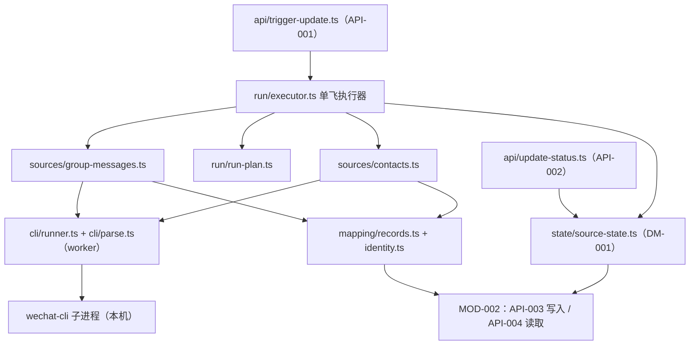
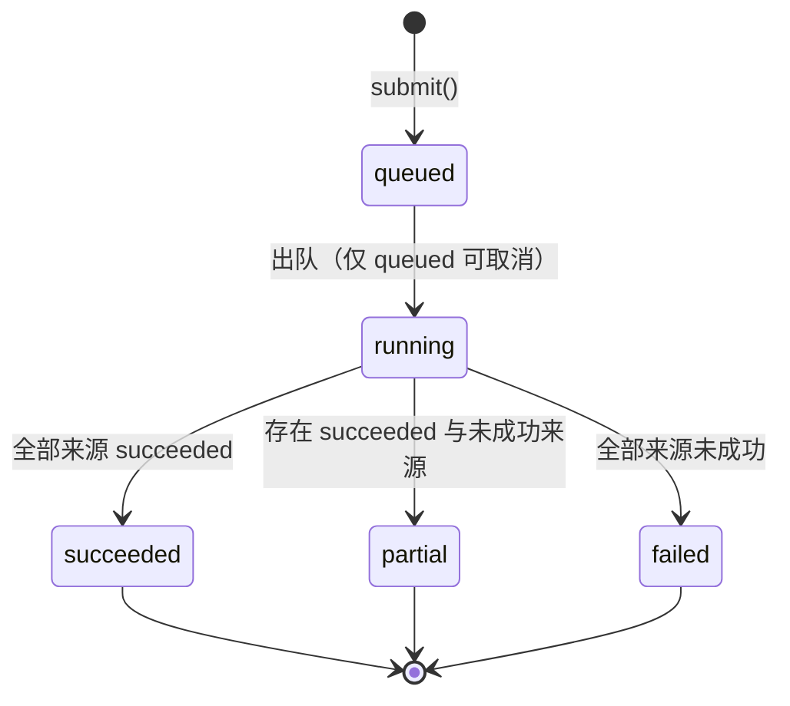

# MOD-001 —— 数据接入与更新 模块设计

> **状态**: reviewed
> **生成者**: 模块负责人按 `mod-000-template.md` 撰写（骨架由编排器按 `docs/prompt/run_pipeline.md` 步骤 4 建立）
> **上游**: `docs/design/modules.md`、`docs/design/api-contract.md`、`docs/design/data-model.md`、`docs/design/impl/high-level-design.md`
> **下游**: 无（叶子文档）
> **变更中**: —
> **最后更新**: 2026-09-12

<!-- 本文件属于实现层。修改必须走 design-doc-change skill（.github/skills/design-doc-change/SKILL.md）。 -->

## 1. 模块信息

| 项 | 值 |
| --- | --- |
| 模块 ID | `MOD-001` |
| 负责人 | — |
| 关联任务 | `TASK-006`、`TASK-007` |
| 涉及的契约 | 实现：`API-001`、`API-002`；持有：`DM-001`；消费：`API-003`、`API-004` |
| 实现进度看板 | `docs/status/implementation.md` |

<!-- 负责人改动后，同步更新看板里对应的那一行。 -->

## 2. 职责与边界

- 职责范围与明确不负责项：见 `docs/design/modules.md` 的 `MOD-001` 卡片（`REQ-001` ~ `REQ-003`、`REQ-016` 采集侧、`REQ-019`、`REQ-082` 采集侧）。本文件不复述契约层正文。
- 实现层补充的边界（契约层声明之外、由本次实现固定的落点）：
  - **唯一 CLI 调用方**：本模块是全应用唯一拉起 wechat-cli 的位置（HLD 决策 7）；其他模块不得调用 CLI、不得读取 CLI 原始输出。
  - **入口集合封闭**：来源适配器只有两个（群消息、通讯录与好友列表），不存在第三个来源与任何演示 / 模拟数据通道（`REQ-001`、`REQ-019`）。
  - **不持有第二份存储**：采集结果与来源状态一律经 `API-003` / `API-004` 进出 `MOD-002`；本模块不打开数据库、不写媒体或缓存文件（HLD 决策 3、`detailed-design.md` §3.1）。
  - **不承担呈现与编排**：更新入口的置灰、分项提示、「记录更新至 X」与首屏引导的展示属 `MOD-004`；本模块只保证出参与错误信封足以驱动这些呈现。
  - **不触发下游分析**：采集完成后不自行调用分析任务；后台分析由 `MOD-004` 编排（HLD 决策 9）。

## 3. 内部结构

### 3.1 代码目录划分

建议落点为 `src/server/ingest/`（单包结构，`src/shared/` 存跨模块契约类型与错误标识）：

```text
src/server/ingest/
├── index.ts             # 模块出口与装配：对外只暴露 API-001 / API-002 的实现
├── api/                 # 契约薄层：入参校验 + 错误信封，不含业务逻辑
│   ├── trigger-update.ts
│   └── update-status.ts
├── run/                 # 运行编排
│   ├── executor.ts      # 单飞执行器：全局互斥 + 合流 / 排队 + 运行状态机
│   ├── run-plan.ts      # 来源集合、增量窗口、断点的计算
│   └── progress.ts      # 进度事件体（SSE，传输在 MOD-004）
├── sources/             # 来源适配器，一来源一文件
│   ├── source.ts        # SourceAdapter 接口与来源枚举
│   ├── group-messages.ts
│   └── contacts.ts
├── cli/                 # wechat-cli 适配层：唯一出现 CLI 细节的地方
│   ├── runner.ts        # spawn + 超时 + 退出码；参数数组、不经 shell
│   ├── parse.ts         # JSON 解析与字段校验（在 worker 池执行）
│   └── probe.ts         # 可执行文件存在性、版本、init 状态探测
├── mapping/             # CLI 字段 → 记录 + 记录身份
│   ├── records.ts
│   └── identity.ts
├── state/
│   └── source-state.ts  # DM-001 的读写（经 API-003 / API-004）与派生字段计算
└── errors.ts            # 错误标识映射（api-contract §1.2 闭集内）
```

划分理由：`cli/` 是唯一吸收 CLI 输出字段变化的点（`detailed-design.md` §8.2）；`sources/` 只依赖 `cli/` 与 `mapping/`；`run/` 只依赖 `sources/`；`api/` 只依赖 `run/` 与 `state/`。依赖方向单向，单测只需替换 `cli/runner.ts` 与 `mapping/`。

### 3.2 结构图



### 3.3 关键接口（签名级）

```ts
// sources/source.ts
type IngestSource = 'groupMessages' | 'contacts';

interface CollectContext {
  runId: string;                           // 本次运行引用（日志 / 进度）
  window?: { from: number; to: number };   // 增量窗口；首次全量为空
  checkpoint?: SourceCheckpoint;           // 进程内断点（见 §5.3）
  onProgress(p: SourceProgress): void;
}

interface CollectOutcome {
  source: IngestSource;
  status: 'succeeded' | 'failed' | 'noAuth' | 'timeout';   // 与 API-001 出参枚举一致
  written: number;                          // 经 API-003 成功写入的记录数
  failure?: { code: ErrorCode; reason: string; scope: string };
  subFailures: SubFailure[];                // 单群 / 单分页级明细，不阻塞其他分项
  completedAt?: number;                     // 仅 succeeded 时给出
}

interface SourceAdapter {
  readonly source: IngestSource;
  collect(ctx: CollectContext): Promise<CollectOutcome>;
}

// cli/runner.ts
interface CliResult { exitCode: number; stdout: string; stderrTail: string; durationMs: number }

interface CliRunner {
  run(args: string[], timeoutMs: number): Promise<CliResult>;  // spawn；超时即终止
  probe(): Promise<CliProbeResult>;                            // 可执行文件 / 版本 / init 状态
}

// run/executor.ts
interface RunRequest { targetSource?: IngestSource }
interface RunReport { sources: CollectOutcome[]; overallCode?: ErrorCode }

interface IngestExecutor {
  submit(req: RunRequest): Promise<RunReport>;   // 合流 / 排队语义见 §4.1
  isRunning(): boolean;
}
```

`ErrorCode` = `api-contract.md` §1.2 的标识联合类型，落点 `src/shared/`。

## 4. 接口实现说明

本模块以进程内组件形式被 `MOD-004` 的本机 HTTP 处理器调用（HLD 架构图）；HTTP 层的路由、schema 校验与 SSE 传输属 `MOD-004`（`detailed-design.md` §4.4、决策 1）。

### 4.1 API-001 触发更新

- **调用链**：`api/trigger-update.ts` 校验入参（`targetSource` 只接受两个来源枚举，非法值防御性返回 `INVALID_INPUT`）→ `executor.submit()` → 运行结束后组装出参（分来源结果 + 分来源状态 + 完成时间）与错误信封。
- **执行语义**：一次调用 = 一次运行；一次运行按 `run-plan` **串行**执行目标来源适配器（见 §8 决策 3）。返回时机为本次运行结束（合流时 = 被挂接运行的结束）。
- **并发与重入**（`detailed-design.md` §1.2 采集串行域的落点）：
  - 全局互斥：`IngestExecutor` 只有一个运行槽，同一时刻最多一个运行（含分项重试）。
  - 重复触发（同一时刻第二次调用）：本次来源集合 ⊆ 进行中运行的来源集合 → **挂接**到进行中运行，返回其运行结果（不启动第二次采集；对外即「已在采集」，`MOD-004` 由 SSE 进度事件置灰入口）；否则**入队**（FIFO，队列不设硬上限，`detailed-design.md` §1.3），前一次结束后执行。挂接与排队都不新增错误标识。
- **副作用**：经 `API-003` 写入 `DM-002` ~ `DM-005` 记录与 `DM-001` 状态；群消息来源完整成功时推进「记录更新至 X」（§5.2）。本次运行的最后一批写入完成即「更新数据完成」边界，`dataEpoch` 递增属 `MOD-002` 写路径（`detailed-design.md` §3.3），本模块不新增接口。
- **线程语义**：调度与写入在服务进程主线程；CLI 子进程 spawn 后不阻塞事件循环；CLI 输出解析经 worker 池（`detailed-design.md` §1.1）；主线程单次同步计算 ≤ 50 ms（同文件 §5.4）。
- **超时**：每次 CLI 命令取 `timeouts.cliCommandMs`（`detailed-design.md` §7）；超时即终止子进程、不读残缺输出（同文件 §1.4）。整次运行不设整体超时。
- **重试**：单条命令的瞬时失败按 `detailed-design.md` §2.3 自动重试（退避 + 上限 + 熔断）；终态仍失败则按来源状态返回，由使用者手动重试。手动重试只重跑失败分项、且从断点继续（同文件 §2.4）。
- **性能假设**：人工触发的低频调用；首次全量按 `ingest.pageSize` 分页（同文件 §7），耗时以分钟计属正常；进度经 `run/progress.ts` 产出事件体推送，不阻塞读路径。

### 4.2 API-002 查询更新状态

- **调用链**：`api/update-status.ts` → `state/source-state.ts` → 经 `API-004` 读 `DM-001`（两条来源记录）与 `DM-003`（`每页条数 = 1`，只取分页信息中的命中总数）。
- **派生字段即时计算**（不落库、不缓存），口径见 `DM-001`：`是否有数据` = 群消息来源存在 ≥ 1 条 `DM-003` 记录；`记录更新至 X` = 群消息来源的最近成功时间。
- **可重入与副作用**：只读、幂等、无副作用。**不做进程内缓存** —— 删除（`API-006`）后必须立即回落（`AC-029`），缓存会破坏这一点。
- **错误**：`API-004` 的 `STORAGE_UNAVAILABLE` 原样冒泡（`AC-038`），不得转成「无数据」（`detailed-design.md` §2.1：不静默失败）。
- **性能假设**：两条状态记录 + 一次计数查询，服务 `MOD-004` 的首屏与设置页（`AC-001`、`AC-003`）。

### 4.3 消费的接口

| 消费 | 本模块的用法 |
| --- | --- |
| `API-003` 写入记录 | 实体类型 ∈ {`DM-001`、`DM-002`、`DM-003`、`DM-004`、`DM-005`}；按批提交（单批 ≤ 1000 行或 2 MB，`detailed-design.md` §3.2）；记录身份由 `mapping/identity.ts` 提供（§5.4）；去重由 `MOD-002` 执行 |
| `API-004` 按条件读取 | 实体类型 = `DM-001`（两条来源状态，不带筛选条件）；实体类型 = `DM-003`（`每页条数 = 1`，只取分页信息）。页码 / 每页条数恒 ≥ 1（`AC-020` 的下限口径） |

## 5. 数据与状态

### 5.1 状态机

运行级（汇总层，与 `detailed-design.md` §1.3 的批次口径一致）：



来源级：`pending → running → succeeded | failed | noAuth | timeout`（与 `API-001` 出参枚举一一对应）。来源内部的子分项（单群、单分页、单写入批）失败不阻塞其他分项推进，汇总进 `subFailures`（`detailed-design.md` §2.5）。

### 5.2 来源级成功口径与「记录更新至 X」

- 来源状态 = `succeeded` ⇔ 该来源**全部**子分项成功（全部群、全部分页、全部写入批）。
- 只有群消息来源 `succeeded` 时才写 `DM-001` 的最近成功时间 ⇒ X 只在**完整成功**时推进；部分成功不推进，等重试补齐后推进（`AC-002`、`AC-003`）。
- 通讯录与好友列表来源只写自己的 `DM-001` 行（状态 + 时间 + 失败原因），永不推进 X（`AC-004`）。
- 该口径是保守选择：X 是使用者判断数据新鲜度的唯一凭据（`REQ-002`），宁可停在上次完整值，不给出「已更新至」的乐观假象。

### 5.3 运行期状态（不持久化）

| 状态 | 内容 | 生命周期 |
| --- | --- | --- |
| 运行槽与队列 | 进行中运行 + 待执行请求（FIFO） | 进程内；重启即丢 |
| 断点 `SourceCheckpoint` | 来源 + 时间窗 + 分页游标（`detailed-design.md` §2.4 的采集断点幂等键） | 进程内；重启后从窗口起点重采，靠记录身份去重兜底 |
| 进度计数 | 每来源已处理群 / 分页 / 已写条数 | 进程内；运行结束清除 |

不持久化断点的理由：`data-model.md` 未为游标类状态分配 `DM-###`（阶段 4 裁定：运行期结构不分配实体），持久化等于新增数据实体（属契约层变更）；而重启后重采的代价已被记录身份去重吸收。

### 5.4 与 `DM-###` 的映射（记录身份 = 幂等键）

| 写入实体 | 数据来源（CLI 命令） | 记录身份（字段口径见 `data-model.md`） |
| --- | --- | --- |
| `DM-002` 群 | `sessions` | 群标识 |
| `DM-003` 原始消息记录 | `history`（分页 + 时间窗） | 消息标识 |
| `DM-004` 群成员身份 | `members`（含登录账号 Me 标识） | 成员标识 + 所属群 |
| `DM-005` 通讯录 / 好友列表记录 | `contacts` | 联系人标识 + 来源 |
| `DM-001` 采集来源状态 | 本次运行结果 | 采集来源（两个来源各一条） |

映射规则：字段映射集中在 `mapping/records.ts`；未知字段忽略、可选字段缺失跳过、必填缺失记日志并跳过该条（`detailed-design.md` §4.4、§8.2）。媒体只记录引用，解密与缓存归 `MOD-002`（HLD 决策 8）。

### 5.5 生命周期联动

- 首采前 `DM-001` 无记录：`是否有数据` 为否、X 为空（`AC-001`）；首次运行按来源各写一条（`DM-001` 生命周期）。
- 删除后（`API-005` / `API-006`）：`DM-003` 被清空 ⇒ `是否有数据` 即时回落为否（`AC-029`）。按群删除不回退 X —— X 表示「最近一次成功」，不是「当前数据完整覆盖」的证明（`AC-003` 的边界口径）。
- 群名、成员昵称随采集更新（`DM-002` / `DM-004` 的可变字段）。

## 6. 错误处理

### 6.1 来源级映射（全部在 `api-contract.md` §1.2 闭集内）

| 触发条件 | 来源状态 | 错误标识 | 自动重试 | 使用者可见动作 |
| --- | --- | --- | --- | --- |
| CLI 未初始化 / 微信桌面客户端未运行 / 权限不足 | 无授权 | `NO_AUTH` | 否（`detailed-design.md` §2.1「依赖未就绪」） | 来源 + 原因 + 终端操作指引 + 手动重试（HLD 决策 7） |
| 单条 CLI 命令超时（`timeouts.cliCommandMs`） | 超时 | `TIMEOUT` | 是（§2.3） | 分项提示 + 重试；已成功来源的结果照常返回（`AC-006`） |
| CLI 非零退出（原因不明）/ 输出非法 / 必填字段缺失致该来源不可用 | 失败 | `SOURCE_UNAVAILABLE` | 是（有限次） | 分项提示（来源 + 原因）+ 重试 |
| 经 `API-003` 写入失败 | 失败 | `STORAGE_UNAVAILABLE` | 仅 DB busy（§2.1） | 提示 + 重试；已提交批次不回滚（§3.2） |

`SOURCE_UNAVAILABLE` 在本模块的用法限定为「来源不可用 → 说明原因 + 手动重试」，与 §1.2 该标识的处理口径一致；不新增标识、不改动任何标识的含义。本模块可能出现的标识仅：`NO_AUTH`、`TIMEOUT`、`PARTIAL_FAILURE`、`SOURCE_UNAVAILABLE`、`STORAGE_UNAVAILABLE`、`INVALID_INPUT`（防御性入参校验）；其余标识不由本模块产生。

### 6.2 批次级汇总规则

1. 全部来源 `succeeded` → 不产生错误标识，出参即最终结果。
2. 存在 `succeeded` 来源、且存在未成功来源 → `PARTIAL_FAILURE`（明细含每个未成功来源的标识、状态与原因；`AC-007`）。
3. 全部来源未成功 → 按优先级 `NO_AUTH` > `TIMEOUT` > `STORAGE_UNAVAILABLE` > `SOURCE_UNAVAILABLE` 取首个作为批次级标识，其余进分项明细（`AC-005`）。

规则 2、3 覆盖 `API-001` 声明的三个标识（`NO_AUTH` / `TIMEOUT` / `PARTIAL_FAILURE`）；`SOURCE_UNAVAILABLE` 与 `STORAGE_UNAVAILABLE` 只在分项与「全失败」情形出现。任何来源与子分项的失败都不会被静默（`REQ-016`）。

### 6.3 不可恢复与兜底

- 未初始化 / 权限不足：应用内不可自动恢复，只给原因与终端指引（HLD 决策 7；不在应用内提权）。
- 未预期的内部异常：按 `detailed-design.md` §2.2 归入「未知失败」，只进日志，不向使用者展示报文，不新增错误标识。
- 进程崩溃 / 重启：进行中运行与其断点丢失；重试从窗口起点重采，由记录身份去重；`DM-001` 只保留上一个「来源结束」时写入的状态，不留半成品（§8 决策 7）。

### 6.4 日志

复用 `detailed-design.md` §6.2 的事件清单，不新增事件名：`ingest.start` / `ingest.source.done` / `ingest.source.failed` / `ingest.finish`，字段含 `source`、计数、`durationMs`、`code`、`retry`；不写消息原文与联系人姓名（同文件 §6.1）。

## 7. 测试要点

单测覆盖 `TASK-006`、`TASK-007`；wechat-cli 一律 mock（不真调）；mock 边界 = `cli/runner.ts` 与 `cli/parse.ts`，其余走真实代码。

| 组 | 关键分支 | 对应 `AC-###` |
| --- | --- | --- |
| 运行编排 | 两来源串行；部分失败不阻塞；指定来源重试只跑该来源且跳过已完成分页；挂接 / 排队的并发路径 | `AC-006`、`AC-007` |
| CLI 适配 | 超时 → 终止子进程 + `TIMEOUT`；非零退出 / 非法输出 → `SOURCE_UNAVAILABLE`；未初始化 / 未运行 → `NO_AUTH`；参数数组不经 shell | `AC-005`、`AC-006` |
| 写入与幂等 | 同一范围重复采集不产生副本；记录身份取值与 `data-model.md` 一致；按批上限拆分 | `AC-008` |
| 状态与 X | 群消息完整成功才推进；通讯录来源不推进；未执行更新时保持不变；`是否有数据` 派生正确 | `AC-002`、`AC-003`、`AC-004` |
| 只读接口 | `API-002` 幂等、无缓存；删除后即时回落为否 | `AC-001`、`AC-029` |
| 错误面 | `STORAGE_UNAVAILABLE` 冒泡、不静默失败；批次级标识符合 §6.2 | `AC-038` |
| 负向 | 适配器集合恰为两个来源；无演示数据通道 | `AC-009`、`AC-010` |

补充（无对应 `AC-###`、但属详设硬约束）：CLI 解析走 worker、主线程单次同步计算 ≤ 50 ms（`detailed-design.md` §1.1、§5.4）。

## 8. 关键决策与取舍

### 决策 1 —— CLI 适配层：子进程 + JSON 映射，解析下沉 worker

- **背景与约束**：HLD 决策 7 已定「子进程 + 适配层」且 `init` 不在应用内执行；CLI 输出为大 JSON，主线程不得被解析阻塞（`detailed-design.md` §1.1、§5.3）。
- **候选方案与取舍**：① 主线程直接解析：实现最短；大 JSON 会卡住服务响应，违背 §5.4。② 解析放 worker 池：主线程只做编排；多一层消息传递与错误映射。③ 常驻桥进程：省启动开销；引入额外生命周期与端口，与 HLD 决策 7 排除的候选重复。
- **决定**：②；`cli/runner.ts` 只负责 spawn（参数数组、不经 shell、超时终止），`cli/parse.ts` 在 worker 池解析并逐字段校验。
- **后果**：CLI 字段变化被 `cli/` 一层吸收（`detailed-design.md` §8.2）；单测可把 `runner` / `parse` 整体替换为固定 JSON 夹具。
- **上游影响**：无

### 决策 2 —— 重复触发：挂接 / 排队，不新增错误标识

- **背景与约束**：采集全局互斥（HLD §2、`detailed-design.md` §1.2）；`API-001` 的错误集合只有三个标识，不得新增（同文件 §2.2）；入口置灰属 `MOD-004`。
- **候选方案与取舍**：① 重复触发直接拒绝：需要造一个「已在采集」的错误标识，闭集内无对应项，且调用方要处理新错误。② 一律排队：语义简单；连点会让同一次意图跑两遍（重复劳动、X 被二次推进）。③ 来源集合被进行中运行覆盖时挂接、否则排队：不做重复采集、不新增标识；代价是多一层并发状态。
- **决定**：③。挂接时返回被挂接运行的结果；排队为 FIFO、不设硬上限（`detailed-design.md` §1.3）；「正在采集」的信号由 SSE 进度事件给 `MOD-004` 用于置灰。
- **后果**：`API-001` 的入参 / 出参 / 错误列表不变；同一时刻最多一个采集或分项重试（HLD §2）。
- **上游影响**：无

### 决策 3 —— 运行内串行：两来源串行、来源内分页串行

- **背景与约束**：两来源相互独立，理论上可并行；但 CLI 每次调用都要读取本机微信客户端，并发读取会放大对微信客户端的压力，也让失败归因与状态落库顺序变得不确定。
- **候选方案与取舍**：① 两来源并行：总耗时最短；子进程并发、进度与状态交错，排障成本高。② 两来源串行 + 来源内分页串行：可预测、易测、失败边界清晰；耗时 = 两者之和。③ 来源内小并发（如 2–4 个群并行）：折中；需要额外的限流与顺序保证。
- **决定**：②。分页批量由 `ingest.pageSize` 控制；若后续实测首采耗时不可接受，可在同一互斥锁内改为并行，不改契约。
- **后果**：分项结果按固定顺序产生，进度事件顺序稳定；首次全量耗时较长，但运行期间读路径不受影响（`detailed-design.md` 决策 9）。
- **上游影响**：无

### 决策 4 —— 增量窗口与断点：窗口取上次成功时间 − 重叠量；断点只在进程内

- **背景与约束**：HLD 决策 8 已定「首次全量 + 之后增量」；`detailed-design.md` §2.4 要求重试从失败分页继续；`data-model.md` 未给游标类状态分配实体。
- **候选方案与取舍**：① 断点持久化到自建表 / 文件：重启也能续采；等于在本模块内另存持久化状态，违背「同经 `MOD-002`」且需要新增数据实体（契约层变更）。② 断点只存进程内：零新增实体；重启后从窗口起点重采。③ 不做断点、每次全量：实现最简；大库重采开销不可接受。
- **决定**：②；增量窗口起点 = `DM-001` 群消息来源的最近成功时间 − 重叠量（模块内常量 5 分钟，不新增配置键），终点 = 运行开始时刻；首次全量不带窗口。
- **后果**：同进程内的手动重试从失败分页继续（符合 §2.4）；跨重启重采由记录身份去重吸收（`AC-008`）；重叠量吸收时钟偏移与迟到消息，代价是少量重复读取。
- **上游影响**：无

### 决策 5 —— 来源级成功口径：完整成功才推进 X

- **背景与约束**：`REQ-002` 的 X 是使用者判断数据新鲜度的唯一凭据；`DM-001` 的最近成功时间可空、只由群消息来源推进。
- **候选方案与取舍**：① 只要运行未致命失败就推进 X：X 更新快；部分群失败时会给出「已更新至」的错误印象。② 仅当该来源全部子分项成功才推进：口径保守、可解释；单群长期失败会让 X 停住，需要重试收敛。③ 按群分别记时间：粒度更细；`DM-001` 只有来源级字段，需改数据模型。
- **决定**：②。失败子分项进入 `subFailures` 与 `DM-001` 的失败原因，重试补齐后再推进。
- **后果**：X 的含义稳定为「群消息最近一次完整成功」；`AC-002`、`AC-003`、`AC-004` 可直接判定。
- **上游影响**：无

### 决策 6 —— 错误标识映射与批次级优先级

- **背景与约束**：`detailed-design.md` §2.2 要求错误信封复用 `api-contract.md` §1.2 的闭集、不新增；分项展示与分项重试按 `scope` 聚合。
- **候选方案与取舍**：① 每类失败各定义新标识：语义最准；超出闭集，必须回流改契约。② 全部归入 `NO_AUTH` / `TIMEOUT` 两类：不新增；但「命令失败」不是无授权，会给使用者错误指引。③ 按原因分流到闭集内已有的 `SOURCE_UNAVAILABLE` / `STORAGE_UNAVAILABLE`（§6.1 表）。
- **决定**：③；批次级按 §6.2 的优先级取首个标识，剩余进分项明细（`scope` = 来源）。
- **后果**：`API-001` 声明的三个标识仍是主路径；「来源不可用」与「存储不可用」只在分项与全失败情形出现；使用者始终看到来源 + 原因（`REQ-016` 的不静默失败）。
- **上游影响**：无

### 决策 7 —— 状态写入时机：按来源结束时整体写入

- **背景与约束**：`detailed-design.md` §3.2 要求「一个使用者动作 = 一个事务、不留半成品」；`DM-001` 的状态只由采集 / 重试结果更新。
- **候选方案与取舍**：① 运行中实时更新状态：进度最直观；中断会留下「进行中」的半成品状态，且放大写入次数。② 每个来源结束时写一次该来源的 `DM-001` 行：中断时已完成来源的状态保留、进行中来源维持上一次的值；实现简单。
- **决定**：②；运行中的进度只走内存与 SSE，不落库。
- **后果**：`API-002` 读到的状态永远是「上一次已结束的来源结果」；进程崩溃不影响已有状态的可信度（§6.3）。
- **上游影响**：无

## 9. 未决问题

无。
