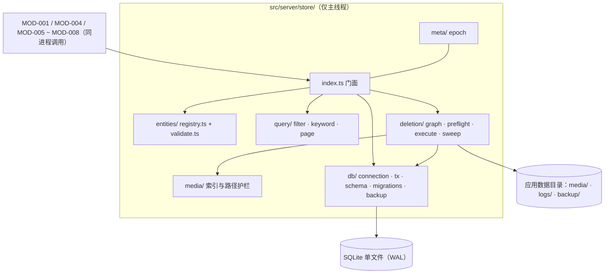
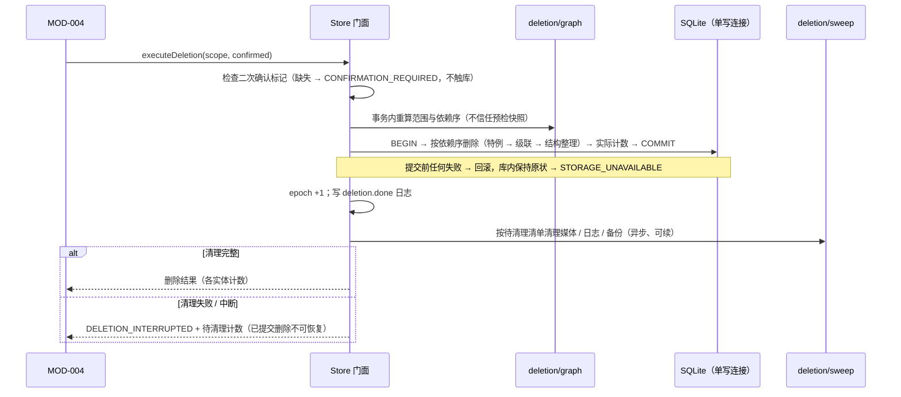
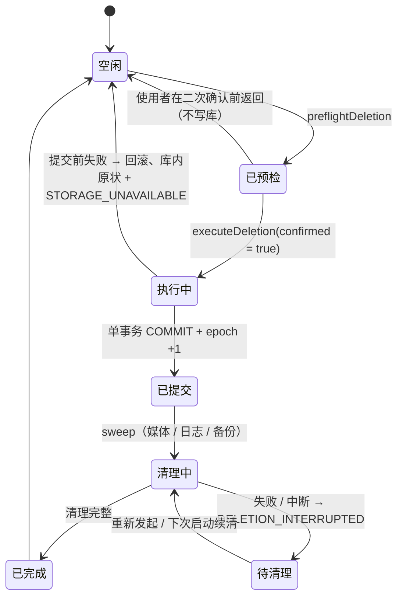

# MOD-002 —— 数据存储与隐私 模块设计

> **状态**: reviewed
> **生成者**: 模块负责人按 `mod-000-template.md` 撰写（骨架由编排器按 `docs/prompt/run_pipeline.md` 步骤 4 建立）
> **上游**: `docs/design/modules.md`、`docs/design/api-contract.md`、`docs/design/data-model.md`、`docs/design/impl/high-level-design.md`
> **下游**: 无（叶子文档）
> **变更中**: —
> **最后更新**: 2026-09-12

<!-- 本文件属于实现层。修改必须走 design-doc-change skill（.github/skills/design-doc-change/SKILL.md）。 -->

## 1. 模块信息

| 项 | 值 |
| --- | --- |
| 模块 ID | `MOD-002` |
| 负责人 | 模块负责人 |
| 关联任务 | `TASK-001`、`TASK-002`、`TASK-003` |
| 涉及的契约 | 实现：`API-003` ~ `API-006`；持有：`DM-002` ~ `DM-005` |
| 实现进度看板 | `docs/status/implementation.md` |

<!-- 负责人改动后，同步更新看板里对应的那一行。 -->

## 2. 职责与边界

职责、明确不负责项、对外接口声明、依赖与禁用方向见 `docs/design/modules.md` 的 `MOD-002`；接口的入参 / 出参 / 错误见 `docs/design/api-contract.md` 的 `API-003` ~ `API-006`。本文件不复述契约正文，只写实现侧边界：

- **落点**：服务进程主线程内的进程内组件，代码目录 `src/server/store/`。不监听端口、不注册 HTTP 路由（HTTP 入口属 `MOD-004`）；全进程只有一个库连接，不与 worker 共享。
- **唯一写者**：全部持久化写入、读取与删除经本组件；worker 只把结果回传主线程，由主线程经本组件落库（详设 §1.1）。
- **不承载业务口径**：派生记录的判定与算法（评分、阈值、聚类命名、重算）归声明该实体的模块；本模块只做结构、去重、级联、查询执行与失效信号（对应 `MOD-002` 的「明确不负责」）。
- **不面向使用者**：删除入口、二次确认交互与文案、数据去向说明均属 `MOD-004`；本模块只提供事实（预检清单与计数、删除计数、错误）。
- **依赖方向**：不依赖任何其他 `MOD-###`；与采集互斥等跨模块编排由组合根（`MOD-004` 侧）接线（详设 §1.2），本模块只暴露门面与删除门。

## 3. 内部结构

### 3.1 代码目录（`src/server/store/`）

```text
src/server/store/
├── index.ts            # 门面：createStore() → Store（API-003 ~ API-006 的唯一实现入口）
├── errors.ts           # 内部异常 → 契约错误标识的唯一映射点（见 §6）
├── db/
│   ├── connection.ts   # 打开连接、运行参数（详设 §3.1）、主线程断言、关闭
│   ├── tx.ts           # withTransaction(db, fn)：同步事务体 + 防 async 护栏
│   ├── schema.ts       # 全库 DDL（与 schema 版本对应）
│   ├── backup.ts       # 迁移前备份（VACUUM INTO）与备份清理
│   └── migrations/
│       ├── index.ts    # 迁移链：版本号 → 步骤（只向前）
│       └── v001.ts     # 版本 1：全部表 / 索引 / 内部表
├── entities/
│   ├── registry.ts     # 实体登记表：DM-001 ~ DM-022 的类型 → 表 / 身份键 / 可变字段 / 筛选绑定 / 级联
│   ├── raw.ts          # DM-002 ~ DM-005 的列映射（本模块持有的事实）
│   ├── derived.ts      # DM-006 ~ DM-022 的列映射（口径归持有模块，这里只登记结构）
│   └── validate.ts     # 记录级校验，产出逐条失败明细
├── query/
│   ├── filter.ts       # 全局筛选（群 / 时间 / 关键词 / 身份）→ 参数化 WHERE
│   ├── keyword.ts      # 关键词匹配列与 LIKE 转义（口径见 §4）
│   └── page.ts         # 分页规范化与结果装配
├── deletion/
│   ├── graph.ts        # 删除图：范围解析、级联边、依赖序、计数
│   ├── preflight.ts    # API-005
│   ├── execute.ts      # API-006 的库内部分（单事务）
│   └── sweep.ts        # 提交后清理与「待清理」续做（媒体 / 日志 / 备份）
├── media/
│   └── index.ts        # 媒体索引读写与路径护栏（相对路径 + 应用数据目录内校验）
└── meta/
    └── epoch.ts        # data_epoch 读写（详设 §3.3 的失效信号）
```

### 3.2 关键类型与签名（实现侧）

契约类型（实体类型枚举、记录类型、筛选结构、错误标识）来自 `src/shared/`，本模块与调用方共享同一份定义。

```ts
// index.ts —— 唯一的跨模块入口；同步方法返回前，本次事务已提交或已整体回滚
export interface Store {
  write<T extends EntityType>(type: T, records: EntityRecord<T>[], opts?: WriteOptions): WriteResult;
  read<T extends EntityType>(type: T, filter?: FilterCondition, page?: PageRequest): ReadResult<T>;
  preflightDeletion(scope: DeletionScope): PreflightResult;                            // 只读
  executeDeletion(scope: DeletionScope, confirmed: boolean): Promise<DeletionResult>;  // 库内同步、提交后清理异步
  currentEpoch(): number;                                                              // 详设 §3.3
}

interface WriteOptions { bumpEpoch?: boolean } // 采集 / 导入完成、改判落库时由调用方声明（详设 §3.3）
type DeletionScope =
  | { kind: 'group'; groupId: string }
  | { kind: 'all' };

// db/tx.ts —— 事务体必须是同步函数；返回 Promise 视为违约（抛内部错误，见 §6）
export function withTransaction<T>(db: Database, fn: (tx: Tx) => T): T;

// entities/registry.ts —— 每个 DM 一条登记；这是「照着实现」的核心表
interface EntityDescriptor {
  type: EntityType; table: string; writer: ModuleId;   // writer 仅用于日志与归属标注
  identity: readonly string[];                          // 记录身份键（去重依据，见 §5.1）
  writeMode: 'insert-only' | 'upsert';
  mutableFields: readonly string[];                     // 仅 upsert 生效；不超过 DM 已声明的可变字段
  filterBindings: FilterBindings;                       // 群 / 时间 / 关键词 / 身份 的列绑定（§5.2）
  deleteRule: DeleteRule;                               // 级联与特例（§5.3）
}
```

### 3.3 并发与串行点

| 点 | 规则 | 出处 |
| --- | --- | --- |
| 写 | 单连接、主线程；一次 `write` 调用 = 一个同步事务（批上限 1000 行 / 2 MB，超限拆批、逐批提交、可重放） | 详设 §3.2、§2.4 |
| 事务体 | 禁止 `await` 与异步回调；签名与运行期护栏双重限制 | 决策 1 |
| 读 | 同一连接同步读；WAL 下读不阻塞写；不引入第二连接 | 详设 §3.1 |
| 删除 | 库内部分在一个同步事务内完成（全有或全无）；提交后进入异步清理 | 详设 §2.5、§3.2 |
| 删除门 | 暴露进程内 `DeleteGate`；与采集锁的接线在组合根（`MOD-004`），本模块不依赖 `MOD-001` | 详设 §1.2；`MOD-002` 禁止反向依赖 |
| 迁移 | 启动时、对外服务前执行；此时无并发调用 | 详设 §8.1 |
| worker | 不开库、不写媒体目录；结果经主线程落库 | 详设 §1.1 |



## 4. 接口实现说明

通用：`API-003` ~ `API-006` 的调用方是同进程模块（不经 HTTP），本模块做参数级与记录级校验（闭集、必填、范围），非法输入在进入 SQL 前被拒；SQL 全部预编译 + 参数绑定（详设 §4.4）。

### 4.1 `API-003` 写入记录

- **线程语义**：同步方法；返回时本批已提交或已整体回滚，不存在「后台仍在写」的状态。
- **校验与失败粒度**：按登记表逐条校验（必填、类型、闭集值）；单条失败不影响同批其余记录，失败明细（记录身份 + 原因）随结果返回，**不升级为契约错误码**（契约出参即「成功条数 + 失败明细」）。
- **去重语义**：以登记表的 `identity` 定位既有记录 —— `insert-only` 实体忽略重复写入；`upsert` 实体只覆盖 `mutableFields` 白名单（身份列与不可变列永不覆盖）。两种模式下「写入后库内存在该身份记录」都视为成功，保证重试原样成功、不产生副本。
- **副作用**：媒体类记录同时登记媒体索引；`bumpEpoch` 为真时递增 epoch；日志只记计数与失败分类，不记记录内容（详设 §6.1）。
- **可重入**：同批重复提交幂等；单线程下天然顺序执行，无需额外锁。
- **性能假设**：单批 1000 行（含 JSON 列）写入 < 100 ms；按身份键定位，不触发全表扫描。
- **错误**：仅存储不可用时抛 `STORAGE_UNAVAILABLE`（见 §6）。

### 4.2 `API-004` 按条件读取

- **线程语义**：同步只读；记录集与命中总数在同一次同步调用内取（必要时包一个只读事务），保证两者自洽（详设 §3.3）。
- **分页**：页码默认 1、每页条数默认 50，均须 ≥ 1；每页条数上限 1000，越界返回 `INVALID_INPUT`（下限见 `AC-020`；上限依据详设 §5.4 护栏）。
- **筛选**：四项条件为 AND；空 = 不限（`AC-014`）。群多选取 `IN`；时间范围按登记的时间绑定列；关键词按登记列做参数化 `LIKE`（转义 `%` / `_` / `\`，ASCII 大小写不敏感）；身份条件只施加于声明了身份绑定的实体（模块二口径 = 不施加，记 debug 日志）。
- **排序**：登记表声明排序键（原始消息 = 发送时间 + 身份键；列表类 = 登记排序键 + 身份键兜底），保证翻页稳定，不依赖 `rowid`。
- **出参装配**：按 DM 字段返回记录，并装配来源消息引用（引用只存标识）；随附 `epoch` 供上层做失效判断（详设 §3.3）。
- **性能假设**：分页 + 索引覆盖，命中规模不影响单页耗时；存储侧查询预算参照详设 §5.2（≤ 800 ms 份额）。
- **错误**：参数非法 `INVALID_INPUT`；存储不可用 `STORAGE_UNAVAILABLE`。空结果不是错误（空态与 `EMPTY_RESULT` / `NOT_FOUND` 的判定归调用方）。

### 4.3 `API-005` 删除预检

- **线程语义**：同步只读；在单个读事务快照内取全部计数，保证清单内部自洽。
- **范围语义**：按群 / 全量两种；未知群标识返回全零清单（不是错误）。
- **与执行的关系**：预检只是给 `MOD-004` 展示的快照；`API-006` 执行时不使用它作为删除依据（见 4.4）。
- **性能假设**：各表 `COUNT` 走覆盖索引；22 张表全量预检 < 50 ms。

### 4.4 `API-006` 执行删除



- **前置**：二次确认标记不为真 → `CONFIRMATION_REQUIRED`，不读写库（`AC-027`）。
- **执行**：库内单事务，按 §5.3 的删除图依赖序执行；计数取事务内实际删除数。
- **提交后清理**：媒体文件、日志、应用自建迁移备份按索引清除（范围见决策 3 / 决策 5）；失败写「待清理」清单，下次启动或再次调用续做，不因文件失败回滚已提交的库删除（详设 §3.2）。
- **重试语义**：可重新发起（契约「重试语义：适用」）；已删范围内的数据不存在时对应计数为 0，清理续做，不重复删除。
- **副作用**：不可恢复；「是否有数据」随 `DM-003` 归零回落（全量时同时删除 `DM-001` 行）。
- **性能假设**：万条级全量删除的事务内部分 < 2 s；清理按索引批处理，清理期间读取已可见删除结果。

## 5. 数据与状态

### 5.1 物理映射（DM → 表 → 记录身份键）

| DM | 表 | 记录身份键 | 写者 |
| --- | --- | --- | --- |
| DM-001 | `dm001_source_status` | 采集来源 | MOD-001 |
| DM-002 | `dm002_group` | 群标识 | MOD-001 |
| DM-003 | `dm003_message` | 消息标识 | MOD-001 |
| DM-004 | `dm004_member` | 所属群 + 成员标识 | MOD-001 |
| DM-005 | `dm005_contact` | 联系人标识 + 来源 | MOD-001 |
| DM-006 | `dm006_meme` | 梗标识 | MOD-005；G3 入库侧 MOD-008 |
| DM-007 | `dm007_occurrence` | 记录标识 | MOD-005 |
| DM-008 | `dm008_variant_link` | 源梗 + 衍生梗 | MOD-005 |
| DM-009 | `dm009_highlight` | 梗 + 来源消息 | MOD-005 |
| DM-010 | `dm010_item` + `dm010_source` | 条目标识 | MOD-006 |
| DM-011 | `dm011_person` | 人标识 | MOD-007（默认创建见下） |
| DM-012 | `dm012_identity_candidate` | 候选标识 | MOD-007 |
| DM-013 | `dm013_tag` | 标签标识 | MOD-007 |
| DM-014 | `dm014_person_tag` + `dm014_evidence` | 人物 + 兴趣标签 | MOD-007 |
| DM-015 | `dm015_tag_merge` | 归并组标识（代表标签唯一） | MOD-007 |
| DM-016 | `dm016_personality_tag` | 标签标识 | MOD-007 |
| DM-017 | `dm017_interaction` | 记录标识 | MOD-007 |
| DM-018 | `dm018_pair_score` | 配对标识（无序对规范化为 人A < 人B） | MOD-007 |
| DM-019 | `dm019_my_fit` | 「我」的人标识（单例） | MOD-007 |
| DM-020 | `dm020_generation` + `dm020_output` | 记录标识 | MOD-008 |
| DM-021 | `dm021_candidate` + `dm021_source` | 候选标识 | MOD-008 |
| DM-022 | `dm022_material_consent` | 确认标识 | MOD-008 |

说明：

- 多对多关系一律拆连接表（`dm010_source`、`dm014_evidence`、`dm021_source`、`dm020_output`）。
- `DM-###` 未显式声明记录身份键的实体（`DM-008`、`DM-009`、`DM-014`、`DM-019`），上表给出的自然键即实现侧约定的身份键；其余实体的身份键直接取自其标识 / 唯一字段与唯一性描述（如 `DM-004` 的「群内唯一」落为组合键）。
- 「写者」列指记录内容由谁给出；结构性写入（身份、去重、级联、绑定）一律由本模块执行。`DM-011` 的默认记录（一人 = 一个群成员，未确认映射时）在 `DM-004` 写入时由本模块结构创建；评分与合并仍归 `MOD-007`。
- 内部表（不属任何 `DM-###`）：`_meta`（`data_epoch`、迁移水位）、`_media_index`（媒体相对路径与归属引用）、`_pending_cleanup`（待清理清单）。

### 5.2 筛选绑定与存储口径

| 条件 | 绑定规则 | 覆盖实体举例 |
| --- | --- | --- |
| 群 | 群列直连，或经归属链（梗 → 归属群；人 / 标签 → 群成员身份） | `DM-003` / `DM-004` / `DM-006` / `DM-010` 直连；`DM-007` / `DM-011` / `DM-013` / `DM-020` 经归属链 |
| 时间 | 实体自带时间列；无自带时间的派生实体在写入时冗余来源消息时间（`src_time`，仅内部用、不属 DM 字段） | `DM-003` 用 `sent_at`；`DM-007` / `DM-010` 用 `src_time` |
| 关键词 | 按 `modules.md` §4 的模块口径绑定列：`DM-006` → 梗名 + 解读；`DM-003` → 文本；`DM-010` → AI 总结 + 来源消息文本；`DM-004` → 群昵称；`DM-013` → 标签名 | 未声明匹配列的实体 = 该条件不施加 |
| 身份 | 「我」= `dm004_member.is_me` 唯一命中行；绑定为成员引用比较或布尔派生列 | `DM-003` / `DM-004` / `DM-007` / `DM-011` / `DM-014` |

存储口径：时间统一存 UTC epoch 毫秒（`INTEGER`），展示与自然日口径（如「跨天」判定）由持有模块处理；媒体引用只存应用数据目录内的相对路径；枚举列用 `CHECK` 约束闭集；全表 `STRICT`（DDL 见 5.6）。

### 5.3 删除图（`API-005` / `API-006` 共用）

**范围**：按群 `{ kind: 'group', groupId }` / 全量 `{ kind: 'all' }`。依赖序（事务内自上而下）：

1. **特例先行**（不会被外键自动带走、又必须先判定的行）：
   - `dm021_candidate`：任一出处消息落在范围内 → 删除（候选可再生、确认前不生效）；
   - `dm020_generation`：梗引用落在范围内 → 删除；经 `dm022` 引用了被删成员的素材 → 删除；
   - `dm010_item`：来源消息**无剩余** → 删除；**部分剩余** → 保留 + 置 `needs_recompute`，重算完成前不进入读取结果（决策 4）。
2. **根删除与级联**：按群 = `dm002_group[groupId]`（`dm005_contact` 无群归属、不受影响）；全量 = 各表全删。`dm003` / `dm004` / `dm006`（归属群）/ `dm010`（来源群）及其引用行随 `ON DELETE CASCADE` 一并删除；`dm003` 的自引用（引用消息）用 `ON DELETE SET NULL` 兜底，不产生悬空引用。
3. **结构整理**（同一事务）：`dm011_person` 不再被任何 `dm004` 引用 → 删除（派生行随外键级联）；映射被级联删除后，剩余 `dm004` 的「归属的人」回退为「自成人」；`dm013_tag` 不再被任何 `dm014` 引用 → 删除，其 `dm015` 归并组一并删除。
4. **提交后清理**：媒体索引 → 媒体文件；全量另清日志与应用自建的迁移备份（决策 5）；失败 → `_pending_cleanup` + `DELETION_INTERRUPTED`。

不变量：删除完成后全库不存在指向已删行的引用（§7 用 SQL 断言覆盖）。

### 5.4 状态

删除流程（一次调用内的状态迁移；「已预检」不是授权凭证）：



- **写入**：无跨调用状态，每次调用独立事务；「事务体禁 `await`」为唯一护栏（决策 1）。
- **迁移**：打开库 → 版本检查 →（旧库）备份 → 逐版本迁移 → 就绪；任一步失败即停止启动（详设 §8.1）。
- **epoch**：`_meta.data_epoch` 单调递增，在提交事务内 +1；触发点 = 采集 / 导入完成、删除完成、改判落库、迁移完成（详设 §3.3），由调用方以 `bumpEpoch` 声明。
- **内存态**：只保留连接、`DeleteGate`、待清理队列与 epoch 缓存；不在内存维护数据副本（权威数据只在库内，详设 §3.3）。

### 5.5 版本与迁移

- 版本存取 `PRAGMA user_version`；初始版本 1（`db/migrations/v001.ts` = 5.6 的 DDL 全集）；迁移链只向前、逐版本一个事务（详设 §8.1）。
- 迁移前备份 `VACUUM INTO backup/app.db.v<旧版本>`，保留最近 2 份；备份失败则不迁移、不启动（宁可不动）。
- 迁移失败：该版本事务回滚、停止启动，日志 `migration.failed` + 页面给出「已到版本 / 备份路径 / 恢复指引」；回滚 = 用备份替换恢复（人工）。
- 库版本高于应用：拒绝打开并提示升级应用，防止旧版写坏新结构。
- 迁移完成后 epoch +1，全部派生缓存失效（详设 §8.3）。

### 5.6 DDL 片段（示例，非全集）

```sql
-- 原始消息记录：字段与 DM-003 一一对应；时间统一 UTC epoch 毫秒
CREATE TABLE dm003_message (
  msg_id       TEXT PRIMARY KEY,                     -- 记录身份键（消息标识）
  group_id     TEXT NOT NULL REFERENCES dm002_group(group_id) ON DELETE CASCADE,
  sender_key   TEXT NOT NULL,                        -- 指向 (group_id, member_id)
  sent_at      INTEGER NOT NULL,                     -- 发送时间：全部时间口径的基准
  msg_type     TEXT NOT NULL CHECK (msg_type IN ('文字','图片','表情包')),
  text         TEXT,                                 -- 图片 / 表情包消息为空
  media_ref    TEXT,                                 -- 媒体相对路径（经媒体索引）
  mentioned    TEXT,                                 -- JSON 数组：提及成员键集合
  quote_msg_id TEXT REFERENCES dm003_message(msg_id) ON DELETE SET NULL,
  FOREIGN KEY (sender_key, group_id) REFERENCES dm004_member(group_id, member_id) ON DELETE CASCADE
) STRICT;

-- 全库至多一条「我」：部分唯一索引（DM-004 的约束）
CREATE UNIQUE INDEX idx_dm004_me ON dm004_member(is_me) WHERE is_me = 1;

-- 多对多一律连接表；示例：DM-010 ↔ DM-003
CREATE TABLE dm010_source (
  item_id TEXT NOT NULL REFERENCES dm010_item(item_id) ON DELETE CASCADE,
  msg_id  TEXT NOT NULL REFERENCES dm003_message(msg_id) ON DELETE CASCADE,
  PRIMARY KEY (item_id, msg_id)
) STRICT;

-- 内部表
CREATE TABLE _meta (
  key   TEXT PRIMARY KEY,                            -- data_epoch / schema 水位
  value TEXT NOT NULL
) STRICT;
CREATE TABLE _pending_cleanup (
  id INTEGER PRIMARY KEY,
  kind TEXT NOT NULL CHECK (kind IN ('media','log','backup')),
  path TEXT NOT NULL, created_at INTEGER NOT NULL, attempts INTEGER NOT NULL DEFAULT 0
) STRICT;
```

索引要点：`dm003(group_id, sent_at)`、`dm003(sender_key)`、`dm004(group_id, member_id)`、`dm007(meme_id)` / `dm007(source_msg_id)`、`dm010(source_group_id)`、`dm010_source(msg_id)`、`dm014(person_id)` / `dm014(tag_id)`、`dm017` 两侧消息列、`dm020(meme_id)`、`_media_index(path)`。

## 6. 错误处理

错误信封统一按详设 §2.2 构造（`{ code, message, retryable, scope, context }`）；`code` 只用 `api-contract.md` §1.2 的既有标识，不新增、不复述。

| 情形 | 映射 | 行为与重试语义 |
| --- | --- | --- |
| 连接打开失败 / 磁盘满 / 权限错误 / `busy_timeout` 内拿不到锁 | `STORAGE_UNAVAILABLE` | 按详设 §2.1 分类给 `retryable`（busy 可重试；磁盘 / 权限需先清理）；不静默失败（`AC-038`） |
| 记录级校验失败（`API-003`） | 不进错误码 | 逐条失败明细（记录身份 + 原因）随写入结果返回，同批其余记录照常写入 |
| 未知实体类型 / 非法分页 / 非法筛选结构 | `INVALID_INPUT` | 整次调用拒绝（闭集定义见 §1.2；分页下限见 `AC-020`） |
| 缺二次确认（`API-006`） | `CONFIRMATION_REQUIRED` | 不读写库；数据保持原状（`AC-027`） |
| 已提交、提交后清理未完成 | `DELETION_INTERRUPTED` | 提示「已删除部分不可恢复」+ 待清理计数；重新发起或下次启动续清（`AC-028`） |
| 提交前事务失败 | `STORAGE_UNAVAILABLE` | 事务回滚、库内保持原状（详设 §2.5），可原样重试 |
| 迁移失败 / 库版本过高 | 启动期错误（非契约标识） | 拒绝启动 + 日志 + 恢复指引；不经 HTTP 返回（详设 §8.1） |
| 读取命中空集 / 目标群不存在 | 不是错误 | 返回空集与计数 0；空态与 `EMPTY_RESULT` / `NOT_FOUND` 的判定归调用方 |
| 事务体返回 Promise（编程错误） | 内部错误 | 立即中止事务并抛异常，不上抛为契约标识；由测试护栏捕获（决策 1） |

- 本模块不产生的标识：`NO_AUTH` / `TIMEOUT` / `PARTIAL_FAILURE` / `ANALYSIS_FAILED` / `IDENTITY_NOT_READY` / `NO_DATA` / `EMPTY_RESULT` / `MATERIAL_NOT_CONFIRMED` / `SOURCE_UNAVAILABLE`（身份是否就绪的判定由 `MOD-005` / `MOD-007` 依 `DM-004` 的读取结果作出）。
- 不可恢复的情形：删除（`AC-028`）；迁移回滚 = 用备份替换恢复（人工，详设 §8.1）。

## 7. 测试要点

交付口径：`typecheck` + 构建通过 + 单元测试全绿；测试一律使用临时目录下的临时库文件，不使用真实数据。

### 7.1 对应 `AC-###`

| AC | 本模块承担的部分 | 关键断言 |
| --- | --- | --- |
| `AC-008` | 写入去重（`API-003` / `API-004`） | 同身份重复写、批内重复、跨批重复：条数不变、无副本、结果含成功计数与失败明细 |
| `AC-013` | 关键词匹配列（`API-004`） | 按实体绑定列命中（梗名 / 解读、消息文本 / AI 总结、标签名 / 群昵称），不跨列命中 |
| `AC-014` | 空条件 = 不限（`API-004`） | 四项全空返回不受限集合；单项为空只放开该项 |
| `AC-016` | `DM-004` 事实与约束 | `is_me` 部分唯一索引生效（第二条被拒）；无「手工设置身份」的写入路径 |
| `AC-020` | 分页校验（`API-004`） | 页码 / 每页条数 < 1 → `INVALID_INPUT`；省略 → 1 / 50 且回显 |
| `AC-021` | 来源引用装配与级联（`API-004`） | 记录集带来源消息引用；删除后无悬空引用 |
| `AC-025` | 按群删除（`API-005` / `API-006`） | 预检含原始 + 派生 + 生成历史计数；确认后群 A 不可读；群 B 不受影响 |
| `AC-026` | 全量清空 | 全部实体（含 `DM-020`、`DM-001`）清零；无残留悬空引用 |
| `AC-027` | 缺二次确认 | `CONFIRMATION_REQUIRED`；数据条数与内容不变 |
| `AC-028` | 删除中断 | 提交后清理失败 → `DELETION_INTERRUPTED` + 待清理清单；重新发起续做；库内不出现「部分回滚」 |
| `AC-029` | 回落为无数据（存储侧） | 全量后 `DM-003` 计数为 0；`DM-001` 的派生字段随之为否 |
| `AC-038` | 存储不可用 | 注入打开失败 / 只读目录 → `STORAGE_UNAVAILABLE`，不静默返回空集 |

相邻但不归本模块主责、由本模块提供支撑的用例：`AC-006` / `AC-007`（去重保证重试不重复）、`AC-019`（身份就绪判定的事实来源）、`AC-024`（首屏预算的存储侧份额 ≤ 800 ms）、`AC-030`（「存了哪些数据」的事实一致性）、`AC-036`（重试结果经 `API-003` 落库）。

### 7.2 覆盖的关键分支

- **写入**：`insert-only` 与 `upsert` 两模式；可变字段白名单外的列不被覆盖；批拆分（1000 行 / 2 MB）；单条失败不拖累同批；`bumpEpoch` 语义。
- **读取**：排序稳定（翻页不重不漏）；多条件组合；身份条件在模块二实体上不施加；上限越界；空集。
- **删除**：特例三类（`DM-021`、`DM-020`、`DM-010` 部分来源）逐一构造；`DM-011` 孤儿人；`DM-013` 无引用；全量含备份 / 日志清理。
- **不变量**：每次删除后对全部引用列跑「无孤儿行」断言；预检计数与（无并发写入时）执行计数一致。
- **迁移**：空库初始化到版本 1；注入测试迁移验证链式升级与备份文件；备份失败不迁移；版本过高拒绝。
- **护栏**：事务体返回 Promise 被拒；worker 侧打开连接被拒（`isMainThread` 断言）；媒体路径穿越被拒。

### 7.3 Mock 与边界

- 依赖注入点：时钟（排序与 epoch 确定性的测试）、文件系统清理器（构造清理失败，覆盖 `AC-028`）、备份器（构造备份失败）。
- 不 mock SQLite 本身（用真实临时库文件），保证事务、外键与唯一约束的行为被测到。
- 性能基线：10 万条消息 + 成员 / 派生数据下，存储侧查询 ≤ 800 ms、单批写入 < 100 ms（`AC-024` 的存储侧份额）。

## 8. 关键决策与取舍

### 决策 1 —— 单写连接 + 同步事务，用「事务体禁 `await`」代替锁

- **背景与约束**：单机单写者（HLD 决策 3）；并发表要求「写」与「删除」互斥（详设 §1.2），且读不能排在后台队列之后（详设 决策 2）。
- **候选方案与取舍**：① 引入互斥锁 / 写队列：显式；但与单线程 + 同步驱动重复，增加死锁与顺序 bug 面。② 单连接 + 同步事务 + 护栏：`BEGIN…COMMIT` 之间不让出事件循环，写与删天然不可交错；护栏可测。
- **决定**：②；`withTransaction` 只接受同步回调，返回 Promise 即抛错；跨模块的「删除期间拒绝新采集」由组合根接线（详设 §1.2），不在存储层伪装成锁。
- **后果**：全部写入顺序即调用顺序；长动作（CLI、模型、图像）一律在事务外执行。
- **上游影响**：无

### 决策 2 —— 登记表驱动的泛化存储；身份键与可变字段白名单

- **背景与约束**：22 个实体都要经 `API-003` 写入并按记录身份去重（`TASK-001`）；同时 `REQ-008` 的改判 / 人工增删改必须落库，而契约里没有独立的「更新」接口。
- **候选方案与取舍**：① 每个实体手写一套读写：直观；22 套代码与 22 个漂移点。② 通用登记表 + 每实体一表：身份键、可变字段、筛选绑定集中成一张表，写入 / 删除 / 查询三条流程各写一次；代价是登记表必须与 DM 保持同步。③ 单表 EAV：极端通用；放弃列约束与索引，查询与级联变复杂。
- **决定**：②；`writeMode = insert-only | upsert`，upsert 仅覆盖 `mutableFields`（= DM 已声明的可变字段），身份列与不可变列永不覆盖 —— 与「同一身份不产生副本」的去重语义一致，且为改判提供唯一写路径。
- **后果**：新增字段 / 实体 = 改登记表 + 一次迁移；登记表与契约层字段的一致性由迁移测试守住。
- **上游影响**：无

### 决策 3 —— 删除拆成「库内单事务 + 提交后清理」；`DELETION_INTERRUPTED` 对应后者

- **背景与约束**：删除不分项、不允许部分成功（详设 §2.5）；而 `API-006` 又要求中断时「已删除部分不可恢复」且可「按剩余范围重新发起」（`AC-028`）；媒体 / 日志 / 备份本就不在事务内。
- **候选方案与取舍**：① 分批提交库内删除：可做进度与断点续删；但会出现「库内部分删除」的中间态，与详设 §2.5 冲突。② 库内全有或全无，文件清理后置且可续：库内不出现半成品；「已提交、清理未完成」正好解释「已删除部分不可恢复 + 可重新发起」。
- **决定**：②；`DELETION_INTERRUPTED` 只在库内已提交、清理未完成时返回（附待清理计数）；提交前失败一律回滚并按 `STORAGE_UNAVAILABLE` 返回。
- **后果**：重新发起是幂等续做（已删范围计数为 0）；测试需同时覆盖「提交前失败」与「提交后中断」两条路径。
- **上游影响**：无

### 决策 4 —— `DM-010` 部分来源被删：保留 + 标记，重算前不可读

- **背景与约束**：`DM-010` 的级联口径是「按剩余来源消息重算，无来源消息时删除」；而重算需要模型任务，不能在删除事务内完成。
- **候选方案与取舍**：① 直接整行删除：实现最简；与 `DM-010` 的级联口径不符，且会误删仍由其他群消息支撑的条目。② 保留并继续可读：不丢条目；但旧总结文本仍含已删群的信息，破坏「不可再访问」。③ 保留 + `needs_recompute` 标记，重算完成前不进入读取结果。
- **决定**：③；标记由持有模块（`MOD-006`）重算完成后经 `API-003` 清除；删除完成信号（epoch 递增）触发重算。
- **后果**：存在「条目短暂不可见」的重算窗口，窗口内空态由调用方按常规空态处理。其余派生实体的统计重算同理由持有模块按 epoch 失效执行——本模块不做业务重算；差异的理由：`DM-010` 的行内容（总结文本）由被删消息直接生成、无法局部失效，而其余实体的行身份不依赖被删数据、受影响的只是聚合数值（不泄露被删原文）。
- **上游影响**：无

### 决策 5 —— 全量清空一并清除应用自建迁移备份；按群删除不清日志

- **背景与约束**：`REQ-011` / `AC-025` / `AC-026` 要求删除后「不可恢复」；而迁移前备份（详设 §8.1）是应用自建、含全量数据的快照；详设 决策 7 要求「日志随删除数据一并清空」。
- **候选方案与取舍**：① 备份不参与删除：恢复路径完整；但与「不可恢复」冲突，全量清空后数据仍躺在 `backup/`。② 全量清空 = 库 + 媒体 + 日志 + 自建备份全清；按群删除只清该群的媒体文件（日志与备份不动，避免为一次按群删除牺牲全局恢复能力）。
- **决定**：②；使用者自行复制到应用数据目录之外的备份不在应用控制内（详设 §8.4 已声明备份责任在使用者）。
- **后果**：全量清空后恢复只能依赖使用者自建备份；按群删除后的备份仍可能含被删群数据——记为已知取舍，写入「数据去向」事实供 `MOD-004` 表述。
- **上游影响**：无

### 决策 6 —— 关键词用参数化 `LIKE`，不引入 FTS5

- **背景与约束**：关键词匹配对象按模块口径固定（`modules.md` §4）；数据量 1 万–10 万条（详设 §5.1）；查询预算存储侧 ≤ 800 ms（详设 §5.2）。
- **候选方案与取舍**：① FTS5：中文分词 / trigram 配置与短词（1–2 字）命中问题都带来正确性风险，还需随 `better-sqlite3` 版本做能力探测。② 参数化 `LIKE '%kw%'` + 转义：正确性最好（任意长度、任意字符），万条级扫描在本机可接受；代价是数据量再上一个量级时需要升级。
- **决定**：②；关键词列上不建全文索引，靠 `(群, 时间)` 等组合索引先缩小候选集再匹配。
- **后果**：若实测超预算，升级路径 = 迁移链里加 FTS5 影子表 + 触发器，不改任何接口与 `DM-###`。
- **上游影响**：无

### 决策 7 —— 读接口护栏：有上限、禁全量、超限即拒

- **背景与约束**：详设 §5.4 要求「分页或显式上限」「禁止无 `LIMIT`」；`API-004` 只约定下限（≥1）与默认值（1 / 50）。
- **候选方案与取舍**：① 静默截断到上限：调用方无感；但会拿到不完整数据却不自知。② 超限返回 `INVALID_INPUT` 并给出可取值：失败显式、可自愈；内部调用方按上限调整即可。③ 不设上限：违背护栏。
- **决定**：②；上限 1000 条 / 页（约 20 倍于 UI 默认页，留足余量）。
- **后果**：任何「一次拉全量」的调用在契约内被拒；调用方必须分页聚合。
- **上游影响**：无

### 决策 8 —— 迁移实现：`user_version` + 只向前链 + `VACUUM INTO` 备份

- **背景与约束**：详设 §8.1 已定版本存取、备份与失败口径；本模块要把它落成可执行结构，并保证「库结构版本 + 迁移路径」可测。
- **候选方案与取舍**：① `VACUUM INTO` 生成备份：一条语句得到一致快照，WAL 下安全、实现最简。② 文件复制：需先 checkpoint，且存在复制到一半的半文件风险。③ 引入迁移框架：与详设 决策 6 的结论相反，引入依赖。
- **决定**：①；备份命名 `backup/app.db.v<旧版本>`（保留最近 2 份），备份失败不迁移、不启动；迁移链 `v001…vNNN` 每版本一个文件，注册表集中在 `migrations/index.ts`。
- **后果**：新增结构 = 追加一个版本文件 + 登记；测试注入一个测试迁移即可覆盖升级路径。
- **上游影响**：无

## 9. 未决问题

无。
