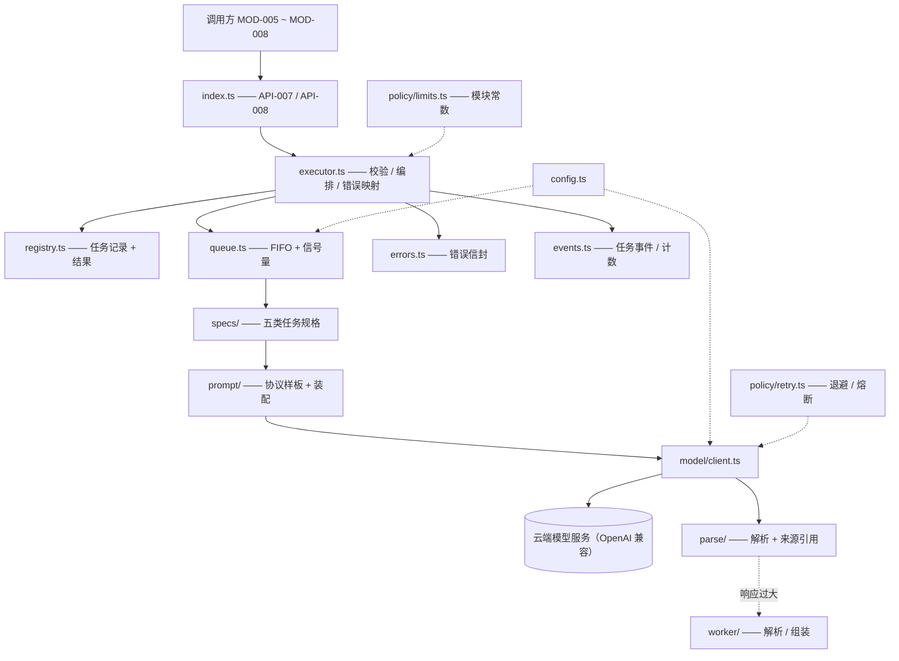
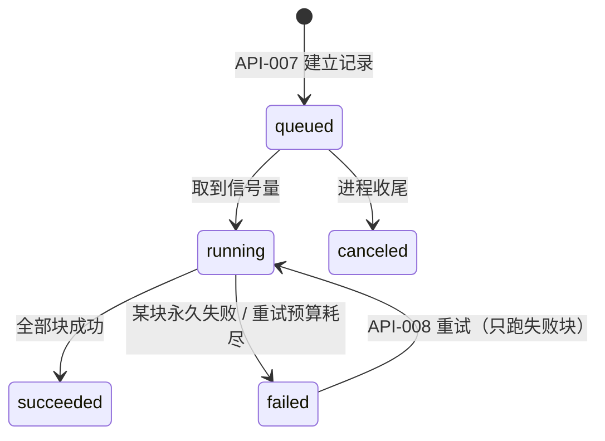

# MOD-003 —— 智能分析引擎 模块设计

> **状态**: reviewed
> **生成者**: 模块负责人按 `mod-000-template.md` 撰写（骨架由编排器按 `docs/prompt/run_pipeline.md` 步骤 4 建立）
> **上游**: `docs/design/modules.md`、`docs/design/api-contract.md`、`docs/design/data-model.md`、`docs/design/impl/high-level-design.md`
> **下游**: 无（叶子文档）
> **变更中**: —
> **最后更新**: 2026-09-12

<!-- 本文件属于实现层。修改必须走 design-doc-change skill（.github/skills/design-doc-change/SKILL.md）。 -->

## 1. 模块信息

| 项 | 值 |
| --- | --- |
| 模块 ID | `MOD-003` |
| 负责人 | — |
| 关联任务 | `TASK-004`、`TASK-005` |
| 涉及的契约 | 实现：`API-007`、`API-008`；无 `DM-###` 落点（经阶段 4 裁定） |
| 实现进度看板 | `docs/status/implementation.md` |

## 2. 职责与边界

- 职责与「明确不负责」项：见 `MOD-003` 的卡片（`docs/design/modules.md`），本文件不复制正文。
- 承接 `TASK-004`、`TASK-005`；实现 `API-007`、`API-008`；无 `DM-###` 落点（`docs/design/data-model.md` §1.2 的裁定）。
- 实现侧的边界补充（不改契约语义）：
  - 任务语义与判定口径全部来自调用方给出的 `任务参数`；引擎内不出现业务词表、阈值、评分规则与业务 prompt 文本（详设 §11 已把 prompt 模板文本与版本号分派给各使用模块）。
  - 引擎不读写任何持久化：不打开库、不碰媒体目录、不校验来源引用在库中是否存在——引用只是把调用方给的输入标识原样带回。
  - 引擎不产生 `NO_DATA` / `EMPTY_RESULT` 等业务空态语义（属调用方）；不发起采集、删除、改判、发布等动作。
  - 无自带界面入口：`src/server/engine/` 不注册 HTTP 路由、不产出面向使用者的文案；使用者可见内容一律由调用方模块呈现。
- 依赖方向（编译期与运行期）：只依赖 `src/shared/` 的跨模块类型与错误标识，以及进程内基建（日志 / 配置 / 事件通道 / 调用上下文）。禁止 import `MOD-001`、`MOD-002` 与四个业务模块；`MOD-003` 的禁止依赖方向按 §7 的 import 边界测试固化。

## 3. 内部结构

### 3.1 代码目录（建议：`src/server/engine/`）

```text
src/server/engine/
├── index.ts             # 模块出口：executeTask / retryTask；无 HTTP 路由、无界面
├── executor.ts          # 执行编排：入参校验 → 建记录 → 入队 → 分块执行 → 汇总 / 错误映射
├── registry.ts          # 任务注册表（任务引用 → 记录；LRU + 容量上限；dataEpoch 变更即清空）
├── task-ref.ts          # 任务引用生成 / 解析 / 校验（不透明字符串，见 §5）
├── queue.ts             # FIFO 队列 + 可热调整信号量（模型任务并发上限）
├── specs/               # 五类任务的执行规格（统一入口的分派点）
│   ├── index.ts         #   任务类型 → TaskSpec 注册表
│   └── recognize.ts · extract.ts · cluster.ts · generate.ts · infer.ts
├── prompt/
│   ├── protocol.ts      #   引擎侧协议样板（JSON 输出约定 / 来源标记约定 / 禁止编造），带版本号
│   └── assemble.ts      #   任务参数 + 归一化输入 → 请求 messages
├── model/
│   └── client.ts        #   OpenAI 兼容调用：超时、Retry-After、响应容错、错误归类
├── parse/
│   ├── decode.ts        #   响应解析与结果条目浅校验（容错，未知字段忽略）
│   └── refs.ts          #   来源标记 → 来源引用；无引用条目的丢弃与计数
├── policy/
│   ├── retry.ts         #   自动重试与退避（详设 §2.3）+ 熔断计数器
│   └── limits.ts        #   模块常数：分块上限、worker 阈值、注册表容量等
├── errors.ts            #   内部分类 → 错误信封（复用 api-contract.md §1.2 标识，见 §6）
├── events.ts            #   任务生命周期事件与计数（供外壳 SSE 转发，见 §4.3）
├── config.ts            #   配置读取与变更订阅（model.* / timeouts.modelCallMs / retry.maxAttempts）
└── worker/
    ├── pool.ts          #   worker 池（惰性建立）
    └── decode-worker.ts #   大响应解析 / 大结果组装（不碰存储、不带凭据）
```

子目录划分口径：`specs/` 按「任务类型」横切（五类各一份，只放差异）；`prompt/` `model/` `parse/` 按「一次模型调用」的三段管线竖切（装配 → 调用 → 解析）；`policy/` 放全局策略（重试、限额）；`worker/` 只放可离线执行的纯计算。除 `index.ts` 外，其余文件不得被其他模块 import（测试除外）。

### 3.2 结构图



### 3.3 关键接口（签名级；契约字段的语义见 `api-contract.md`）

```ts
// index.ts —— 契约层已定义语义与错误，这里只给实现签名与内部类型
type TaskType = 'recognize' | 'extract' | 'cluster' | 'generate' | 'infer'

executeTask(req: { taskType: TaskType; input: TaskInput; params: TaskParams }): Promise<TaskOutcome> // API-007
retryTask(ref: TaskRef): Promise<TaskOutcome>                                                        // API-008

type TaskOutcome =
  | { ok: true;  result: TaskResult; sourceRefs: SourceRef[]; taskRef: TaskRef }
  | { ok: false; error: ErrorEnvelope }   // 失败 / 超时的「任务引用」在 error.scope 内，见 §6

interface TaskParams {                    // 由调用方给出；引擎只校验存在性与形状
  instruction: string                     // 任务语义与判定口径（含词表 / 阈值等业务规则）
  outputSchema: SchemaFragment            // 条目字段片段：type / required / properties / enum 子集
  options?: Record<string, Json>          // 调优旋钮（期望数量、语言等），不改变判定口径
}

type TaskInput =
  | { kind: 'messages'; units: Unit[] }   // 消息集合
  | { kind: 'text';     unit:  Unit  }    // 单条文本（仍需调用方给标识）
  | { kind: 'context';  units: Unit[] }   // 上下文

interface Unit { id: string; text: string }   // id 即来源引用回传的标识；引擎不解释其语义

interface TaskSpec {                      // specs/ 下每类一份
  taskType: TaskType
  chunkable: boolean                      // 见决策 4
  validateParams(params: TaskParams): Issue[]
  validateItem(item: unknown): Issue[]    // 浅校验（required / 类型 / 枚举），多余字段忽略
}
```

五类规格差异（其余流程完全共用）：

| 任务类型 | 可分块 | 典型输入 | 结果条目要点（具体字段由调用方 `outputSchema` 约束） |
| --- | --- | --- | --- |
| 识别 | 是 | 消息集合 | 每条消息一个条目；来源引用 = 该消息 |
| 抽取 | 是 | 消息集合 | 每个要素一个条目；来源引用 = 证据消息（可多条） |
| 聚类 | 否 | 消息集合 / 文本集合 | 每个簇一个条目（名称 + 成员）；来源引用 = 簇内全部成员 |
| 生成 | 否 | 上下文 | 每个变体一个条目；来源引用 = 上下文标识 |
| 推断 | 是 | 消息集合 / 上下文 | 每条推断一个条目（属性 + 可选分数）；来源引用 = 证据消息 |

## 4. 接口实现说明

### 4.1 `API-007` 执行任务

按序执行：① 校验（任务类型、输入形状、任务参数、规模上限；任一不满足 → `INVALID_INPUT`，**不建立记录、不发起任何调用**）→ ② 归一化输入单元并编号标记 → ③ 建立任务记录（生成任务引用，状态 `queued`，留存输入快照）→ ④ 入队等待信号量 → ⑤ 按规格分块，逐块串行执行「装配 → 调用 → 解析 → 来源引用回填」（块内做调用级自动重试）→ ⑥ 汇总结果并置记录为 `succeeded` → ⑦ 返回 `任务结果 / 来源引用 / 任务引用`。

- 线程语义：同进程异步调用（返回 Promise）；出站 HTTP 是异步 I/O，不阻塞事件循环；超大响应的解析交 worker（详设 §1.1、§5.4）。主线程不做单次 > 50 ms 的同步计算。
- 副作用：内存（注册表 / 计数 / 熔断状态）、出站 HTTPS 到已配置模型服务、日志与任务事件；**无持久化副作用**——不写库、不写媒体目录、不修改任何 `DM-###` 实体。
- 可重入：调用彼此独立；唯一共享状态是队列、信号量、注册表、熔断计数器，按任务引用或配置键隔离；同一任务引用不重复入队（单飞）。
- 性能假设：任务耗时以模型调用为主（单次调用上界 = `timeouts.modelCallMs`）；排队等待 ≈ (前方任务数 ÷ 并发上限) × 单任务耗时；块数由输入规模与 `policy/limits.ts` 上限决定。
- 不变量：返回的每个条目至少 1 条来源引用，且引用 ⊆ 本次输入单元标识；成功与失败（`ANALYSIS_FAILED` / `TIMEOUT`）都返回任务引用。

### 4.2 `API-008` 重试任务

按序执行：① 解析并校验任务引用（缺失 / 格式非法 / 未登记 / 已淘汰 / 已被 `dataEpoch` 清空 → `INVALID_INPUT`，不产生执行）→ ② 按记录状态分派：

| 记录状态 | 行为 |
| --- | --- |
| `queued` / `running` | 单飞等待既有执行（不重复调用模型），完成后按结果返回 |
| `succeeded` | 直接返回记录内缓存的结果，不发新调用（详设 §2.4 的口径） |
| `failed` | 只重跑失败块，已成功块复用记录内结果 |

③ 无论成功、失败还是超时，都返回**新的任务引用**（记录内保留重试链），可继续重试；重试成功后由调用方经 `API-003` 落库。

- 幂等与副作用：同 `API-007`（无持久化副作用）；不产生重复结果——成功块不重跑、成功记录直接复用。
- 与自动重试的关系：自动重试发生在任务内部（`policy/retry.ts`，详设 §2.3 的退避 / `Retry-After` / 熔断），对调用方不可见；`API-008` 是任务级手动重试。两者共用幂等口径（详设 §2.4）：只重跑失败分项。熔断只拦自动重试，手动重试不受限（详设 §2.3）。
- 无公开取消接口（详设 §1.3：仅 `queued` 可取消，`running` 靠超时兜底）。

### 4.3 事件与统计（非契约、进程内）

`events.ts` 发布任务生命周期事件（任务引用 / 状态 / 块计数 / 失败边界），字段口径对齐详设 §6.2 的 `task.*` 事件与决策 1 的 SSE「任务状态变更 + 计数」；同时维护「队列长度」与「进行中数量」两个只读计数（详设 §1.3 的可见性要求；读取方与展示属外壳，本模块不新增模块间接口）。事件与日志均不含消息文本与凭据。

## 5. 数据与状态

### 5.1 内部数据结构（全部在内存，进程退出即消失）

| 结构 | 关键字段 | 说明 |
| --- | --- | --- |
| `TaskRecord` | 任务引用、重试链来源引用、任务类型、输入快照（归一化单元）、任务参数、状态、块表、自动重试计数、结果 / 错误、时间戳 | 注册表的存储单位；重试的全部依据 |
| `ChunkRecord` | 块序号、输入单元区间、状态、结果条目、错误 | 「只重跑失败分项」的台账 |
| `NormalizedInput` | 单元列表（标识 + 文本 + 标记编号） | 来源引用回填的索引；标记编号 → 输入标识的映射 |
| `ErrorEnvelope` | `code` / `message` / `retryable` / `scope` / `context` | 详设 §2.2 的统一信封；`code` 复用 `api-contract.md` §1.2 的标识 |
| 计数器 | 队列长度、进行中、熔断状态（按目标地址） | 供 §4.3 的可见性与诊断 |

### 5.2 状态机



与详设 §1.3 一致：任务级只有成功 / 失败（`partial` 只存在于块级台账）。

### 5.3 生命周期与失效

- 注册表按 LRU 保留 `policy/limits.ts` 的容量；淘汰后旧引用 → `INVALID_INPUT`。
- 订阅 `dataEpoch`（详设 §3.3）：收到「更新数据完成 / 删除完成 / 改判落库 / 迁移完成」的递增即清空注册表——保证删除后不残留输入文本副本，旧引用统一失效为 `INVALID_INPUT`。
- 无跨重启恢复：进程重启后旧引用一律无效（本模块无持久化，见 §5.4）。

### 5.4 与 `DM-###` 的映射

- 无落点：`MOD-003` 在 `docs/design/data-model.md` §1.2 已裁定不分配 `DM-###`；任务输入不落库，任务结果与失败 / 超时分类随接口返回。
- 结果进入数据模型的唯一路径：调用方拿到结果后经 `API-003` 落库；引擎不写任何实体、不跨请求持有业务数据。
- 来源引用中的标识由调用方提供（通常是 `DM-003` 的消息标识），引擎只做「原样回传 + 校验其回指本次输入」，不做存在性校验（不查库）。

## 6. 错误处理

### 6.1 映射表（内部分类 → 错误信封）

| 内部触发 | `code` | `retryable` | 自动重试 | `context.reason` |
| --- | --- | --- | --- | --- |
| 任务类型非法 / 输入缺失或为空 / 单元缺标识或文本 / 任务参数缺字段 | `INVALID_INPUT` | 否 | — | `VALIDATION` |
| 输入超出规模上限（含不可分块类型的单次上限） | `INVALID_INPUT` | 否 | — | `INPUT_TOO_LARGE` |
| 任务引用缺失 / 格式非法 / 未登记 / 已淘汰 / 已失效 | `INVALID_INPUT` | 否 | — | `REF_UNKNOWN` |
| 单次模型调用超时 | `TIMEOUT` | 是 | 是（详设 §2.3 退避，至预算耗尽） | `CALL_TIMEOUT` |
| 网络不可达 / DNS / TLS 瞬时错误 | `ANALYSIS_FAILED` | 是 | 是 | `NETWORK` |
| 限流（429，含 `Retry-After`） | `ANALYSIS_FAILED` | 是 | 是（按 `Retry-After`，不叠加抖动） | `RATE_LIMIT` |
| 服务端 5xx | `ANALYSIS_FAILED` | 是 | 是 | `UPSTREAM_5XX` |
| 响应非法 JSON / 缺必填字段 / 类型不符 | `ANALYSIS_FAILED` | 是 | 是（同一输入重放可能成功） | `OUTPUT_INVALID` |
| 凭据无效（401 / 403） | `ANALYSIS_FAILED` | 否 | 否 | `CREDENTIAL` |
| 未配置模型地址或凭据 | `ANALYSIS_FAILED` | 否 | 否 | `MODEL_NOT_CONFIGURED` |
| 请求被服务端拒绝（400 / 404 / 422） | `ANALYSIS_FAILED` | 否 | 否 | `REQUEST_REJECTED` |
| 模型拒答 | `ANALYSIS_FAILED` | 否 | 否 | `REFUSAL` |
| 解析 worker 崩溃 | `ANALYSIS_FAILED` | 是 | 是 | `WORKER_CRASH` |
| 熔断打开（自动重试暂停期内） | `ANALYSIS_FAILED` | 是 | 否（暂停期内） | `BREAKER_OPEN` |
| 未映射的内部异常 | `ANALYSIS_FAILED` | 否 | 否 | `UNKNOWN` |

- 失败 / 超时的信封 `scope` 为 `{ kind: 'task', taskRef }`——契约要求的「任务引用」由此携带；`INVALID_INPUT` 无任务引用（未建立记录，也不产生执行）。
- 本模块只产生 `INVALID_INPUT` / `TIMEOUT` / `ANALYSIS_FAILED` 三个标识；其余 11 个不由本模块产生。不新增标识（`api-contract.md` §1.2 一经分配不复用）。
- `message` 只给日志与诊断（一句原因 + 失败边界），不含消息文本、凭据与原始报文；面向使用者的一句话原因由调用方按 `code` 产出（详设 §2.2）。

### 6.2 不可恢复的情形

- 凭据 / 配置类错误：重放同一输入必然失败，不自动重试（`retryable=false`），调用方引导到设置页（详设 §2.1）。
- 任务引用失效（被淘汰 / 被 `dataEpoch` 清空 / 进程重启）：不可恢复，调用方重新发起 `API-007`。
- 模型拒答（`REFUSAL`）：不自动重试；换输入或换口径才有意义。

## 7. 测试要点

交付口径：**全部单测 mock 模型服务（进程内假 OpenAI 兼容端点），禁止真调云端**。需要 mock / 注入的边界：模型 HTTP 端点、时钟（退避与超时用假时钟）、worker 池（可注入崩溃）、调用上下文（`requestId` / 调用方标识）。

分支覆盖（对应 `TASK-004` / `TASK-005`）：

1. 五类任务各一条成功路径：结果结构合法、每条目 ≥ 1 来源引用、引用 ⊆ 输入标识、返回新的任务引用。
2. 分块：输入超单块上限 → 多块串行；块边界确定可复现；引用不跨块串错。
3. 输出容错：多余字段忽略；非法 JSON / 缺必填 → 自动重试后成功；引用标记解析失败的条目被丢弃并计入计数。
4. 失败与超时：`ANALYSIS_FAILED` / `TIMEOUT` 均携带任务引用；`INVALID_INPUT` 不建立记录、不发起任何调用（假端点请求数为零）。
5. 重试：失败任务经 `API-008` 重试成功，仅失败块被重新调用（按块断言假端点调用次数）；重试结果与首次同构；无效 / 淘汰 / 失效引用 → `INVALID_INPUT`（`AC-037`：无执行、无副作用）。
6. 自动重试：退避序列 `1 s → 2 s → 4 s`（假时钟）；`Retry-After` 优先；预算耗尽后任务失败（`AC-036`）；同目标连续 5 次可重试失败 → 熔断暂停自动重试、手动重试仍可用。
7. 并发：并发上限 4 时提交 10 个任务 → 同时在飞 ≤ 4 且 FIFO；配置改为 2 后运行中任务不打断、新任务按新上限排队。
8. 凭据 / 配置错误：401 / 未配置 → 不自动重试、`retryable=false`、原因分类正确。
9. 注册表：容量淘汰、`dataEpoch` 清空（输入文本副本不再被引用）、进程重启模拟（新实例）后旧引用无效。
10. 纪律与边界：引擎不 import 存储与业务模块（import 边界测试）；日志与事件不含消息文本与凭据（用哨兵文本断言）；worker 崩溃映射为可重试失败。

对应验收用例：`AC-035`（三个模块与外壳对同一错误标识的呈现一致——引擎侧保证信封与分类一致）、`AC-036`（按任务引用重试成功并可落库）、`AC-037`（无效引用被拒且无副作用）、`AC-038`（不静默失败：引擎错误一律以信封上抛，不吞错）、`AC-080`、`AC-092`、`AC-138`（模块级失败 / 超时体验依赖引擎的失败语义与「排队不阻塞读」口径）。

## 8. 关键决策与取舍

### 决策 1 —— 任务引用：不透明标识 + 进程内注册表（不落库）

- **背景与约束**：`API-008` 只收任务引用、不收输入；`MOD-003` 经阶段 4 裁定无 `DM-###` 落点，任务输入不落库（是否持久化由调用方决定）。
- **候选方案与取舍**：① 引用内编码全部输入（自包含）→ 标识会夹带消息正文、随日志与错误面扩散，体积不可控；② 落库快照 → 与阶段 4 裁定冲突，并破坏本模块「依赖：无」；③ 进程内注册表 + 不透明随机引用 → 实现最简、零持久化代价，代价是进程重启后旧引用失效。
- **决定**：③；引用为随机不透明字符串，只做格式与登记校验，不解析出语义。
- **后果**：重试窗口 = 进程生命周期 ∩ 注册表容量；注册表随 `dataEpoch` 清空；调用方按「失败 → 提示 + 重试」的短窗口使用引用，窗口外重新发起 `API-007`。
- **上游影响**：无

### 决策 2 —— 业务语义全部来自调用方，引擎只实现协议层

- **背景与约束**：卡片规定「任务语义与判定口径由调用方提供」；详设 §11 把 prompt 模板文本与版本号分派给各使用模块；引擎又必须统一失败 / 超时 / 重试语义。
- **候选方案与取舍**：① 引擎内置五类任务的完整 prompt 与业务规则 → 违反卡片边界，业务口径变更处处改引擎；② 引擎只做传输 → 各调用方自写提示词与校验，「统一语义」落空；③ 分工：调用方给 `instruction` + `outputSchema`，引擎给协议样板（JSON 输出、来源标记、禁止编造）+ 浅校验 + 统一执行语义。
- **决定**：③；协议样板在 `prompt/protocol.ts`，带版本号，只进日志与诊断，不参与判定口径。
- **后果**：业务口径变更不动引擎；输出校验为浅校验（required / 类型 / 枚举），多余字段容忍（详设 §8.2 的容错口径）。
- **上游影响**：无

### 决策 3 —— 来源引用强制：条目 ≥ 1 条引用，无引用条目丢弃并计数

- **背景与约束**：`REQ-007` 要求每个结论可回溯；统一的模型输出无法保证每条都标注出处。
- **候选方案与取舍**：① 无引用条目照常返回 → 「无证据」状态扩散到每个调用方的落库路径，追溯保证变成四处实现；② 丢弃无引用条目并计数 → 引擎保证「返回的每条都能回溯」，代价是模型未标注的内容不可见；③ 让模型重答至引用齐全 → 不稳定且放大成本。
- **决定**：②；协议样板写明标记约定，解析端容忍多种写法。
- **后果**：调用方拿到的结果天然带证据；丢弃量进结果计数与日志（不含正文），便于按数据调提示词。
- **上游影响**：无

### 决策 4 —— 分块与失败分项：可分块类型逐块串行、块级留痕，重试只跑失败块

- **背景与约束**：消息集合类输入可能超单次调用上限；详设 §2.3 / §2.4 要求「只重跑失败分项，已成功分项不再执行」。
- **候选方案与取舍**：① 不分块 → 大输入必然超窗，切分知识外泄给每个调用方；② 分块 + 块级留痕 → 重试成本随失败块数而非输入规模增长；③ 块间并行 → 单任务即可吃满并发上限，饿死其他调用方。
- **决定**：②；识别 / 抽取 / 推断可分块；聚类 / 生成整入单次调用（超限 → `INVALID_INPUT`，原因 `INPUT_TOO_LARGE`）；块内单元独立、块间串行；某块永久失败即任务失败（不再发起后续块，已成功块保留）。
- **后果**：调用方对大集合无感；上限常数集中在 `policy/limits.ts`，实现期按模型上下文窗口校准（不新增配置键）。
- **上游影响**：无

### 决策 5 —— 并发口径：一个任务占一个额度，任务内串行调用

- **背景与约束**：详设 §1.2 已定模型任务信号量（默认 4、可配 1–8、超限 FIFO），未定「任务与额度」的关系。
- **候选方案与取舍**：① 每次调用占额度（任务内可并行）→ 吞吐高，但单任务即可占满全部额度，公平性差、块级重试记账复杂；② 一个任务占一个额度、任务内串行 → 公平可预测、账目简单，代价是长任务占额度更久。
- **决定**：②；信号量支持热调整（详设 §7「立即生效，运行中任务不打断」）。
- **后果**：同时在跑的任务 ≤ 并发上限；排队不阻塞任何读取（引擎不在读路径上）；队列长度与进行中数量经 §4.3 可见。
- **上游影响**：无

### 决策 6 —— 重试分层：任务内自动重试 + 任务级手动重试

- **背景与约束**：详设 §2.1–§2.4 的自动重试 / 退避 / 熔断 / 幂等键是全局口径；`API-008` 是契约给出的手动重试入口。
- **候选方案与取舍**：① 只在引擎内自动重试 → 失败上抛前反复重放，等待不可控；② 只做手动重试 → 瞬时抖动也直接暴露，违背 §2.3 对后台任务的自动重试口径；③ 分层：调用级自动重试 + 任务级手动重试，共用幂等口径。
- **决定**：③；自动重试只作用于「可重试」分类（含超时，按 §2.1 的判定规则）；熔断只拦自动重试。
- **后果**：调用方只在「自动重试也没救」时看到失败；五类任务对四个调用模块的重试语义完全一致；交互等待上界 ≈ 预算 × 调用超时，进度由任务事件呈现。
- **上游影响**：无

### 决策 7 —— worker 边界：只做超阈值的大响应解析 / 组装

- **背景与约束**：详设 §1.1 禁止主线程单次同步计算 > 50 ms、worker 允许「大结果集组装」且禁止碰存储；§5.4 要求查询护栏。
- **候选方案与取舍**：① 全部主线程解析 → 大响应拖慢整个服务；② 全部交 worker → 小响应也付跨线程开销；③ 按阈值（响应体大小 / 条目数）切换 → 常态零开销、峰值不阻塞。
- **决定**：③；阈值与池上限在 `policy/limits.ts`（池上限 `min(2, CPU−1)`）；worker 只收「文本 → 解析结果」的纯计算输入，不带凭据、不含配置。
- **后果**：worker 崩溃映射为可重试失败（`WORKER_CRASH`），不影响已缓存内容。
- **上游影响**：无

### 决策 8 —— 模型接入：OpenAI 兼容调用；模型名走配置键 `model.name`

- **背景与约束**：HLD 决策 4 定「单抽象层 + 默认云端」；详设 §8.2 要求「模型名与地址可配，不在代码写死」，但其 §7 的配置表只列了 `model.baseUrl` / `model.apiKey` / `model.taskConcurrency`。
- **候选方案与取舍**：① 代码写死模型名 → 直接违反 §8.2；② 模型名进 `任务参数` → 基础设施旋钮混进业务口径，四个调用模块都要关心模型名；③ 增补配置键 `model.name`（空 = 内置默认），只被本模块读取 → 改动面最小。
- **决定**：③；该键只被 `MOD-003` 使用（模型服务只有本模块出站），键的登记与设置页是否暴露属配置 / 外壳面，本模块只要求「值可配」。
- **后果**：换模型不改代码、不重启（下一个任务生效，与 §7 的 `model.baseUrl` 口径一致）；出站内容按详设 §4.3 裁剪——调用方未给的内容不出站。
- **上游影响**：无

### 决策 9 —— 进度与统计：进程内事件通道，不新增模块间接口

- **背景与约束**：详设 §1.3 / 决策 1 / 决策 9 要求长任务有进度、队列可见、页面经 SSE 订阅；契约层只定义 `API-007` / `API-008`，没有进度接口。
- **候选方案与取舍**：① 新增「查询任务进度」模块间接口 → 需改 `modules.md` / `api-contract.md`（契约层），超出本文件权限；② 不提供进度、由调用方自行估计 → 与详设决策 1 的 SSE 口径脱节；③ 引擎把任务状态变更事件与只读计数发布到进程内通道（详设决策 1 定义的进度回传机制），外壳的 SSE 层订阅转发 → 不加契约接口即可满足可见性。
- **决定**：③；事件字段对齐详设 §6.2 的 `task.*` 与决策 1 的「状态 + 计数 + 失败边界」。
- **后果**：进度与队列展示归外壳；引擎只保证事件口径稳定且不含敏感内容。若后续需要跨进程或持久化进度，属契约变更，走回流。
- **上游影响**：无

## 9. 未决问题

无。
