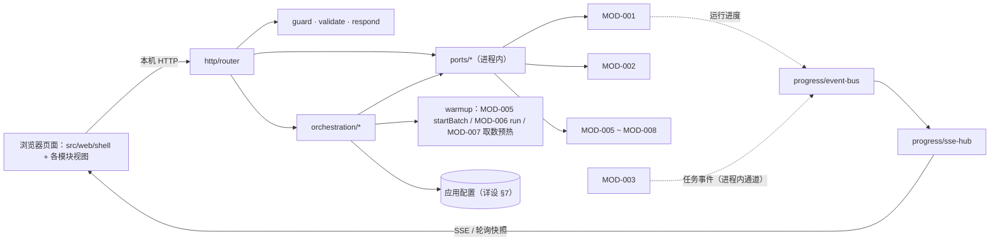
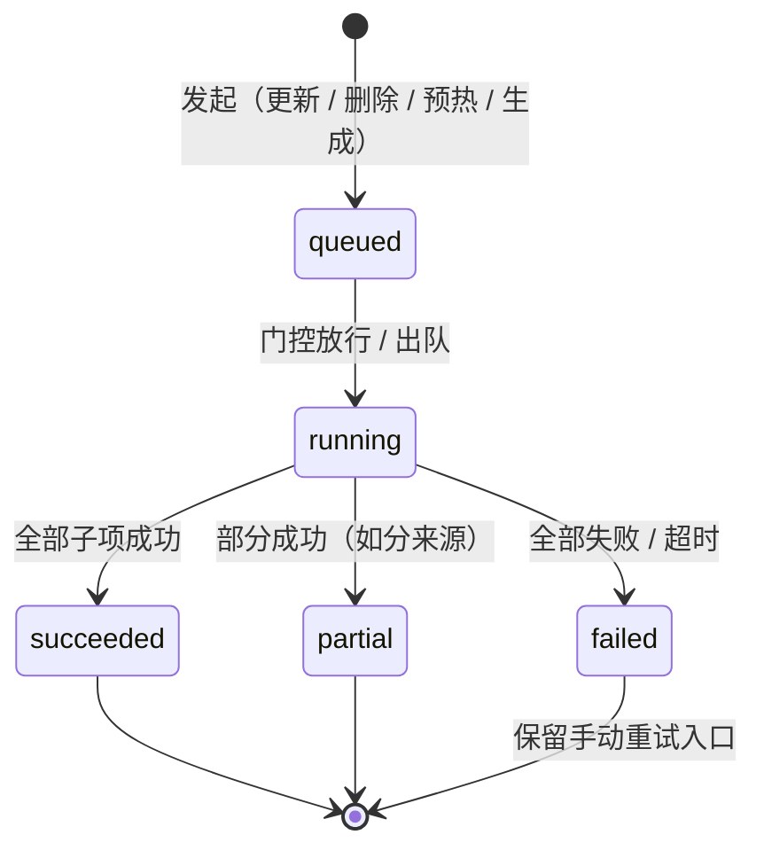
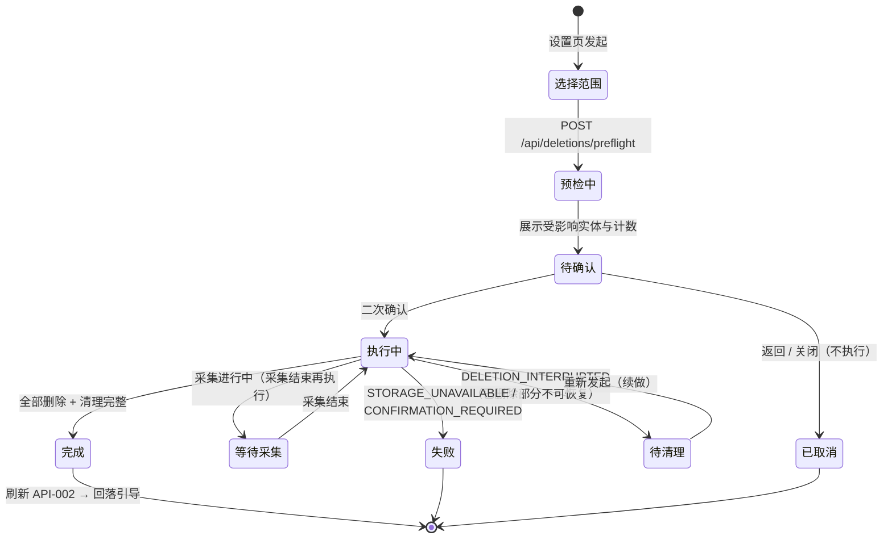

# MOD-004 —— 应用外壳与全局筛选 模块设计

> **状态**: reviewed
> **生成者**: 模块负责人按 `mod-000-template.md` 撰写（骨架由编排器按 `docs/prompt/run_pipeline.md` 步骤 4 建立）
> **上游**: `docs/design/modules.md`、`docs/design/api-contract.md`、`docs/design/data-model.md`、`docs/design/impl/high-level-design.md`
> **下游**: 无（叶子文档）
> **变更中**: —
> **最后更新**: 2026-09-12

<!-- 本文件属于实现层。修改必须走 design-doc-change skill（.github/skills/design-doc-change/SKILL.md）。 -->

## 1. 模块信息

| 项 | 值 |
| --- | --- |
| 模块 ID | `MOD-004` |
| 负责人 | — |
| 关联任务 | `TASK-008` ~ `TASK-011`、`TASK-036` ~ `TASK-038` |
| 涉及的契约 | 不产生 `API-###`（经阶段 3 裁定）；消费：`API-001`、`API-002`、`API-004` ~ `API-006`、`API-009` ~ `API-034`（`API-004` 的群清单读路径经 CHG-024 补齐）；无 `DM-###` 落点（经阶段 4 裁定） |
| 实现进度看板 | `docs/status/implementation.md` |

<!-- 负责人改动后，同步更新看板里对应的那一行。 -->

## 2. 职责与边界

- 职责与不负责项见 `MOD-004` 模块卡片（`docs/design/modules.md`）；本节只写实现侧边界。
- 本文件覆盖**两半实现**，同属一个交付单元：
  - 服务端外壳 `src/server/shell/`：本机 HTTP 入口（路由、校验、统一响应与错误信封）、跨模块编排（更新 / 删除 / 预热 / 详情组装 / 生成转交）、进度传输、本地接口防护、设置读写。
  - 浏览器侧外壳 `src/web/shell/`：页面骨架与导航、首屏引导、全局筛选条（全应用唯一筛选控件）、数据状态（「记录更新至 X」）展示、设置与删除交互、生成面板容器、统一异常呈现的落点。
- 编排边界（三句话）：只**转发**模块结论、只**组装**跨模块数据、只**登记**自己发起的操作；不持有业务数据副本、不改写任何模块输出、不替模块解释业务口径。
- 依赖方向：外壳 → 全部模块（单向）；业务模块不 import `src/server/shell/` 与 `src/web/shell/` 的状态与编排代码（`AC-040` 的实现侧护栏）。模块视图要复用的**纯展示**组件发布在 `src/shared/ui/present/`（§3.1），不经外壳目录。
- 不负责（实现侧补充）：各模块自身视图内部（`src/web/<模块>/`）、采集 / 存储 / 任务执行（`MOD-001` ~ `MOD-003`）、模板与图像合成（`MOD-008`）、业务口径与判定阈值。
- 明确不做（口径来自上游）：不提供读取模块内部队列深度的队列状态接口，`detailed-design.md` §1.3 / §6.4 只允许展示外壳发起操作的排队与在途数量（CHG-024）；不提供演示数据 / 演示模式入口（`REQ-019`）；不新增任何第二组同类筛选控件（`REQ-004` / `REQ-049`）。

## 3. 内部结构

### 3.1 代码目录（`src/server/shell/` + `src/web/shell/`）

```text
src/server/shell/
  app.ts                 # 组装根：装配端口 / 路由 / 守卫 / SSE；选端口 → 启服务 → 打开带令牌页面（详设决策 9）
  http/
    router.ts            # 路由表（§4.1）：直通 / 组合 / 编排三类处理器
    guard.ts             # Host / Origin 校验 + 启动令牌（写操作）；无令牌页面降级为只读
    validate.ts          # JSON schema 校验与归一化（详设 §4.4）
    respond.ts           # 统一响应 { data, epoch, requestId } 与错误信封 { code, message, retryable, scope, context }
    static.ts            # 页面与静态资源
  ports/                 # 进程内适配：每个模块一个端口对象，是外壳唯一的数据出入口
    ingest.ts            #   MOD-001：API-001 / API-002
    store.ts             #   MOD-002：API-004 / API-005 / API-006 + 媒体读取（§4.6）
    meme.ts / extract.ts / social.ts / regen.ts
  orchestration/
    operation-gate.ts    # 采集 ↔ 删除互斥（组合根接线；详设 §1.2）
    operation-tracker.ts # 外壳发起操作的登记与计数（排队 / 在途 / 完成 / 失败）
    ingest-flow.ts       # 更新入口：API-001 → 刷新 API-002 → 触发预热
    delete-flow.ts       # 删除：范围 → API-005 预检 → 二次确认 → API-006 → 状态回落
    warmup.ts            # 采集完成后按模块预热（§4.5）
    detail-assembly.ts   # API-019 + API-029 组合（§4.6）
    hint-members.ts      # 成员集推导（纯函数，§4.6）
    settings.ts          # 应用配置读写（详设 §7；凭据只写不读回）
  progress/
    event-bus.ts         # 订阅进程内事件通道（MOD-001 运行进度 / MOD-003 任务事件）
    sse-hub.ts           # SSE 连接、心跳、重连快照、断连降级口径
src/web/shell/
  app/                   # 根组件、路由（引导 / 主界面 / 设置）、模块视图懒加载 + 错误边界
  state/                 # filterStore / dataStatusStore / operationsStore / sessionStore（§5.1）
  api/                   # 客户端取数：fetch 封装（写操作带令牌头）、SSE 客户端（5 s 轮询降级）、信封解析
  compose/               # MessageDetailContainer、MemberHints、GenerationPanelContainer
  components/            # GlobalFilterBar、DataStatusHeader、UpdateEntry、DeleteFlow、SettingsPage、Onboarding、进度面板
  terminology.ts         # 术语常量与禁用词表（`REQ-017`）
```

划分理由：`http/` 只做传输与校验、不含业务分支；`ports/` 是唯一模块接触面（可整体替换为测试替身，见 §7）；`orchestration/` 承载全部跨模块行为（`TASK-036` ~ `TASK-038` 的落点）；`progress/` 把「进度来源」与「进度传输」分开——前者订阅进程内事件，后者只面向 SSE / 轮询。

`src/shared/ui/present/` 放发布给各模块复用的纯展示组件与映射常量（空态、错误提示、重试、一键清除、进度条、术语文案）：无状态、不取数、不读外壳状态（理由见 §8 决策 7）。

### 3.2 结构图



`ports` 与 `orchestration` 都在服务进程主线程；浏览器不直达任何模块（HLD 架构图口径）。

### 3.3 关键接口（签名级，实现侧）

```ts
// ports/ingest.ts —— MOD-001
interface IngestPort {
  trigger(req: { targetSource?: IngestSource }): Promise<RunReport>;  // API-001
  status(): Promise<UpdateStatus>;                                    // API-002
  isRunning(): boolean;                                               // 组合根接线用（§4.4）
}

// ports/store.ts —— MOD-002
interface StorePort {
  readGroups(page?: PageRequest): Promise<{ groups: GroupRef[]; pageInfo: PageInfo }>; // API-004，实体类型 = 群
  preflight(scope: DeletionScope): Promise<PreflightResult>;                           // API-005
  execute(scope: DeletionScope, confirmed: boolean): Promise<DeletionResult>;           // API-006
  openMedia(ref: MediaRef): Promise<{ bytes: Uint8Array; mime: string }>;               // 媒体通道（§4.6）
  epoch(): number;                                                                      // dataEpoch 来源
}

// ports/meme.ts / extract.ts / social.ts / regen.ts —— 模块 5 / 6 / 7 / 8
// 逐条对应 API-009 ~ API-034 的入出参；类型定义在 src/shared/（与契约同源），本层不另起类型
interface MemePort { /* API-009 ~ API-013；另有进程内 startBatch（§4.5） */ }
interface ExtractPort { /* API-014 ~ API-019；另有进程内 run(window)（§4.5） */ }
interface SocialPort { /* API-020 ~ API-029 */ }
interface RegenPort { /* API-030 ~ API-034；另有进程内 submitMaterialConsent / readArtifact（§4.7） */ }

// orchestration/operation-tracker.ts —— 外壳发起操作的登记表
interface ShellOperation {
  id: string;
  kind: 'ingest' | 'deletion' | 'warmup' | 'generation';
  scope: string;                    // 来源 / 群 / 模块 ID / 生成请求
  state: 'queued' | 'running' | 'succeeded' | 'partial' | 'failed';
  counts: { done: number; total?: number };
  error?: ErrorEnvelope;
  startedAt: number;
  updatedAt: number;
}
interface OperationTracker {
  start(op: Omit<ShellOperation, 'state'>): string;
  update(id: string, patch: Partial<ShellOperation>): void;
  snapshot(): ShellOperation[];     // SSE 与轮询共用同一份快照
}

// orchestration/detail-assembly.ts —— REQ-070 组装
interface DetailPayload {
  detail: MessageDetail;            // API-019 原样透传
  hints: MemberHint[];              // API-029，按成员聚合；无数据 = 空数组
  hintStatus: 'ok' | 'degraded';    // degraded = 提示子调用失败，正文不受影响（REQ-016）
}
assembleDetail(entryId: EntryId): Promise<DetailPayload>;
```

类型来源：`ErrorEnvelope` / `ErrorCode` / `EntityType` / `SharedFilter` / `PageRequest` 等全部取自 `src/shared/`，与契约同源，本模块不另起一套。

## 4. 接口实现说明

### 4.1 HTTP 表面与路由（消费关系的落点）

所有模块接口都在本进程内被调用，浏览器只经外壳。路由分三类：**直通**（校验后原样转发）、**组合**（多次调用结果合并）、**编排**（含跨操作状态与副作用）。

| 消费 | 路由 | 类别 | 需写令牌 |
| --- | --- | --- | --- |
| `API-002` | `GET /api/update-status` | 直通 | 否 |
| `API-001` | `POST /api/update`（可选 `targetSource`） | 编排（门控 + 预热触发） | 是 |
| `API-004`（实体类型 = 群） | `GET /api/filter-options/groups` | 直通（专用读） | 否 |
| `API-005` / `API-006` | `POST /api/deletions/preflight`、`POST /api/deletions` | 编排（§4.4） | 是 |
| `API-009` ~ `API-013` | `/api/memes/**` | 直通（`API-012` 为写） | 写时 |
| `API-014` ~ `API-018` | `/api/extracts/**`、`/api/notifications`、`/api/todos/due` | 直通（`API-016` / `API-017` 为写） | 写时 |
| `API-019`（+ `API-029`） | `GET /api/message-detail/:entryId` | 组合（§4.6） | 否 |
| `API-020` ~ `API-029` | `/api/people/**`、`/api/pairs`、`/api/me/fit`、`/api/playdate`、`/api/identity/**` | 直通（`API-024`、`API-026` ~ `API-028` 为写） | 写时 |
| `API-030` ~ `API-034` | `/api/generations/**` | 直通（`API-030` ~ `API-033` 为写） | 写时 |
| 进程内 `submitMaterialConsent` | `POST /api/generations/material-consents` | 编排（§4.7） | 是 |
| 进程内 `readArtifact` | `GET /api/artifacts/:ref` | 编排（浏览器侧复制 / 下载） | 否 |
| 媒体通道 | `GET /media/:ref` | 编排（§4.6） | 否 |
| 进度 | `GET /api/events`（SSE）；`GET /api/operations`（5 s 轮询降级） | 传输 | 否 |
| 本模块自有 | `GET/PUT /api/settings`、`GET /`、`/assets/*` | 自有 | 写时 |

路由名只在本模块内稳定，不进契约层；入参一律 schema 校验（详设 §4.4），非法值直接拒绝、不进业务层。

### 4.2 通用读行为

- 筛选条件由页面逐请求携带（§5.1）；外壳按 `api-contract.md` §1.3 的结构校验并归一化，未提供的项不下发（空 = 不限，`AC-014`）。模块二不下发「身份」（该模块设计亦显式剔除）。
- 响应统一携带 `dataEpoch` 与 `requestId`；页面按 epoch 丢弃过期响应（详设 §3.3）。
- 分页：页面按各模块声明的默认页与上限取数，外壳不自行改口径；越界值由模块返回 `INVALID_INPUT`，外壳原样透传呈现。
- 同屏的列表与统计必须来自同一 epoch 的同一次请求（详设 §3.3），外壳不做跨请求拼装，避免数字对不上。

### 4.3 更新入口（`API-001` / `API-002`）

- 首屏：`GET /api/update-status` → 「是否有数据」决定引导 / 主界面（`AC-001`）；「记录更新至 X」写入 `dataStatusStore`，主界面顶栏常驻（无值显示「尚未更新」、不隐藏，对齐 `DM-001` 的可空口径，`AC-002` ~ `AC-004`）。
- 触发：`POST /api/update` → 门控检查（§4.4）→ 登记 `kind='ingest'` 操作 → 调 `IngestPort.trigger()`。重复触发的挂接 / 排队语义由 `MOD-001` 自身吸收（外壳不造新错误标识）；更新入口的置灰依据是进度事件。
- 完成：按来源分项呈现（成功 / 失败 / 无授权 / 超时 + 原因 + 分项重试入口，`AC-005` ~ `AC-007`）；刷新 `API-002`；群消息来源成功时触发预热（§4.5）。
- 失败不影响已有数据：外壳只呈现与登记，`MOD-001` 保证已入库数据不受影响。

### 4.4 删除流程与采集互斥（`API-005` / `API-006`）

- 顺序：设置页发起 → 选范围（全量 / 按群；群选择项取自 `API-004` 的群清单）→ `preflight` → 展示受影响实体与计数 → 使用者二次确认 → `execute(scope, confirmed: true)`。
- 二次确认是唯一授权凭证：确认动作在页面弹层完成，未确认时前端不发执行请求；即使收到缺少标记的调用，外壳也不代模块补齐（由模块返回 `CONFIRMATION_REQUIRED`，`AC-027`）。
- 门控（组合根接线，详设 §1.2）：`operation-gate.ts` 组合 `IngestPort.isRunning()` 与 `MOD-002` 的删除门：
  - 采集进行中发起删除 → 置「等待采集收尾」，采集结束事件到达后进入预检；页面显示等待态；
  - **二次确认之后**（删除进入等待 / 执行）→ 更新入口置灰，`POST /api/update` 被拒绝：信封 `code = INVALID_INPUT`、`retryable = false`、`scope = 'update'`、文案「删除进行中」（闭集内无「忙」类标识，故不新增，详设 §2.2）；预检与待确认阶段不阻断更新。
- 结果：成功 → 清空筛选与页面缓存、刷新 `API-002`（回落引导，`AC-029`）；`DELETION_INTERRUPTED` → 按不可恢复口径提示 + 续做入口（`AC-028`）；`STORAGE_UNAVAILABLE` → 提示 + 重试（`AC-038`）。

### 4.5 预热（HLD 决策 9）与操作登记（CHG-024 口径）

- 触发时机：群消息来源采集成功后（`ingest-flow` 的完成回调）。
- 调用面（全部为各模块已声明的入口 / 接口，不新增接口）：
  - `MOD-005`：进程内 `startBatch('ingestDone', scope)`（`scope` 取空 = 不限）；
  - `MOD-006`：进程内 `run(window)`（窗口语义按该模块的增量水位口径，本模块只传采集完成时刻）；
  - `MOD-007`：以无入参接口取数预热（`API-023`、`API-025`，该模块不要求非契约接口）；
  - `MOD-008`：不参与后台预热（无采集后任务）。
- 登记：每模块一条 `kind='warmup'` 操作（`scope = 模块 ID`），状态随事件与调用结果收敛；失败给手动重试入口（同参数再次触发）。
- 可见性：设置页 / 进度面板只展示**外壳发起操作**（采集 / 删除 / 预热 / 生成）的排队与在途数量；`MOD-003` 的只读计数仅供外壳内部归属与日志，模块内部队列深度不进页面（详设 §1.3、§6.4）。

### 4.6 组合端点

- **消息详情（`REQ-070`，`TASK-036`）**：`assembleDetail(entryId)` 并行调用 `API-019` 与 `API-029`。
  - 成员集推导（`hint-members.ts`，纯函数）：取正文全部来源消息，`成员集 = ∪发送者 ∪ ∪提及成员`（两者均为 `DM-003` 的既有字段），去重后作为 `API-029` 入参；无提及的消息只贡献发送者。
  - 呈现：正文用 `MOD-006` 的详情视图；成员提示由外壳的 `MemberHints` 渲染在详情内、正文成员引用旁（模块二不感知 `MOD-007`）。
  - 降级：`API-029` 失败 / 超时 → `hintStatus='degraded'`，正文照常展示 + 提示区给重试（`REQ-016`、`AC-116`）；`NO_DATA` → 不显示提示、不弹错误。
  - `API-019` 失败：按该模块口径呈现（`NOT_FOUND` → 返回上一视图；`ANALYSIS_FAILED` / `TIMEOUT` → 提示 + 重试，正文仍可浏览）。
- **媒体通道（HLD 决策 8）**：`GET /media/:ref` 经 `StorePort.openMedia(ref)` 取字节流（路径护栏与索引在 `MOD-002`；入口名以其设计为准）；未命中触发按需解密，进度并入相应操作；失败按 `SOURCE_UNAVAILABLE` 呈现并允许切换素材档位（`AC-068` 的呈现侧）。
- **产物读取（`TASK-037`）**：`GET /api/artifacts/:ref` 经进程内 `readArtifact(ref)`；复制 / 下载在浏览器侧完成；产物随所属数据删除后返回 `NOT_FOUND`。

### 4.7 生成面板（`TASK-037`）

- 容器：`GenerationPanelContainer`（`src/web/shell/compose/`）承载 G1 / G2 / G3 / 生成历史四个入口；`MOD-005` 的 `GenerationMount` 只渲染外壳注入的 slot（挂载点是梗单元左下角，`AC-062`）。
- 上下文转交：面板打开时从当前梗单元的 `API-010` 结果组装 `MemeGenerationContext`（梗标识、解读、变体、精华图片引用）——**会话内瞬态，不落库、不缓存、不改写**；`MOD-005` 与 `MOD-008` 之间不发生任何调用。
- 素材合规：`API-030` 返回 `MATERIAL_NOT_CONFIRMED` 时，按信封 `context` 渲染确认面板 → 使用者确认 → `POST /api/generations/material-consents`（转进程内 `submitMaterialConsent`）→ 面板恢复可生成（由使用者再次点击，不做静默重发）。
- G3 的「近期消息范围」= 全局筛选的时间范围；为空时取默认窗口（近 30 天，常量放 `src/shared/`），**不新增第二组时间控件**（`REQ-049`、`AC-012`）。
- 呈现约束：全部产出带「创作」标注（`AC-031`）、可复制 / 下载。

### 4.8 进度传输

- `event-bus` 订阅 `MOD-001` 运行进度与 `MOD-003` 任务生命周期事件（字段口径对齐详设 §6.2）；`sse-hub` 按 `ShellOperation` 归属聚合，推送「状态变更 + 计数 + 失败边界」（详设决策 1）。
- SSE 建连失败 → 页面自动降级 5 s 轮询 `GET /api/operations`（与 SSE 同一份快照）；重连后先取一次快照再订阅（详设 §1.4）。
- 断连不影响任务执行（服务端为权威）；页面关闭即停（无后台常驻）。

## 5. 数据与状态

### 5.1 页面侧状态（全部运行期，不持久化）

| 结构 | 内容 | 约束 |
| --- | --- | --- |
| `filterStore` | 群多选 / 时间范围 / 关键词 / 身份（结构见 `api-contract.md` §1.3） | 全应用唯一筛选源；切模块不重置、不丢失（`AC-011`）；`身份` 为只读项（取自 `API-002` 的当前用户，无手工设置，`AC-016`）；空项省略 = 不限（`AC-014`） |
| `dataStatusStore` | 「是否有数据」「记录更新至 X」、来源状态、当前用户 | 每次 `API-002` 返回整体替换；`X` 不由本地推算（`AC-003`）；`STORAGE_UNAVAILABLE` 时为「不可用」而非「无数据」（`AC-038`） |
| `operationsStore` | `ShellOperation[]` 快照 + SSE 连接态 | 只含外壳发起的操作；断连时保留最近快照 |
| `sessionStore` | 启动令牌、生成面板上下文、删除流程中间态 | 令牌只在内存（详设 §4.1）；上下文与中间态随页面关闭丢弃 |
| `groupOptions` | 群清单（群标识 + 群名，来自 `API-004`） | 页面 / 进程内缓存，`dataEpoch` 变化即失效（详设 §3.3） |

与 `DM-###` 的映射：本模块无 `DM-###` 落点（阶段 4 裁定）；上表全部是**展示用读模型**，权威数据在服务端与库内，页面不持有可写副本。

### 5.2 外壳操作状态机（与详设 §1.3 同构）



`canceled` 本模块不产生：不提供取消交互，排队由门控直接串行（详设 §1.3 只允许取消 `queued`）。

### 5.3 删除流程状态机



### 5.4 首屏状态判定

`bootstrapping →(API-002 成功) → hasData ? main : onboarding`；`API-002` 失败 → `unavailable` 态（提示 + 重试，**不落到** onboarding，`AC-038`）；更新完成 / 删除完成后按同一规则重判。三个模块视图在 `main` 下由路由懒加载，各带错误边界——单个模块视图出错不影响其余（`AC-040`）。

## 6. 错误处理

### 6.1 错误标识 → 呈现映射（统一呈现的唯一实现，`TASK-038`、`AC-035`）

| 标识 | 呈现类别 | 落点与动作 | 重试 |
| --- | --- | --- | --- |
| `NO_AUTH` | 无授权 | 操作面板 / 视图内：来源名 + 原因 + 手动重试；不静默失败 | 手动 |
| `TIMEOUT` | 失败 / 超时 | 提示 + 重试；已缓存内容保持可浏览 | 手动 |
| `PARTIAL_FAILURE` | 失败 | 分项列表（失败分项 + 原因 + 单项重试） | 手动（分项） |
| `ANALYSIS_FAILED` | 失败 | 提示 + 重试；不阻塞缓存内容 | 手动 |
| `STORAGE_UNAVAILABLE` | 失败 | 顶栏 / 视图内提示 + 重试；`API-002` 场景不得呈现为「无数据」 | 手动（busy 类可重试，详设 §2.1） |
| `NOT_FOUND` | 失败 | 提示并返回上一视图 / 刷新列表 | 否 |
| `INVALID_INPUT` | 失败 | 就地说明（含可取值）；外壳守卫场景同此呈现 | 否 |
| `CONFIRMATION_REQUIRED` | 失败 | 删除流程回到「待确认」 | 否（需确认） |
| `DELETION_INTERRUPTED` | 失败 | 「已删除部分不可恢复」+ 续做入口 | 手动（续做） |
| `IDENTITY_NOT_READY` | 失败 | 「我」相关入口：原因 + 手动重试；`身份` 只读项显示未就绪 | 手动 |
| `NO_DATA` | 空状态 | 视图内空态 + 「更新数据」入口 | — |
| `EMPTY_RESULT` | 空状态 | 视图内空态 + 「一键清除筛选」（恢复清除前结果，`AC-015`） | — |
| `MATERIAL_NOT_CONFIRMED` | 前置条件 | 素材确认面板（不产出）；确认后回到可生成 | 否（需确认） |
| `SOURCE_UNAVAILABLE` | 失败 | 说明原因 + 手动重试；素材场景允许切换档位 | 手动 |

`code` 只取上述闭集、不新增（详设 §2.2）；未映射异常 → 「未知失败」通用提示 + `requestId`（细节只进日志）。映射常量与展示组件同源于 `src/shared/ui/present/`（§8 决策 7）。

### 6.2 外壳自身的守卫错误

| 情形 | HTTP | 呈现 |
| --- | --- | --- |
| 写操作缺 / 错启动令牌 | 403 | 页面转**只读模式**：可浏览，写操作置灰并提示「请从应用入口重新打开页面」 |
| Host / Origin 不合法 | 403 | 直接拒绝（不下发 CORS 头），页面无影响 |
| 删除期间触发更新（门控） | 409 + 信封（`INVALID_INPUT`，见 §4.4） | 提示「删除进行中」 |
| 路由 / 资源不存在 | 404 | 页面显示「返回主界面」 |

### 6.3 不可恢复的情形（只给明确提示，不自动补救）

- 删除已提交后的媒体 / 日志清理失败（`DELETION_INTERRUPTED`）：不可恢复，只给「重新发起续做」入口（`AC-028`）。
- 令牌失效（进程重启）：写操作不可用，需按启动脚本重新打开页面；页面不尝试自行获取令牌。
- `MOD-002` 迁移失败 / 库版本过高：启动期拒绝服务，外壳只呈现启动错误与恢复指引（详设 §8.1）。

## 7. 测试要点

测试口径：单元 / 组件测试**全部 mock 端口**——`ports/*` 整体替换为测试替身，不启动真实 CLI、不调模型、不写真实数据目录（交付口径：typecheck + 构建 + 单测全绿）。可注入边界：六个端口 + 进程内事件通道 + 时钟。表内 `AC-###` 为主用例编号，部分用例由模块侧与外壳共同承接（见 `acceptance-tests.md` §4）。

| 用例 | 测试要点 | 需 mock 的边界 |
| --- | --- | --- |
| `AC-001` | `API-002` 返回无数据 → 只渲染引导 + 更新入口，不出现空白视图 | `IngestPort.status` |
| `AC-002` ~ `AC-004` | 完成回调后 `X` = 本次完成时间；未更新则不变；通讯录来源成功不推进 `X` | 端口返回序列 |
| `AC-011` / `AC-012` | 同一 `filterStore` 下发三个模块；静态检查：模块视图内无同类筛选控件 | — |
| `AC-013` / `AC-014` | 关键词随模块下发；空项省略 = 不限；单项为空不影响其余三项 | — |
| `AC-015` | `EMPTY_RESULT` → 空态 + 一键清除后恢复清除前结果 | — |
| `AC-016` / `AC-019` | `身份` 只读、无手工设置步骤；`IDENTITY_NOT_READY` 的原因 + 手动重试呈现 | — |
| `AC-025` ~ `AC-029` | 删除流程状态机全分支：预检先行、未确认不发执行、等待采集、中断提示、回落引导 | `StorePort.preflight/execute`、`IngestPort.isRunning` |
| `AC-030` | 「数据去向」文案含存了哪些数据 / 云端去向 / 删除范围与不可恢复，且与删除能力不矛盾 | — |
| `AC-035` / `AC-038` | 14 个标识 → 呈现映射逐条断言；`STORAGE_UNAVAILABLE` 不呈现为「无数据」 | 端口抛信封 |
| `AC-039` | 术语静态检查：使用者可见文案不含英文标识与禁用词（`REQ-017`） | — |
| `AC-040` | 模块视图懒加载 + 错误边界：一个模块渲染抛错不影响其余 | 渲染层注入抛错 |
| `AC-010` | 负向：路由表与端口集合含且仅含两个来源，无演示数据 / 模拟通道 | — |
| `AC-062` | `GenerationMount` slot 注入、面板展开、四个入口可达 | — |
| `AC-116` | 成员集 = 发送者 ∪ 提及成员（去重）；提示仅已确认数据；`API-029` 失败 → `degraded` 且正文可浏览 | `SocialPort`、`ExtractPort` |
| —（详设 §1.2 / §1.3） | 门控：采集进行中删除 → 等待；删除期间更新 → 拒绝；可取消项不产生 | 时钟 + 事件通道 |
| —（详设 §1.4 / 决策 1） | SSE 建连失败 → 5 s 轮询；重连先取快照；epoch 丢弃过期响应 | 事件通道 + 时钟 |
| —（HLD 决策 9） | 预热：采集成功后按面调用（`startBatch` / `run` / 取数），失败登记并给重试 | 端口 + 事件通道 |
| —（详设 §4.1） | 令牌：无令牌写操作 403 → 只读模式；Host / Origin 校验；写操作带令牌头 | — |

排除在外的测试面：三个模块视图的内部行为与业务口径（`MOD-005` ~ `MOD-007` 自家测试）；`API-019` / `API-029` 结果正确性（模块侧），本模块只测组合、降级与呈现。

## 8. 关键决策与取舍

### 决策 1 —— 外壳拆成「服务端入口 / 编排」与「浏览器侧视图容器」，模块经端口适配

- **背景与约束**：HLD 把 HTTP 入口与编排归 `MOD-004`、界面归浏览器；模块接口是进程内调用（各模块设计同此口径）；编排逻辑要能整体替换端口做单测（§7）。
- **候选方案与取舍**：① 路由直接 import 各模块函数——少一层，但路由与模块实现耦合、测试要拉起全部模块。② 端口对象 + 编排层（本文选定）——测试替身替换整层、边界清晰；多一层转发代码。③ 把进程内接口再包一层 HTTP——多一跳无收益。
- **决定**：②；`ports/*` 是外壳唯一接触面，跨模块行为全部在 `orchestration/*`，`http/*` 不含业务分支。
- **后果**：模块增减只改 `ports`；单测不依赖任何模块实现。
- **上游影响**：无

### 决策 2 —— 筛选状态单源在页面、服务端不存筛选；群清单缓存按 epoch 失效

- **背景与约束**：`REQ-004` 要求唯一筛选源、三模块同步受限；`REQ-049` 禁止第二组控件；删除与筛选需要群清单读路径（`API-004` 的群读口径，CHG-024）。
- **候选方案与取舍**：① 服务端会话存筛选——多一份状态与失效面，页面刷新即丢。② 页面 store 单源、逐请求下发（本文选定）——天然满足「唯一来源」，代价是每个请求携带筛选。③ URL 参数存筛选——本应用无对外通道，且筛选值有落入日志的风险面。
- **决定**：②；群清单一处取、一份缓存（key = `dataEpoch`）；筛选值不落任何持久化位置。
- **后果**：三模块「同步受限」由同一 store 保证（`AC-011`）；新增视图无需注册筛选。
- **上游影响**：无

### 决策 3 —— 采集 / 删除的门控放组合根；删除期间的更新请求返回 `INVALID_INPUT` 信封

- **背景与约束**：详设 §1.2 要求删除等待采集、进入删除后拒绝新采集启动；`MOD-002` 只暴露删除门、`MOD-001` 只保证自身互斥，且两者不许互相依赖。
- **候选方案与取舍**：① 让 `MOD-001` 依赖 `MOD-002` 的删除门——违反依赖方向，排除。② 外壳（组合根）接线并承担拒绝逻辑（本文选定）——不改任何模块；代价是外壳多一份状态。③ 新增「忙」类错误标识——闭集外，需回流（详设 §2.2 明确不新增）。
- **决定**：②；拒绝口径见 §4.4（`INVALID_INPUT` + 面向使用者的原因文案），页面同时置灰入口以避免常规触达。
- **后果**：互斥语义集中一处、可单测（§7）；模块侧无需感知对方。
- **上游影响**：无

### 决策 4 —— 后台预热不新增接口，按模块既有能力触发；操作登记只覆盖外壳发起的操作

- **背景与约束**：HLD 决策 9 要求采集完成后后台触发；CHG-024 收敛可见性——设置页只展示外壳发起操作的排队与在途数量，模块内部队列深度不对外暴露。
- **候选方案与取舍**：① 新增「触发分析」模块间接口——契约层变更，超出本文件权限。② 按各模块已声明的入口触发（`startBatch` / `run` / 无入参取数）（本文选定）——零契约变化；代价是三个模块的触发面形态不一致。③ 不预热、纯惰性——与 HLD 决策 9 不符。
- **决定**：②；每模块一条 `warmup` 操作；`MOD-003` 的只读计数只用于外壳内部归属与日志。
- **后果**：可见性口径与详设 §1.3 / §6.4 一致；模块内部队列深度不进页面。
- **上游影响**：无

### 决策 5 —— 详情组装：并行取数，成员集 = 发送者 ∪ 提及成员

- **背景与约束**：`REQ-070` / `API-029` 的入参是「消息涉及的成员」；`DM-003` 中与之相关的字段为 `发送者` 与 `提及成员`；`TASK-036` 要求任一子调用失败不阻塞正文。
- **候选方案与取舍**：① 只取提及成员——最常见的提示对象（发送者）会缺提示，`AC-116` 的「相关成员旁」覆盖不足。② 发送者 ∪ 提及成员（本文选定）——只用 `DM-003` 既有字段，不新增字段、不改其语义。③ 要求上游改 `DM-003` / `API-029`——无必要且属回流。
- **决定**：②；`API-029` 无数据 → 不显示提示、不弹错误；失败 / 超时 → `degraded`，正文照常。
- **后果**：正文与提示失败互不牵连；成员集推导为纯函数、可单测。
- **上游影响**：无

### 决策 6 —— 生成面板容器与上下文转交由外壳承担，上下文会话内瞬态

- **背景与约束**：`TASK-037` 要求入口由外壳挂载、上下文由外壳转交；`MOD-005` 与 `MOD-008` 不得直接依赖；外壳不得持有业务数据副本。
- **候选方案与取舍**：① 上下文落库 / 缓存——等于外壳持有业务数据副本，且引入失效面，排除。② 会话内瞬态对象（本文选定）——来源是 `API-010` 的返回，面板关闭即丢。③ 每次由 `MOD-008` 回查梗——需要它依赖 `MOD-005`，排除。
- **决定**：②；素材确认经进程内 `submitMaterialConsent` 转发，产物经 `readArtifact` + 下载路由。
- **后果**：两个模块保持零依赖；刷新页面后上下文丢失属预期（重开梗单元即可）。
- **上游影响**：无

### 决策 7 —— 统一呈现落在 `src/shared/ui/present/`（纯展示组件 + 映射常量）

- **背景与约束**：`AC-035` 要求三个模块与外壳对同一标识呈现一致；模块不得反向依赖外壳（`AC-040`）；前台操作禁止静默自动重试（详设 §2.3）。
- **候选方案与取舍**：① 各模块各写一套——一致性无保障。② 模块 import 外壳目录——形成模块 → 外壳的编译期依赖，违反方向。③ 纯展示组件 + 映射常量发布到共享层、双方复用（本文选定）——方向干净；代价是共享层多一个 UI 目录。
- **决定**：③；组件只接收 `ErrorEnvelope` / 空态类型等入参，不取数、不读外壳状态，重试动作由调用方注入。
- **后果**：标识 → 呈现的映射只改一处；模块视图的呈现偏差可被静态检查发现。
- **上游影响**：无

### 决策 8 —— G3 的「近期消息范围」取全局筛选的时间范围，为空时用固定默认窗口

- **背景与约束**：`API-032` 需要「近期消息范围」；`REQ-049` / `AC-012` 禁止第二组同类控件。
- **候选方案与取舍**：① 面板内加时间选择器——等于第二个时间控件，`AC-012` 直接失败。② 复用全局筛选、为空取默认常量（本文选定）——零新增控件、口径可解释。③ 交由 `MOD-008` 决定——契约要求入参必填，等于把口径推给下游。
- **决定**：②；默认窗口取常量（`src/shared/`），改动需同步 §7 断言。
- **后果**：使用者可用全局筛选调整 G3 的输入范围；`AC-012` 的静态检查覆盖面板代码。
- **上游影响**：无

### 决策 9 —— 术语与文案集中常量 + 静态检查

- **背景与约束**：`REQ-017` 要求不引入英文术语、两对专名不混用；错误标识属契约层内部标识，不得成为界面文案（阶段 6 提问 2/4 裁定）。
- **候选方案与取舍**：① 散落硬编码——不可检查。② 集中常量 + 静态扫描（本文选定）——`AC-039` 可自动判定；代价是文案改动要过常量层。③ 引入 i18n 框架——单语言应用，过度设计。
- **决定**：②；`terminology.ts` 导出文案常量与禁用词表，单测扫描 `src/web/**` 的字符串字面量。
- **后果**：`AC-039` 成为可重复执行的检查；新增文案有统一入口。
- **上游影响**：无

## 9. 未决问题

无。
