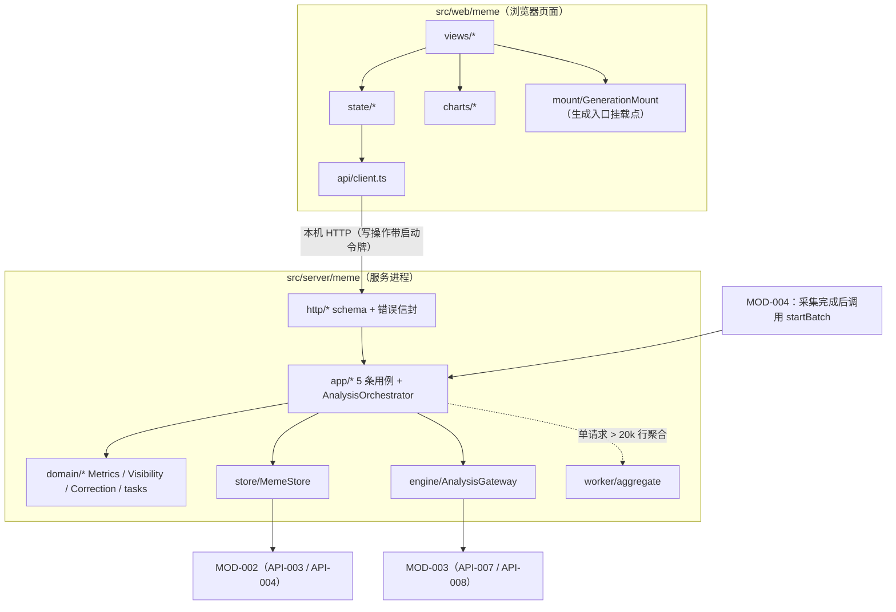
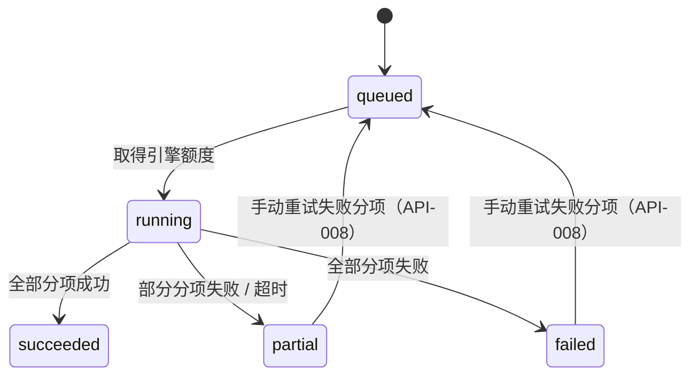

# MOD-005 —— 梗分析（模块一） 模块设计

> **状态**: reviewed
> **生成者**: 模块负责人按 `mod-000-template.md` 撰写（骨架由编排器按 `docs/prompt/run_pipeline.md` 步骤 4 建立）
> **上游**: `docs/design/modules.md`、`docs/design/api-contract.md`、`docs/design/data-model.md`、`docs/design/impl/high-level-design.md`
> **下游**: 无（叶子文档）
> **变更中**: —
> **最后更新**: 2026-09-12

<!-- 本文件属于实现层。修改必须走 design-doc-change skill（.github/skills/design-doc-change/SKILL.md）。 -->

## 1. 模块信息

| 项 | 值 |
| --- | --- |
| 模块 ID | `MOD-005` |
| 负责人 | — |
| 关联任务 | `TASK-012` ~ `TASK-017` |
| 涉及的契约 | 实现：`API-009` ~ `API-013`；持有：`DM-006` ~ `DM-009`；消费：`API-003`、`API-004`、`API-007`、`API-008` |
| 实现进度看板 | `docs/status/implementation.md` |

<!-- 负责人改动后，同步更新看板里对应的那一行。 -->

## 2. 职责与边界

模块职责、明确不负责项与禁止依赖方向：见 `docs/design/modules.md` 的 `MOD-005` 卡片。本文件不复述契约层正文，只写「模块内部怎么实现」。

- **实现范围**：实现 `API-009` ~ `API-013` 五条接口（服务端处理 + 浏览器侧视图与图表）；持有 `DM-006` ~ `DM-009` 的读写与派生计算；消费 `API-003`、`API-004`（存储）与 `API-007`、`API-008`（模型任务）。
- **实现侧硬边界**（均为契约层边界的落地，不新增约定）：
  - 代码不 import `MOD-006` / `MOD-007` / `MOD-008`；跨模块数据由 `MOD-004` 转交（`REQ-034`、`REQ-070`）。
  - 一切持久化读写经 `API-003` / `API-004`；模块内不出现数据库驱动、不触碰媒体目录。
  - 一切模型调用经 `API-007` / `API-008`；模块内不出现模型地址、凭据与 SDK 调用点。
  - 不产生第二组筛选控件（`REQ-004`、`REQ-049`）：筛选条件只作为入参接收与透传。
  - 「生成」入口只提供挂载点与上下文，不实现 G1 / G2 / G3 与生成历史（`REQ-034`、`TASK-037`）。

## 3. 内部结构

### 3.1 代码落点与子目录划分

单包结构下，本模块的全部代码落在两个目录；不在 `src/shared/` 新增跨模块约定。

**服务端 `src/server/meme/`**

| 子目录 / 文件 | 职责 | 约束 |
| --- | --- | --- |
| `index.ts` | 组装依赖（存储网关、引擎网关、时钟）并导出模块入口 | 不自行建连、不读配置文件 |
| `http/` | 5 条接口的 HTTP 绑定与入参 schema（`schemas.ts`） | 只做校验 + 错误信封映射，不含业务 |
| `app/` | 用例编排：5 个查询 / 改判处理器 + `AnalysisOrchestrator` | 唯一的业务编排层 |
| `domain/` | 纯函数域逻辑：`Metrics`（派生计算）、`Visibility`（可见性与合并折叠）、`TypeCatalog`（类型闭集与图例）、`Correction`（改判规则）、`tasks.ts`（任务定义与结果校验） | 无 IO、无 IO 类型依赖，可全量单测 |
| `store/` | 经 `API-003` / `API-004` 的读写适配：`MemeStore`、`mappers.ts`（`DM-006` ~ `DM-009` ↔ 内部 DTO）、`paging.ts`（分页读取与护栏） | 不 import 任何数据库库 |
| `engine/` | 经 `API-007` / `API-008` 的任务执行与重试：`AnalysisGateway`、`taskParams.ts` | 不 import 模型 SDK |
| `worker/` | `aggregate.ts`：大结果集聚合的 `worker_threads` 入口 | 不开库、不写盘，只收 / 回消息（详设 §1.1） |
| `constants.ts` | 本模块全部阈值与取值（§5.4 一张表） | 单一取值来源 |

**浏览器侧 `src/web/meme/`**

| 子目录 / 文件 | 职责 |
| --- | --- |
| `api/client.ts` | 5 条接口的调用封装（序列化、写操作携带启动令牌、请求取消、`dataEpoch` 过期丢弃） |
| `state/` | 数据获取 hooks：`useCloud` / `useCell` / `useLifecycle` / `useMine` / `useCorrection` |
| `views/` | `CloudView`（词云 + 等价表格）、`CellView`（梗单元，从词位置就地展开）、`LifecycleView`（条带 + 可复制表格） |
| `charts/` | `wordcloud.ts`（`echarts-wordcloud` 注册与 option）、`monthlyBar.ts`、`lifecycleStrip.ts` |
| `components/` | `TypeLegend`、`TermTooltip`、`EquivalenceTable`（虚拟滚动）、`EssenceList`、`VariantChips`、`CorrectionMenu`、`MineToggle` |
| `mount/` | `GenerationMount.tsx`：「生成」入口挂载点（只渲染外壳注入的 slot 与上下文） |

### 3.2 结构图



### 3.3 服务端关键接口（签名级）

```ts
// app/ —— 5 条契约接口的用例入口（出参与错误以契约条目为准）
queryCloud(input: CloudQueryInput): Promise<CloudOutput>              // API-009
queryCell(input: CellQueryInput): Promise<CellOutput>                 // API-010
queryLifecycle(input: LifecycleQueryInput): Promise<LifecycleOutput>  // API-011
applyCorrection(input: CorrectionInput): Promise<CorrectionOutput>    // API-012
queryMine(input: MineQueryInput): Promise<MineOutput>                 // API-013

// app/AnalysisOrchestrator —— 进程内编排入口（非 HTTP、非 API-###，见 §8 决策 5）
startBatch(cause: 'ingestDone' | 'manualRetry', scope: ScopeFilter): BatchHandle
retryItem(item: TaskItem, taskRef: string): Promise<void>

// domain/Metrics —— 纯函数，now 由调用方注入
computeCloudTerms(memes: MemeRow[], windowRecords: OccurrenceRow[], basis: SizeBasis, now: Date): CloudTerm[]
computeCellMetrics(meme: MemeRow, recent14d: OccurrenceRow[], now: Date): CellMetrics
computeLifecycle(rows: MemeWithMonths[], months: MonthRange): LifecycleRow[]
pickHighlights(rows: EssenceRow[]): { page: EssenceRow[]; truncated: boolean }   // 默认 3、展开 ≤ 20

// domain/Visibility —— 纯函数
resolveVisibility(memes: MemeRow[]): VisibilityIndex         // 折叠 + 排除（§5.3）
normalize(memeId: Id, index: VisibilityIndex): Id | null     // 合并链解析到根

// domain/Correction —— 纯规则
checkMerge(src: Id, target: Id, index: VisibilityIndex, memes: MemeRow[]): MergeCheck

// store/MemeStore —— 只经 API-003 / API-004；写批按 1000 行 / 2MB 拆批（详设 §3.2）
upsertEntities(type: EntityType, records: RecordDTO[]): Promise<WriteResult>
readAll(type: EntityType, filter: SharedFilter, hardCap: number): AsyncPageIterator<RecordDTO>
readAt(type: EntityType, filter: SharedFilter, timePoint: Date): Promise<RecordDTO[]>   // 单时间点窄窗（§8 决策 1）
```

### 3.4 浏览器侧关键接口

```ts
useCloud(): { data?: CloudOutput; empty: 'none' | 'noData' | 'filtered'; error?: ErrorEnvelope; refresh(): void }
useCell(memeId: Id): { data?: CellOutput; notFound: boolean; error?: ErrorEnvelope }
useLifecycle(months: MonthRange): { data?: LifecycleOutput; error?: ErrorEnvelope }
useMine(view: 'used' | 'participated'): { data?: MineOutput; error?: ErrorEnvelope }
useCorrection(): { submit(input: CorrectionInput): Promise<CorrectionOutput> }  // 成功后使相关 hooks 重取数
GenerationMount({ context }: { context: MemeGenerationContext }): ReactNode      // 只渲染外壳注入的 slot
```

### 3.5 状态机

**A. 分析批次（运行期状态；队列语义沿用详设 §1.3）**



批次按「任务类型 × 分批窗口」切成分项（item），每项携带 `taskRef`；只有 `succeeded` 的分项才落库（`API-003`），失败分项不留半成品。一条梗行的写入条件是「梗名 / 类型 / 解读」三项全部成功 → 一次写入 `DM-006` + 其 `DM-007` 记录（同批 = 同事务）。

**B. 纠正标记（`DM-006` 可变字段）**

| 当前 | 允许改判为 | 落库动作 |
| --- | --- | --- |
| 无 | 四类任一 | 写 `纠正标记`；合并另写 `合并目标`（解析到链末端根梗） |
| 任一 | 四类任一（后写覆盖先写；重放同值幂等） | 同上；由「不是梗 / 已合并至」改回可见类时恢复统计口径 |
| 不是梗 / 已合并至 | 允许覆盖 | 不提供「撤销」接口（`API-012` 无该入参） |

「合并到其他梗」写入前依次校验：目标存在 → 与本梗同群 → 非自环、非成环 → 解析链末端为可见梗；任一不满足 → `NOT_FOUND`（§6）。涉及「不是梗 / 已合并至」的改判同时把 `DM-008` 中该梗相关的边置 `已失效`。

### 3.6 并发与串行点

| 环节 | 并发语义 | 依据 |
| --- | --- | --- |
| 查询（`API-009` ~ `API-011`、`API-013`） | 读请求可并发；每请求用不可变快照，无共享可变状态 | 详设 §1.2（读不排队） |
| 改判（`API-012`） | 写路径串行（`MOD-002` 单写者）；同梗并发改判按到达序覆盖 | 详设 §1.2（库写入） |
| 分析批次分项 | 占用 `MOD-003` 的模型任务额度（默认 4）；模块不另设并发上限 | 详设 §1.2 / §7 |
| 大结果集聚合 | 单请求预估记录数 > 20 000 → 派 `worker_threads`；否则主线程分批（≤ 2 000 行 / 批，批间让出事件循环） | 详设 §1.1（> 50 ms 同步计算禁令） |
| 派生重算（写侧） | 只发生在分项落库前与改判后，随 `API-003` 写入提交；无后台就地改库 | 详设 §3.2 |
| 采集后触发 | `MOD-004` 调 `startBatch`（HLD 决策 9）；重复触发按「读库查缺块」判定，缺块才重算，不写进度台账 | 详设 §2.4 |

## 4. 接口实现说明

前置口径：出参字段与错误集合见 `api-contract.md` 对应条目；全部入参先经 `http/schemas.ts`（zod）校验——枚举闭集、必填项、页码 / 每页条数 ≥ 1、月份范围上限（§5.4）；非法 → `INVALID_INPUT`，不进入业务层（详设 §4.4）。时间语义：**事件时间一律取来源消息发送时间**；仅「距今 / 热度状态 / 周环比」使用服务端当前时刻（经可注入 `Clock`，测试可固定）。

**API-009 查询梗词云**（`queryCloud`）

- 线程语义：主线程；读取 / 聚合超阈值时下沉 `worker/aggregate`（worker 只接收消息数组）。
- 步骤：① 经 `API-004` 读 `DM-006`（关键词匹配由 `MOD-002` 按模块一口径处理）；② 按字号口径取数——`累计出现次数` 直用落库值，`指定时间窗内出现频次` 用一次全局筛选时间范围的 `DM-007` 读取复用于同批全部梗（时间窗为空 = 全量，等同累计口径）；③ `Metrics` 计算字号值与截断；④ 组装梗条目 + 图例（类型 → 颜色 + 文字标签）+ 来源引用。
- 副作用：无写入；可重入（相同入参 + 相同快照 → 相同结果）。
- 空态：忽略筛选时 `DM-003` 为空 → `NO_DATA`；有数据但筛选无命中 → `EMPTY_RESULT`（§6）。
- 性能假设：服务端 ≤ 400 ms（详设 §5.2 的 800 ms 预算内）；词云渲染条目 ≤ 200，超出返回截断标记与总数（表格视图全量分页，默认 100 / 页、上限 500）。

**API-010 查询梗单元**（`queryCell`）

- 步骤：按标识经 `Visibility` 归一化与可见性判定 → 读梗行、14 天窗口记录（周环比）、`DM-008` 生效边、`DM-009` 行 → 对首现 / 最近 / 精华各引用以「单时间点窄窗」读取 `DM-003`（`readAt`，窗宽 ≤ 2 s + 一次容错扩窗）→ `Metrics` 计算读取时字段 → 组装全部区块。
- 副作用：无写入。可重入：只读；`NOT_FOUND` 覆盖「已删除 / 已合并 / 被判不是梗」三类不可直访情形（`AC-045`）。
- 缺块与状态：装配依赖缺失（精华来源消息已删、变体边悬空）且对应分项失败 / 超时 → `ANALYSIS_FAILED` / `TIMEOUT`（`retryable=true`，`context.taskRef` 携带任务引用）；分项进行中 → 正常返回，缺块以空集合返回（不杜撰数据；外壳经 SSE 推进度）。查询不为首次加载等待模型任务（HLD 决策 9）。
- 媒体预览：响应只携带 `媒体引用` 标识，预览经外壳转交的媒体通道（HLD 决策 8），本模块不做文件服务。
- 性能假设：服务端 ≤ 200 ms；精华默认 3 条、展开上限 20 条（超出返回截断标记）。

**API-011 查询生命周期视图**（`queryLifecycle`）

- 步骤：读 `DM-006`（生命周期结构与月度分布已落库）→ 按月份范围裁剪 → 逐梗条带 + 当月领跑梗 → 排序（最近调用时间降序，并列按累计次数降序）→ 截断（≤ 100 行，返回截断标记与总数）。
- 口径常量：月度强度 = 当月次数 ÷ 该梗峰值月次数（0–1，前端映射顺序色阶）；当月领跑梗并列时全部标注；无数据 → `NO_DATA`。
- 副作用：无。可重入：只读。性能假设：服务端 ≤ 500 ms。

**API-012 提交纠正改判**（`applyCorrection`）

- 步骤：schema 校验（类型闭集；合并目标条件必填）→ 读梗行与范围内梗集合 → `checkMerge`（合并分支）→ 组装 `DM-006` 更新（必要时含 `DM-008` 边置失效）→ 一次 `API-003` 调用提交（同批 = 同事务）→ 重读并返回最新梗数据（合并时返回归一化后的目标梗数据 + 源梗改判信息）。
- 幂等 / 重入：重复提交同一改判结果一致；不同改判后者覆盖前者；无部分写入（两步同批）。
- 性能假设：无模型调用，一次存储往返。
- 写操作后前端使相关 hooks 失效并重取数（`REQ-008` 的「立即生效」＝下一次查询即反映；模块不做跨请求缓存）。

**API-013 查询「我相关」梗**（`queryMine`）

- 步骤：经 `API-004` 读 `DM-004` 取 Me 标识（缺失 → `IDENTITY_NOT_READY`）→ 读 `DM-007` 子集（筛选带 `身份`）+ 读 `DM-003` 子集（筛选带 `身份`）→ 视角分组：`我用过的` = 记录发言成员为 Me；`我参与消息里的` = 记录来源消息的提及成员含 Me → 汇总梗集合并附来源引用。
- 两视角不互斥：同时命中的梗在两个视角都出现（`AC-017` 未要求互斥）。
- 副作用：无。可重入：只读。空结果 → `EMPTY_RESULT`。性能假设：服务端 ≤ 300 ms；结果截断 ≤ 200 条（表格可翻页）。

## 5. 数据与状态

### 5.1 内部结构与 `DM-###` 的映射

| 内部结构 | 契约实体 | 产生 / 维护者 | 说明 |
| --- | --- | --- | --- |
| `MemeRow` | `DM-006` | `AnalysisOrchestrator` 落库；`Correction` 只改 `纠正标记` / `合并目标` | 一个梗一条，字段与契约字段一一对应 |
| `OccurrenceRow` | `DM-007` | 识别分项落库 | 只增不改；`是否「我相关」` 在落库时按并集口径计算 |
| `VariantEdge` | `DM-008` | 变体分项落库；改判时置 `已失效` | 只连接同群梗 |
| `EssenceRow` | `DM-009` | 精华分项落库 | 重跑整批替换；`展示序号` 决定顺序 |
| `CloudTerm` / `CellMetrics` / `LifecycleRow` | 视图结构（不落库） | `domain/Metrics` 纯函数 | 请求内构造，随响应丢弃 |
| `ScopeIndex` / `VisibilityIndex` | 请求内索引 | `Visibility` / `paging` | 按标识的 Map，请求结束即释放 |
| `BatchState` | 运行期状态 | `AnalysisOrchestrator` | 批次与分项状态 + `taskRef`；进程退出即失 |

不新增持久化字段与实体；§5.4 的常量属于计算 / 渲染口径，不改变契约实体结构。

### 5.2 落库字段与读取时求值

| 字段组（`DM-006`） | 落库 | 读取时处理 |
| --- | --- | --- |
| `梗名` / `类型` / `解读` | 「梗名 / 类型 / 解读」三分项全部成功后一次写入（不出现缺字段半成品行） | 直读 |
| `首现时间` / `首现来源群` / `最近调用时间` / `累计出现次数` | 由 `Metrics` 从 `DM-007` 重算后随写入提交 | 直读 |
| `月度分布` / `生命周期` / `梗王` / `主要使用者` | 同上 | 直读；月度分布按查询月范围裁剪 |
| `距今` / `热度状态` / `周环比` | 随写入按写入时刻落库（满足字段非空） | 对外响应一律按读取时刻重算，库值只作对照 |

### 5.3 可见性与合并折叠（`domain/Visibility`）

| `纠正标记` | 词云 / 表格 | 生命周期 | 我相关 | 单元直访 | 变体关系 | 梗王区块 | 统计 |
| --- | --- | --- | --- | --- | --- | --- | --- |
| 无 | ✔ | ✔ | ✔ | ✔ | ✔ | ✔ | 自身记录 |
| 不是梗 | ✖ | ✖ | ✖ | `NOT_FOUND` | 置 `已失效` | —（不可见） | 保留在库（改判记录可查） |
| 不感兴趣 | ✖ | ✖ | ✖ | ✔（显示改判标记） | 保留 | ✔ | 自身记录 |
| 已合并至 | ✖ | ✖ | ✖ | `NOT_FOUND` | 置 `已失效` | —（并入目标） | 计入目标（折叠） |
| 梗王标注有误 | ✔ | ✔ | ✔ | ✔ | ✔ | 降级为改判提示 | 自身记录（口径不变） |

折叠算法：对范围内 `DM-006` 行构建 `source → root` 映射（沿 `合并目标` 逐跳解析，跳跃上限 32，防御性截断并记 `warn`）；聚合与展示单位均为 root；root 为「不是梗」时整条链从视图排除，直访任一链成员返回 `NOT_FOUND`。

### 5.4 取值常量（`constants.ts`，全模块唯一来源）

| 常量 | 值 | 用途 / 出处 |
| --- | --- | --- |
| `HEAT_ACTIVE_DAYS` / `HEAT_DECAY_DAYS` | 7 / 30 | 热度三档分界（`DM-006`、`REQ-028`） |
| `TREND_WINDOW_DAYS` | 7 | 周环比窗口（`REQ-028`） |
| `TREND_ZERO_BASE` | 上期 0 且本期 > 0 → 「新增」；两期都 0 → 0（显示「—」） | 周环比零基处理 |
| `PEAK_TIE_BREAK` | 取最早月份 | 峰值月并列 |
| `TOP_USERS` | 5 | 主要使用者 = 次数前 5（并列按成员标识稳定排序） |
| `CALENDAR_DAY_DIFF` | 本地自然日差（当天 = 0） | `距今`、`活跃天数` |
| `WORDCLOUD_MAX_TERMS` | 200 | 词云渲染上限；超出返回截断标记 |
| `WORDCLOUD_SIZE_RANGE` / 映射 | 14–72 px / `sqrt` 压缩 | 字号 = 频率的单调映射（`REQ-020`） |
| `TABLE_PAGE_SIZE` / `TABLE_PAGE_MAX` | 100 / 500 | 等价表格分页（详设 §5.3） |
| `LIFECYCLE_MAX_ROWS` | 100 | 生命周期条带行上限 |
| `ESSENCE_DEFAULT` / `ESSENCE_MAX` | 3 / 20 | 精华消息默认与展开上限（`REQ-032`） |
| `READ_HARD_CAP` / `AGG_WORKER_THRESHOLD` | 20 000 行 | 单请求读取硬上限；超过即派 worker + 截断标记 |
| `MONTH_RANGE_MAX` | 60 个月 | 生命周期月份范围上限（schema 护栏） |
| `TYPE_CLOSED_SET` | 3 类闭集 | 类型闭集与图例（`REQ-020`）；越界输出按任务失败处理（§6） |

**不完整月份判定**（`REQ-029` 的实现口径）：月 M 标注「不完整」当且仅当——① M = 当前自然月；或 ② M = 数据覆盖窗口起始月且该月起始日 > 1；或 ③ M = 数据覆盖窗口结束月且结束日 < 该月末日。数据覆盖窗口 = 全局筛选范围内 `DM-003` 的最早 / 最晚发送时间，一次查询内只读一次并复用。

### 5.5 内存状态与一致性

- 无跨请求可变缓存：派生数据即库内数据，改判落库后下一次查询立即反映（`REQ-008`）；常量与类型目录为进程级不可变。
- 每请求一次「读 + 关」的不可变快照；列表与统计同源（详设 §3.3）。响应由外壳统一封装携带 `dataEpoch`，前端丢弃过期响应。
- `BatchState` 仅存在于运行期；进程重启后由「读库查缺块」恢复待办（§3.6）。

## 6. 错误处理

错误统一经外壳信封 `{ code, message, retryable, scope, context }`；`code` 只取契约层既有标识（不新增，详设 §2.2），`requestId` 透传进日志。

| 触发情形 | 标识 | 可重试 | 使用者可见动作 |
| --- | --- | --- | --- |
| 忽略筛选时 `DM-003` 为空（`API-009` / `API-011`） | `NO_DATA` | 否 | 空态 + 引导完成首次更新（`AC-079`） |
| 有数据但筛选无命中（`API-009` / `API-013`） | `EMPTY_RESULT` | 否 | 空态 + 一键清除筛选 |
| 梗不存在 / 已删除 / 已合并 / 被判「不是梗」（`API-010`） | `NOT_FOUND` | 否 | 提示 + 返回上一视图（`AC-045`） |
| 合并目标不存在、跨群、自环、成环、链端非可见梗（`API-012`） | `NOT_FOUND` | 否 | 保留原状态，换一个目标（`AC-064`）；契约未给其它标识，原因写 `message` / `context` |
| 枚举越界、缺必填项、月份范围超上限（各接口） | `INVALID_INPUT` | 否 | 修正输入并给出可取值（schema 层拒绝） |
| Me 标识未就绪（`API-013`） | `IDENTITY_NOT_READY` | 是（手动） | 提示 + 手动重试（`AC-019`） |
| 装配缺块且分项已失败 / 超时（`API-010`） | `ANALYSIS_FAILED` / `TIMEOUT` | 是 | 提示 + 重试（`context.taskRef`）；已缓存内容仍可浏览（`AC-080`） |
| 分析分项失败 / 超时（批次） | `ANALYSIS_FAILED` / `TIMEOUT` | 是（自动 + 手动） | 分项提示 + 重试，透传不吞 |
| 模型输出越界（类型不在闭集）或来源引用缺失 | `ANALYSIS_FAILED` | 是 | 该分项不落库，重试 |
| 读路径 worker 异常退出 | `ANALYSIS_FAILED` | 是 | 主线程分批重试一次后仍失败才上抛 |
| `API-003` / `API-004` 失败 | `STORAGE_UNAVAILABLE` | 是 | 提示 + 重试，不静默失败 |

- 自动重试：仅后台分析分项适用（详设 §2.3 的统一退避，最多 3 次）；查询与改判为前台动作，失败即提示、不静默重试。
- 不可恢复情形：存储持续不可用（清理磁盘 / 检查目录后重试）；模型凭据错误（引导设置页，属 `MOD-003` 与外壳口径）；合并成环（直接拒绝，无替代语义）。

## 7. 测试要点

口径：交付 = typecheck + 构建通过 + 单元测试全绿；只测本模块，`MOD-002` / `MOD-003` 全 mock（不真调存储与模型）；时间经注入 `Clock` 固定；ECharts / `echarts-wordcloud` 在 jsdom 下 mock，图表只做 option 结构断言。

| 测试面 | 关键分支 | 落点 |
| --- | --- | --- |
| `domain/Metrics` | 热度四边界（7 / 8 / 30 / 31 天）；自然日差（同日 = 0）；周环比三态（正 / 负 / 零基）；峰值并列取最早月；梗王并列与占比复算；月度分布补 0；不完整月份三类判定 | 纯函数单测 |
| `domain/Visibility` | 五类标记 × 六列矩阵；合并折叠一跳 / 多跳 / 链端非梗；跳跃上限防御 | 纯函数单测 |
| `store/paging` | 分页拼接与硬上限截断；单时间点窄窗读取；`STORAGE_UNAVAILABLE` 透传；写批 1000 行拆批 | mock `API-003/004` |
| `app/*` 查询 | `NO_DATA` / `EMPTY_RESULT` 判定分界；`NOT_FOUND` 三情形；截断标记与总数；图例 ≤ 3 类 | mock 存储 |
| `app/AnalysisOrchestrator` | 分项拆分与 `partial` 汇总；失败分项经 `API-008` 重试后落库；输出越界不落库；重复触发的缺块判定 | mock `API-007/008` |
| `mount/GenerationMount` | 只渲染注入 slot；上下文含梗标识 / 解读 / 变体 / 精华图片引用；不 import 任何生成接口 | 组件测试 + 静态断言 |
| 负向护栏 | 白名单断言：无情感 / 立场字段、无梗王之外成员画像、无 G4 路由、无自动合并路径 | 静态断言 + schema 单测 |

**`AC-###` 逐条对应**

| 用例 | 测试点 |
| --- | --- |
| `AC-017` | 两视角谓词（发言者为「我」 / 提及含「我」）与来源引用 |
| `AC-019` | Me 缺失 → `IDENTITY_NOT_READY`；就绪后重试成功 |
| `AC-021` | 首现 / 最近 / 精华 / 梗王四类引用均可解析到消息 |
| `AC-022` | 改判「不是梗」后同快照对比：词云与统计不再包含该梗 |
| `AC-024` | 万条级 fixture 下服务端响应预算达标（性能用例，三次取中位） |
| `AC-041` | 字号与频率正相关；颜色 ≤ 3 类；图例 + 文字标签 |
| `AC-042` | 默认累计口径；切时间窗口径后频率值 = 表格值 |
| `AC-043` | 表格与词云同集合同频率；词云截断时表格仍全量 |
| `AC-044` | 点击词返回对应梗（标识不串位） |
| `AC-045` | `NOT_FOUND` 三情形（删除 / 合并 / 不是梗） |
| `AC-046` | 首现时间布局的词序与首现日期字段 |
| `AC-047` | 悬停四项字段齐全 |
| `AC-048` | 条带行结构、强度值、当月领跑梗、与表格一致 |
| `AC-049` | 解读三要素字段齐全 |
| `AC-050` | 首现 / 最近调用时间与来源引用 |
| `AC-051` | 累计次数与周环比复算（14 天夹具） |
| `AC-052` | 7 / 8 / 30 / 31 天四边界 |
| `AC-053` | 月度分布数值与表格一致 |
| `AC-054` | 不完整月份三类判定与例外 |
| `AC-055` | 活跃天数 = 自然日跨度（同日 = 0） |
| `AC-056` | 梗王次数与占比复算 |
| `AC-057` | 并列梗王全部列出 |
| `AC-058` | 默认 3 条、展开、媒体类型、上下文引用 |
| `AC-059` | 剩余不足 3 条按实际返回（不补位） |
| `AC-060` | 变体列表与切换（目标标识正确） |
| `AC-061` | 改判后 `DM-008` 置 `已失效`，不再出现在变体列表 |
| `AC-063` | 四类改判提交成功；响应反映最新状态 |
| `AC-064` | 目标不存在 → `NOT_FOUND`，原标记与统计不变 |
| `AC-065` | 「不是梗」后从词云 / 统计消失、改判记录保留 |
| `AC-075` | 输出与图表白名单中无情感维度 |
| `AC-076` | 无自动合并路径；跨群目标被拒 |
| `AC-077` | 输出中无梗王之外的成员画像 |
| `AC-078` | 路由表中无 G4 入口 |
| `AC-079` | `NO_DATA` 空态（词云与生命周期） |
| `AC-080` | 失败 / 超时返回与重试；缓存可浏览由前端用例覆盖 |

邻接但不在本模块测试范围：`AC-023`（`MOD-008`）、`AC-035` / `AC-040`（外壳统一呈现与并列交付）、`AC-036` ~ `AC-038`（`MOD-003` / `MOD-001`）、`AC-062`（挂载侧 `TASK-037`）。

## 8. 关键决策与取舍

### 决策 1 —— 读取路径：共享筛选 + 模块内索引，不依赖按标识直取

- **背景与约束**：`API-004` 的入参只有实体类型 + 共享筛选条件 + 分页；本模块需要按梗标识、消息标识定位记录，且结论必须可回溯（`REQ-007`）。
- **候选方案与取舍**：① 要求「按标识直取」——契约未定义，需回流，超出本文件权限；② 读量用群 / 时间范围收敛，模块内建临时标识索引，引用回读用窄窗；③ 全量读入内存——违反详设 §5.4 查询护栏。
- **决定**：②；单请求读量受 `READ_HARD_CAP` 与分页护栏约束，超出走 worker + 截断标记。
- **后果**：读量与筛选范围成正比（单机单用户规模可接受）；引用回读用「单时间点窄窗 + 一次容错扩窗」避免全量扫描。本设计不改 `API-004` 语义；若日后确需按标识直取，属契约级优化，另行回流。
- **上游影响**：无

### 决策 2 —— 派生指标：与时刻无关的落库，与时刻相关的读取时求值

- **背景与约束**：`DM-006` 的派生字段中，「距今 / 热度状态 / 周环比」依赖「当前时刻」，全部落库会随时间失真；全部读取时计算则需扫原始记录。
- **候选方案与取舍**：① 全落库 + 定时刷新——需后台常驻，与 HLD 决策 1 冲突；② 全部读取时计算——超服务端预算；③ 分层：与时刻无关的落库；与时刻相关的按写入时刻落库、读取时按注入时钟重算。
- **决定**：③；边界口径（自然日差、周环比零基、峰值并列、不完整月份）在 §5.4 固化为唯一取值来源。
- **后果**：写入侧只在分项落库 / 重算时写值；读取侧无随机性、可测；「同日 = 0」等口径写进测试夹具。
- **上游影响**：无

### 决策 3 —— 纠正改判：读路径折叠 + 可见性排除，不改写出现记录

- **背景与约束**：`DM-006` 的 `纠正标记` / `合并目标` 是可变字段；`DM-007` 是统计唯一基础且只增不改；改判须立即生效（`REQ-035`）且记录保留（`AC-065`）。
- **候选方案与取舍**：① 合并时把来源的出现记录批量改指向目标——改写历史、目标再被改判时需回滚；② 读路径折叠：查询时解析合并链、聚合到根，来源进不可见集，改判只写 `DM-006`（+ `DM-008` 状态）；③ 仅隐藏来源、不合并统计——与「合并」语义不符。
- **决定**：②；矩阵见 §5.3。
- **后果**：历史与可回溯性保留；目标统计 = 自身 + 链上来源；链端不可见时整支排除；直访已合并 / 不是梗的梗 → `NOT_FOUND`（`AC-045`）；写入面最小（两个字段）。
- **上游影响**：无

### 决策 4 —— 词云渲染上限与等价表格容量

- **背景与约束**：`REQ-020` ~ `REQ-024` 要求词云可读且表格等价（`REQ-021` 的「全部」以表格为准）；详设 §5.3 / §5.4 要求 top-N 截断 + 截断标记 + 分页护栏；`REQ-010` 首屏 < 2s。
- **候选方案与取舍**：① 词云渲染全量——节点过多拖垮渲染；② 词云截断（200）+ 截断透明化 + 表格分页全量（100 / 页、上限 500）；③ 服务端统一只返回 top-N——表格也少数据，违背等价口径。
- **决定**：②；截断依据 = 当前布局的排序口径；截断标记与总数随响应返回。
- **后果**：词云与表格同口径不同容量（差异明示，不偷偷少数据）；`AC-043` 以表格行集判定。
- **上游影响**：无

### 决策 5 —— 分析编排入口与失败语义

- **背景与约束**：HLD 决策 9 定「采集完成后外壳后台按模块触发、打开模块先渲染缓存」；`api-contract.md` §1.1 已把 `MOD-004` 的编排契约留给实现层承接；本模块 5 条契约接口均为查询 / 改判，不含触发。
- **候选方案与取舍**：① 只靠查询惰性触发——首次打开可能长时间等待，与 HLD 决策 9 不符；② 导出进程内编排入口 `startBatch` 供外壳调用，查询保持纯读；③ 新增一条 `API-###`——需回流改契约。
- **决定**：②（与 HLD 决策 9 的「后台批次为主 + 惰性兜底」一致，兜底表现为查询返回缓存 / 空态与重试入口）。
- **后果**：模块间多一条进程内入口，形态与 `api-contract.md` §1.1 的编排口径一致，不进 HTTP 契约；批次幂等按「读库查缺块」判定，不新增持久化台账。
- **上游影响**：无

### 决策 6 —— 「生成」入口挂载点

- **背景与约束**：`REQ-034` 的入口侧归 `MOD-005`，生成逻辑归 `MOD-008`，挂载编排归 `TASK-037`；业务模块互不依赖。
- **候选方案与取舍**：① 本模块实现按钮与面板——越界；② 本模块只渲染容器 slot，上下文交给外壳注入；③ 直接引用 `MOD-008` 组件——违反禁止依赖方向。
- **决定**：②；`GenerationMount` 只接收并透出上下文（梗标识、解读、变体、精华图片引用），不发起任何生成请求。
- **后果**：挂载行为在 `AC-062` 由外壳侧验收；本模块测试只断言 slot 与上下文完整性。
- **上游影响**：无

### 决策 7 —— 前端图表与等价视图

- **背景与约束**：HLD 决策 2 定 React + ECharts（含 `echarts-wordcloud`）；`REQ-023` 要求「按首现时间」布局的词序可靠；`REQ-021` / `REQ-025` 要求等价表格。
- **候选方案与取舍**：① 两种布局都用 `echarts-wordcloud`——随机化布局无法保证词序（不可测）；② 词云用 `echarts-wordcloud`，时间布局用确定性分行布局（字号仍映射频率），表格用普通组件 + 虚拟滚动；③ 全部自研——成本最高。
- **决定**：②；颜色与图例取自服务端响应，前端不自建第二套口径；同屏表格与图表取同一快照。
- **后果**：两种布局共享数据与字号映射，词序可断言；图表只负责呈现。
- **上游影响**：无

### 决策 8 —— 「我相关」两视角的判定来源

- **背景与约束**：`AC-017` 的两个视角分别对应「发送者为『我』」与「来源消息提及含『我』」；`DM-007` 落库的是并集布尔值，无法单独反推第二个谓词。
- **候选方案与取舍**：① 两视角返回同一并集——与 `AC-017` 不符；② 读取时分别求值（视角一用 `DM-007.发言成员`，视角二用 `DM-003.提及成员`，两批读取都带 `身份` 筛选）；③ 给 `DM-007` 增字段——契约变更，需回流。
- **决定**：②；两视角不互斥，同时命中的梗都出现。
- **后果**：该接口读量大于其它查询（两批分页 + 内存求交），受同一护栏与 worker 规则约束。
- **上游影响**：无

## 9. 未决问题

无。实现层取值（词云 top-N、表格分页、字号区间、精华展开上限、月份范围、不完整月份判定、周环比零基处理、合并折叠口径）均在本文件定死；契约层未定项已按 `docs/design/modules.md`、`docs/design/data-model.md` 与各阶段裁定落实，无待确认占位。
