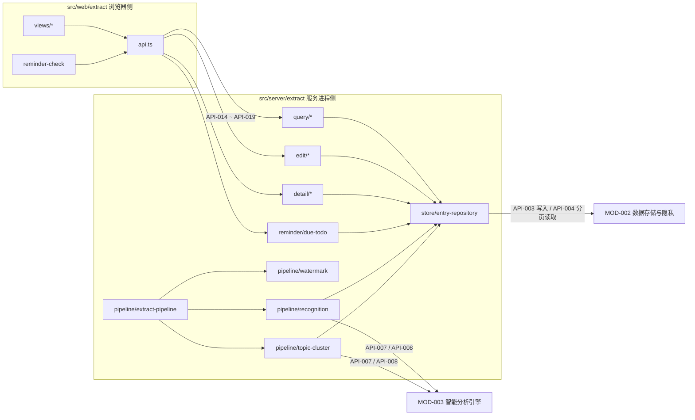

# MOD-006 —— 信息提取（模块二） 模块设计

> **状态**: reviewed
> **生成者**: 模块负责人按 `mod-000-template.md` 撰写（骨架由编排器按 `docs/prompt/run_pipeline.md` 步骤 4 建立）
> **上游**: `docs/design/modules.md`、`docs/design/api-contract.md`、`docs/design/data-model.md`、`docs/design/impl/high-level-design.md`
> **下游**: 无（叶子文档）
> **变更中**: —
> **最后更新**: 2026-09-12

<!-- 本文件属于实现层。修改必须走 design-doc-change skill（.github/skills/design-doc-change/SKILL.md）。 -->

## 1. 模块信息

| 项 | 值 |
| --- | --- |
| 模块 ID | `MOD-006` |
| 负责人 | — |
| 关联任务 | `TASK-018` ~ `TASK-021` |
| 涉及的契约 | 实现：`API-014` ~ `API-019`；持有：`DM-010`；消费：`API-003`、`API-004`、`API-007`、`API-008` |
| 实现进度看板 | `docs/status/implementation.md` |

<!-- 负责人改动后，同步更新看板里对应的那一行。 -->

## 2. 职责与边界

职责与「明确不负责」项见 `docs/design/modules.md` 的 MOD-006 卡片与 `api-contract.md` 中 `API-014` ~ `API-019` 的声明，本文件不复述；实现层补充的边界口径如下。

- 持久化只经 `API-003` / `API-004`：`MOD-002` 是唯一写者与读底座，本模块不打开库文件、不另存任何持久副本。
- 模型任务只经 `API-007` / `API-008`：本模块不直接对接模型服务，也不自建第二套失败 / 超时 / 重试语义（延用详设 §2 的统一口径）。
- 数据面筛选一律取自全局筛选条件（`REQ-049` 的落点）：视图层不渲染第二组群 / 时间 / 关键词控件；身份字段对本模块无意义，收到即显式忽略（`REQ-006` 的模块二口径）。
- 与 `MOD-005` / `MOD-007` / `MOD-008` 无编译期与运行期依赖；消息详情中的兴趣提示由 `MOD-004` 另行组装（`REQ-070`），本模块只提供详情本体。
- 无后台常驻：服务侧不注册任何调度；提醒检查由浏览器侧在使用应用期间发起（`REQ-046`）。

## 3. 内部结构

### 3.1 代码目录

按已确认的单包结构，本模块代码分两处；子目录划分理由见下。

```
src/server/extract/            # 业务逻辑，跑在 Node 服务进程
  index.ts                     # 装配：向外壳注册 6 条 API 的服务端实现
  constants.ts                 # 识别类型基线九类、优先级闭集、分页与上限参数（唯一取值来源）
  pipeline/                    # 批次管线：全模块唯一发起模型任务的地方
    extract-pipeline.ts        #   批次编排：窗口 → 识别 → 抽取 → 聚类 → 落库 → 汇总
    recognition.ts             #   识别与抽取：任务参数构造、结果校验、人物要素映射
    topic-cluster.ts           #   主题聚类与命名（既有主题复用、粒度参数）
    watermark.ts               #   增量水位推导与重叠窗口（见 §5.2）
  store/
    entry-repository.ts        # 全部读写封装：只调 API-003 / API-004，含分页与筛选组装
  query/
    entry-query.ts             #   API-014：时间轴 / 归档（含分组）
    notify-query.ts            #   API-015：通知总览四维度分组
  edit/
    entry-edit.ts              #   API-016 / API-017：主题、优先级、待办状态
  reminder/
    due-todo.ts                #   API-018：到期计算 + 会话级提醒去重
  detail/
    message-detail.ts          #   API-019：heading / 正文组装（来源消息批量取回）

src/web/extract/               # 视图，跑在浏览器侧（React）
  api.ts                       # 对 6 条 API 的调用封装（写操作带启动令牌头）
  store.ts                     # 视图状态：当前视图、分页游标、加载态
  reminder-check.ts            # 页面内提醒定时器（默认 60 s；详设 §1.2）
  views/                       # timeline / archive / notifications / todos / detail 五个视图
  components/                  # 条目卡片、分组头、主题与优先级编辑、提醒气泡
```

划分理由：`pipeline/` 与查询 / 编辑 / 提醒路径分开 —— 前者是唯一会发起模型任务的路径（失败与重试语义都收敛在这里），后者是纯读写路径（不排队、不被任务阻塞，详设 §1.1 与决策 9）；`store/` 是全模块唯一的数据出口，保证「不绕开 MOD-002」。

### 3.2 结构图



### 3.3 关键接口（签名级）

服务侧（`src/server/extract/`）：

```ts
// constants.ts —— 闭集与参数的唯一取值来源
RECOGNITION_TYPES = ['群公告','@所有人','接龙','投票','报名','缴费','会议','活动','截止日期'] // 基线九类，可加项扩展
PRIORITIES = ['高','中','低']        // 三档闭集；默认「中」
PAGE_SIZE_DEFAULT = 100              // UI 默认页（详设 §5.3）
PAGE_SIZE_MAX = 500                  // 单页上限；越界 → INVALID_INPUT
LIST_CAP = 2000                      // 单次响应条目总数显式上限（通知总览跨组合计；详设 §5.4）

// pipeline/extract-pipeline.ts
class ExtractPipeline {
  run(window: ExtractWindow): Promise<BatchResult>          // 采集成功后由外壳触发
  retry(scope: GroupScope | TaskRef): Promise<BatchResult>  // 分项重试；任务引用交 API-008
}
interface BatchResult { counts; failures: { group; code; taskRef }[] }

// query/entry-query.ts
queryEntries(q: { filter: GlobalFilter; page?: PageInput }): Promise<EntryListPage>  // API-014
groupByTopic(entries: EntrySummary[]): TopicGroup[]     // 归档（主题维度）
groupByMonth(entries: EntrySummary[]): MonthGroup[]     // 归档（时间维度）

// query/notify-query.ts
queryNotifications(q: { filter: GlobalFilter; dimension: '来源'|'类型'|'优先级'|'待办'; page?: PageInput }): Promise<NotifyGroupPage>  // API-015

// edit/entry-edit.ts
updateEntryAttr(q: { entryId; topic?: string; priority?: Priority }): Promise<EntryDetail>  // API-016
setTodoState(q: { entryId; todoState: '完成'|'忽略' }): Promise<TodoState>                 // API-017

// reminder/due-todo.ts
queryDueTodos(q: { now: Timestamp }): Promise<DueTodo[]>                 // API-018
pickNewBubbles(list: DueTodo[], seen: Set<EntryId>): DueTodo[]           // 会话级去重，不落库

// detail/message-detail.ts
queryMessageDetail(q: { entryId }): Promise<MessageDetail>               // API-019
```

浏览器侧 `api.ts` 暴露与上表一一对应的 6 个函数；`views/` 各视图只消费这 6 个函数，不自行拼请求。

`PageInput`（页码 / 每页条数）与随结果返回的分页信息，是本模块对详设 §5.3 / §5.4 护栏的实现层落实：契约表格未列该字段，缺省调用（不传）返回第一页，行为与契约声明兼容（见 §8 决策 4）。

### 3.4 并发与串行点

- 读路径（`API-014` ~ `API-016` 查询侧、`API-018`、`API-019`）不进任何队列，与模型任务队列解耦：任务失败 / 超时 / 排队不影响已缓存内容的浏览（详设决策 9）。
- 写路径全部经 `entry-repository` → `API-003`，由 `MOD-002` 单写者串行化；本模块不持有写锁，不存在本模块内部的写冲突面。
- 管线同一时刻只跑一批：进程内一把批次锁；批次运行期间的新触发请求顺延到下一批（只保留最新一次，不堆积）。
- 批内按群分片，子任务并发交给 `MOD-003` 的信号量排队（默认 4，详设 §7）；本模块不自建并发池。
- `reminder-check` 为浏览器侧定时器：上一次请求未返回则跳过本次（防重入叠加）；页面关闭即停。
- 主线程单次同步计算 ≤ 50 ms（详设 §1.1）：详情正文超过 200 条来源消息时改由 worker 组装（§4 · API-019）。

## 4. 接口实现说明

总则：查询为主线程异步、可重入、无副作用；写入一律经 `API-003` 落库后才返回；模块不持有条目级权威缓存（§8 决策 6），因此不存在「写完忘失效」的路径。

### API-014 查询提取条目（`query/entry-query.ts`）

- 流程：组装筛选（群 / 时间范围 / 关键词；身份字段显式剔除）→ 经 `API-004` 按「提取条目」读取 → 按排序时间倒序（§5.2）→ 分页 → 归档分组在结果页上完成。
- 分页：默认 1 / 100；页码 < 1 或每页 > 500 → `INVALID_INPUT`；响应携带分页信息与截断标记（详设 §5.4）。
- 关键词：只经 `API-004` 执行一次（§8 决策 5），模块内不做二次过滤。
- 空态区分：无任何条目 → `NO_DATA`；筛选命中 0 条 → `EMPTY_RESULT`。
- 性能假设：首屏只取一页；响应不含来源消息正文（详情懒加载）；服务端预算 ≤ 800 ms（详设 §5.2）。
- 归档分组：时间维度默认按自然月分组（组头 = 月份 + 条目数），主题维度按主题值分组（组头 = 主题 + 条目数）；与时间轴消费同一份条目数据。

### API-015 查询通知总览（`query/notify-query.ts`）

- 流程：读路径同 `API-014`；按浏览维度分组后返回组头（组名 + 计数，顺序固定）+ 组内条目（排序时间倒序）。
- 组内分页：默认每组第一页 50 条；带 `page` 时返回各组第 k 页；组内截断标记与组内总数随组头返回；单次响应条目总数（跨组合计）不超过上限值。
- 组的取值域：优先级 = 三档（空组也返回）；待办 = 三值；来源 / 类型 = 实际出现值，组间按组内最新条目时间倒序。
- 分组只在服务端做一次，页面不重复聚合（避免两处口径）。

### API-016 修改主题 / 优先级（`edit/entry-edit.ts`）

- 流程：校验（主题与优先级至少一项，优先级 ∈ 三档）→ 经 `API-004` 确认条目存在（否则 `NOT_FOUND`）→ 经 `API-003` 写入 → 返回更新后的条目。
- 立即生效（`REQ-008`）：写成功即返回新值；后续查询直读库，无缓存层。
- 幂等 / 重入：同一新值重复提交结果一致；`STORAGE_UNAVAILABLE` 时原值不变，可原样重试。

### API-017 标记待办状态（`edit/entry-edit.ts`）

- 流程：校验入参 ∈ {完成, 忽略} → 存在性确认 → 写库 → 返回最新待办状态。
- 流转单向（§5.3）：契约未提供回到「未处理」的入参，故不实现该流转。
- 幂等与错误口径同 `API-016`。

### API-018 查询到期待办（`reminder/due-todo.ts`）

- 流程：筛出 DDL 非空、待办状态 ≠ 完成 / 忽略的条目（经 `API-004`）→ 按 `now` 计算距到期时长 → 取 ≤1 天者（含已过期），按 DDL 升序返回；上限 200 条 + 总数 + 截断标记。
- 纯只读：不写「已读」、不落库任何会话状态（§8 决策 3）。
- 触发：仅页面打开期间由浏览器侧定时器（默认 60 s）与进入待办视图时调用；服务侧无调度。

### API-019 查询消息详情（`detail/message-detail.ts`）

- 流程：读条目 → 批量取全部来源消息（`DM-003`）→ 组装 heading（一句话总结 + 来源群 + 排序时间）与正文（AI 总结 + 全部来源消息，按发送时间升序，含图片 / 表情包引用）。
- 来源消息部分缺失（被删除）时按剩余组装，不报错、不补占位；全部缺失时条目已在级联删除中消失 → `NOT_FOUND`。
- 性能：来源消息 ≤ 200 条主线程组装；超过则委托 worker（详设 §1.1）。
- 边界：不返回兴趣提示（`REQ-070` 由 `MOD-004` 经 `API-029` 组装）；heading 的时间取排序时间（§5.2），时间要素在要素区展示。

## 5. 数据与状态

### 5.1 与 DM-010 的映射

所有读写经 `API-003` / `API-004` 的「提取条目」实体完成；字段语义见 `docs/design/data-model.md` DM-010，本表只写实现侧口径。

| DM-010 字段 | 写出方 | 实现层口径 |
| --- | --- | --- |
| 条目标识 | 管线（任务产出） | 同时是写入幂等键（`API-003` 去重）；重放同一批不产生副本 |
| 识别类型 | 识别任务 | 提示词注入基线九类，闭集外的新值透传落库、通用样式展示（可扩展的落点，§8 决策 7） |
| 时间 / 地点 / 人物 / 事项 / DDL | 抽取任务 | 缺项留空、不填猜测值；人物要素映射到 `DM-004` 引用，映射不上的人名留在事项文本中 |
| 来源群 / 来源消息 | 识别任务的来源引用 | 时间轴、详情正文与排序时间的依据；全部结论可回跳原文（`REQ-007`） |
| 一句话总结 / AI 总结 | 抽取任务 | 详情 heading 与正文的组成；关键词匹配面之一 |
| 主题 | 聚类任务 + `API-016` | 非空；只由新批次聚类命名，人工值不被自动流程改写（§8 决策 2） |
| 优先级 | 抽取任务判定 + `API-016` | 三档闭集；模型不可判定时取「中」 |
| 待办状态 | `API-017`（使用者） | 初始「未处理」；单向流转（§5.3） |
| 提醒状态 | 读取时计算，不落库 | = 待办未处理 ∧ 距 DDL ≤ 1 天；`now` 由调用方给出（`API-018`） |

落库批量遵守详设 §3.2：单事务 ≤ 1000 行或 2 MB，批间以条目标识幂等可重放。

### 5.2 两个派生量

- **排序时间** = 条目全部来源消息中最早的发送时间。DM-010 的时间要素可空，不能作排序键；全库时间口径以来源消息发送时间为基准。用途：时间轴 / 归档排序、通知总览组内排序、详情 heading 的「时间」。不落库，读取时随来源引用解析。
- **增量水位**（推导 + 重叠，不持久化）：水位 = max(本进程上次成功批次终点, 已有条目的最晚来源消息发送时间)；扫描窗口 = (水位 − 7 天, 当前]；冷启动且无任何条目时全量扫描。重叠部分由条目标识幂等吸收（§8 决策 1）。

### 5.3 内存中的状态机

- 批次（`ExtractPipeline`）：`idle → running（识别 → 抽取 → 聚类 → 落库）→ succeeded | partial | failed`；`partial / failed` 的分项保留任务引用供 `API-008` 重试；批锁保证单批。
- 待办：`未处理 →（完成）→ 完成`、`未处理 →（忽略）→ 忽略`；单向（契约无回退入参）。
- 提醒会话状态（仅页面内存）：`unseen → shown →（被处理或不再满足条件）settled`；页面关闭归零。
- 查询视角状态（视图层）：`loading → ready | empty(EMPTY_RESULT) | noData(NO_DATA) | error(可重试)`，与外壳的统一异常呈现对接。

### 5.4 不引入契约外状态

- 已读、提醒去重、视图状态全部只存会话内存，不新增任何持久结构；条目侧的权威状态严格等于 DM-010 的字段集（§8 决策 3 / 6）。
- 本模块不写 `DM-003`：消息类型（文字 / 图片 / 表情包）由采集与存储侧持有；系统 / 活动类消息只在条目层体现为识别类型，不与消息类型字段混用。
- 本模块不缓存条目副本：删除 / 迁移 / 改判后的下一次读取即最新事实（与 `REQ-011` 的级联删除要求相容）。
- 条目 ↔ 来源消息 / 来源群 / 人物要素的关系不落本模块自有结构，全部由 `API-004` 的组合读取得到。

## 6. 错误处理

只使用 `api-contract.md` §1.2 的既有标识（不新增、不复述其含义）；本模块的触发条件与处理口径：

| 触发场景 | 标识 | 处理与可恢复性 |
| --- | --- | --- |
| 识别 / 抽取 / 聚类失败或超时 | `ANALYSIS_FAILED` / `TIMEOUT` | 落在批次分项（含任务引用）；已提取内容照常可读；经 `API-008` 重试（可恢复） |
| 尚无任何条目 | `NO_DATA` | 外壳呈首屏引导；可恢复：完成首次更新 |
| 筛选命中为空 | `EMPTY_RESULT` | 空态 + 一键清除筛选；可恢复 |
| 条目标识不存在（含查询与写入竞态中被删） | `NOT_FOUND` | 提示并刷新 / 返回上一视图；可恢复 |
| 主题与优先级均未给出、页码 / 每页非法、枚举越界 | `INVALID_INPUT` | 拒绝请求、原值不变；可恢复：修正入参 |
| 读 / 写存储失败 | `STORAGE_UNAVAILABLE` | 提示 + 重试，不静默失败；恢复依赖 `MOD-002` |
| 模块内未知异常 | 不新增标识，归「未知失败」 | 页面给通用提示与 `requestId`，细节只进日志（详设 §2.2） |

不可恢复的情形（只给明确提示，不做自动补救）：

- 条目与来源消息已被删除（级联）：读取返回剩余内容或 `NOT_FOUND`，本模块不重建已删数据。
- 批窗内消息已全被删除：该批直接记「无命中」，不进重试队列。
- 存储损坏 / 库版本过高：不属本模块职责，交 `MOD-002` 的迁移与恢复指引（详设 §8.1）。

## 7. 测试要点

单测边界：不真调模型、不真开库；`API-003` / `API-004` / `API-007` / `API-008` 全部 mock；时钟注入（提醒与 DDL 判定）；「应用未运行期间到期」用「清空会话状态后重新检查」模拟。

| 分组 | 关键分支 | 对应 AC |
| --- | --- | --- |
| 识别与要素 | 九类样例各命中；要素齐全与缺项可空；闭集外类型透传；来源群与来源引用随条目返回 | `AC-081`、`AC-082` |
| 归档与主题 | 聚类命名落库；改名后条目移动到新分组；批次重跑不改写既有主题 | `AC-083` |
| 通知总览 | 四维度分组的组名 / 计数 / 组内排序；优先级默认「中」；双空提交 `INVALID_INPUT` 且原值不变 | `AC-084`、`AC-085` |
| 待办与提醒 | 完成 / 忽略流转；DDL > 1 天不提醒；≤1 天未处理提醒；已完成 / 忽略不提醒；已过期仍提醒；会话去重；关闭重开补出 | `AC-086`、`AC-087`、`AC-088` |
| 时间轴 | 排序键 = 最早来源消息发送时间、倒序且稳定；群多选后只显示选中群 | `AC-089` |
| 消息详情 | heading 三要素；正文含全部来源消息（含图片 / 表情包，按时间升序）；来源消息部分缺失时按剩余组装 | `AC-090` |
| 失败路径 | 条目不存在 `NOT_FOUND`；任务失败 / 超时后已缓存条目与详情仍可浏览、重试后更新；与模块二相关的异常路径（失败 / 超时、无结果）与外壳呈现一致 | `AC-091`、`AC-092`、`AC-035` |
| 空态 | `NO_DATA` 与 `EMPTY_RESULT` 的区分与呈现 | `AC-093` |
| 筛选契约 | 关键词只命中消息文本与 AI 总结；身份字段被忽略 | `AC-013`、`AC-018` |
| 护栏 | 只请求一页（默认 100 条）；每页 > 500 被拒；截断标记与总数正确；视图无第二组筛选控件 | `AC-024`、`AC-012` |
| 并发与存储 | 批锁互斥；重叠窗口内重复触发不产生重复条目；读路径不受任务队列影响 | `AC-092`、`AC-038` |

## 8. 关键决策与取舍

### 决策 1 —— 提取管线的触发时机与增量口径（不持久化水位）

- **背景与约束**：HLD 决策 9 规定采集成功后由外壳在后台触发分析、结果落库缓存；持续运行与重启都要避免漏提取、避免重复提取。数据模型没有给「处理水位」实体，写库只能经 `API-003`（实体类型取自 data-model 清单）——水位不能以新增持久结构的方式实现。
- **候选方案与取舍**：① 每次全量重扫：语义最稳，模型调用量随历史线性上涨；② 持久化水位：调用最省，但需要新增实体 / 字段，越出本模块可改范围；③ 推导水位 + 重叠窗口：水位从既有数据推导，窗口留重叠，重复靠幂等吸收。
- **决定**：③ —— 水位 = max(本进程上次成功批次终点, 已有条目的最晚来源消息发送时间)；扫描窗口 = (水位 − 7 天, 当前]；冷启动且无任何条目时全量；批内按群分片、分项记结果。
- **后果**：重启后可能重扫一个有界的重叠窗口，不产生重复条目；无新增持久结构；窗口外漏扫的极端情况需要全量重跑修补（人工兜底，可接受）。
- **上游影响**：无

### 决策 2 —— 主题的聚类参数与「人工值保护」

- **背景与约束**：主题由聚类命名、可改、改后立即生效（`REQ-044`、`REQ-008`）；DM-010 的「主题」非空、来源为任务产出 + 使用者输入。
- **候选方案与取舍**：① 每批独立聚类：实现最简，跨批同语义条目易落入不同主题名（分组碎片化）；② 批内聚类 + 任务参数附带「既有主题名清单」优先复用：分组稳定，结果可校验；③ 全库重聚类：分组最一致，但会覆盖人工修改（与 `REQ-008` 冲突）且开销大——排除。
- **决定**：② —— 聚类参数 = 本批新条目的一句话总结 + 事项要素 + 既有主题名清单 + 粒度（同批 3 ~ 12 个主题、主题名 2 ~ 6 字）；聚类只作用于本批新条目；`API-016` 是既有条目的唯一改写途径，按条目粒度生效。
- **后果**：人工改过的主题不会被自动流程覆盖；跨批主题名趋同；聚类失败时本批不落库（主题非空约束），已完成阶段的成果保留任务引用、仅重跑聚类。
- **上游影响**：无

### 决策 3 —— 提醒检查的触发时机与已读口径

- **背景与约束**：提前 1 天、仅在使用应用期间检查（无后台常驻）已由阶段 2 裁定；详设 §11 把「具体展示与已读口径」分派给本模块。
- **候选方案与取舍**：① 服务侧定时器：与无后台常驻的运行形态冲突（HLD 决策 1），排除；② 页面定时器（默认 60 s）+ 进入待办视图时加查：及时性足够、零后台；③ 仅会话开始检查一次：更省，但长时间使用会漏掉跨过阈值的条目。
- **决定**：② —— 已读口径 = 「处理即消失 + 会话内去重」：条目被标记完成 / 忽略或不再满足条件即退出清单；同一会话对同一条目只弹一次提示气泡，清单本身随时可查；已读不落库。
- **后果**：「应用未运行期间到期」在下次使用时按当时状态补出（`AC-088`）；下次会话会再次提示仍满足条件的条目（保证不漏）。
- **上游影响**：无

### 决策 4 —— 排序键与分页 / 截断策略

- **背景与约束**：`REQ-047` 要求时间轴按时间排序、`REQ-010` 要求万条级首屏 < 2s；详设 §5.3 / §5.4 要求服务端分页（UI 默认页 100 条）与显式结果上限；DM-010 的「时间要素」可空。
- **候选方案与取舍**：排序键：① 时间要素——可空导致排序不稳定，排除；② 最早来源消息发送时间——恒有值、与全库时间口径一致，采用。分页：③ 一次拉全量——违反 §5.4，排除；④ 可选分页参数 + 单次响应上限 + 截断标记 + 总数——满足 §5.3 / §5.4，缺省调用即第一页。
- **决定**：② + ④ —— 排序倒序（近 → 远），同值按条目标识稳定排序；默认 1 / 100、单页上限 500、单次响应（通知总览跨组合计）上限 2000。
- **后果**：外壳按 §5.3 口径传页参数即可实现虚拟滚动；任何响应都带总数，超限即截断并标注；页码 / 每页越界 → `INVALID_INPUT`。
- **上游影响**：无（`API-014` / `API-015` 既有字段语义与缺省行为不变；分页是实现层对详设护栏的补充）

### 决策 5 —— 关键词匹配的位置与匹配面

- **背景与约束**：`REQ-005` 的模块二口径 = 消息文本与 AI 总结；`TASK-002` 把「按模块口径的关键词匹配」放在数据访问层（`API-004`）。
- **候选方案与取舍**：① 模块内另做一次过滤：两处口径，易漂移；② 只经 `API-004` 一次执行：单一口径，模块内不再有任何匹配代码。
- **决定**：② —— 匹配面严格 = 来源消息的文本内容 ∪ AI 总结；一句话总结不单独纳入（保持与 `REQ-005` 字面一致）；图片 / 表情包消息无文本，不参与。
- **后果**：关键词行为与存储层实现一致；模块内不做二次过滤，也无需为匹配建索引（索引属 `MOD-002` 的读取实现）。
- **上游影响**：无

### 决策 6 —— 模块内不做条目级缓存

- **背景与约束**：`REQ-008` 要求改后立即生效；详设 §3.3 要求写操作同步失效相关进程内缓存；详设 §5.2 已给出服务端查询预算。
- **候选方案与取舍**：① 维护主题 / 待办 / 计数的进程内快照：查询快，但写路径必须配套失效逻辑，漏一处即脏读；② 查询直读 + 只保留无权威语义的会话状态（提醒去重集合）：一致性最强、没有失效面。
- **决定**：② —— 管线落库与单条改写都经 `API-003`（单写者）串行化；模块内不存在需要失效的权威缓存（详设 §3.3 的要求对本模块自然满足）。
- **后果**：任意视图下一次读取即最新值；查询预算依赖 `MOD-002` 的索引与分页能力。
- **上游影响**：无

### 决策 7 —— 识别类型与优先级的取值表示

- **背景与约束**：识别类型「至少九类且可扩展」、优先级「三档闭集、默认中」为已确认口径；两类取值都要经 `MOD-003` 的任务参数与结果校验流转。
- **候选方案与取舍**：① 判定逻辑与展示样式散落各处：扩展一次要改多处；② 常量集中并作为任务参数注入：识别类型宽松校验（闭集外新值透传）、优先级严格闭集校验（越界 `INVALID_INPUT`）；扩展 = 加一项常量。
- **决定**：② —— 优先级模型不可判定时取「中」；识别类型闭集驱动提示词与展示样式，闭集外新值以通用样式呈现（「可扩展」的落点）。
- **后果**：新增识别类型不改数据结构、只加常量与样式映射；优先级不会出现第四档；两类取值行为可被单测锁定（`AC-082`、`AC-084`、`AC-085`）。
- **上游影响**：无

## 9. 未决问题

无。
