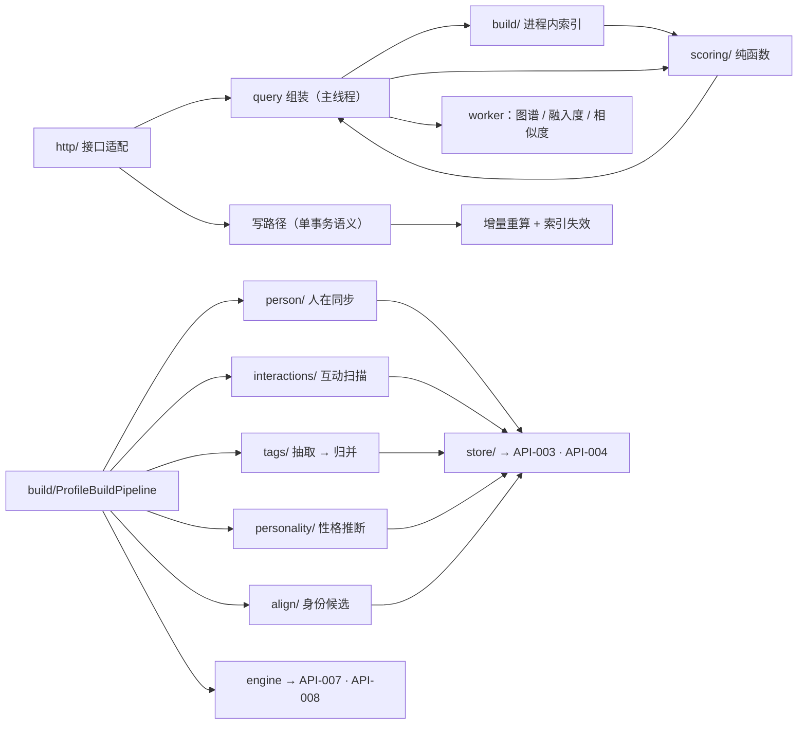

# MOD-007 —— 社交画像（模块三） 模块设计

> **状态**: reviewed
> **生成者**: 模块负责人按 `mod-000-template.md` 撰写（骨架由编排器按 `docs/prompt/run_pipeline.md` 步骤 4 建立）
> **上游**: `docs/design/modules.md`、`docs/design/api-contract.md`、`docs/design/data-model.md`、`docs/design/impl/high-level-design.md`
> **下游**: 无（叶子文档）
> **变更中**: —
> **最后更新**: 2026-09-12

<!-- 本文件属于实现层。修改必须走 design-doc-change skill（.github/skills/design-doc-change/SKILL.md）。 -->

## 1. 模块信息

| 项 | 值 |
| --- | --- |
| 模块 ID | `MOD-007` |
| 负责人 | — |
| 关联任务 | `TASK-022` ~ `TASK-031` |
| 涉及的契约 | 实现：`API-020` ~ `API-029`；持有：`DM-011` ~ `DM-019`；消费：`API-003`、`API-004`、`API-007`、`API-008` |
| 实现进度看板 | `docs/status/implementation.md` |

<!-- 负责人改动后，同步更新看板里对应的那一行。 -->

## 2. 职责与边界

**实现落点**：服务进程内的业务模块三（`src/server/social/`）+ 浏览器侧视图（`src/web/social/`）。职责与不负责项见 `MOD-007`（`docs/design/modules.md`），本节只写实现侧的边界与约束。

- **只经三个口子触达外部**：读 / 写数据经 `API-003`、`API-004`（MOD-002）；模型任务经 `API-007`、`API-008`（MOD-003）；取数与跨模块组装由外壳（MOD-004）经本模块的十条接口发起。模块三不反向依赖 MOD-004，也不与 MOD-005 / MOD-006 / MOD-008 发生任何调用（`REQ-018`）。
- **筛选只从入参进**：模块三不生成筛选控件；输入只有 `api-contract.md` §1.3 的四键，关键词匹配对象固定为标签名与成员昵称（`REQ-005`）。
- **负向边界在实现上表现为「不存在代码路径」**：无定时器与推送、无社交动作调用、无分享 / 导出 / 同步通道（`REQ-083` ~ `REQ-085`）；性格标签与分数不出现在 `API-029` 与任何列表接口中（`REQ-077`）。
- **口径单向**：所有评分公式不含时间项（`REQ-086`）；事件流只被视图读取，不进任何分值与排序（`REQ-087`）；不定义「活跃时间 / 夜猫指数」类字段（`REQ-088`）。
- **兴趣提示只做查询**：`API-029` 只返回已确认数据，组装在 MOD-004（`TASK-036`）；模块内没有推送 / 提醒出口。

**本文件负责的实现层口径**（`data-model.md` 中标注「由实现层确定」的部分）：置信度分值、活跃度口径、互动记录与回复时长算法、一级维度分 / 契合度 / 整体融入度 / 兴趣热度分公式与常量、未知成员阈值、身份对齐候选生成策略、图谱与标签取数上限、构建触发与串行点（§5.4、§8）。

## 3. 内部结构

### 3.1 目录划分

服务端与浏览器侧同属单包；`src/shared/`（契约类型与错误标识）只被消费，不在模块内修改。

| 路径 | 内容 | 约束 |
| --- | --- | --- |
| `src/server/social/http/` | `API-020` ~ `API-029` 的适配：路由、入参 schema 校验、错误映射入口 | 入参非法即拒绝，不进业务层（`detailed-design.md` §4.4） |
| `src/server/social/store/` | MOD-002 适配：实体类型常量、分页读取器、批量写入器（`API-003` / `API-004`）、`dataEpoch` 订阅 | 不直接开库；写入只在主线程 |
| `src/server/social/person/` | 人的同步与身份合并、未知判定（DM-011；读 DM-004 的归属解析） | 只按已确认映射合并（`REQ-082`） |
| `src/server/social/tags/` | 一级维度闭集、标签名规范化、归并组（DM-013、DM-015）、双向索引物化 | 一级维度不增不减（`REQ-052`） |
| `src/server/social/interactions/` | 互动记录扫描（DM-017）、活跃度与回复时长（DM-011 派生字段） | 纯计算 + 批量落库，可重算 |
| `src/server/social/scoring/` | 置信度、维度分、契合度、整体融入度、兴趣热度分（纯函数 + `constants.ts`） | 无 I/O、无时间项，可直接单测 |
| `src/server/social/align/` | 身份对齐候选生成与结论提交（DM-012） | 本地确定性匹配，不调模型 |
| `src/server/social/personality/` | 性格标签推断编排与确认 / 增删改（DM-016） | 六维闭集；未确认不出产物 |
| `src/server/social/build/` | 构建流水线、进程内索引、worker 桥、任务重试（`API-007` / `API-008`） | 单飞、幂等、可重入 |
| `src/server/social/suggest/` | 组局建议编排（经生成任务） | 只出文字、不落库、不生成待办 |
| `src/web/social/views/` | 人物画像、兴趣 → 人、两人配对、我的社交契合度、评分卡 / 仪表盘、身份对齐面板、时间轴 / 事件流 | 不自建筛选控件（`REQ-049`）；只经外壳取数 |
| `src/web/social/charts/` | ECharts 封装：爱好雷达、性格雷达、个人标签词云、人-人关系图谱、时间轴、评分卡 | 先容器后异步绘制（`detailed-design.md` §5.2） |
| `src/web/social/compose.ts` | 视图层组装：图谱边、词云条目、时间轴分箱 | 只组合接口返回，不做权威计算 |
| `src/web/social/api.ts` | 外壳路由封装、重试与错误呈现（复用外壳统一口径） | 写操作携带启动令牌（`detailed-design.md` §4.1） |

### 3.2 结构与数据流



### 3.3 关键接口（签名级）

```ts
// 对外十条（外壳经本机 HTTP 调用；入出参类型与 API-020 ~ API-029 对齐）
interface SocialProfileApi {
  getProfile(memberId: MemberId, filter: GlobalFilter): Promise<ProfileView>;                        // API-020
  searchPeople(entry: 'dimension' | 'tag', value: string, filter: GlobalFilter): Promise<PeopleResult>; // API-021
  getPair(a: MemberId, b: MemberId): Promise<PairView>;                                               // API-022
  getMyAffinity(): Promise<MyAffinityView>;                                                           // API-023
  suggestGroupActivity(interest: string, candidates: MemberId[]): Promise<{ text: string }>;          // API-024
  listIdentityCandidates(): Promise<IdentityCandidate[]>;                                             // API-025
  submitIdentityDecision(candidateId: string, decision: 'confirm' | 'reject'): Promise<MappingState>; // API-026
  editPersonalityTag(input: PersonalityEdit): Promise<PersonalityTagState[]>;                         // API-027
  editInterestTag(input: InterestTagEdit): Promise<ProfileView>;                                      // API-028
  getInterestHints(memberIds: MemberId[]): Promise<InterestHint[]>;                                   // API-029
}

// 构建流水线（模块内；由查询惰性触发或外壳预热取数触发）
interface ProfileBuildPipeline {
  readonly state: 'idle' | 'building' | 'ready' | 'partial' | 'failed';
  run(reason: 'lazy' | 'epoch' | 'after-write' | 'retry'): Promise<BuildReport>; // 幂等、可重入
}

// 评分纯函数（只依赖入参；常量集中在 constants.ts，缓存键含 SCORING_VERSION）
function confidenceOf(rawStrength: number, kind: TagKind, activity: number): number;
function effectiveTags(links: PersonTagLink[], groups: MergeGroup[]): EffectiveTag[];
function dimensionScores(tags: EffectiveTag[]): DimensionScores;                 // Σ 有效标签置信度
function affinity(a: PersonStats, b: PersonStats, common: EffectiveTag[], interactions: number): number;
function overallIntegration(pairs: PairScore[], friends: FriendStats[]): number | null;
function interestHeat(tags: EffectiveTag[], people: PersonStats[]): number;
function isUnknown(activity: number): boolean;

// 互动扫描（DM-017）
function scanInteractions(rows: MessageRow[], replies: ReplyIndex): InteractionRow[];
function replyLatencyMedian(rows: InteractionRow[]): number | null;              // null = 无可统计样本
```

### 3.4 构建流水线与串行点

| 阶段 | 输入 | 产出 | 落库 |
| --- | --- | --- | --- |
| 0 人在同步 | DM-004（含归属解析）、DM-012 | 人集合（新建 / 合并 / 保持独立） | DM-011 |
| 1 互动扫描 | DM-003（分页 + 引用索引） | 互动记录 | DM-017 |
| 2 活跃度与回复时长 | DM-003 计数、DM-017 | 活跃度、回复时长、未知标记 | DM-011 派生字段 |
| 3 兴趣抽取 | 逐人 / 逐群消息样本（`API-007` 抽取任务） | 标签候选 + 证据 + 一级维度 | DM-013、DM-014 |
| 4 同义归并 | 全部二级标签名（`API-007` 聚类任务） | 归并组与代表标签 | DM-015 |
| 5 维度分与热度分 | 有效标签、活跃度 | 五维分、性格六维分（仅已确认）、热度分 | DM-011 派生字段、DM-013 |
| 6 性格推断 | 消息样本（`API-007` 推断任务） | 六维候选与分数（状态 = 候选） | DM-016 |
| 7 身份候选 | DM-004、DM-005 | 候选映射（状态 = 未确认） | DM-012 |
| 8 索引物化 | 以上全部 | 进程内索引与缓存 | 内存（epoch 失效） |

- **触发**：任一查询发现索引缺失 / epoch 过期 → 后台启动构建，本次请求照常返回缓存（HLD 决策 9 的「先渲染缓存 + 进度 + 重试」）；采集完成后外壳以无入参接口（`API-023`、`API-025`）预热取数，模块侧不要求任何非契约接口。
- **单飞**：同一时刻最多一个构建在跑（进程内互斥）；构建中重复触发合并为一次补跑。
- **阶段隔离**：任一阶段失败只影响其下游；已落库阶段结果照常可读，构建状态置 `partial` 并给重试入口（`REQ-016`）。
- **worker**：图谱组装、逐人融入度、身份候选相似度（O(n²) 段）在 worker 执行；worker 不接触库与网络，输入由主线程分页读取后传入。

### 3.5 任务落点

| 任务 | 组件 |
| --- | --- |
| `TASK-022` | `tags/` + `store/`（`API-028` 写路径与双向索引） |
| `TASK-023` | `http/`（`API-020`）+ `scoring/` + `web/social/views/ProfileView` |
| `TASK-024` | `interactions/` + `http/`（`API-021`） |
| `TASK-025` | `scoring/affinity` + `API-022` |
| `TASK-026` | `scoring/integration` + `API-023` |
| `TASK-027` | `personality/` + `API-027` |
| `TASK-028` | `align/` + `API-025` / `API-026` |
| `TASK-029` | `suggest/` + `API-024` |
| `TASK-030` | `http/`（`API-029`） |
| `TASK-031` | `web/social/views/` + `web/social/charts/` |

## 4. 接口实现说明

通用规则（十条接口共用）：

- **线程语义**：查询在主线程做索引化读取与轻量组装，单次同步计算 ≤ 50 ms（`detailed-design.md` §1.1）；超出的组装（图谱、逐人融入度、候选相似度）下放 worker。写操作全部走 MOD-002 的单写路径，一个使用者动作 = 一个事务域（`detailed-design.md` §3.2）。
- **副作用顺序**：写操作先落状态，再在同一使用者动作内重算受影响的派生值，最后失效相关内存索引；重算以人 / 标签为键、幂等可重入，失败可整体重试而不留半成品。
- **可重入**：写后重算与构建流水线共用同一批纯函数，同一输入重复执行结果一致。
- **性能假设**：读路径命中进程内索引；`API-020` / `API-021` 的目标查询落在服务端 ≤ 800 ms 预算的模块份额内（`detailed-design.md` §5.2）。若「跨全部已采集群」的量级使查询超预算，按 `REQ-010` 的遗留风险处置（回流），不在模块内改写口径。
- **取数形态**：热路径走索引；明细按「实体类型 + 实体键 + 全局筛选条件」经 `API-004` 分页回读。列表条目以契约声明的「含」为下限，可附加只读派生字段（§8 决策 6）。
- **筛选语义**：群与时间范围为**重算窗口** —— 窗口非空时，活跃度 / 维度分 / 契合度按窗口内的消息与互动重算（同一批纯函数，结果只用于本次返回，不覆盖库内全量派生值）；关键词先匹配成员昵称（命中即该人整体命中），未命中再按标签名过滤。

| 接口 | 线程语义 | 副作用 | 幂等 | 性能假设 | 主要错误 |
| --- | --- | --- | --- | --- | --- |
| `API-020` 查询人物画像 | 主线程：索引取标签 + 纯函数组装；证据明细回读 | 无写；索引过期 → 触发后台构建 | 只读幂等 | 人 × 标签量级，标签数受 §5.4 上限约束 | `NO_DATA`、`EMPTY_RESULT`、`ANALYSIS_FAILED`、`TIMEOUT` |
| `API-021` 兴趣 → 人 | 主线程：走「标签 → 人」索引；按维度入口附未知成员分组 | 同上 | 只读幂等 | 命中集由索引直取 | 同上 |
| `API-022` 两人配对 | 主线程：缓存命中直取，否则纯函数计算 | 可经 `API-003` 写 DM-018 缓存（键含 epoch 与 `SCORING_VERSION`） | 同对、同 epoch 结果一致 | 单对 O(共同标签 + 互动数) | `NOT_FOUND`、`ANALYSIS_FAILED`、`TIMEOUT` |
| `API-023` 我的社交契合度 | 「我」的逐人列表 + 融入度；人数多时 worker | 可写 DM-019 缓存 | 幂等 | O(群友数) | `IDENTITY_NOT_READY`、`ANALYSIS_FAILED`、`TIMEOUT` |
| `API-024` 生成组局建议 | 主线程编排 + `API-007` 生成任务 | **不落库**（组局建议不留存，`data-model.md` §1.2） | 不适用（每次为一次新的生成） | 单次模型调用，超时 90 s（`detailed-design.md` §7） | `EMPTY_RESULT`、`ANALYSIS_FAILED`、`TIMEOUT` |
| `API-025` 身份对齐候选 | 主线程读 DM-004 / DM-005 + worker 相似度 | 写 DM-012（状态 = 未确认）；重复生成按候选身份去重，不覆盖已有结论 | 幂等 | 群成员 × 联系人数级 | `SOURCE_UNAVAILABLE` |
| `API-026` 提交身份对齐结论 | 写路径（单事务语义） | DM-012 状态变更 → 触发受影响人的派生重建 | 同结论重复提交一致 | 重建范围 = 涉及群成员对应的人 | `NOT_FOUND`、`STORAGE_UNAVAILABLE` |
| `API-027` 确认与增删改性格标签 | 写路径 | DM-016 变更 → 性格维度分与性格雷达即时重算 | 幂等 | 单实体 | `INVALID_INPUT`、`NOT_FOUND`、`STORAGE_UNAVAILABLE` |
| `API-028` 增删改兴趣标签 | 写路径 | DM-013 / DM-014 / DM-015 变更 → 画像与匹配结果即时重算（`REQ-008`） | 幂等 | 单实体 + 受影响维度求和 | `NOT_FOUND`、`STORAGE_UNAVAILABLE` |
| `API-029` 查询成员兴趣提示 | 主线程批量读索引 | 无写 | 只读幂等 | 成员集合 ≤ 消息涉及成员数 | `NO_DATA`（仅当集合内全部成员均无已确认数据；调用方静默忽略） |

## 5. 数据与状态

### 5.1 与 `DM-###` 的映射

| 契约实体 | 内部结构（`src/server/social/**`） | 记录身份键 | 访问路径 |
| --- | --- | --- | --- |
| DM-011 人 | `PersonRecord`：人标识、群成员身份集、是否「我」、未知标记、活跃度、回复时长、五维分、六维分 | 人标识 | 人标识；「我」唯一；按 DM-004 的归属解析合并 |
| DM-012 身份对齐候选映射 | `IdentityCandidate` | 候选标识（= 联系人标识 + 群成员集合的规范化哈希） | 状态；涉及群成员 |
| DM-013 兴趣标签 | `InterestTag`：标签标识、名、一级维度、归并组、首现、事件流、热度分 | 标签标识 = 一级维度 + 规范化标签名 |（一级维度, 规范名）唯一；归并组索引 |
| DM-014 人物兴趣标签 | `PersonTagLink`：人物、标签、置信度、证据、来源方式 | 人物 + 标签 |（人物）与（标签）双向 |
| DM-015 同义标签归并组 | `MergeGroup` | 代表标签 | 代表标签唯一；已归入标签集 |
| DM-016 性格标签 | `PersonalityTag`：人物、维度、分数、状态、来源方式 | 人物 + 维度 |（人物, 维度）唯一 |
| DM-017 消息互动记录 | `InteractionRow` | 触发消息 + 响应消息 |（响应成员）、（触发成员）、（触发消息） |
| DM-018 两人契合度 | `PairScore`：人 A、人 B、共同爱好、契合度、逐维度差值、计算 epoch 与 `SCORING_VERSION` | 人 A + 人 B（按标识字典序存放，无序对唯一） | 无序对直取 |
| DM-019 我的社交契合度 | `MyAffinity`：逐人列表、整体融入度、epoch | 「我」的人标识 | 「我」唯一 |

### 5.2 进程内索引与失效

- 索引：`PersonTagIndex`（人 → 有效标签、标签 → 人集）、`InteractionIndex`（互动计数与中位数样本）、`ScoreIndex`（维度分与契合度缓存）、`CandidateIndex`（未确认候选）。作为进程内缓存使用，权威数据仍在库内（`detailed-design.md` §3.3）。
- 载入：构建阶段 8 从 `API-004` 分页读回后物化；读路径不触发全表扫描。
- 失效：`dataEpoch` 变化（更新完成 / 删除完成 / 改判落库 / 迁移完成）全量失效；写操作（`API-026` ~ `API-028`）同步失效相关键。进程重启即失效。

### 5.3 状态机

- **构建**：`idle → building → ready | partial | failed`；`partial` = 有阶段失败但已有可用结果（页面先渲染缓存 + 进度 + 重试）。
- **身份映射**（DM-012）：`未确认 → 已确认 | 已否定`；单出口；重新生成候选不覆盖已确认 / 已否定（`REQ-082`）。
- **性格标签**（DM-016）：`候选 → 已确认`；「改」= 更新维度 / 分数并置为已确认，「删」= 删除记录；未确认记录不进任何产物与视图（`REQ-075`）。
- **归并**（DM-015）：`未归并 → 已归并`；代表标签被删除时组失效并重算（DM-015 级联）。
- **未知标记**（DM-011）：`够量 ↔ 未知`（按活跃度重算），发言增量后可回到够量；标记为未知时不产出任何标签。

### 5.4 评分与统计口径（纯函数输出，全部可复算）

| 名称 | 公式 / 规则 | 常量 | 依据 |
| --- | --- | --- | --- |
| 活跃度 | 该人作为发送者的 DM-003 记录数（文字 / 图片 / 表情包均计），跨全部已采集群合并到人 | — | `REQ-057`、DM-011 |
| 置信度（语义标签） | `clamp01(抽取强度)`，保留 3 位小数 | — | DM-014「分值口径由实现层确定」 |
| 置信度（社交维度标签） | `clamp01(抽取强度) × min(1, sqrt((活跃度 + 1) / 50))` | 50 | `REQ-057`（与活跃度同源、同步变化） |
| 有效标签 | 归并组内取代表标签，置信度取组内最大值；每组只计一次（不重复出现） | — | `REQ-055`、DM-015 |
| 一级维度分（爱好五轴 / 性格六轴） | 该维度下全部有效标签置信度之和；性格侧只统计状态为「已确认」的记录（候选不计入） | — | `REQ-080`、`REQ-075`、DM-011 |
| 回复时长 | 该人作为响应成员的 DM-017 间隔时长的中位数；无样本为空（不显示 0） | — | `REQ-066`、DM-011 |
| 契合度 | `100 × (0.35·T + 0.25·C + 0.25·I + 0.15·V)`，其中 T = `min(1, 共同标签数 / 5)`、C = 共同标签上 `min(置信度A, 置信度B)` 的均值、I = `min(1, 双向互动条数 / 10)`、V = `min(1, min(活跃度A, 活跃度B) / 100)`；**共同标签与置信度加权两项只取运动 / 艺术 / 游戏 / 娱乐四维**（社交维度与活跃度同源，其贡献由 V 承担一次）；公式无时间项 | 5 / 10 / 100；权重 0.35 / 0.25 / 0.25 / 0.15 | `REQ-058`、`REQ-086`、DM-018 |
| 共同爱好（展示与图谱连线） | 两人五维共同有效标签（含社交维度）；未知成员无连线 | — | `REQ-062`、`REQ-069` |
| 逐维度差值 | 两人五个一级维度分逐轴相减 | — | `REQ-059`、DM-018 |
| 整体融入度 | `Σ(契合度 × max(1, 活跃度)) / Σ(max(1, 活跃度))`，遍历「我的群友」（去重到人，排除「我」）；无群友返回空 | — | `REQ-079`、DM-019 |
| 兴趣热度分 | `Σ 置信度 × sqrt(1 + 活跃度)`，遍历该标签（归并后）下全部人；阻尼防止高活跃者独占 | — | `REQ-078`、DM-013 |
| 未知标记 | `活跃度 < 5` → 未知；不推断、仍列出、图谱中零连线 | 5 | `REQ-081`、DM-011 |
| 事件流 | 按自然月分箱的该标签证据条数；首现 = 最早证据消息发送时间；不参与任何分值 | — | `REQ-067`、`REQ-087` |
| 取数上限 | 图谱节点 ≤ 200（活跃度降序，「我」优先）；标签批量取数 ≤ 200（热度分降序）；个人标签词云 ≤ 100 | 200 / 100 | `detailed-design.md` §5.4 护栏 |

### 5.5 变化 → 重算范围

| 变化 | 重算 |
| --- | --- |
| 采集完成 / 删除完成（epoch 递增） | 全量构建（阶段 0 → 8） |
| 人工增删改兴趣标签（`API-028`） | 该人的有效标签 → 五维分；涉及该人的契合度缓存失效；标签集合变化 → 热度分与归并组 |
| 性格标签确认 / 增删改（`API-027`） | 该人的性格六维分与性格雷达 |
| 身份结论提交（`API-026`） | 受影响群成员的归属 → 人在同步 → 受影响人的全部派生（活跃度 / 回复时长 / 标签 / 契合度 / 素材） |
| 证据消息被删除 | 引用该消息的标签（或其证据项）在下次重算时剔除，不保留悬空引用（`REQ-011`） |

### 5.6 幂等键（`detailed-design.md` §2.4 的落点）

| 场景 | 幂等键 |
| --- | --- |
| 派生记录写入 | 记录身份键（§5.1）；重复写入不新增 |
| 派生结果缓存（DM-018 / DM-019 / DM-013 热度分） | 人 / 对 + `dataEpoch` + `SCORING_VERSION`（口径公式变更时递增） |
| 模型任务 | 任务引用（`API-007` 出参），重试经 `API-008`；重试成功后结果由本模块落库 |

## 6. 错误处理

| 场景 | 出口标识 | 说明 |
| --- | --- | --- |
| MOD-002 读 / 写失败 | `STORAGE_UNAVAILABLE` | 透传，不静默失败（`REQ-016`）；写失败时前序状态不落地 |
| 抽取 / 推断 / 生成 / 聚类任务失败 | `ANALYSIS_FAILED` | 透传；保存任务引用供 `API-008` 重试；已落库阶段结果照常可读 |
| 任务超时 | `TIMEOUT` | 同上；超时按失败处理，不读残缺输出（`detailed-design.md` §1.4） |
| 成员标识不存在（`API-022`、`API-027`、`API-028`） | `NOT_FOUND` | 提示并刷新列表 |
| 标签 / 候选不存在（`API-026` ~ `API-028`） | `NOT_FOUND` | 同上 |
| 性格标签值不在六维闭集 | `INVALID_INPUT` | 拒绝并回传可取值（`REQ-074`） |
| 尚无任何已采集数据 | `NO_DATA` | 空态 + 引导首次更新 |
| 有数据但筛选 / 检索无命中 | `EMPTY_RESULT` | 空态 + 一键清除筛选；与 `NO_DATA` 严格区分（`AC-139`） |
| 组局建议候选为空 | `EMPTY_RESULT` | 空态 + 提示重新选择兴趣；不写入任何记录（`AC-109`） |
| 通讯录 / 好友列表未采集或不可读（`API-025`） | `SOURCE_UNAVAILABLE` | 说明原因 + 手动重试，不显示空白面板（`AC-131`） |
| 「我」的身份未就绪（`API-023`） | `IDENTITY_NOT_READY` | 提示 + 手动重试 |
| 未映射的内部异常 | 统一信封的「未知失败」 | 不新增标识（`detailed-design.md` §2.2）；`message` 只进日志，不给使用者看 |

不可恢复情形：

- 来源消息被删除：以它为证据的标签在下次重算时剔除，不保留悬空引用（`REQ-011`）。
- 某人的全部群成员身份被删除：人及其派生结果由 MOD-002 级联删除；模块内索引在下一次 epoch 变化时重建。
- 库结构版本高于应用：由存储层拒绝打开并提示（`detailed-design.md` §8.1），模块不自行处理。

日志（字段与级别遵循 `detailed-design.md` §6.1；`module` 固定为 `MOD-007`，带 `requestId` / `taskRef`）：`social.build.start` / `social.build.stage.failed` / `social.build.done`、`social.recompute`（人 / 标签范围与耗时）、`social.identity.decision`（候选标识 + 结论，不记姓名）、`social.index.invalidated`。禁止写入消息原文与成员昵称。

## 7. 测试要点

**mock 边界**：MOD-002（`API-003` / `API-004`）与 MOD-003（`API-007` / `API-008`）全部 mock，不真开库、不真调模型；不提供演示数据（`REQ-019`）。时钟注入（跨天判定与事件流分箱）；所有口径确定、无随机性（常量集中在 `scoring/constants.ts`）。

| 测试组 | 关键分支 | 对应 `AC-###` |
| --- | --- | --- |
| 标签体系与双向索引 | 一级五类闭集 / 二级自由创建 / 无证据不入画像 / 归并组去重 / 人工增删改即生效 / 正反两侧一致 | `AC-094` ~ `AC-100`、`AC-096` |
| 画像与展示数据 | 维度分复算 / 证据「打开更多」/ 雷达五轴展开 / 词云命名区分 / 性格雷达闭集 / 评分卡三类分 | `AC-097`、`AC-106`、`AC-114`、`AC-117` ~ `AC-119`、`AC-124`、`AC-126` |
| 反向检索与互动 | 两个入口 / 跨全部已采集群 / 回复时长中位数（纯表情与跨天排除、跨群合并）/ 未知标记 | `AC-095`、`AC-101`、`AC-105`、`AC-110` ~ `AC-112`、`AC-127` |
| 契合度与融入度 | 因子单调性 / 活跃度只计一次 / 逐维度差值可复算 / 时间前移不变 / 逐人列表 + 单一分数 | `AC-102` ~ `AC-104`、`AC-107`、`AC-125`、`AC-135` |
| 性格标签 | 闭集非法值拒绝 / 未确认不出现、确认后出现 / 增删改即时生效 / 无对外通道 | `AC-120` ~ `AC-123` |
| 身份对齐 | 候选来源与状态 / 未确认与否定不生效 / 确认后合并 / 来源不可用 | `AC-128` ~ `AC-131` |
| 组局与兴趣提示 | 仅文字、无待办与可发送文案 / 无候选空态 / 仅已确认数据出提示 / 无数据静默 | `AC-108`、`AC-109`、`AC-116` |
| 视图与负向 | 时间轴回放与不参与权重 / 图谱节点与边、未知孤立 / 无推送 / 无社交动作 / 无分享通道 / 无夜猫指数 | `AC-113`、`AC-115`、`AC-132` ~ `AC-134`、`AC-136`、`AC-137` |
| 异常与空态 | `NO_DATA` 与 `EMPTY_RESULT` 区分 / 失败与超时后缓存可浏览 + 重试 / 存储不可用不静默 / 术语命名 | `AC-015`、`AC-035`、`AC-039`、`AC-138`、`AC-139` |
| 性能 | 万条级首屏（服务端查询 ≤ 800 ms 的模块份额） | `AC-024` |
| 模块独立性 | 模块一 / 二不可用时模块三仍可查询 | `AC-040` |

重点断言（写单测时直接照抄口径）：① 任一维度分 = 该维度有效标签置信度之和，社交维度分随活跃度单调变化；② 契合度在共同标签增加、置信度变化、互动增加时严格变化，且证据时间前移后不变；③ 回复时长样本排除纯表情与跨天后的中位数与手工复算一致；④ 未确认性格标签、未确认身份映射在任何出参与视图中都不可达。

## 8. 关键决策与取舍

### 决策 1 —— 社交维度与活跃度同源的落法

- **背景与约束**：`REQ-057` 要求活跃度与「社交」维度同源且在契合度中只计一次；`AC-101` 要求发言量变化后两者同步变化；`AC-126` 要求维度分 = 该维度全部二级标签置信度之和；`AC-102` 要求配对 / 雷达中与发言量同源的指标只有「社交」一项。四个口径必须同时成立。
- **候选方案与取舍**：① 社交维度分直接取活跃度归一化 —— 最简单，但社交维度就没有可求和的二级标签，与 `AC-126` 的复算口径冲突。② 社交维度标签仍由抽取产出，但其置信度按活跃度联动（本文选定）—— 四个口径同时成立，代价是一个常量与一次乘法。③ 社交维度只在雷达轴上出现、不进画像 —— 与 `REQ-052`「二级标签可自由创建且必须归属五类之一」的口径别扭。
- **决定**：②。社交维度标签的置信度 = `clamp01(强度) × min(1, sqrt((活跃度 + 1) / 50))`（常量属模块内，不进 `config.json`）；契合度的「共同标签 / 置信度加权」两项只取四维语义标签，社交维度只经活跃度因子进入一次。
- **后果**：单测可同时断言「维度分 = Σ 有效标签置信度」与「发言量 +Δ → 社交维度分随之变化」；雷达的社交轴与活跃度同向。
- **上游影响**：无（DM-014 与 DM-018 均明写分值口径 / 权重由实现层确定；未改任何枚举值与字段）。

### 决策 2 —— 契合度 / 融入度 / 热度分的公式与常量

- **背景与约束**：契约给了因子集合（`REQ-058`）与「无时效衰减」（`REQ-086`），权重与归一化留给实现层；没有具体取值，单测无法写。
- **候选方案与取舍**：① 线性加权 + 固定参考量（0.35 / 0.25 / 0.25 / 0.15，参考量 5 / 10 / 100）—— 常量少、可复算、单调性易测。② 百分位归一化（相对全库分布）—— 自适应，但同一对在不同数据下不可比，单测脆弱。③ 相乘式（几何平均）—— 任一因子为零即整体归零，容易被单点压死。
- **决定**：①（公式见 §5.4）；常量集中在 `scoring/constants.ts`，随 `SCORING_VERSION` 变更，缓存键含版本号，旧缓存不命中即重算。
- **后果**：契合度与融入度均落在 [0, 100]；`AC-103`（随因子变化）与 `AC-135`（证据时间整体前移后数值不变）可直接单测；活跃度只在 `V` 项出现一次（`AC-102`）。
- **上游影响**：无。

### 决策 3 —— 互动扫描与「首条有效响应」的口径

- **背景与约束**：DM-017 给了三类互动与两类排除项，但没定扫描顺序、并行候选的取舍与记录粒度；`AC-112` 要求中位数可手工复算。
- **候选方案与取舍**：① 每条触发消息只落一条记录、取最早有效响应（本文选定）—— 记录数与触发消息同阶，口径与「回复时长取首条」一致。② 全部候选都落记录 —— 信息全，但与「首条」口径不一致且写入量放大。③ 只落引用回复与 @ 提及两类 —— 丢失「紧随接话」（`REQ-066` 明列）。
- **决定**：①。「紧随」的边界 = 该消息与响应者的首条非纯表情消息之间无其他成员发言；纯表情与跨天响应在扫描阶段就剔除（不落库）；同一触发消息的多个候选按响应时间取最早，并列时按 引用回复 > @ 提及 > 紧随接话 取一；记录身份 = 触发消息 + 响应消息。
- **后果**：DM-017 行数 ≤ 触发消息数；回复时长 = 该人作为响应成员的中位数，无样本返回空（`AC-111` 不显示 0 或猜测值）。
- **上游影响**：无（DM-017 只声明类型与排除项，未定扫描与并列规则）。

### 决策 4 —— 未知成员阈值与「仍列出」的落点

- **背景与约束**：DM-011 明写「判定阈值由实现层确定」；`REQ-081` / `AC-127` 要求未知成员不被推断、仍出现在列表、图谱中零连线。
- **候选方案与取舍**：① 活跃度 < 5（本文选定）—— 与「发言太少」的语义相符，常量可调。② 活跃度为 0 —— 会把只发过 1 ~ 4 条的人当成可推断对象，与「不做推测」相悖。③ 按消息总量占比 —— 随数据量漂移，不可解释。
- **决定**：①；未知成员不进入抽取任务输入、不产出任何标签（含社交维度）、五维分与六维分为 0；「仍列出」的落点 = 按一级维度检索结果尾部的「未知成员」分组（标「未知」、不带分值）+ 人-人图谱的孤立节点；按二级标签检索不含未知成员（没有标签可命中）。
- **后果**：`AC-127` 的三项断言均有落点；`AC-105`（按标签无遗漏）不受影响。
- **上游影响**：无。

### 决策 5 —— 身份对齐候选的生成策略

- **背景与约束**：`REQ-082` 只要求「结合通讯录 / 好友列表给出候选」；DM-012 的候选来源为必填；`detailed-design.md` §11 把生成与确认的交互细节明确分派给本文件。
- **候选方案与取舍**：① 本地确定性匹配（名称规范化 + 精确 / 包含 / 编辑距离三级）（本文选定）—— 可单测、无模型成本、无数据出站。② 模型聚类任务 —— 能吸收「小张 / 张三」这类改写，但每轮采集后都要调用，成本与不确定性都高，且候选质量只影响一次人工确认。③ 仅精确匹配 —— 最简单，但会漏掉带前缀、emoji、全半角差异的常见情况。
- **决定**：①；候选锚定联系人记录（DM-005），仅当同一联系人匹配到 ≥ 2 个不同群的群成员时产出；候选身份 = 联系人标识 + 群成员集合，重复生成不覆盖已确认 / 已否定。
- **后果**：`AC-128` / `AC-129` 可测；通讯录未采集或读取失败 → `SOURCE_UNAVAILABLE`（`AC-131`）；误匹配由使用者在面板上逐条否定。
- **上游影响**：无。

### 决策 6 —— 列表条目「含」为下限：附加只读派生字段与实体键读取

- **背景与约束**：契约以「含…」描述列表条目（如 `API-020` 的二级标签含置信度与证据引用、`API-021` 的人选含回复时长与活跃度），而 `REQ-068` / `REQ-078` 要求热度分等分值在界面可见、`REQ-053` 要求证据可回原文；筛选条件只声明了四键（§1.3），但模块必须按实体键（人物 / 标签 / 候选）读取。
- **候选方案与取舍**：① 把「含」读作下限，实体键作为筛选条件的实体侧补充（本文选定）—— 不改既有字段语义、不新增接口。② 严格穷举读法 —— 等于要求把全量实体每次拉回内存过滤，与 `REQ-010` 的首屏预算冲突。③ 新增接口或新增出参字段 —— 超出模块负责人权限，必须回流。
- **决定**：①。附加字段一律只读、可选、不改变既有字段含义（在 `src/shared/` 的类型上以可选属性表达，缺省不影响调用方逻辑）；筛选条件中的实体键由实体类型隐含。
- **后果**：评分卡、个人标签词云、时间轴与图谱都有合法取数路径；若评审认为该读法不成立，需要回流的是 `API-004` / `API-020` / `API-021` 的表述，而不是在模块内绕过 —— 本模块不自行扩展契约。
- **上游影响**：无（本决策不改变任何已声明字段的语义与取值范围；实现不依赖任何未定义字段作为必需项）。

### 决策 7 —— 构建触发与并发

- **背景与约束**：HLD 决策 9 定了「采集完成后后台触发，打开模块先渲染缓存」，但没说触发信号怎么进模块；`detailed-design.md` §1.1 禁止主线程单次同步计算 > 50 ms。
- **候选方案与取舍**：① 惰性触发 + 外壳用无入参接口预热取数（本文选定）—— 不新增接口、不违反调用方向；代价是冷启动首次查询有等待。② 采集完成后由外壳直接调用模块的构建入口 —— 需要新增一条接口，超出契约。③ 定时轮询 —— 引入不必要的常驻行为，也与「无后台常驻」口径相悖（HLD §2）。
- **决定**：①；模块内构建单飞（同一时刻最多一个），重复触发合并为一次补跑；阶段串行、失败只影响下游；重组装段一律下放 worker。
- **后果**：HLD 决策 9 的两条路径都有落点；`AC-138`（失败 / 超时后缓存仍可浏览）由 `partial` 状态与阶段隔离成立。
- **上游影响**：无。

## 9. 未决问题

无。本文件涉及的口径均为阶段 4 已裁定的「由实现层确定」项，取值与理由见 §5.4 与 §8。
