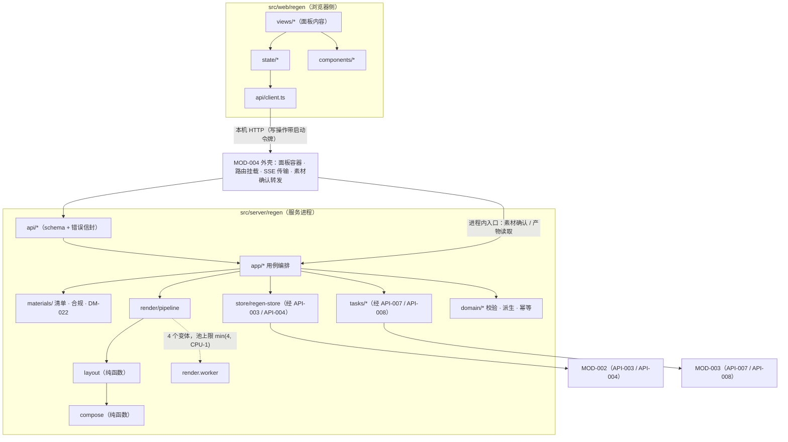
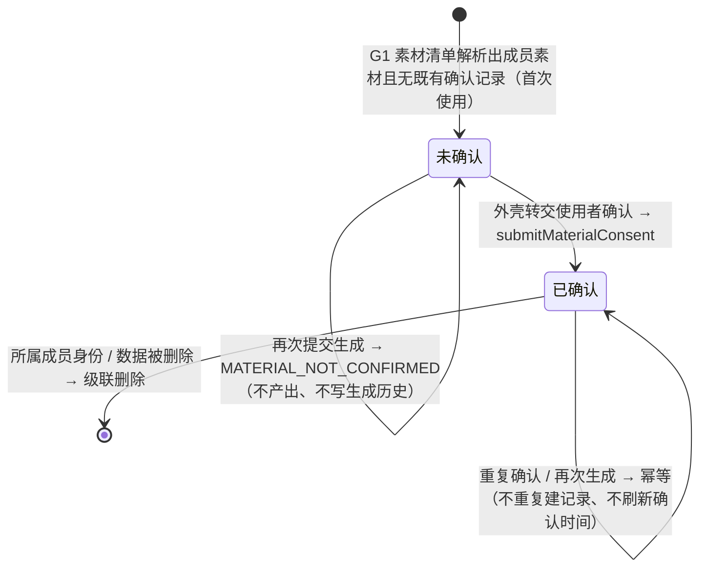
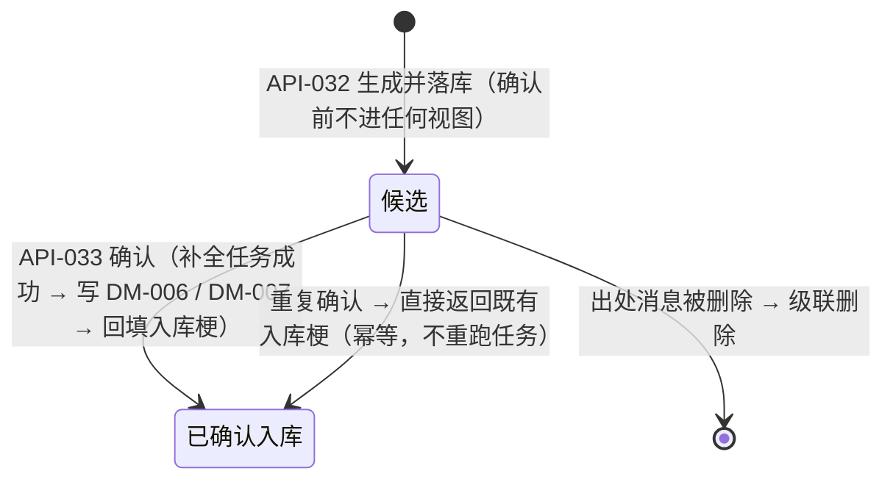
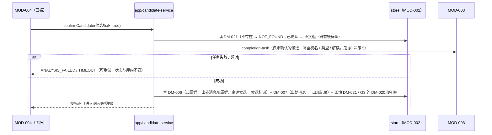

# MOD-008 —— 再创作生成 模块设计

> **状态**: reviewed
> **生成者**: 模块负责人按 `mod-000-template.md` 撰写（骨架由编排器按 `docs/prompt/run_pipeline.md` 步骤 4 建立）
> **上游**: `docs/design/modules.md`、`docs/design/api-contract.md`、`docs/design/data-model.md`、`docs/design/impl/high-level-design.md`
> **下游**: 无（叶子文档）
> **变更中**: —
> **最后更新**: 2026-09-12

<!-- 本文件属于实现层。修改必须走 design-doc-change skill（.github/skills/design-doc-change/SKILL.md）。 -->

## 1. 模块信息

| 项 | 值 |
| --- | --- |
| 模块 ID | `MOD-008` |
| 负责人 | — |
| 关联任务 | `TASK-032` ~ `TASK-035` |
| 涉及的契约 | 实现：`API-030` ~ `API-034`；持有：`DM-020` ~ `DM-022`；消费：`API-003`、`API-004`、`API-007`、`API-008` |
| 实现进度看板 | `docs/status/implementation.md` |

<!-- 负责人改动后，同步更新看板里对应的那一行。 -->

## 2. 职责与边界

职责、明确不负责项、对外接口声明与依赖方向见 `docs/design/modules.md` 的 `MOD-008`；接口的入参 / 出参 / 错误见 `docs/design/api-contract.md` 的 `API-030` ~ `API-034`。本文件不复述契约正文，只写实现侧落点与边界。

- **实现范围**：实现 `API-030` ~ `API-034`（服务端处理 + 浏览器侧面板内容）；持有 `DM-020` ~ `DM-022` 的读写；消费 `API-003` / `API-004`（存储）与 `API-007` / `API-008`（模型任务）；关联 `TASK-032` ~ `TASK-035`。
- **合规确认流的落点**：本模块实现其数据与判定（`DM-022` 的写入、成员素材未确认时的拒绝路径），确认交互的呈现与转发由外壳承担（`TASK-037`）——见 §8 决策 1。
- **代码落点**：`src/server/regen/`（服务进程：用例、素材、渲染、任务、存储适配）与 `src/web/regen/`（浏览器侧面板内容）。跨模块契约类型与错误标识来自 `src/shared/`，本模块不新增共享定义。
- **实现侧硬边界**（均为契约层边界的落地）：
  - 不 import `MOD-005` / `MOD-006` / `MOD-007`；梗上下文由外壳转交（`REQ-034`）。
  - 一切持久化与产物字节经 `API-003` / `API-004` 进出 `MOD-002`；模块内不出现数据库驱动、不直接读写应用数据目录。
  - 一切模型调用经 `API-007` / `API-008`；模块内不出现模型地址、凭据与 SDK 调用点。
  - 不做视图容器与入口挂载：生成面板的容器、展开与四个入口（G1 / G2 / G3 / 生成历史）的编排属 `MOD-004`（`TASK-037`）；`src/web/regen/` 只出面板内容组件。
  - 不建第二组筛选控件：筛选条件只接收与透传（`REQ-004`、`REQ-049`）。
  - 负向边界（由测试与静态检查守住）：不存在自动发布、自动替换群内说法、对外分享 / 发送的代码路径（`REQ-015`、`REQ-085`）；模板库不含模拟聊天记录的版式，生成物一律带「创作」标注（`REQ-013`）。

## 3. 内部结构

### 3.1 代码目录与子目录划分

**服务端 `src/server/regen/`**

| 子目录 / 文件 | 职责 | 约束 |
| --- | --- | --- |
| `index.ts` | 装配依赖（存储网关、任务网关、worker 池、时钟、模板库）并导出模块入口 | 不自行建连、不读配置文件 |
| `api/` | 5 条接口的绑定与入参 schema：`emoji.ts`（`API-030`）、`variants.ts`（`API-031`）、`candidates.ts`（`API-032` / `API-033`）、`history.ts`（`API-034`） | 只做校验 + 错误信封映射，不含业务 |
| `app/` | 用例编排：`emoji-service`、`variant-service`、`candidate-service`、`history-service` | 唯一同时依赖渲染、任务、存储的地方 |
| `materials/` | 素材档位解析与合规：`resolver`（档位 → 素材清单）、`manifest`（清单构造）、`compliance`（成员素材判定）、`consent`（`DM-022` 读写与状态机） | 纯逻辑与存储适配分离 |
| `render/` | 本地模板化渲染：`registry`（模板库加载 / 校验 / 版本）、`layout`（模板 + 文案 → 绘制指令，纯函数）、`compose`（指令 + 素材 → 位图，纯函数）、`pipeline`（变体调度、超时、重试）、`render.worker`（`worker_threads` 入口） | worker 只收参数、回传字节，不落盘、不开库 |
| `tasks/` | 经 `API-007` / `API-008` 的任务封装：`text-variant-task`（G1 文案变体 / G2）、`candidate-task`（G3）、`completion-task`（确认入库补全，见 §8 决策 5） | 不 import 模型 SDK |
| `store/` | 经 `API-003` / `API-004` 的读写适配：`regen-store`（`DM-020` ~ `DM-022` 映射）、`artifacts`（产物句柄与读取入口） | 不 import 任何数据库库 |
| `domain/` | 纯函数域逻辑：`validate`（候选 / 任务结果校验）、`derive`（入库字段派生）、`dedupe`（幂等键） | 无 IO，可全量单测 |
| `templates/` | 模板库资源（只读，随应用版本打包）：模板清单 + 内置素材 | 只读；不写应用数据目录 |
| `constants.ts` | 本模块全部取值（变体数、条数上限、原话阈值等，见 §5.3、§7.3） | 单一取值来源 |

**浏览器侧 `src/web/regen/`**

| 子目录 / 文件 | 职责 |
| --- | --- |
| `api/client.ts` | 5 条接口调用封装（写操作带启动令牌、`dataEpoch` 过期丢弃） |
| `state/` | 取数 hooks：`useEmojiPanel`、`useVariants`、`useCandidates`、`useHistory` |
| `views/` | 面板内容：`EmojiView`（档位 / 模板 / 文案 / 4 变体预览）、`VariantListView`、`CandidateListView`、`HistoryView` |
| `components/` | `TierPicker`（三档单选）、`TemplatePicker`、`MaterialSlotView`、`ConsentPanel`（成员素材确认）、`VariantGrid`（复制 / 下载）、`CreationBadge`（「创作」标注） |

划分理由：`templates/` 与 `render/` 是 G1 独有的确定性核心，独立成目录后可脱离网络与存储单测（`layout` / `compose` 为纯函数）；`materials/` 与 `tasks/` 分别隔离「合规」与「模型」两类外部依赖；`api/` 只依赖 `app/`，`app/` 是唯一编排层；`domain/` 不依赖任何 IO。`src/web/regen/` 不实现面板容器与入口挂载（属外壳），只含内容组件与取数。

### 3.2 结构图



### 3.3 关键数据结构（模板与素材）

```ts
// render/registry.ts —— 模板库：内置、只读、带版本（详设 §8.3：缓存键含模板版本）
interface TemplateMeta {
  id: string; version: number;      // 稳定标识 + 版本；历史产物锁定版本，不回改
  name: string;                      // 中文展示名（REQ-017）
  tiers: MaterialTier[];             // 适用档位：groupImage | hotMeme | builtin
  size: { w: number; h: number };
  textSlots: TextSlot[];             // 文案槽位：4 条文案变体逐一填充
  mediaSlots: MediaSlot[];           // 素材槽位（可为空）
  builtinAssets: string[];           // 内置素材相对路径（只读）
}
interface TextSlot { id: string; box: Rect; font: FontRef; maxLines: number; align: 'left' | 'center'; }
interface MediaSlot {
  id: string; box: Rect; shape: 'rect' | 'circle'; required: boolean;
  sources: MaterialKind[];           // 允许装入的素材类别
  memberBound: boolean;              // true = 成员素材槽（头像 / 照片），装载即触发合规判定
}

// materials/ —— 三档收敛为同一「素材清单」；档位只决定外部素材的来源（见 §4.1）
type MaterialTier = 'groupImage' | 'hotMeme' | 'builtin';
type MaterialKind = 'builtinAsset' | 'groupImage' | 'memberAvatar' | 'memberPhoto' | 'memberQuote';
interface MaterialItem {
  kind: MaterialKind; ref: string;   // 媒体引用 / 成员标识 / 内置素材路径
  memberRef?: string;                // 成员素材必填（→ DM-004）
  originMsgRef?: string;             // 来源消息（→ DM-003）：群内图片 / 原话
  slotId?: string;
}
interface MaterialManifest { tier: MaterialTier; templateId: string; items: MaterialItem[]; }
```

**模板库组织**（`detailed-design.md` §11 留给本文件的事项）：模板 = 元数据（JSON，上表字段）+ 内置素材（图片 / 贴图，相对路径），随应用版本打包在 `src/server/regen/templates/`，只读、不做在线更新（无对外通道）。`registry` 启动时加载并校验（标识唯一、槽位矩形在画布内、引用素材存在、`tiers` 非空、版本号合法），校验失败即启动期报错，不静默降级。模板更新只增版本、不改旧版本文件；生成历史按「模板 + 版本」记录并复现（`DM-020`）。

### 3.4 关键接口（签名级）

```ts
// api/ —— 5 条契约接口的用例入口（出参与错误以契约条目为准）
generateEmoji(input: GenerateEmojiInput): Promise<GenerateEmojiOutput>   // API-030
generateVariants(input: VariantInput): Promise<VariantOutput>            // API-031
generateCandidates(input: CandidateInput): Promise<CandidateOutput>      // API-032
confirmCandidate(input: ConfirmInput): Promise<ConfirmOutput>            // API-033
queryHistory(filter: SharedFilter): Promise<HistoryOutput>               // API-034

// —— 进程内编排入口（非 HTTP、非 API-###，供外壳调用；见 §8 决策 1 / 决策 6）
submitMaterialConsent(items: MaterialItem[]): Promise<ConsentResult>      // 写 DM-022 为已确认
readArtifact(ref: string): Promise<{ bytes: Uint8Array; mime: string }>  // 供外壳的下载路由

// render/ —— 纯函数 + 主线程编排（逐变体超时与重试）
buildDirectives(template: TemplateMeta, texts: string[]): DrawDirective[]
compose(directives: DrawDirective[], assets: ResolvedAsset[]): Uint8Array
renderVariants(input: { template: TemplateMeta; texts: string[]; assets: ResolvedAsset[] }): Promise<RenderedArtifact[]>

// materials/ —— 清单与合规（纯逻辑）
resolveManifest(tier: MaterialTier, template: TemplateMeta, ctx: MemeContext, texts: string[]): MaterialManifest
evaluateCompliance(manifest: MaterialManifest, consent: ConsentIndex): ComplianceVerdict

// store/ —— 只经 API-003 / API-004
writeEntities(type: EntityType, records: RecordDTO[]): Promise<WriteResult>
readEntities(type: EntityType, filter: SharedFilter, page?: PageRequest): Promise<ReadResult>
```

`ErrorCode` = `api-contract.md` §1.2 的标识联合类型，落点 `src/shared/`；`EntityType` / `SharedFilter` / `RecordDTO` 同源。

### 3.5 状态机

**A. 成员素材确认（`DM-022`）**



**B. 候选梗单元（`DM-021`）**



说明：「已废弃」是 `DM-021` 的状态枚举值，本期无契约入口触发（无对应 `API-###`）；实现保留状态位，不提供旁路入口 —— 若需要入口，属契约变更，走回流。

**C. 生成请求（一次 `API-030` 调用内的运行期状态）**：`已受理 → 素材解析 → 合规判定（拒绝即结束）→ 文案变体任务 → 渲染（逐变体，可重试）→ 落库 → 完成`；任一步失败按 §6 映射，均不写半成品（`DM-020` 只在产物落库成功时写入）。

## 4. 接口实现说明

通用：5 条接口的调用方是外壳（同进程组件调用，经本机 HTTP）；本模块做入参与记录级校验（闭集、必填、枚举），启动令牌校验与路由挂载在外壳（详设 §4.1）。除模型任务与渲染外，编排在主线程同步完成（单次 ≤ 50 ms，详设 §1.1）。

### 4.1 `API-030` 生成表情包

调用链：`api/emoji.ts` → `app/emoji-service`：

1. **素材清单构造**（`materials/resolver` + `manifest`，纯逻辑）：三档收敛为同一 `MaterialManifest`，档位只决定外部素材来源 ——
   - 档位①「参考群内相关图片」：素材 = 梗上下文的精华图片引用（经 `API-004` 读 `DM-003` 取媒体引用与来源消息）；引用缺失或媒体不可用 → `SOURCE_UNAVAILABLE`。
   - 档位②「改编热门表情包」：素材 = 该梗归属群（经 `API-004` 读 `DM-006`）近期使用频次靠前的「表情包」类消息媒体引用；无可选素材 → `SOURCE_UNAVAILABLE`。
   - 档位③「纯模板生成」：素材 = 模板内置素材，无外部来源。
   - 档位值不在闭集 / 模板标识不在清单 → `INVALID_INPUT`。
2. **合规判定**（`materials/compliance`，判定表见 §5.3 / §8 决策 2）：成员素材（头像 / 照片 / 原话）逐条查 `DM-022`（经 `API-004`）；存在未确认项 → 落 `DM-022` 未确认记录（经 `API-003`）→ 返回 `MATERIAL_NOT_CONFIRMED`，错误信封 `scope` = 本次生成请求、`context` 逐条列出待确认素材（供外壳的确认面板）；**不产出、不写 `DM-020`**（`AC-032`）。
3. **文案变体任务**（`tasks/text-variant-task`，经 `API-007`）：输入 = 梗上下文（解读 / 变体）+ 使用者文案；输出 = 4 条文案变体；条数与结构校验失败按任务失败处理（`ANALYSIS_FAILED`）。
4. **渲染**（`render/pipeline` → worker 池）：逐变体提交（`buildDirectives` 纯函数产出绘制指令 → worker 内 `compose` 合成）→ 回传字节；逐变体超时取 `timeouts.renderMs`，失败 / 超时按详设 §2.3 重试（「生成」在可自动重试场景内）；worker 崩溃 / 异常退出按该变体失败处理（详设 §1.4）。
5. **持久化**：产物字节经主线程交 `MOD-002` 落「文件 + 索引」双载体（本模块不写应用数据目录）；写 `DM-020`（生成类型 = G1、梗引用、素材档位、模板 + 版本、产出引用、创作标注固定为已标注、生成时间）；涉及成员素材时在记录内容中保留 `DM-022` 引用。
6. **出参**：4 张产物引用 + 「创作」标注。

线程与并发：素材解析与合规判定同步；模型任务与渲染异步、各自排队（模型信号量、渲染 worker 池，详设 §1.2）；排队 / 渲染期间页面显示「生成中」（进度事件体由本模块给出，SSE 传输在外壳）。副作用：成功路径写 `DM-020`（与产物登记同批）；拒绝路径只写 `DM-022`。重入：技术重试（任务重试、逐变体渲染重试）复用同一生成请求 ID，落库按记录身份去重、不重复计入历史；使用者重新点击 = 新请求（`API-030` 幂等性不适用，见 §5.2）。性能假设：单张画布 ≤ 1080×1080、单张合成 < 2 s（本机），4 变体并行受池上限约束。

### 4.2 `API-031` 生成文字变体

调用链：梗上下文 → `tasks/text-variant-task`（经 `API-007`，任务参数含默认条数 5 与风格口径）→ 条数校验（少于 5 条按任务失败；多于则按序取前 5）→ 写 `DM-020`（G2）→ 出参（文字变体 + 「创作」标注）。失败 / 超时 → `ANALYSIS_FAILED` / `TIMEOUT`，经 `API-008` 用任务引用重试。副作用：仅新增 `DM-020`；任务不成功不写记录。线程语义：读取与写入同步、任务异步；同一请求内重试复用同一生成请求 ID。

### 4.3 `API-032` 生成新梗候选

调用链：经 `API-004` 分页读取「近期消息范围」（护栏见详设 §5.4，不一次拉全量）→ `tasks/candidate-task`（经 `API-007`；输入 = 消息集合 + 分析结果引用，任务参数给出候选结构与条数上限 1–2，本模块定义）→ `domain/validate` 校验（每条含含义推测 / 出处消息引用 / 使用示例；出处消息必须真实存在且落在读取范围内）→ 写 `DM-021`（状态 = 候选）+ `DM-020`（G3、产出引用 = 候选）→ 出参（候选 + 候选状态）。无候选 → `EMPTY_RESULT`（不写占位候选、不写生成历史）。失败 / 超时 → `ANALYSIS_FAILED` / `TIMEOUT`。线程语义：同一批候选与历史记录一次写入（同一事务批次）；校验失败的候选逐条丢弃并记日志，不落半成品。

### 4.4 `API-033` 确认候选入库



幂等（`AC-071`）：状态 = 已确认入库时直接返回既有梗标识，不跑任务、不重复写 `DM-006`。存储不可用 → `STORAGE_UNAVAILABLE`；四处写入在同一事务批次内，不出现「已回填入库梗但梗不存在」的中间态。

### 4.5 `API-034` 查询生成历史

调用链：全局筛选 → `store/regen-store` 经 `API-004` 读 `DM-020`（排序 = 生成时间倒序 + 记录标识兜底，翻页稳定）→ 装配记录（类型、时间、梗标识、素材档位、产出引用）→ 出参。筛选口径：群经梗归属链（G3 未回填梗时经候选出处消息归属）；时间按生成时间；关键词与身份在 `DM-020` 上不施加（`MOD-002` 的绑定规则：未声明匹配列的实体不施加该条件）。只读、无副作用；空 → `EMPTY_RESULT`（空态）。回看 / 下载：外壳按产出引用调用本模块的 `readArtifact` 取字节流；产物已随所属数据删除时返回 `NOT_FOUND`。

## 5. 数据与状态

内部状态只保留运行期（渲染队列、任务引用表、幂等窗口）；权威数据全部经 `MOD-002` 落库（详设 §3.3）。

### 5.1 与 `DM-###` 的映射

| 实体 | 记录身份键（去重依据） | 本模块写入的字段 | 备注 |
| --- | --- | --- | --- |
| `DM-020` | 记录标识 = 生成请求 ID（本模块生成） | 生成类型、梗引用、素材档位、模板（含版本）、产出引用、创作标注、生成时间 | 技术重试复用同一 ID；G3 的梗引用在 `API-033` 回填 |
| `DM-021` | 候选标识（本模块生成） | 含义推测、出处消息引用、使用示例、状态、入库梗（确认后回填） | 状态机见 §3.5-B |
| `DM-022` | 确认标识 = （素材类别 + 素材引用 + 涉及成员）的确定性散列 | 素材引用、涉及成员、确认状态、确认时间 | 同一素材重复使用不产生第二条；未确认记录随首次使用创建 |

产物字节不在 `DM-###` 字段中：`DM-020` 的产出引用是不透明标识（`gen/<记录标识>/<变体序号>`），内容由 `MOD-002` 按「文件 + 索引」双载体承载；本模块不直接读写应用数据目录（详设 §3.1 / §3.4）。

### 5.2 生成请求身份与幂等

- 生成请求 ID 由主线程受理请求时生成；同一请求内部的全部技术重试（任务重试、逐变体渲染重试）复用它，落库按记录身份去重（`API-003`），生成历史不重复（详设 §2.4「生成请求」）。
- 使用者重新点击生成 = 新请求 = 新 ID（与 `API-030` 的「幂等性不适用」一致）。
- 候选确认的幂等由 `DM-021.状态` 承载（§4.4）；素材确认的幂等由 `DM-022` 的确定性身份键承载（§5.1）。

### 5.3 素材清单的构造口径（判定表见 §8 决策 2）

清单 = 「档位 × 模板槽位 × 上下文引用 × 文案」的确定性派生，全部在服务端完成（`API-030` 的入参不含素材字段）：

| 素材条目 | 判定规则 | 是否成员素材（需 `DM-022`） |
| --- | --- | --- |
| 内置素材 | 模板元数据的 `builtinAssets` | 否 |
| 群内图片 | 档位①的精华图片引用；来源消息类型 = 表情包 | 否 |
| 成员照片 | 档位①的精华图片引用；来源消息类型 = 图片（可能含真实人物，从严判定） | 是 |
| 成员头像 | 装入 `memberBound = true` 的模板槽位（成员 = 来源消息的发送者 → `DM-004`） | 是 |
| 成员原话 | 文案与本次素材来源消息文本逐字一致、长度 ≥ 6 字的片段 | 是 |

一致性：清单只在一次生成请求内使用；`MATERIAL_NOT_CONFIRMED` 的 `context` 携带同一份清单，确认动作按清单条目写 `DM-022`（同一引用 + 同一成员才复用同一确认记录）。

## 6. 错误处理

错误信封统一按详设 §2.2 构造；`code` 只用 `api-contract.md` §1.2 的既有标识（不新增、不复述）。

| 情形 | 映射 | 行为与重试语义 |
| --- | --- | --- |
| 成员素材（头像 / 照片 / 原话）未确认 | `MATERIAL_NOT_CONFIRMED` | 拒绝生成；`context` 带待确认清单；不产出、不写生成历史（`AC-032`） |
| 档位①来源素材缺失 / 媒体不可用；档位②无可用素材 | `SOURCE_UNAVAILABLE` | 提示并允许切换档位后重试（`AC-068`） |
| 模板标识不在清单 / 档位值非法 / 筛选结构非法 | `INVALID_INPUT` | 拒绝调用；不触库 |
| 文案变体 / 候选 / 补全任务失败 | `ANALYSIS_FAILED` | 提示 + 重试（任务引用经 `API-008`） |
| 任务 / 渲染超时 | `TIMEOUT` | 同上；渲染超时以 `timeouts.renderMs` 为准 |
| 候选为空 | `EMPTY_RESULT` | 空态；不写占位（`AC-072`） |
| 生成历史无记录 | `EMPTY_RESULT` | 空态（`AC-074`） |
| 候选不存在 | `NOT_FOUND` | 提示并刷新候选列表 |
| 已确认素材在再次生成前被删除 | `SOURCE_UNAVAILABLE` | 提示切换素材；不回改 `DM-022` |
| 存储不可用 / 产物持久化失败 | `STORAGE_UNAVAILABLE` | 批次整体失败、状态不变、可原样重试；不静默失败（`REQ-016`） |
| worker 崩溃 / 异常退出 | 归入该变体失败 | 按 `ANALYSIS_FAILED` 处理，主进程不受影响（详设 §1.4） |

- 不可恢复的情形：无 —— 全部失败不留下半成品，可重试或重新生成。
- 本模块不产生的标识：`NO_AUTH`、`PARTIAL_FAILURE`、`CONFIRMATION_REQUIRED`、`DELETION_INTERRUPTED`、`IDENTITY_NOT_READY`、`NO_DATA`。

## 7. 测试要点

交付口径：`typecheck` + 构建通过 + 单元测试全绿；模型任务、worker 池与存储全部以桩替换，测试不联网、不使用真实数据。

### 7.1 对应 `AC-###`

| AC | 本模块承担的部分 | 关键断言 |
| --- | --- | --- |
| `AC-023` | 素材确认侧（候选侧见 `AC-071`） | 成员素材未确认不能产出；确认后可产出；候选确认前不入视图 |
| `AC-031` | 「创作」标注 | G1 / G2 出参与 `DM-020` 均带标注；历史中回看仍带标注；不呈现为聊天记录 |
| `AC-032` | 未确认拒绝 | `MATERIAL_NOT_CONFIRMED` + 待确认清单；无产物、`DM-020` 不新增 |
| `AC-033` | 确认后生成 | 确认记录含素材 / 涉及成员 / 确认时间；随后生成成功 |
| `AC-034` | 无发布 / 替换路径 | 静态断言：无发送、发布、替换类代码路径与入口 |
| `AC-066` | G1 四变体 | 4 张同模板、文案互异；复制 / 下载引用可用；计入历史 |
| `AC-067` | 档位单选 | 同时提交两档被拒（`INVALID_INPUT`）；单档生成成功并记录档位 |
| `AC-068` | 来源素材不可用 | `SOURCE_UNAVAILABLE`；切换档位后成功 |
| `AC-069` | G2 五条 | 默认 5 条；可复制；计入历史 |
| `AC-070` | G3 候选内容 | 三条俱全；确认前 `DM-006` 与词云无该梗 |
| `AC-071` | 确认入库 | 确认后返回梗标识并进入词云；重复确认返回同一梗标识、`DM-006` 不新增 |
| `AC-072` | G3 空态 | `EMPTY_RESULT`；不写占位候选 |
| `AC-073` | 生成历史 | 字段齐全（类型 / 时间 / 梗 / 档位 / 产出引用）；可回看、可再次下载 |
| `AC-074` | 历史空态 | `EMPTY_RESULT`；不出现空白列表或错误提示 |

相邻但不由本模块主责的用例：`AC-025` / `AC-026`（删除完整性 —— 本模块保证全部数据与产物经 `MOD-002`、无模块私有副本）；`AC-062`（生成入口与面板展开属 `TASK-037`，本模块只保证 5 条接口与 `submitMaterialConsent` 可供其调用）。

### 7.2 覆盖的关键分支

- **素材与合规**：三档位；成员素材四类判定逐一构造（头像 / 照片 / 原话 / 非成员）；未确认 → 拒绝 → 确认 → 成功；确认后素材被删；同名素材不同成员不共享确认。
- **渲染（纯函数）**：`buildDirectives` 对同一（模板 + 4 文案）输出确定性指令树；4 条文案互异；空 / 超长文案的截断由 `layout` 规则覆盖；`compose` 同输入两次字节一致；槽位越界被拒。
- **任务（桩）**：条数不足 / 超出、结果结构不合法、超时、失败后经 `API-008` 重试成功落库。
- **幂等**：同一生成请求 ID 的落库去重；重复候选确认；重复素材确认。
- **负向**：无发布 / 替换 / 分享路径（静态检查）；未确认素材不出现在任何出参与产物中。

### 7.3 Mock 与边界

- 桩：`render/pipeline` 的 worker 池（同步直通桩，返回固定字节）、`tasks/` 网关（固定成功 / 失败 / 超时脚本）、`store/` 网关（内存实现，保住 `API-003` 的去重与批次语义）、时钟（生成请求 ID 与确认时间可复现）。
- 不桩：`materials/`、`domain/` 与 `render/layout` 的纯逻辑。
- 性能基线：G1 单请求（4 变体）在桩渲染下的服务端编排耗时 < 200 ms；模板库加载 < 100 ms。

## 8. 关键决策与取舍

### 决策 1 —— 素材合规确认的提交入口：进程内编排入口，不新增 `API-###`

- **背景与约束**：`MOD-008` 的职责含「合规确认流」（`modules.md`），`DM-022` 的确认状态 / 确认时间来源为「使用者输入」（`data-model.md`），而 `API-030` ~ `API-034` 未给该输入任何落点（`API-030` 只有梗上下文 / 档位 / 模板 / 文案四个入参）；`AC-023` / `AC-032` / `AC-033` 要求「确认后可生成」端到端成立。
- **候选方案与取舍**：① 新增一条确认型 `API-###`（与 `API-026` / `API-027` 同构）——最清晰，但属契约层变更，超出模块负责人权限，必须回流；② 把确认动作做成外壳可调用的**进程内编排入口**（只写本模块持有的 `DM-022`，不改任何既有接口的入参 / 出参 / 错误）——与 `MOD-005` 导出进程内编排入口、`MOD-002` 暴露删除门的同类做法一致；③ 约定「同一生成请求重发即视为确认」——把「重试」与「确认」混为一谈、且属在 `impl/` 私定跨模块约定，排除。
- **决定**：②；入口 `submitMaterialConsent(items)`（§3.4），由外壳在确认面板的确认动作中调用；`API-030` 的拒绝路径与错误标识不变。
- **后果**：确认数据落 `DM-022`（本模块持有），交互与转发在外壳（`TASK-037`）；若评审要求一等公民接口，按 ① 走回流，届时本设计只需把入口换成契约接口，数据结构与状态机不变。
- **上游影响**：无

### 决策 2 —— 素材类别判定表：由「档位 × 模板槽位 × 来源消息类型 × 文案」确定性派生

- **背景与约束**：`REQ-014` 要求成员头像 / 照片 / 原话经确认，而生成请求不含素材字段，清单必须服务端派生；判定必须可测、可复现，且「从严」优先（合规规则宁多问一次）。
- **候选方案与取舍**：① 全部群内图片都要求确认——最保守，但 `REQ-036` 档位①的正常用法（群内梗图）会被大面积阻断；② 仅在模板显式声明成员槽位时要求确认——漏判：消息里的真实照片不会被拦；③ 表驱动确定性判定（§5.3）：表情包 → 群内梗图（免确认），图片 → 成员照片（需确认），`memberBound` 槽位 → 成员头像（需确认），与素材来源消息逐字一致的文案片段 → 原话（需确认）。
- **决定**：③；判定表是 `materials/compliance` 的唯一依据，逐条可单测。
- **后果**：群内真实照片一律触发确认（从严），误判成本是一次确认，不会产出未授权素材；若产品希望放宽（如图片免确认），属 `REQ-014` 口径变更，走回流。
- **上游影响**：无

### 决策 3 —— 模板库：内置只读、元数据驱动、版本化

- **背景与约束**：`HLD` 决策 5 与 `detailed-design.md` §11 把「模板库的组织与模板元数据」留给本文件；详设 §8.3 要求模板更新后旧缓存不命中、历史产物不回改。
- **候选方案与取舍**：① 模板 = 代码里的硬编码布局函数——最快，但不可配置、新增模板要改代码；② 元数据（JSON）+ 内置素材 + 通用布局解释器——模板可增量添加、布局可校验、版本可记录，代价是多一层解释器；③ 模板 = 通用图片 + 叠字——最简，但无法表达槽位，无法承接成员素材的合规定位。
- **决定**：②；模板随应用内置（`src/server/regen/templates/`，只读），`registry` 启动校验（标识唯一、尺寸合法、素材存在、版本递增）；生成历史记录「模板 + 版本」，历史产物按记录版本复现。
- **后果**：新增模板 = 加资源 + 一个元数据条目，不改渲染管线；模板缺陷可定位到具体版本；模板库不做在线更新（无对外通道）。
- **上游影响**：无

### 决策 4 —— G1 的 4 个文案变体由任务生成、图像本地渲染；管线拆「布局（纯）→ 合成（纯）/ 光栅化（可桩）」

- **背景与约束**：`REQ-036` 要求 4 张同一模板的文案变体；`HLD` 决策 5 定本地模板化渲染（不调云端文生图）；任务包口径为「文字变体经 `MOD-003`、表情包本地渲染」；`API-030` 的错误表含 `ANALYSIS_FAILED` / `TIMEOUT`。
- **候选方案与取舍**：① 4 条文案本地规则拼装——无网络，但「文案变体」退化为模板填空，与 `REQ-036` 意图不符，且 `API-030` 的失败面没有来源；② 4 条文案经 `MOD-003` 生成 + 图像本地渲染（选定）——文案质量与失败语义都有落点，渲染不依赖网络；渲染内部：`buildDirectives` 为纯函数、`compose` 在 worker 内完成合成（纯函数）、光栅化适配点单点隔离以便测试桩替换。
- **决定**：②；渲染逐变体提交 worker（池上限 `min(4, CPU-1)`，详设 §1.2），逐变体超时 `timeouts.renderMs` 与重试；worker 只回传字节、不落盘。
- **后果**：文案失败 → `ANALYSIS_FAILED` / `TIMEOUT`（带任务引用可重试）；渲染失败按同一分类映射；纯函数部分在无网络测试里全量覆盖（§7.2）。
- **上游影响**：无

### 决策 5 —— G3 确认入库的字段补全：确认时执行一次补全任务，不改 `DM-021` / `API-033`

- **背景与约束**：`API-033` 的输入只有候选标识与确认；`DM-021` 只持久化含义推测 / 出处消息 / 使用示例；而入库产物 `DM-006` 的必填字段（梗名、类型、解读、归属群）没有落点；`AC-071` 要求确认后梗立即进入词云等视图。
- **候选方案与取舍**：① 给 `DM-021` / `API-032` / `API-033` 增加「梗名建议 / 类型建议」字段——最直接，但属契约层变更（`DM-###` / `API-###`），必须回流；② 确认时经 `API-007` 执行补全任务（输入 = 候选三字段 + 出处消息，输出 = 梗名 / 类型（三分闭集）/ 解读），并与出现记录一并写入——不改契约、确认动作自洽，代价是确认依赖模型可用（失败可重试）；③ 用固定格式从「含义推测」文本反解梗名 / 类型——把结构化数据藏进文本，脆弱且不可测，排除。
- **决定**：②；归属群 = 出处消息所属群（确定性）；`DM-007` 出现记录按出处消息生成（出现时间 = 发送时间、发言成员 = 发送者，按「梗 + 来源消息」去重）；`DM-021` 回填状态与入库梗；G3 的 `DM-020` 回填梗引用。任务失败 → `ANALYSIS_FAILED` / `TIMEOUT`（沿用 §1.2 稳定标识，不新增）。
- **后果**：确认入库对模型可用性有运行时依赖（候选本就得过一次模型）；重复确认不重跑任务（幂等）；若未来要离线确认，属 ① 的契约变更，走回流。
- **上游影响**：无

### 决策 6 —— 产物落点与下载：不透明句柄 + 经 `MOD-002` 的双载体，本模块不碰应用数据目录

- **背景与约束**：详设 §1.1 要求 worker 结果经主线程经 `MOD-002`「落库 / 落盘」；§3.1 禁止任何模块绕过 `MOD-002` 读写库与媒体目录；`REQ-011` / `AC-026` 要求产物纳入删除范围。
- **候选方案与取舍**：① 本模块直接把 PNG 写进应用数据目录——最直接，但违反 §3.1，删除完整性也要靠 `MOD-002` 之外的清理，排除；② 产物句柄写入 `DM-020.产出引用`，内容交 `MOD-002` 按其「文件 + 索引」双载体承载——删除随实体级联与索引清理自动覆盖（`MOD-002` 的删除图含 `DM-020` / `DM-022`），本模块只经读取入口取字节流；③ 把图片字节塞进 `DM-020` 记录内容——字段语义是「引用」，且与批上限 / 大对象懒加载口径相抵，排除。
- **决定**：②；产出引用 = `gen/<记录标识>/<变体序号>`；下载 = 外壳按引用调用 `readArtifact` 取字节流后回给浏览器；产物随所属梗 / 群删除后读取返回 `NOT_FOUND`。
- **后果**：下载与删除都收敛到 `MOD-002`；本模块的持久化接口面不扩大（仍是 `API-003` / `API-004`）。
- **上游影响**：无

### 决策 7 —— 生成请求身份：内部生成请求 ID，只吸收技术重试

- **背景与约束**：`API-030` 声明「幂等性不适用（每次生成产生新的产出并计入生成历史）」，而详设 §2.4 又为生成请求定义了幂等键（「生成请求 ID + 变体序号」：「重复提交返回既有产出」）；两者需在实现里同时成立。
- **候选方案与取舍**：① 以调用方传入的请求标识为准——契约没有该入参，不可行；② 主线程受理时生成内部生成请求 ID：同一请求内部的模型 / 渲染重试复用，落库按记录身份去重；使用者重新点击 = 新请求 = 新 ID——与两处口径同时一致。
- **决定**：②；该 ID 同时作为 `DM-020.记录标识`、日志 `requestId` 关联键与产物句柄前缀。
- **后果**：重试不产生重复历史；「再次生成」不受去重限制；`API-030` 的行为与契约逐字一致。
- **上游影响**：无

### 决策 8 —— 「改编热门表情包」的素材范围 = 本机数据内的高频表情包

- **背景与约束**：`REQ-036` 档位② 未定义「热门」的来源；系统除模型服务外无对外通道（`HLD` §4），也不提供素材上传 / 下载入口（`REQ-085`）。
- **候选方案与取舍**：① 外部热门素材库——无获取通道，与「单机、无对外访问」的部署口径冲突，排除；② 内置固定素材包——与档位③「纯模板生成」重叠，档位失去区分度，排除；③ 本机群数据内按使用频次取表情包（`DM-003` 中类型 = 表情包的消息，读取期局部排序，不涉及 `MOD-005` 的梗统计口径）作为「当前流传」的实现口径——可测、可解释、无外部依赖，版权提示随素材条目在面板呈现。
- **决定**：③；按时间窗内出现次数排序取候选，使用者可换选；无可选素材 → `SOURCE_UNAVAILABLE`（`AC-068` 场景之一）。
- **后果**：「热门」在本应用内闭合为「本群近期高频」；若产品要引入外部素材源，属部署与契约层变更，走回流。
- **上游影响**：无

## 9. 未决问题

无。
