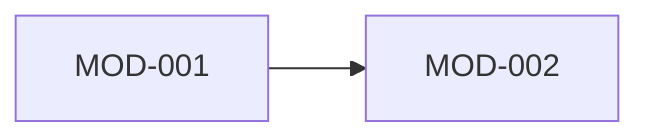

# MessagePick 模块拆分声明

> **状态**: draft
> **生成者**: `docs/prompt/generate_modules.md`
> **上游**: `docs/product/prd.md`
> **下游**: `docs/prompt/generate_api_contract.md`、`docs/prompt/generate_data_model.md`、`docs/prompt/generate_tasks.md`
> **变更中**: —
> **最后更新**: 2026-09-12

<!-- 本文件由 prompt 生成。修改必须走 design-doc-change skill（.github/skills/design-doc-change/SKILL.md，状态机见 docs/README.md §6）。 -->
<!-- 只做声明，不产出实现：不写函数体、不写伪代码、不选技术框架。 -->

## 1. 模块清单

| 模块 ID | 模块名 | 一句话职责 | 来源需求 |
| --- | --- | --- | --- |
| MOD-001 | | | REQ-### |

## 2. 模块详情

### MOD-001 <模块名>

- **职责**：
- **明确不负责**：（比职责更重要）
- **对外接口声明**：入参 / 出参 / 错误码或异常类型
- **持有或依赖的数据**：字段、来源、类型、默认值、约束
- **依赖**：依赖哪些模块
- **被依赖**：被哪些模块调用
- **禁止的依赖方向**：反向依赖、循环依赖
- **验收标准**：可判定，能写成用例

## 3. 模块依赖图

<!-- 标注每条依赖的方向与用途 -->

## 4. 待确认

<!-- > TODO: 待确认 —— <具体问题> -->
