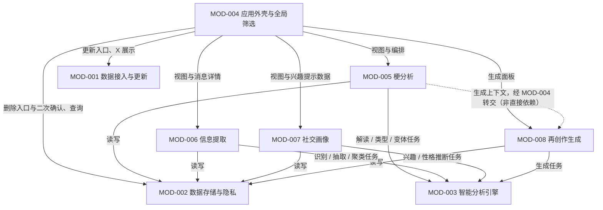

# MessagePick 模块拆分声明

> **状态**: reviewed
> **生成者**: `docs/prompt/generate_modules.md`
> **上游**: `docs/product/prd.md`
> **下游**: `docs/prompt/generate_api_contract.md`、`docs/prompt/generate_data_model.md`、`docs/prompt/generate_tasks.md`
> **变更中**: —
> **最后更新**: 2026-09-12

<!-- 本文件由 prompt 生成。修改必须走 design-doc-change skill（.github/skills/design-doc-change/SKILL.md，状态机见 docs/README.md §6）。 -->
## 1. 模块清单

| 模块 ID | 模块名 | 一句话职责 | 来源需求 |
| --- | --- | --- | --- |
| MOD-001 | 数据接入与更新 | 触发采集 / 导入，维护「记录更新至 X」，判定有无数据 | REQ-001 ~ REQ-003 |
| MOD-002 | 数据存储与隐私 | 唯一的持久化与查询底座；按群删除 / 全量清空的级联删除 | REQ-006、REQ-007、REQ-011、REQ-012 |
| MOD-003 | 智能分析引擎 | 统一执行识别 / 抽取 / 聚类 / 生成 / 推断任务，统一失败、超时、重试语义 | REQ-016 |
| MOD-004 | 应用外壳与全局筛选 | 首屏引导、全局筛选条、设置与数据去向说明、跨模块编排与统一异常呈现 | REQ-002 ~ REQ-005、REQ-012、REQ-016、REQ-017、REQ-018、REQ-070 |
| MOD-005 | 梗分析（模块一） | 梗词云、梗单元、梗生命周期与纠正 | REQ-020 ~ REQ-035（REQ-034 为入口侧）、REQ-039 ~ REQ-042（不负责项） |
| MOD-006 | 信息提取（模块二） | 识别与要素提取、归档、通知总览、待办与提醒、时间轴、详情 | REQ-043 ~ REQ-048、REQ-049（不负责项） |
| MOD-007 | 社交画像（模块三） | 人 ↔ 兴趣双向索引、评分与展示、身份对齐、性格标签确认 | REQ-050 ~ REQ-082、REQ-083 ~ REQ-088（不负责项） |
| MOD-008 | 再创作生成 | G1 / G2 / G3、生成历史与合规确认流 | REQ-009、REQ-013 ~ REQ-015、REQ-034、REQ-036 ~ REQ-038 |

说明：

- 「模块一 / 二 / 三」与 MOD-005 / MOD-006 / MOD-007 一一对应；MOD-008 是从模块一中拆出的独立能力，使合规规则（REQ-013 ~ REQ-015）集中在一处。
- `MOD-000` 保留给模板（`docs/design/impl/mod-000-template.md`），不分配给任何模块。
- 横切需求（REQ-007 ~ REQ-010、REQ-016 ~ REQ-019）不单独成模块：统一收在 §4，并在各模块卡片中落到「职责 / 不负责 / 验收标准」的具体条目上。
- 阶段 2 提问已闭环的裁定（不写入 PRD 的部分）：采集部分失败不阻塞、分项提示、可单独重试；提醒提前 1 天且仅在使用应用期间检查；生成结果保存生成历史；X = 群消息来源的最近成功时间。

## 2. 模块详情

### MOD-001 数据接入与更新

**承接需求**：REQ-001 ~ REQ-003、REQ-016（采集侧）、REQ-019、REQ-082（通讯录 / 好友列表的采集侧）

- **职责**：
  - 提供应用内唯一的采集 / 导入入口（「更新数据」），在同一入口同时接入两个来源：微信数据（群消息、群成员身份，经 wechat-cli）与通讯录 / 好友列表（REQ-001、REQ-002、REQ-082）。
  - 部分失败不阻塞：按来源分别给出结果，失败的来源分项提示并可单独重试（REQ-016，阶段 2 提问裁定）。
  - 维护「记录更新至 X」：X = 群消息来源最近一次成功的采集 / 导入完成时间；通讯录 / 好友列表的状态分项记录、分项展示（REQ-002，阶段 2 提问裁定）。
  - 判定「是否已有数据」：以群消息来源是否已有原始记录为准（三个分析模块都基于群消息）；无记录 → 首屏引导（REQ-003）。
- **明确不负责**：
  - 不做分析、解读、汇总（属 MOD-003 与 MOD-005 ~ MOD-007）。
  - 不做删除与数据清理，也不定义删除范围（属 MOD-002）。
  - 不做界面：更新入口、X 的展示、首屏引导均属 MOD-004。
  - 不做演示数据版本 / 演示模式（REQ-019）。
  - 不对无授权数据做降级模拟：按 REQ-016 说明原因 + 手动重试，不静默失败。
- **对外接口声明**（只声明契约）：

| 接口 | 入参 | 出参 | 错误 |
| --- | --- | --- | --- |
| 触发更新 | 目标来源（选填）：省略 = 全部来源；指定 = 只采集 / 重试该来源 | 分来源结果（群消息、通讯录 / 好友列表）+ 分来源状态 + 本次完成时间 | 无授权（来源 + 原因）；超时（来源 + 已成功来源的结果）；部分失败（失败来源明细，其余来源结果照常返回） |
| 查询更新状态 | 无 | 是否有数据；「记录更新至 X」；各来源最近一次的状态与时间 | 存储不可用 |

- 重试语义：对失败来源可指定「目标来源」单独重试；省略来源即重跑全部来源（写入按记录身份去重，不产生重复数据）。
- **持有或依赖的数据**：

| 字段 / 字段组 | 来源 | 类型 | 默认值 | 约束 |
| --- | --- | --- | --- | --- |
| 来源状态 | 采集结果 | 枚举（成功 / 失败 / 无授权 / 超时） | — | 按来源分别记录，部分失败不阻塞（REQ-016） |
| 完成时间 X | 群消息来源成功完成时写入 | 时间 | — | 只随群消息来源刷新；通讯录 / 好友列表不推进 X（REQ-002，阶段 2 提问裁定） |
| 是否有数据 | 由群消息来源的记录数派生 | 布尔 | 否 | 为「否」时触发首屏引导（REQ-003） |
| 原始采集记录 | wechat-cli、通讯录 / 好友列表 | 记录集 | — | 经 MOD-002 落库，不另存副本（REQ-011） |

- **依赖**：MOD-002（写入采集结果、读取数据状态）。
- **被依赖**：MOD-004（更新入口与 X 的展示）。
- **禁止的依赖方向**：禁止依赖 MOD-003 / MOD-004 / MOD-005 ~ MOD-008（采集层不得反向依赖分析层与业务层）；禁止绕过 MOD-002 另存持久化副本；禁止出现循环依赖。
- **验收标准**：

| 验收标准 | 出处 |
| --- | --- |
| 全流程仅由 wechat-cli 采集数据与通讯录 / 好友列表完成，系统中不存在其他数据来源入口 | REQ-001 |
| 群消息来源成功完成后「记录更新至 X」立即更新为本次完成时间；未执行更新时保持不变 | REQ-002 |
| 通讯录 / 好友列表失败不阻塞整体更新，分项提示且可单独重试 | REQ-016 |
| 无数据环境打开应用：出现首次更新引导与「更新数据」入口，不显示空白分析视图 | REQ-003 |
| 系统中不存在演示数据版本 / 演示模式 | REQ-019 |
| 无授权 / 超时：给出原因并可手动重试，不静默失败 | REQ-016 |

### MOD-002 数据存储与隐私

**承接需求**：REQ-006、REQ-007、REQ-011、REQ-012（数据事实侧）

- **职责**：
  - 全应用唯一的持久化与查询底座：原始记录（群消息、群成员身份、通讯录 / 好友列表）与全部派生结果都经本模块写入与读取（REQ-007、REQ-011）。
  - 按群删除与全量清空：删除范围含原始记录及其全部派生结果（含 MOD-008 的生成历史），不可恢复；执行前提供删除范围预检（REQ-011）。
  - 持有「当前用户身份」：wechat-cli 数据中标识为「Me」的成员，供模块一 / 模块三取「我」的视角（REQ-006）。
- **明确不负责**：
  - 不做采集 / 导入（属 MOD-001）；不做分析（属 MOD-003 与各业务模块）。
  - 不做删除入口、二次确认交互与提示文案（属 MOD-004），也不决定删除入口的界面位置。
  - 不定义派生结果的业务口径 —— 由声明该数据的模块负责。
  - 不做「数据去向」说明的文案与展示（属 MOD-004）；只提供「存了哪些数据、存在哪一类位置」的事实。
- **对外接口声明**：

| 接口 | 入参 | 出参 | 错误 |
| --- | --- | --- | --- |
| 写入记录 | 实体类型 + 记录内容（含记录身份） | 写入结果（成功条数、失败明细） | 存储不可用 |
| 按条件读取 | 实体类型 + 筛选条件（群、时间范围、关键词、身份）+ 分页 | 记录集（含来源消息引用） | 存储不可用 |
| 删除预检 | 删除范围（按群 / 全量） | 受影响实体清单与计数（原始 + 派生） | 存储不可用 |
| 执行删除 | 删除范围 + 二次确认标记 | 删除结果（各实体删除计数） | 缺少二次确认（拒绝执行）；删除中断（已删除部分不可恢复）；存储不可用 |

- 幂等：`写入记录` 按记录身份去重，同一记录重复写入不产生副本；其余接口为查询或幂等操作。
- **持有或依赖的数据**：

| 字段 / 字段组 | 来源 | 类型 | 默认值 | 约束 |
| --- | --- | --- | --- | --- |
| 原始消息记录 | 采集（MOD-001） | 记录集（群、发送者、时间、类型、内容或媒体引用） | — | 每个结论的来源引用必须可回溯到此（REQ-007） |
| 成员身份 | 采集（MOD-001） | 记录集（群、群昵称 / 群名片、Me 标识） | — | Me 标识无需使用者手工设置（REQ-006） |
| 通讯录 / 好友列表 | 采集（MOD-001） | 记录集 | — | 仅用于 REQ-082 的身份对齐候选 |
| 派生结果 | 各业务模块与 MOD-008 写入 | 记录集（按实体类型登记） | — | 必须纳入删除范围（REQ-011） |
| 删除范围与级联关系 | 删除操作时计算 | 结构 | — | 按群 / 全量两种；均不可恢复（REQ-011） |

- **依赖**：无（最底层，不依赖任何模块）。
- **被依赖**：MOD-001、MOD-004、MOD-005、MOD-006、MOD-007、MOD-008。
- **禁止的依赖方向**：禁止依赖任何上层模块（存储层反向依赖业务层即形成循环）；禁止任何模块绕过本模块另存持久化副本（会破坏 REQ-011 的删除完整性）；禁止出现循环依赖。
- **验收标准**：

| 验收标准 | 出处 |
| --- | --- |
| 按群删除与全量清空均要求二次确认标记，缺失时拒绝执行 | REQ-011 |
| 删除后原始记录与全部派生结果均不可再访问且不可恢复 | REQ-011 |
| 删除后「是否已有数据」转为否，重新出现首屏引导 | REQ-003、REQ-011 |
| 无需任何身份设置步骤即可取到「我」（Me 标识） | REQ-006 |
| 任取首现、最近调用、任一条精华消息、梗王统计，均可到达对应原始消息 | REQ-007 |

### MOD-003 智能分析引擎

**承接需求**：REQ-016（分析 / 生成侧的统一兜底）

- **职责**：
  - 统一执行五类模型任务：识别（消息类型）、抽取（要素 / 标签）、聚类（主题）、生成（解读 / 文案变体 / 候选梗）、推断（兴趣 / 性格）；任务语义与判定口径由调用方提供。
  - 对全部任务提供统一的失败、超时、重试语义（REQ-016 的统一兜底在此落地）。
  - 每次任务结果附带来源引用（消息 / 输入标识），供调用方落库后回溯（REQ-007）。
- **明确不负责**：
  - 不定义业务口径：「什么算梗」「通知有哪些类型」「契合度怎么算」等全部属调用方。
  - 不持久化业务数据（调用方经 MOD-002 落库）；不面向使用者，无自带界面入口。
  - 不执行任何社交动作、不发布内容（REQ-084、REQ-015）。
- **对外接口声明**：

| 接口 | 入参 | 出参 | 错误 |
| --- | --- | --- | --- |
| 执行任务 | 任务类型 + 输入内容（消息集合 / 文本 / 上下文）+ 任务参数（调用方给出的语义与判定口径） | 任务结果（结构化结果 + 来源引用）+ 任务引用（供重试） | 任务失败（原因分类，同样携带任务引用）；任务超时（可重试，同样携带任务引用）；输入缺失 / 非法 |
| 重试任务 | 任务引用 | 同「执行任务」（含新的任务引用，可再次重试） | 同「执行任务」；任务引用无效 |

- **持有或依赖的数据**：

| 字段 / 字段组 | 来源 | 类型 | 默认值 | 约束 |
| --- | --- | --- | --- | --- |
| 任务输入 | 调用方 | 内容（消息集合 / 文本 / 上下文） | — | 不落库；是否持久化由调用方决定 |
| 任务结果 | 任务执行 | 结构（结果 + 来源引用） | — | 来源引用必须可回溯到具体输入消息（REQ-007） |
| 失败 / 超时分类 | 任务执行 | 枚举 | — | 随错误返回；支持重试（REQ-016） |

- **依赖**：无。
- **被依赖**：MOD-005、MOD-006、MOD-007、MOD-008。
- **禁止的依赖方向**：禁止依赖任何调用方（业务模块 / 外壳），否则形成循环；禁止调用方绕过本模块直接对接模型服务（会破坏 REQ-016 的统一失败 / 超时 / 重试语义）。
- **验收标准**：

| 验收标准 | 出处 |
| --- | --- |
| 失败 / 超时返回可区分的原因且支持重试；重试成功后结果可正常落库 | REQ-016 |
| 同一任务类型对四个调用模块表现一致：提示 + 重试，且已缓存内容仍可浏览 | REQ-016 |
| 任务结果的来源引用可回溯到具体输入消息 | REQ-007 |
| 本模块无自带界面入口，任何使用者可见结果都来自调用方模块 | REQ-016 |

### MOD-004 应用外壳与全局筛选

**承接需求**：REQ-002（展示侧）、REQ-003、REQ-004、REQ-005、REQ-012、REQ-016（界面侧）、REQ-017、REQ-018、REQ-070（组装侧）

- **职责**：
  - 主界面框架、三个模块的视图容器；首屏引导（无数据时）与「记录更新至 X」的始终展示（REQ-002、REQ-003）。
  - 全局筛选条（群多选 · 时间范围 · 关键词 · 当前用户身份）：全应用唯一的筛选控件，统一作用于三个模块的所有视图；筛选条件作为入参传给各模块的查询接口（REQ-004、REQ-005）。
  - 跨模块编排（业务模块互不依赖，见 §3）：REQ-070 的兴趣内联提示由外壳取 MOD-007 数据后与 MOD-006 的消息详情一起组装；梗单元 → 生成面板的上下文同样由外壳转交。
  - 统一异常呈现：失败 / 超时 → 提示 + 重试且已缓存内容仍可浏览；无结果 → 空态 + 一键清除筛选；无授权 → 说明原因 + 手动重试（REQ-016）。
  - 设置页与「数据去向」说明（首次使用与设置页），删除入口与二次确认交互（REQ-012、REQ-011 的界面侧）。
  - 全站文案遵循术语与命名规则（REQ-017）。
- **明确不负责**：
  - 不做分析、生成、采集与删除执行（分别属 MOD-003、MOD-008、MOD-001、MOD-002）。
  - 不持有业务数据、不复制业务结论（只做转发与组装）。
  - 不定义筛选的匹配对象（REQ-005 由各模块声明并按此过滤）。
  - 不为任何模块另设同类筛选控件（REQ-004、REQ-049）。
- **对外接口声明**：本模块为顶层：**无模块间接口**（没有任何模块依赖它）。对使用者暴露的编排契约如下：

| 接口 | 入参 | 出参 | 错误 |
| --- | --- | --- | --- |
| 首屏引导与更新入口 | 数据状态（来自 MOD-001） | 引导视图或主界面；「记录更新至 X」 | 数据状态不可用（提示 + 重试） |
| 全局筛选 | 使用者的筛选操作 | 统一筛选条件（群多选、时间范围、关键词、身份） | — |
| 消息详情组装（REQ-070） | 消息标识 + 筛选条件 | MOD-006 的详情内容 + MOD-007 的兴趣提示 | 任一子调用失败 → 提示 + 重试，详情正文仍可浏览（REQ-016） |
| 删除流程 | 删除范围 + 使用者二次确认 | 预检结果 → 执行结果 | 未确认不执行；删除失败按 MOD-002 的错误提示 |

- **持有或依赖的数据**：

| 字段 / 字段组 | 来源 | 类型 | 默认值 | 约束 |
| --- | --- | --- | --- | --- |
| 全局筛选条件 | 使用者操作 | 结构（群多选、时间范围、关键词、身份） | — | 唯一来源；所有模块的查询入参取自此处（REQ-004） |
| 是否无数据 | MOD-001 | 布尔 | 否 | 为真时只显示引导（REQ-003） |
| 记录更新至 X | MOD-001 | 时间 | — | 始终可见（REQ-002） |
| 视图与导航状态 | 使用者操作 | 状态 | — | — |

- **依赖**：MOD-001、MOD-002、MOD-005、MOD-006、MOD-007、MOD-008。
- **被依赖**：无（顶层模块）。
- **禁止的依赖方向**：禁止业务模块反向依赖本模块（业务模块不得读取外壳状态、不得替外壳做编排）；禁止本模块持有业务数据副本；禁止出现循环依赖。
- **验收标准**：

| 验收标准 | 出处 |
| --- | --- |
| 无数据打开应用出现引导与「更新数据」入口；有数据时「记录更新至 X」始终可见 | REQ-003、REQ-002 |
| 在任一模块修改筛选，另外两个模块视图同步受限；模块内不存在第二组时间 / 关键词 / 群筛选控件 | REQ-004、REQ-049 |
| 首次使用流程与设置页均可看到「数据去向」说明 | REQ-012 |
| 失败 / 超时 / 无结果 / 无授权四种情形按统一表现处理 | REQ-016 |
| 消息详情中的兴趣提示来自 MOD-007，且仅含已确认的数据 | REQ-070、REQ-075 |
| 全站文案不含英文术语名；「梗词云」与「个人标签词云」、「梗生命周期」与「消息时间轴」不混用 | REQ-017 |
| 三个业务模块的视图互不依赖对方的可用性，可并列交付 | REQ-018 |

### MOD-005 梗分析（模块一）

**承接需求**：REQ-005（梗名与解读）、REQ-006（我相关视角）、REQ-007、REQ-008、REQ-010、REQ-020 ~ REQ-033、REQ-034（入口侧）、REQ-035、REQ-039 ~ REQ-042（不负责项）

- **职责**：
  - 梗词云：字号 = 出现频率（默认累计出现次数，可切「指定时间窗内出现频次」）；颜色 = 梗类型（口头禅 / 内部梗 / 表情包梗，≤3 类）带图例与文字标签；布局可切按热度 / 按首次出现时间；悬停显示出现次数、首现时间、最近调用、类型；提供等价的列表 / 表格视图（REQ-020 ~ REQ-024）。
  - 梗单元：解读（什么意思 / 从哪来 / 现在怎么用）、首现时间与来源群、最近调用时间与距今（均可跳回原始消息）、累计次数与周环比趋势、按月分布（标注不完整月份）、生命周期条、梗王、精华消息（默认 3 条、可展开更多、每条可看上下文）、相关变体（REQ-026 ~ REQ-033）。
  - 梗生命周期视图：每梗一行、条带内按月强度、首现 / 峰值 / 沉寂点、当月领跑梗、可复制表格视图（REQ-025）。
  - 纠正：不是梗 / 不感兴趣 / 合并到其他梗 / 梗王标注有误，改判立即影响后续结果（REQ-035）；「我相关」的只看 / 标注视角（REQ-006）。
  - 为再创作生成准备上下文（梗标识、解读、变体、精华消息中的图片引用），由 MOD-004 转交给 MOD-008。
- **明确不负责**：
  - 不做 G1 / G2 / G3 生成与生成历史（属 MOD-008）；本模块只提供「生成」入口的挂载点（REQ-034）。
  - 不做梗的情感倾向 / 立场分析（REQ-039）。
  - 不做跨群梗的自动合并（仅由使用者手动发起）（REQ-040）。
  - 不做梗王之外的成员画像（REQ-041）；不做 G4 规划中的功能（接话草稿、群年度报告、新人补课卡片、梗百科词条）（REQ-042）。
  - 不做信息提取与社交画像（MOD-006、MOD-007），也不直接依赖它们。
- **对外接口声明**：

| 接口 | 入参 | 出参 | 错误 |
| --- | --- | --- | --- |
| 查询梗词云 | 全局筛选条件 + 字号口径（累计 / 时间窗）+ 布局（热度 / 首现时间） | 梗条目（梗名、频率值、类型、首现日期）+ 图例；表格视图数据与之等价 | 分析失败 / 超时（提示 + 重试）；无数据 / 筛选无结果（空态） |
| 查询梗单元 | 梗标识 + 全局筛选条件 | 解读、首现时间与来源群、最近调用时间与距今、累计次数、周环比、月度分布、生命周期、梗王、精华消息、相关变体、来源消息引用 | 梗不存在；分析失败 / 超时 |
| 查询生命周期视图 | 全局筛选条件 + 月份范围 | 每梗条带（首现 / 峰值 / 沉寂 / 活跃天数 / 按月强度）+ 当月领跑梗 | 分析失败 / 超时；无数据 |
| 提交纠正改判 | 梗标识 + 改判类型（4 类）+ 合并目标（仅「合并到其他梗」时） | 改判后的最新梗数据 | 梗不存在；合并目标不存在；存储不可用 |
| 查询「我相关」梗 | 全局筛选条件 + 视角（我用过的 / 我参与消息里的） | 梗条目（附来源引用） | 身份未就绪（提示 + 手动重试）；无结果（空态） |

- **持有或依赖的数据**：

| 字段 / 字段组 | 来源 | 类型 | 默认值 | 约束 |
| --- | --- | --- | --- | --- |
| 梗名 / 类型 / 解读 | 任务产出 + 使用者改判 | 文本 / 枚举（3 类） | — | 类型 ≤3 类且带图例与文字标签（REQ-020） |
| 首现时间（含来源群）、最近调用时间 | 任务产出 | 时间 / 引用 | — | 均可跳回原始消息（REQ-027） |
| 累计出现次数 / 周环比 / 热度状态 | 计算 | 数值 / 枚举 | — | 热度状态：≤7 天活跃、8–30 天衰减中、>30 天已沉寂（REQ-028） |
| 月度分布 | 计算 | 数值序列 | — | 柱状图可切表格、悬停显数值、标注不完整月份（REQ-029） |
| 生命周期 | 计算 | 结构（首现 / 峰值 / 沉寂 / 活跃天数） | — | 条带长度 = 生命周期跨度（REQ-025、REQ-030） |
| 梗王、主要使用者 | 统计 | 结构（成员 + 次数 + 占比） | — | 只呈现可统计事实（REQ-031） |
| 精华消息 | 任务产出 | 引用集 | 3 条 | 文字与图片 / 表情包都支持、图片可预览、可展开更多（REQ-032） |
| 相关变体 | 任务产出 | 引用集 | — | 可点击切换（REQ-033） |
| 纠正标记 | 使用者改判 | 枚举（4 类） | 无 | 立即影响后续结果（REQ-008、REQ-035） |
| 词云口径 | 使用者切换 | 枚举（累计 / 时间窗） | 累计出现次数 | 字号 = 频率（REQ-020） |

- **依赖**：MOD-002（读写）、MOD-003（解读 / 类型 / 变体等任务执行）。
- **被依赖**：MOD-004（视图、生成入口与上下文转交）。
- **禁止的依赖方向**：禁止依赖 MOD-006 / MOD-007 / MOD-008（业务模块互不依赖，跨模块数据由 MOD-004 转交）；禁止反向依赖 MOD-004；禁止绕过 MOD-002 另存副本；禁止绕过 MOD-003 直接对接模型服务。
- **验收标准**：

| 验收标准 | 出处 |
| --- | --- |
| 字号与频率正相关；默认累计口径可切换；颜色仅对应 ≤3 类且有图例，每类另有文字标签 | REQ-020 |
| 列表 / 表格视图展示与词云相同口径下的全部梗数据 | REQ-021 |
| 点击任意梗词在该词位置展开对应梗单元；切换布局后词序按首现时间排列并标注首现日期 | REQ-022、REQ-023 |
| 悬停任意词显示出现次数、首现时间、最近调用、类型四项 | REQ-024 |
| 生命周期视图与表格数据一致、可复制，且可点击打开对应梗单元 | REQ-025 |
| 梗单元的解读、时间与来源、次数与趋势、分布、生命周期条、梗王、精华消息、变体齐全且可回溯 | REQ-026 ~ REQ-033、REQ-007 |
| 四项改判均可执行；执行后词云与相关统计立即更新 | REQ-008、REQ-035 |
| 全站不存在情感倾向 / 立场相关的字段、图表或结论 | REQ-039 |
| 模块输出中不存在梗王之外的成员画像类内容；G4 规划功能无入口 | REQ-041、REQ-042 |
| 万条级消息数据下首屏渲染 < 2s | REQ-010 |

### MOD-006 信息提取（模块二）

**承接需求**：REQ-005（消息文本与 AI 总结）、REQ-006（不区分身份）、REQ-007、REQ-008、REQ-010、REQ-043 ~ REQ-048、REQ-049（不负责项）

- **职责**：
  - 自动识别与要素提取：群公告、@所有人、接龙、投票、报名、缴费、会议、活动、截止日期等；提取时间、地点、人物、事项、DDL（REQ-043）。
  - 归档（时间、主题；主题由模型聚类命名、可改）与通知总览（来源、类型、优先级、待办；优先级可改）（REQ-044、REQ-045）。
  - 待办：支持「完成」「忽略」标记；到期前应用内提醒 —— 仅在使用应用期间检查，提前 1 天（REQ-046，阶段 2 提问裁定）。
  - 消息时间轴：全部提取消息按时间排序；群多选（来自全局筛选条）后只看选中群（REQ-047）。
  - 消息详情：heading = 一句话总结 + 来源群 + 时间；正文 = AI 总结 + 所有来源群消息（REQ-048）。
- **明确不负责**：
  - 不另做一套筛选（按时间 / 关键词 / 群）（REQ-049）。
  - 不做梗分析与社交画像（MOD-005、MOD-007），也不直接依赖它们；消息详情中的兴趣提示由 MOD-004 组装（REQ-070）。
  - 不做后台常驻 / 系统级提醒（无后台调度，仅在使用应用期间检查）（REQ-046，阶段 2 提问裁定）。
  - 不代发消息、不执行任何动作（REQ-084 同理的口径）。
- **对外接口声明**：

| 接口 | 入参 | 出参 | 错误 |
| --- | --- | --- | --- |
| 查询提取条目 | 全局筛选条件 | 条目（识别类型、要素、来源群、时间、来源消息引用） | 分析失败 / 超时（提示 + 重试，已提取内容仍可浏览）；无数据 / 无结果（空态） |
| 查询通知总览 | 全局筛选条件 + 浏览维度（来源 / 类型 / 优先级 / 待办） | 分组的通知列表 | 同上 |
| 修改主题 / 优先级 | 条目标识 + 新值 | 更新后的条目 | 条目不存在；存储不可用 |
| 标记待办状态 | 条目标识 + 完成 / 忽略 | 待办状态 | 条目不存在；存储不可用 |
| 查询到期待办 | 当前时间 | 距到期 ≤1 天且未完成的待办清单 | 存储不可用 |
| 查询消息详情 | 条目标识 | heading（一句话总结 + 来源群 + 时间）+ 正文（AI 总结 + 所有来源消息） | 条目不存在；分析失败 / 超时 |

- **持有或依赖的数据**：

| 字段 / 字段组 | 来源 | 类型 | 默认值 | 约束 |
| --- | --- | --- | --- | --- |
| 提取条目与要素 | 任务产出 | 结构（识别类型 + 时间 / 地点 / 人物 / 事项 / DDL） | — | 至少覆盖 REQ-043 列出的九类 |
| 来源群 / 来源消息引用 | 任务产出 | 引用 | — | 详情正文必须含所有来源消息（REQ-048） |
| 主题 | 任务产出 + 使用者修改 | 文本 | — | 可改、改后立即生效（REQ-044、REQ-008） |
| 优先级 | 任务产出 + 使用者修改 | 枚举 | — | 可改、改后立即生效（REQ-045、REQ-008） |
| 待办状态 | 使用者标记 | 枚举（未处理 / 完成 / 忽略） | 未处理 | 支持完成与忽略（REQ-046） |
| 提醒状态 | 计算（到期前 1 天、使用者使用应用时检查） | 状态 | — | 仅在使用应用期间提示（REQ-046） |
| 关键词过滤对象 | 使用者输入 | 文本 | — | 仅匹配消息文本与 AI 总结（REQ-005） |

- **依赖**：MOD-002、MOD-003。
- **被依赖**：MOD-004（视图、消息详情承载与 REQ-070 组装）。
- **禁止的依赖方向**：禁止依赖 MOD-005 / MOD-007 / MOD-008（业务模块互不依赖）；禁止反向依赖 MOD-004；禁止自建第二组筛选控件（REQ-049）；禁止绕过 MOD-002 / MOD-003。
- **验收标准**：

| 验收标准 | 出处 |
| --- | --- |
| 覆盖九类的样例消息均被识别为条目，并填充时间、地点、人物、事项、DDL | REQ-043 |
| 条目可按主题归档；主题可被修改并立即生效 | REQ-044 |
| 通知总览可按来源 / 类型 / 优先级 / 待办浏览；优先级可被修改 | REQ-045 |
| 待办可标记「完成」「忽略」；距到期 ≤1 天且在使用应用时出现提醒 | REQ-046 |
| 时间轴按时间排序；切换群多选后只显示选中群的条目 | REQ-047 |
| 详情 heading 与正文（AI 总结 + 所有来源消息）齐全 | REQ-048 |
| 模块内不存在全局筛选条之外的第二组时间 / 关键词 / 群筛选控件 | REQ-049 |
| 模块二界面无身份维度 | REQ-006 |
| 万条级消息数据下首屏渲染 < 2s | REQ-010 |

### MOD-007 社交画像（模块三）

**承接需求**：REQ-005（标签名与成员昵称）、REQ-006（我相关视角）、REQ-007 ~ REQ-010、REQ-050 ~ REQ-082、REQ-083 ~ REQ-088（不负责项）

- **职责**：
  - 双向索引：人 → 兴趣（人物兴趣画像）与兴趣 → 人（找搭子），同一份数据互为反查（REQ-050）；分析对象是整个群的社交生态，匹配范围跨全部已采集的历史群（REQ-051）。
  - 兴趣标签：模型抽取（每条附带证据消息并判定一级维度）、同义合并、人工增 / 删 / 改（REQ-053 ~ REQ-056）。
  - 评分：兴趣热度分与兴趣置信度（REQ-078）、契合度（共同标签数 + 强度 / 置信度加权 + 实际互动 + 活跃度只计一次）（REQ-057、REQ-058）、我的社交契合度（逐人列表 + 整体融入度）（REQ-079）、雷达图维度分（= 该维度全部二级标签置信度之和）（REQ-080）；逐维度差值（REQ-059）。
  - 产物：兴趣 → 人列表（REQ-060）、人 → 兴趣画像（性格标签须已确认才出现，REQ-061）、人-人配对（共同爱好 + 契合度 + 逐维度差值，REQ-062）；反向搜索支持「按维度搜」与「按具体标签搜」两个入口（REQ-064），结果中展示每人的回复时长与活跃度（REQ-065）。
  - 展示：时间轴 / 事件流（可回放兴趣的首现与兴衰，REQ-067）、评分卡 / 仪表盘（REQ-068）、人-人关系图谱（节点 = 人，连线 = 共同爱好，REQ-069）、爱好雷达图（五轴 = 运动 / 艺术 / 游戏 / 娱乐 / 社交，点击轴展开二级词条，REQ-071）、性格雷达图（REQ-072）、个人标签词云（REQ-073）；并提供 REQ-070 所需的「成员兴趣提示」查询，由 MOD-004 组装。
  - 组局建议：在反向社交结果中选定一个兴趣后生成，仅输出文字建议（不生成待办、不生成可直接发送的文案）（REQ-063）。
  - 性格标签：六维闭集（领导式 / 活泼 / 幽默 / 冷静 / 理性 / 判断）、模型推断、使用者确认后入库、可增可删可改（REQ-074、REQ-075、REQ-076）、仅使用者本人可见（REQ-077）。
  - 跨群身份对齐：结合通讯录 / 好友列表给出候选，在使用者逐条确认 / 否定后生效；未确认不生效（REQ-082）。
  - 未知成员：发言不足者标「未知」、不做推测，但仍列出并在人-人图谱中零连线（REQ-081）。
- **明确不负责**：
  - 不做自动监测推送（只做使用者主动查询）（REQ-083）。
  - 不执行任何社交动作：不替你发消息、不建群（REQ-084）。
  - 推断结果不外露给群成员、无对外分享通道（REQ-085）；性格标签不对使用者以外任何人可见（REQ-077）。
  - 不做时效衰减（REQ-086）；时间轴 / 事件流不参与权重计算（REQ-087）；不做「活跃时间 / 夜猫指数」（REQ-088）。
  - 不负责跨群身份数据的采集与存储（MOD-001、MOD-002）；不负责消息详情界面（MOD-006）与兴趣提示的组装（MOD-004）。
- **对外接口声明**：

| 接口 | 入参 | 出参 | 错误 |
| --- | --- | --- | --- |
| 查询人物画像 | 成员标识（含「我」）+ 全局筛选条件 | 二级标签（含置信度与证据引用）、一级维度分、爱好雷达、个人标签词云、性格标签（仅已确认） | 分析失败 / 超时；无数据 / 无结果（空态） |
| 查询兴趣 → 人 | 检索入口（一级维度 / 二级标签）+ 全局筛选条件 | 人选列表（含回复时长、活跃度、未知标记） | 同上 |
| 查询两人配对 | 两个成员标识 | 共同爱好 + 契合度 + 逐维度差值 | 成员不存在；分析失败 / 超时 |
| 查询「我的社交契合度」 | 「我」 | 逐人契合度列表 + 整体融入度分数 | 身份未就绪；分析失败 / 超时 |
| 生成组局建议 | 选定兴趣 + 候选人集合 | 纯文字建议 | 分析失败 / 超时；无候选 |
| 查询身份对齐候选 | 无 | 候选映射（含通讯录 / 好友列表来源与状态；未确认不生效） | 候选来源不可用（说明原因 + 手动重试） |
| 提交身份对齐结论 | 候选标识 + 结论（确认 / 否定） | 映射状态（未确认 / 已确认 / 已否定；未确认与否定均不生效） | 候选不存在；存储不可用 |
| 性格标签确认与增删改 | 成员标识 + 六维标签 + 操作 | 标签状态（确认后才进入产物） | 值不在闭集内；标签不存在；存储不可用 |
| 增删改兴趣标签 | 成员标识 + 标签 + 操作 | 更新后的画像与匹配结果 | 标签不存在；存储不可用 |
| 查询成员兴趣提示 | 成员标识集合 | 每个成员的已确认兴趣提示 | 无数据（不显示提示） |

- **持有或依赖的数据**：

| 字段 / 字段组 | 来源 | 类型 | 默认值 | 约束 |
| --- | --- | --- | --- | --- |
| 人物 | 采集 + 身份对齐 | 记录（群昵称 / 群名片、跨群映射及确认状态） | — | 未确认映射不生效（REQ-082） |
| 兴趣标签（一级 / 二级） | 任务产出 + 合并 + 人工增删改 | 结构（一级五类固定；二级自由；置信度；证据引用） | — | 一级不增不减；每条标签必须有证据，无证据不入画像（REQ-052 ~ REQ-054） |
| 同义标签归并组 | 任务产出 + 人工修正 | 结构 | — | 归并为同一条（REQ-055） |
| 活跃度 / 发言量 | 统计（跨全部已采集群合并到人） | 数值 | — | 与「社交」维度同源；契合度中只计一次（REQ-057） |
| 回复时长 | 统计（被 @ 或直接接话 → 首条回复间隔的中位数） | 数值 | — | 排除纯表情回复与跨天回复；跨群合并到人（REQ-066） |
| 契合度 / 维度分 / 整体融入度 | 计算 | 数值 | — | 维度分 = 该维度二级标签置信度求和；不做时效衰减（REQ-058、REQ-080、REQ-086） |
| 性格标签 | 任务产出 + 使用者确认 | 枚举（六维闭集）+ 分数 | — | 未确认候选不得出现在任何产物与视图；仅使用者本人可见（REQ-074、REQ-075、REQ-077） |
| 时间轴 / 事件流 | 计算 | 结构 | — | 仅用于回放兴衰过程，不参与权重（REQ-067、REQ-087） |
| 未知标记 | 判定（发言不足） | 枚举 | — | 不推测；仍列出；图谱中零连线（REQ-081） |

- **依赖**：MOD-002、MOD-003。
- **被依赖**：MOD-004（视图与 REQ-070 的兴趣提示数据）。
- **禁止的依赖方向**：禁止依赖 MOD-005 / MOD-006 / MOD-008（业务模块互不依赖）；禁止反向依赖 MOD-004；禁止绕过 MOD-002 / MOD-003；禁止任何以使用者以外对象为出口的数据通道（REQ-077、REQ-085）。
- **验收标准**：

| 验收标准 | 出处 |
| --- | --- |
| 从人查到兴趣、从兴趣查到人，两侧结果一致 | REQ-050 |
| 匹配范围跨全部已采集的历史群；分析以群的社交生态为整体视角呈现 | REQ-051 |
| 一级维度固定五类且不可增删；二级标签可自由创建 | REQ-052 |
| 每个兴趣标签都可「打开更多」并显示至少一条证据消息原文；无证据的标签不进入画像 | REQ-053、REQ-054 |
| 指定同义标签在系统中归并为同一条；增 / 删 / 改均生效并同步影响画像与匹配 | REQ-055、REQ-056、REQ-008 |
| 契合度随共同标签数量、强度 / 置信度、实际互动变化；活跃度只计一次 | REQ-057、REQ-058 |
| 任一维度分等于该维度下全部二级标签的置信度之和（可复算） | REQ-080 |
| 「我的社交契合度」同时给出逐人列表与整体融入度单一分数 | REQ-079 |
| 三类产物（兴趣 → 人、人 → 兴趣、人-人配对）与两种检索入口（按维度 / 按标签）均可返回结果 | REQ-060、REQ-061、REQ-062、REQ-064 |
| 搜索结果中每人显示回复时长与活跃度 | REQ-065 |
| 人-人图谱节点为人、连线为共同爱好；爱好雷达图为五轴且点击任一轴可展开该维度二级词条 | REQ-069、REQ-071 |
| 性格标签只落在六个闭集维度内；未确认不出现；可增可删可改；仅使用者本人可见 | REQ-072、REQ-074、REQ-075、REQ-076、REQ-077 |
| 未确认的身份映射不生效；候选可逐条确认 / 否定且包含通讯录 / 好友列表来源 | REQ-082 |
| 发言不足的成员显示「未知」、不被推断，仍出现在列表且在图谱中为孤立节点 | REQ-081 |
| 系统无自动推送入口、无执行社交动作的路径、无对外分享 / 发送通道 | REQ-083 ~ REQ-085 |
| 万条级消息数据下首屏渲染 < 2s（跨全部已采集群的量级超限时按 PRD 遗留风险回流） | REQ-010 |

### MOD-008 再创作生成

**承接需求**：REQ-009、REQ-013 ~ REQ-015、REQ-034（面板侧）、REQ-036 ~ REQ-038

- **职责**：
  - G1 生成表情包：选素材档位（三档单选其一：参考群内相关图片 / 改编热门表情包 / 纯模板生成）+ 选模板 + 编辑文案 → 生成 4 张（同一模板下 4 个文案变体）→ 复制 / 下载（REQ-036）。
  - G2 生成更多文字变体：基于该梗的用法生成更多说法 / 句式，默认 5 条，可一键复制（REQ-037）。
  - G3 创造新梗：从近期聊天发现潜在新梗，生成候选梗单元（含义推测、出处消息、使用示例），经使用者确认后才入库并进入词云等视图（REQ-038）。
  - 生成历史：保存生成结果，可回看与再次下载（阶段 2 提问裁定）。
  - 合规：生成内容标注「创作」；用成员头像 / 照片 / 原话作素材必须经确认；只产出候选，不自动发布、不自动替换群内正在用的说法（REQ-013 ~ REQ-015）。
- **明确不负责**：
  - 不做梗的判定、统计与维护（属 MOD-005）；不做展示视图容器（属 MOD-004）；梗单元上的「生成」入口挂载点属 MOD-005。
  - 不自动发布、不自动替换群内说法、不伪造成真实聊天记录（REQ-013、REQ-015）。
  - 不提供对外分享 / 发送通道。
  - 不负责梗上下文的取数：由 MOD-004 从 MOD-005 转交，避免业务模块互相依赖。
- **对外接口声明**：

| 接口 | 入参 | 出参 | 错误 |
| --- | --- | --- | --- |
| 生成表情包 | 梗上下文（梗标识、解读、变体、精华图片引用）+ 素材档位（三档单选）+ 模板 + 文案 | 4 张文案变体图引用 + 「创作」标注 | 素材未确认（成员头像 / 照片 / 原话）；来源素材不可用；生成失败 / 超时（可重试） |
| 生成文字变体 | 梗上下文 | 默认 5 条说法 / 句式 | 生成失败 / 超时（可重试） |
| 生成新梗候选 | 近期消息范围（+ 分析结果引用） | 候选（含义推测、出处消息、使用示例）+ 候选状态 | 生成失败 / 超时；无候选 |
| 确认候选入库 | 候选标识 + 使用者确认 | 入库后的梗标识（进入词云等视图） | 候选不存在；存储不可用 |
| 查询生成历史 | 全局筛选条件 | 历史记录（类型、时间、梗、素材档位、产出引用） | 无记录（空态） |

- **持有或依赖的数据**：

| 字段 / 字段组 | 来源 | 类型 | 默认值 | 约束 |
| --- | --- | --- | --- | --- |
| 生成历史 | 生成动作 | 记录（类型 G1 / G2 / G3、梗标识、素材档位、模板、产出引用、时间） | — | 可回看与再次下载；随所属数据一并删除（REQ-011） |
| 候选梗单元 | 任务产出 + 使用者确认 | 结构（含义推测、出处消息引用、使用示例） | — | 确认前不入词云，确认后才入库（REQ-038） |
| 素材档位 | 使用者单选 | 枚举（三档之一） | — | 单选其一，不可多选（REQ-036） |
| 合规确认记录 | 使用者确认 | 状态 | — | 成员素材未确认不得产出（REQ-014） |
| 「创作」标注 | 生成时附加 | 标记 | — | 全部生成物必须带标注（REQ-013） |

- **依赖**：MOD-002（生成历史与候选落库）、MOD-003（生成任务执行）。
- **被依赖**：MOD-004（生成面板容器与上下文转交）。
- **禁止的依赖方向**：禁止依赖 MOD-005 / MOD-006 / MOD-007（业务模块互不依赖；梗上下文由 MOD-004 转交）；禁止反向依赖 MOD-004；禁止任何自动发布 / 自动替换群内说法的路径（REQ-015）；禁止绕过 MOD-002 / MOD-003。
- **验收标准**：

| 验收标准 | 出处 |
| --- | --- |
| 生成结果为 4 张同一模板的文案变体图，可复制 / 下载；素材来源为三档中的一个，不可多选 | REQ-036 |
| 文字变体默认输出 5 条，可一键复制 | REQ-037 |
| 候选包含含义推测、出处消息、使用示例；确认前不出现在词云，确认后进入词云等视图 | REQ-038、REQ-009 |
| 生成的表情包 / 文字变体带有「创作」标注；内容不呈现为伪造的聊天记录 | REQ-013 |
| 使用成员头像 / 照片 / 原话素材时：未确认不能生成，确认后可生成 | REQ-014 |
| 系统中不存在自动发布或自动替换群内说法的功能路径 | REQ-015 |
| 生成历史可回看、可再次下载 | 阶段 2 提问裁定 |

## 3. 模块依赖图

依赖说明（每条边的方向与用途）：

| 依赖边 | 方向与用途 | 出处 |
| --- | --- | --- |
| MOD-001 → MOD-002 | 采集结果落库；读取数据状态 | REQ-001、REQ-002 |
| MOD-005 / MOD-006 / MOD-007 / MOD-008 → MOD-002 | 业务数据与生成历史的持久化、查询与级联删除 | REQ-007、REQ-011 |
| MOD-005 / MOD-006 / MOD-007 / MOD-008 → MOD-003 | 模型任务的统一执行与失败 / 超时 / 重试语义 | REQ-016 |
| MOD-004 → MOD-001 / MOD-002 | 更新入口、X 展示、删除入口与二次确认 | REQ-002、REQ-011 |
| MOD-004 → MOD-005 / MOD-006 / MOD-007 / MOD-008 | 视图容器、全局筛选入参、跨模块组装（含 REQ-070 的内联提示） | REQ-004、REQ-070 |
| MOD-005 ⇢ MOD-008（虚线：数据转交，非依赖） | 生成所需的梗上下文由 MOD-004 转交；两个模块之间不发生直接依赖 | REQ-034、REQ-036 ~ REQ-038 |

全图层禁止的依赖方向：

| 禁止 | 原因 |
| --- | --- |
| 业务模块之间直接依赖（MOD-005 / MOD-006 / MOD-007 / MOD-008 互相指认） | REQ-018 三模块并列交付；跨模块数据一律由 MOD-004 转交 |
| 下层反向依赖上层（MOD-001 ~ MOD-003 依赖任何业务模块；业务模块依赖 MOD-004） | 反向依赖必然形成循环，分层失效 |
| 任何模块绕过 MOD-002 另存持久化副本 | 会破坏 REQ-011 的删除完整性（派生结果漏删） |
| 任何模块绕过 MOD-003 直接对接模型服务 | 会破坏 REQ-016 的统一失败 / 超时 / 重试语义 |
| 任何以使用者以外对象为出口的数据通道 | REQ-077、REQ-085 |

## 4. 跨模块横切约定

| 约定 | 内容 | 出处 |
| --- | --- | --- |
| 全局筛选 | 唯一筛选条在 MOD-004；各模块的查询入参必须接受筛选条件，不得自建同类控件 | REQ-004、REQ-049 |
| 关键词对象 | 模块一 = 梗名与解读；模块二 = 消息文本与 AI 总结；模块三 = 标签名与成员昵称 | REQ-005 |
| 身份 | 「我」= Me 标识，由 MOD-002 持有；模块一 / 三生效，模块二不区分身份 | REQ-006 |
| 可追溯 | 每条结论带来源消息引用，引用可回跳到原文 | REQ-007 |
| 可纠正 | 改判与人工增删改一经提交立即影响后续结果 | REQ-008 |
| 可确认 | 新梗候选、性格标签、成员素材、身份映射：未确认不得进入任何产物与视图 | REQ-009、REQ-038、REQ-075、REQ-082 |
| 统一异常 | 失败 / 超时 → 提示 + 重试且已缓存内容仍可浏览；无结果 → 空态 + 一键清除；无授权 → 说明原因 + 手动重试 | REQ-016 |
| 性能 | 三个模块统一首屏 < 2s（万条级）；模块三跨全部已采集群，量级超限时按 PRD 遗留风险回流 | REQ-010 |
| 提醒 | 到期前 1 天；仅在使用应用期间检查并提示（无后台常驻） | REQ-046、阶段 2 提问裁定 |
| 术语与命名 | 只使用中文术语；「梗词云」≠「个人标签词云」；「梗生命周期」≠「消息时间轴」 | REQ-017 |
| 无演示数据 | 任何模块不得提供演示 / 模拟数据入口 | REQ-019 |
| 删除完整性 | 全部持久化数据（原始记录 + 派生结果 + 生成历史）都在 MOD-002 的删除范围内 | REQ-011 |
| 生成合规 | 生成物标注「创作」；不自动发布、不替换群内说法；素材三档单选 | REQ-013 ~ REQ-015、REQ-036 |

## 5. 待确认

无。阶段 2 的 5 条提问与 1 条补问已全部闭环；本文件不含未决 `TODO`。
