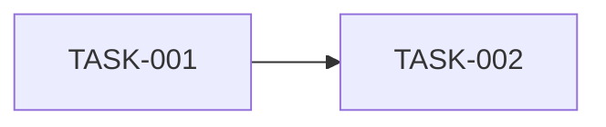

# MessagePick 实施任务拆分

> **状态**: draft
> **生成者**: `docs/prompt/generate_tasks.md`
> **上游**: `docs/design/modules.md`、`docs/design/api-contract.md`、`docs/design/data-model.md`
> **下游**: `docs/prompt/generate_acceptance_tests.md`
> **变更中**: —
> **最后更新**: 2026-09-12

<!-- 本文件由 prompt 生成。修改必须走 design-doc-change skill（.github/skills/design-doc-change/SKILL.md，状态机见 docs/README.md §6）。 -->
<!-- 不指定技术栈、不写代码、不写命令。 -->

## 1. 任务清单

| 任务 ID | 任务名 | 覆盖对象 | 前置依赖 | 规模 | 完成判据 |
| --- | --- | --- | --- | --- | --- |
| TASK-001 | | MOD-### / API-### / DM-### | — | S/M/L | |

## 2. 阶段与顺序

<!-- 按可交付的批次分组，标注关键路径 -->

## 3. 未覆盖的下游条目

<!-- 列出没有任务承接的 API-### / DM-###，并说明原因或提问 -->

## 4. 待确认

<!-- > TODO: 待确认 —— <具体问题> -->
