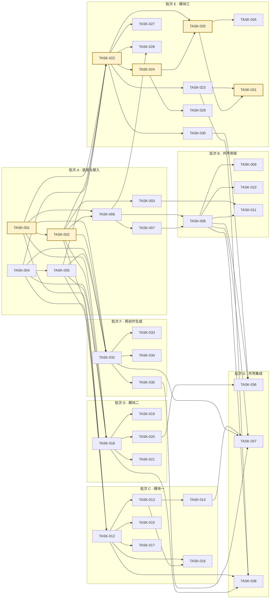

# MessagePick 实施任务拆分

> **状态**: reviewed
> **生成者**: `docs/prompt/generate_tasks.md`
> **上游**: `docs/design/modules.md`、`docs/design/api-contract.md`、`docs/design/data-model.md`
> **下游**: `docs/prompt/generate_acceptance_tests.md`
> **变更中**: —
> **最后更新**: 2026-09-12

<!-- 本文件由 prompt 生成。修改必须走 design-doc-change skill（.github/skills/design-doc-change/SKILL.md，状态机见 docs/README.md §6）。 -->
<!-- 不指定技术栈、不写代码、不写命令。 -->

## 1. 任务清单

> 规模为相对量级（S / M / L），不代表人天；前置依赖为「无」表示无任何前置任务。
> 完成判据只引用已定义条目（`MOD-###` 的验收标准 / `API-###` 的契约行为 / `DM-###` 的字段约束）；具体 `AC-###` 由阶段 6 依据本表生成（阶段 5 提问 1/2 裁定）。

| 任务 ID | 任务名 | 覆盖对象 | 前置依赖 | 规模 | 完成判据 |
| --- | --- | --- | --- | --- | --- |
| TASK-001 | 持久化写入与身份去重 | MOD-002；API-003；DM-001 ~ DM-022（写入路径） | 无 | M | ① DM-001 ~ DM-022 全部实体类型可按「实体类型 + 记录内容（含记录身份）」写入，覆盖原始记录与派生结果（含生成历史）；② 同一记录身份重复写入不产生副本（API-003 幂等）；③ 存储不可用时返回 STORAGE_UNAVAILABLE，并给出逐条失败明细（记录 + 原因）。 |
| TASK-002 | 条件读取与分页 | MOD-002；API-004；DM-002 ~ DM-022（读取路径） | TASK-001 | M | ① 按「实体类型 + 筛选条件（群 / 时间范围 / 关键词 / 身份）+ 页码 / 每页条数」返回记录集与分页信息，页码与每页条数默认 1 / 50 且恒 ≥1；② 命中记录带来源消息引用；③ 关键词匹配对象按模块口径（模块一 = 梗名与解读、模块二 = 消息文本与 AI 总结、模块三 = 标签名与成员昵称）。 |
| TASK-003 | 删除预检与级联删除 | MOD-002；API-005、API-006；DM-002 ~ DM-022（级联范围） | TASK-001、TASK-002 | L | ① 预检按删除范围（按群 / 全量）返回受影响实体清单与计数，含全部派生结果与生成历史；② 缺二次确认标记时返回 CONFIRMATION_REQUIRED 拒绝执行；③ 执行后原始记录与全部派生结果不可再访问且不可恢复；④ 删除后「是否有数据」（DM-001 派生字段）回落为否；⑤ 删除中断返回 DELETION_INTERRUPTED，提示已删除部分不可恢复。 |
| TASK-004 | 模型任务执行 | MOD-003；API-007 | 无 | M | ① 五类任务（识别 / 抽取 / 聚类 / 生成 / 推断）均可按「任务类型 + 输入内容 + 任务参数」执行并返回结构化结果；② 每条结果携带可回溯到具体输入消息的来源引用；③ 返回「任务引用」供重试；④ 失败 / 超时分别返回 ANALYSIS_FAILED / TIMEOUT 并同样携带任务引用；⑤ 输入缺失或非法返回 INVALID_INPUT；⑥ 本能力无自带界面入口，使用者可见结果均来自调用方模块。 |
| TASK-005 | 任务重试 | MOD-003；API-008 | TASK-004 | S | ① 凭「任务引用」重试失败 / 超时任务，返回同构结果与新的任务引用（可再次重试）；② 任务引用无效返回 INVALID_INPUT；③ 重试成功的结果可由调用方经 API-003 落库，且四个调用模块获得一致的失败 / 超时 / 重试语义。 |
| TASK-006 | 采集与导入（两来源） | MOD-001；API-001；DM-001 | TASK-001、TASK-002 | L | ① 同一入口接入群消息与通讯录 / 好友列表两个来源，按来源返回结果与状态（成功 / 失败 / 无授权 / 超时）；② 部分失败不阻塞：返回 PARTIAL_FAILURE 且其余来源结果照常返回，失败来源可单独重试；③ 可指定「目标来源」只采集 / 重试该来源（省略即全部来源）；④ 无授权 / 超时返回 NO_AUTH / TIMEOUT 并给出原因，不静默失败；⑤ 重复采集按记录身份去重、不产生重复数据；⑥ 系统中不存在演示数据版本 / 演示模式（REQ-019）。 |
| TASK-007 | 更新状态与「记录更新至 X」 | MOD-001；API-002；DM-001（派生字段） | TASK-006 | S | ① 「是否有数据」以群消息来源是否已有记录为准；②「记录更新至 X」= 群消息来源最近一次成功完成时间，仅随群消息来源刷新，通讯录 / 好友列表的状态与时间分项记录、分项展示；③ 存储不可用返回 STORAGE_UNAVAILABLE。 |
| TASK-008 | 主框架、首屏引导与更新入口 | MOD-004（首屏引导与更新入口编排契约） | TASK-006、TASK-007 | M | ① 无数据时首屏显示引导与「更新数据」入口，不出现空白分析视图；② 有数据时「记录更新至 X」始终可见，未执行更新时保持不变；③ 更新完成后 X 立即刷新为本次完成时间；④ 数据状态不可用时按统一异常口径提示 + 重试；⑤ 界面文案统一使用中文术语、不引入英文术语名（REQ-017）；⑥ 三个业务模块的视图互不依赖对方的可用性（REQ-018）。 |
| TASK-009 | 全局筛选条 | MOD-004（全局筛选编排契约） | TASK-008 | M | ① 产出群多选 / 时间范围 / 关键词 / 身份四项统一条件（api-contract §1.3 口径），身份取 Me 标识、无需手工设置；② 该条件为全应用唯一筛选入参，传给三个模块的查询接口（REQ-004）；③ 三个模块视图内不存在第二组同类筛选控件（REQ-049）。 |
| TASK-010 | 「数据去向」说明 | MOD-004（REQ-012） | TASK-008 | S | ① 首次使用流程与设置页均可看到「数据去向」说明；② 说明内容与 MOD-002 的事实一致（存了哪些数据、删除范围与不可恢复性），不出现与删除能力相矛盾的表述。 |
| TASK-011 | 删除流程（预检 → 二次确认 → 结果） | MOD-004（删除流程编排契约） | TASK-003、TASK-008 | M | ① 按群删除与全量清空均先展示预检结果（受影响实体清单与计数）再要求二次确认；② 未确认不执行；③ 执行结果与错误按 MOD-002 口径呈现（含删除中断的不可恢复提示）；④ 删除后应用回到首屏引导（无数据状态）。 |
| TASK-012 | 梗词云与等价表格数据 | MOD-005；API-009；DM-006、DM-007 | TASK-001、TASK-002、TASK-004、TASK-005 | M | ① 字号 = 频率、默认累计出现次数、可切「指定时间窗内出现频次」（时间窗取全局筛选）；② 颜色 = 梗类型（≤3 类）且带图例与文字标签；③ 布局可切「按热度 / 按首次出现时间」，切后词序按首现时间排列并标注首现日期；④ 悬停展示出现次数、首现时间、最近调用、类型四项；⑤ 列表 / 表格视图与词云同口径同数据；⑥ 无数据 / 筛选无结果分别返回 NO_DATA / EMPTY_RESULT；⑦ 万条级消息数据下首屏渲染 < 2s（REQ-010）。 |
| TASK-013 | 梗单元基础内容 | MOD-005；API-010；DM-006、DM-007 | TASK-012 | L | ① 点击词云中的梗词可打开对应梗单元；② 解读覆盖「什么意思 / 从哪来 / 现在怎么用」；③ 首现时间与来源群、最近调用时间与距今均可跳回原始消息；④ 累计出现次数、周环比（最近 7 天对上一 7 天）、热度状态（≤7 天活跃 / 8–30 天衰减中 / >30 天已沉寂）、月度分布（可切表格、悬停显值、标注不完整月份）、生命周期（首现 / 峰值 / 沉寂点 / 活跃天数）、梗王（成员 + 次数 + 占比，并列时全部列出）齐备；⑤ 梗不存在返回 NOT_FOUND；⑥ 输出中不存在情感倾向 / 立场类内容与梗王之外的成员画像（REQ-039、REQ-041），G4 规划功能无入口（REQ-042）。 |
| TASK-014 | 精华消息与相关变体 | MOD-005；API-010；DM-008、DM-009 | TASK-013 | M | ① 精华消息默认展示 3 条、可展开更多、支持文字与图片 / 表情包、每条可查看上下文；② 相关变体可点击切换到对应梗；③ 任一端被改判「不是梗」或合并时变体关系转为已失效、不再出现在相关变体中。 |
| TASK-015 | 梗生命周期视图 | MOD-005；API-011；DM-006 | TASK-012 | M | ① 每梗一行条带，含首现 / 峰值 / 沉寂点 / 活跃天数 / 按月强度；② 条带长度 = 生命周期跨度；③ 标注当月领跑梗；④ 可复制表格视图与条带数据一致、可点击打开对应梗单元；⑤ 无数据返回 NO_DATA。 |
| TASK-016 | 纠正改判 | MOD-005；API-012；DM-006、DM-008 | TASK-012、TASK-013 | M | ① 四类改判（不是梗 / 不感兴趣 / 合并到其他梗 / 梗王标注有误）均可提交，提交后词云与相关统计立即更新；② 「合并到其他梗」须给出合并目标、目标须与本梗同群，合并仅由使用者手动发起（不做跨群自动合并）；③ 改判「不是梗」后该梗不再进入词云与统计结果，改判记录保留；④ 梗或合并目标不存在返回 NOT_FOUND 并保留原状态。 |
| TASK-017 | 「我相关」梗视角 | MOD-005；API-013；DM-007 | TASK-012 | S | ① 「我用过的 / 我参与消息里的」两个视角均可查询；② 判定口径 = 发送者为「我」或来源消息的提及成员含「我」；③ 身份未就绪返回 IDENTITY_NOT_READY（提示 + 手动重试）；④ 无结果返回 EMPTY_RESULT（空态 + 一键清除筛选）。 |
| TASK-018 | 识别与要素提取 | MOD-006；API-014；DM-010 | TASK-001、TASK-002、TASK-004、TASK-005 | M | ① 九类消息（群公告 / @所有人 / 接龙 / 投票 / 报名 / 缴费 / 会议 / 活动 / 截止日期）均被识别为条目，识别类型可扩展；② 时间 / 地点 / 人物 / 事项 / DDL 要素按可提取性填充、缺项可空；③ 条目带来源群与来源消息引用；④ 无数据 / 无结果分别返回 NO_DATA / EMPTY_RESULT；⑤ 模块二界面无身份维度；⑥ 万条级消息数据下首屏渲染 < 2s（REQ-010）。 |
| TASK-019 | 归档与通知总览 | MOD-006；API-015、API-016；DM-010 | TASK-018 | M | ① 条目可按主题归档，主题由聚类命名、可改且改后立即生效；② 通知总览可按来源 / 类型 / 优先级 / 待办四种维度浏览；③ 优先级为三档闭集（高 / 中 / 低，默认中）、可改且改后立即生效；④ 条目不存在返回 NOT_FOUND。 |
| TASK-020 | 消息时间轴与消息详情 | MOD-006；API-014、API-019；DM-010 | TASK-018 | M | ① 时间轴按时间排序；群多选取自全局筛选条，切换后只显示选中群的条目；② 详情 heading = 一句话总结 + 来源群 + 时间，正文 = AI 总结 + 所有来源群消息（REQ-048）；③ 条目不存在返回 NOT_FOUND；④ 分析失败 / 超时时返回提示 + 重试，已提取内容与详情正文仍可浏览。 |
| TASK-021 | 待办与到期提醒 | MOD-006；API-017、API-018；DM-010 | TASK-018 | S | ① 待办可标记「完成」「忽略」，标记立即生效；② 到期待办查询返回距到期 ≤1 天且未完成的清单；③ 提醒仅在使用应用期间检查并提示，无后台常驻；④ 存储不可用返回 STORAGE_UNAVAILABLE。 |
| TASK-022 | 兴趣标签体系与人-标签索引 | MOD-007；API-028；DM-011、DM-013、DM-014、DM-015 | TASK-001、TASK-002、TASK-004、TASK-005 | L | ① 一级维度固定五类（运动 / 艺术 / 游戏 / 娱乐 / 社交）、不增不减，二级标签可自由创建；② 每条人物兴趣标签附证据消息，无证据的标签不进入画像；③ 同义标签归并为同一条，正反两侧统一以代表标签呈现、不重复出现；④ 人工增 / 删 / 改立即影响画像与匹配结果；⑤ 默认一人 = 一个群成员记录，仅在身份映射已确认时按映射合并（未确认 / 已否定不生效）。 |
| TASK-023 | 人物画像 | MOD-007；API-020；DM-011、DM-013、DM-014、DM-016 | TASK-022 | M | ① 画像含二级标签（置信度 + 证据引用）、一级维度分、爱好雷达（五轴）、个人标签词云、性格标签（仅已确认）；② 任一维度分 = 该维度下全部二级标签置信度之和、可复算；③ 「梗词云」与「个人标签词云」、「梗生命周期」与「消息时间轴」两对专名在视图与文案中不混用；④ 未确认的性格候选不出现在任何产物与视图；⑤ 无数据 / 无结果分别返回 NO_DATA / EMPTY_RESULT；⑥ 万条级消息数据下首屏渲染 < 2s（REQ-010；跨全部已采集群的量级超限时按 PRD 遗留风险回流）。 |
| TASK-024 | 兴趣 → 人反向检索与互动统计 | MOD-007；API-021；DM-011、DM-017 | TASK-022 | L | ① 「按一级维度」与「按二级标签」两个检索入口均可返回结果，且与「人 → 兴趣」互为反查、结果一致；② 结果中每人展示回复时长与活跃度；③ 发言不足者标「未知」、不做推测但仍列出；④ 回复时长 = 「被 @ 或直接接话」到首条回复间隔的中位数，排除纯表情与跨天回复、跨群合并到人；⑤ 匹配范围跨全部已采集的历史群。 |
| TASK-025 | 两人配对与契合度 | MOD-007；API-022；DM-018 | TASK-022、TASK-024 | M | ① 返回共同爱好 + 契合度 + 逐维度差值；② 契合度因子含共同标签数量、置信度加权、实际互动、活跃度且活跃度只计一次；③ 不做时效衰减；④ 成员不存在返回 NOT_FOUND。 |
| TASK-026 | 我的社交契合度 | MOD-007；API-023；DM-019 | TASK-025 | S | ① 返回逐人契合度列表与整体融入度单一分数；② 「我」取 Me 标识，调用方无需传入身份；③ 身份未就绪返回 IDENTITY_NOT_READY（提示 + 手动重试）。 |
| TASK-027 | 性格标签确认与增删改 | MOD-007；API-027；DM-016 | TASK-022 | S | ① 六维闭集（领导式 / 活泼 / 幽默 / 冷静 / 理性 / 判断）内的确认 / 增 / 删 / 改均可执行；② 值不在闭集内返回 INVALID_INPUT 并说明可取值；③ 未确认的候选不出现在任何产物与视图；④ 性格标签仅使用者本人可见、无对外通道。 |
| TASK-028 | 跨群身份对齐 | MOD-007；API-025、API-026；DM-005、DM-012 | TASK-006、TASK-022 | M | ① 候选映射结合通讯录 / 好友列表给出，标注来源与状态；② 逐条确认 / 否定均可提交；③ 未确认与已否定均不生效（相关人按独立个体处理），确认后两端群成员合并到同一「人」；④ 候选来源不可用返回 SOURCE_UNAVAILABLE（说明原因 + 手动重试）。 |
| TASK-029 | 组局建议 | MOD-007；API-024 | TASK-024 | S | ① 在反向检索结果中选定兴趣后可生成建议；② 输出仅为文字，不含待办、不含可直接发送的文案；③ 无候选返回 EMPTY_RESULT（空态 + 提示重新选择兴趣）。 |
| TASK-030 | 成员兴趣提示 | MOD-007；API-029；DM-014 | TASK-022 | S | ① 按成员集合返回每个成员的已确认兴趣提示；② 提示仅含已确认数据（REQ-075）；③ 无数据时不显示提示且不弹错误提示。 |
| TASK-031 | 模块三展示视图 | MOD-007；DM-011、DM-013、DM-014、DM-018 | TASK-023、TASK-025 | M | ① 时间轴 / 事件流可回放兴趣首现与兴衰，且不参与任何权重计算（REQ-087）；② 评分卡 / 仪表盘含兴趣热度分、兴趣标签置信度、我的社交契合度分（REQ-068）；③ 人-人关系图谱节点 = 人、连线 = 共同爱好，未知成员为孤立节点（零连线）；④ 爱好雷达图五轴可点击任一轴展开该维度二级词条；⑤ 模块三无自动推送入口、无执行社交动作的路径、无对外分享 / 发送通道（REQ-083 ~ REQ-085），且不提供「活跃时间 / 夜猫指数」类指标（REQ-088）。 |
| TASK-032 | G1 生成表情包与素材合规 | MOD-008；API-030；DM-020、DM-022 | TASK-001、TASK-002、TASK-004、TASK-005 | L | ① 素材档位三档单选其一（参考群内图片 / 改编热门表情包 / 纯模板生成），不可多选；② 选定模板与文案后产出同一模板下的 4 个文案变体，可复制 / 下载；③ 使用成员头像 / 照片 / 原话且未确认时返回 MATERIAL_NOT_CONFIRMED 拒绝生成，确认后可生成；④ 来源素材不可用返回 SOURCE_UNAVAILABLE 并允许切换档位；⑤ 失败 / 超时返回 ANALYSIS_FAILED / TIMEOUT 可重试；⑥ 产出带「创作」标注、不呈现为真实聊天记录；⑦ 系统不存在自动发布或自动替换群内说法的路径（REQ-015）。 |
| TASK-033 | G2 文字变体 | MOD-008；API-031；DM-020 | TASK-032 | S | ① 基于梗用法默认输出 5 条说法 / 句式，可一键复制；② 产出计入生成历史；③ 带「创作」标注；④ 失败 / 超时返回 ANALYSIS_FAILED / TIMEOUT 可重试。 |
| TASK-034 | G3 新梗候选与确认入库 | MOD-008；API-032、API-033；DM-021 | TASK-032 | M | ① 从近期消息范围生成候选，含含义推测、出处消息、使用示例；② 候选在确认前不出现在词云等视图；③ 经使用者确认后入库、返回梗标识并进入词云等视图；④ 同一候选重复确认不重复入库；⑤ 无候选返回 EMPTY_RESULT、候选不存在返回 NOT_FOUND。 |
| TASK-035 | 生成历史 | MOD-008；API-034；DM-020 | TASK-032 | S | ① 历史记录含类型（G1 / G2 / G3）、时间、梗、素材档位、产出引用；② 可回看与再次下载；③ 生成历史纳入删除范围（随所属梗 / 群一并删除）；④ 无记录返回 EMPTY_RESULT（空态）。 |
| TASK-036 | 消息详情组装与兴趣内联提示 | MOD-004（消息详情组装编排契约） | TASK-008、TASK-020、TASK-030 | M | ① 详情 = MOD-006 的 heading 与正文 + MOD-007 的成员已确认兴趣提示（REQ-070）；② 提示仅含已确认数据，无数据时不显示；③ 任一子调用失败 → 提示 + 重试且详情正文仍可浏览；④ 业务模块之间不发生直接调用，跨模块数据一律由外壳组装。 |
| TASK-037 | 生成面板容器与上下文转交 | MOD-004（生成面板编排契约、REQ-034 入口挂载侧） | TASK-008、TASK-014、TASK-032、TASK-035 | M | ① 梗单元上的「生成」入口由外壳挂载，MOD-005 不实现生成逻辑；② 梗上下文（梗标识、解读、变体、精华图片引用）由外壳转交 MOD-008，两个模块之间无直接依赖；③ G1 / G2 / G3 与生成历史四个入口均可进入，产出按「创作」标注呈现。 |
| TASK-038 | 统一异常呈现 | MOD-004（统一异常呈现） | TASK-008、TASK-012、TASK-018、TASK-023 | M | ① 失败 / 超时 → 提示 + 重试且已缓存内容仍可浏览；② 无结果 → 空态 + 一键清除筛选；③ 无授权 → 说明原因 + 手动重试、不静默失败；④ 三个模块与外壳对同一错误标识（api-contract §1.2 的 14 个稳定常量）呈现一致。 |

## 2. 阶段与顺序

按可交付的批次分组；批次 C / D / E / F 之间无任何依赖，可并行推进（REQ-018 要求三个业务模块的视图互不依赖、可并列交付），批次 G 是全部批次的汇合点。

| 批次 | 任务 | 本批可交付 |
| --- | --- | --- |
| A · 底座与接入 | TASK-001 ~ TASK-007 | 可写入 / 读取 / 级联删除的持久化底座、统一的模型任务执行与重试、两来源采集与更新状态 |
| B · 外壳骨架 | TASK-008 ~ TASK-011 | 主框架与首屏引导、全局筛选条、「数据去向」说明、删除流程 |
| C · 模块一 | TASK-012 ~ TASK-017 | 梗词云、梗单元、生命周期视图、纠正改判、「我相关」视角 |
| D · 模块二 | TASK-018 ~ TASK-021 | 识别与要素提取、归档与通知总览、时间轴与消息详情、待办与到期提醒 |
| E · 模块三 | TASK-022 ~ TASK-031 | 标签体系、人物画像、反向检索、两人配对、我的社交契合度、性格标签、身份对齐、组局建议、兴趣提示、展示视图 |
| F · 再创作生成 | TASK-032 ~ TASK-035 | G1 / G2 / G3 三个生成入口与生成历史 |
| G · 外壳集成 | TASK-036 ~ TASK-038 | 消息详情组装（REQ-070）、生成面板上下文转交、统一异常呈现 |

**关键路径**（最长依赖链，折算规模 S = 1 / M = 2 / L = 3）：`TASK-001 → TASK-002 → TASK-022 → TASK-024 → TASK-025 → TASK-031`（2 + 2 + 3 + 3 + 2 + 2 = 14，为上图中的高亮节点）。这条链从持久化读取出发，经模块三的标签体系、互动统计、契合度一路延伸到展示视图，压缩其中任一环都会推迟整条链的末端；次长链为 `TASK-001 → TASK-002 → TASK-012 → TASK-013 → TASK-014 → TASK-037`（生成面板的上下文依赖）。

## 3. 未覆盖的下游条目

- 未被任何任务承接的 `API-###`：**无**（API-001 ~ API-034 全部有承接任务，见 §1「覆盖对象」列；API-010、API-014 分别由两个任务分段承接）。
- 未被任何任务承接的 `DM-###`：**无**（DM-001 ~ DM-022 全部有承接任务）。
- 无 `API-###` / 无 `DM-###` 的上游裁定照常成立：MOD-004 不产生模块间接口，其 4 条编排契约与统一异常呈现由 TASK-008 ~ TASK-011、TASK-036 ~ TASK-038 承接；MOD-003 无数据落点，其契约行为由 TASK-004、TASK-005 承接。
- MOD 覆盖核对（每个 `MOD-###` 至少被一个 `TASK-###` 覆盖）：

| 模块 | 承接任务 |
| --- | --- |
| MOD-001 | TASK-006、TASK-007 |
| MOD-002 | TASK-001、TASK-002、TASK-003 |
| MOD-003 | TASK-004、TASK-005 |
| MOD-004 | TASK-008 ~ TASK-011、TASK-036 ~ TASK-038 |
| MOD-005 | TASK-012 ~ TASK-017 |
| MOD-006 | TASK-018 ~ TASK-021 |
| MOD-007 | TASK-022 ~ TASK-031 |
| MOD-008 | TASK-032 ~ TASK-035 |

## 4. 待确认

无。阶段 5 的 2 条提问已全部闭环：

- 阶段 5 提问 1/2 裁定：完成判据只引用已定义条目（`MOD-###` 验收标准 / `API-###` 契约行为 / `DM-###` 字段约束），不写具体 `AC-###` 编号；`AC-###` 由阶段 6 依据本表生成，避免悬空引用。
- 阶段 5 提问 2/2 裁定：横切 / 负向条款（REQ-010、REQ-015、REQ-017、REQ-019、REQ-083 ~ REQ-085、REQ-088 等）折入相关模块任务的完成判据，不单列横切任务。

本文件不含未决 `TODO`。
